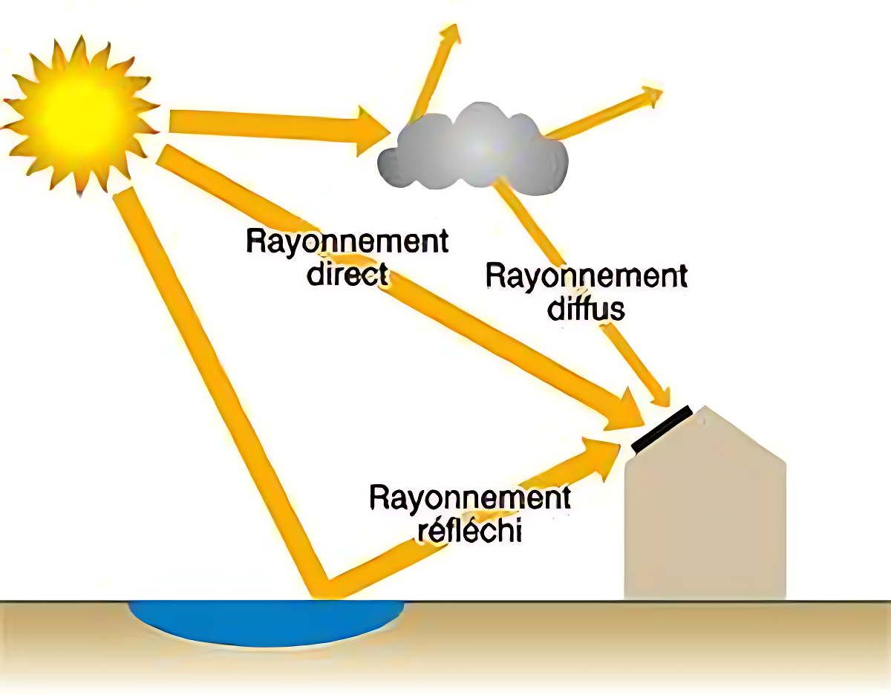
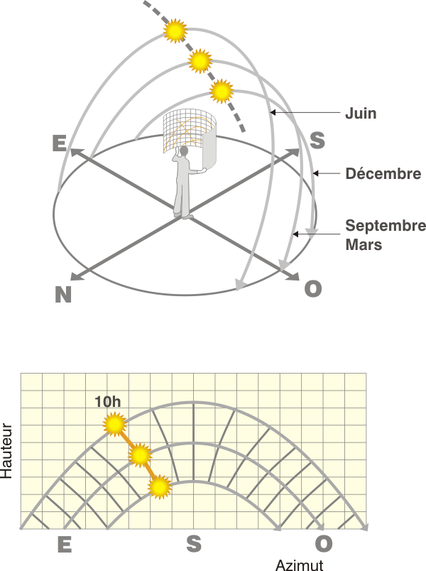
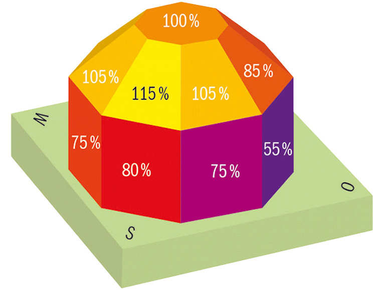

# Fondamentaux d’énergie solaire {#chap:fondamentaux_energie}

Face à l’urgence climatique et la nécessité de réduire notre dépendance aux énergies fossiles, l’énergie solaire représente une solution prometteuse pour la production d’énergie renouvelable en milieu urbain. Les toitures des bâtiments offrent des surfaces importantes et souvent inexploitées pour l’installation de panneaux solaires, qu’ils soient photovoltaïques pour la production d’électricité ou thermiques pour la production d’eau chaude.

L’exploitation optimale de ces surfaces requiert une compréhension des principes fondamentaux de l’énergie solaire et des contraintes techniques associées. Ce chapitre vise à présenter les concepts essentiels pour appréhender les enjeux du cadastre solaire et de la détection automatique des surfaces disponibles sur les toits.

## Cadastre solaire {#cadastre-solaire}

Ce chapitre va explorer ce qu’est un cadastre solaire ainsi que ses applications.

### Motivation {#motivation}

Le cadastre solaire &#91;[116](../bibliography.md#ref-noauthor_solar_2022)&#93; représente la quantité de rayonnement solaire que reçoit un quartier, une région ou un territoire. Son application principale est d’évaluer le potentiel solaire des toitures et des façades pour déterminer la faisabilité d’installations photovoltaïques ou thermiques. Cet outil devient de plus en plus crucial dans la planification énergétique territoriale et la transition vers les énergies renouvelables.

Grâce aux technologies modernes de cartographie et de modélisation 3D, les cadastres solaires permettent aujourd’hui d’obtenir des données précises sur l’ensoleillement de chaque bâtiment. Ces informations sont particulièrement utiles pour :

- Les propriétaires souhaitant évaluer le potentiel solaire de leur bien

- Les collectivités cherchant à planifier leur transition énergétique

- Les professionnels du solaire pour identifier rapidement les sites prometteurs

- Les urbanistes dans la conception de nouveaux quartiers durables

### Méthodologie {#méthodologie-14}

La création d’un cadastre solaire repose sur plusieurs éléments clés. Tout d’abord, un modèle numérique de terrain (<a href="../glossary.html#gloss-mnt">mnt</a>) et un modèle numérique de surface (<a href="../glossary.html#gloss-mns">mns</a>) sont utilisés pour créer une représentation 3D précise du territoire. Ces données sont ensuite combinées avec :

- Des données climatiques locales sur plusieurs années

- Les ombrages dus au relief et aux bâtiments environnants

- L’orientation et l’inclinaison des surfaces

- La présence d’obstacles sur les toits (cheminées, fenêtres, etc.)

D’autres méthodologies existent pour créer un cadastre solaire pour une région, ceux-ci sont détaillés dans le chapitre “”.

### Applications concrètes {#applications-concrètes}

Le cadastre solaire trouve de nombreuses applications pratiques. Il permet notamment de :

- Identifier les surfaces les plus adaptées aux installations solaires

- Optimiser le placement des panneaux solaires

- Identifier les zones intéressantes en fonction de l’ensoleillement pour l’agriculture

Grâce à ces informations, les décideurs peuvent élaborer des stratégies énergétiques plus efficaces et les particuliers peuvent prendre des décisions éclairées concernant l’installation de panneaux solaires.

### Limites et perspectives {#limites-et-perspectives}

Bien que très utile, le cadastre solaire présente certaines limites. La précision des données dépend de la qualité des relevés topographiques et des modèles 3D utilisés. De plus, les évolutions du bâti (nouvelles constructions, modifications) nécessitent des mises à jour régulières. Cependant, les avancées technologiques, notamment en matière d’imagerie satellite et de modélisation, permettent d’améliorer constamment la précision et la fiabilité de ces outils.

## Rayonnement solaire {#rayonnement-solaire}

Ce chapitre explore le fonctionnement du soleil et les défis pour profiter au mieux de cette énergie abondante.

### Principe du rayonnement solaire {#principe-du-rayonnement-solaire}

Le rayonnement solaire &#91;[117](../bibliography.md#ref-energie_plus_ensoleillement_2010)&#93; qui atteint la surface terrestre provient de l’énergie émise par le Soleil, avec une puissance initiale de 1367 W/m² à l’entrée de l’atmosphère (constante solaire). Le rayonnement global qui parvient à la surface terrestre se décompose en trois composantes essentielles :

- Le rayonnement direct : Il s’agit des rayons solaires qui traversent l’atmosphère sans déviation. Son intensité varie selon l’angle d’incidence des rayons, l’épaisseur d’atmosphère traversée et les conditions atmosphériques

- Le rayonnement diffus : Résultant de la diffusion par l’atmosphère (nuages, aérosols, molécules d’air), il peut représenter jusqu’à 100% du rayonnement global par temps couvert

- Le rayonnement réfléchi : Correspond à la fraction du rayonnement réfléchie par l’environnement. Son intensité dépend de la nature des surfaces (neige : 80-90%, végétation : 10-25%) et de leur géométrie.

<figure id="fig:type_rayonnement" data-latex-placement="H">

<figcaption>Rayonnement direct, diffus et réfléchi [<a href="../bibliography.html#ref-energie_plus_ensoleillement_2010" role="doc-biblioref">117</a>]</figcaption>
</figure>

Comme on peut le voir sur la Figure [7.1](#fig:type_rayonnement){reference-type="ref" reference="fig:type_rayonnement"}, ces trois types de rayonnement interagissent différemment avec une surface. Ensemble, ils représentent l’énergie totale que peuvent exploiter les applications solaires, avec une puissance pouvant aller jusqu’à 1000 W/m² au sol quand le ciel est bien dégagé. Cette puissance n’est pas fixe - elle change selon le moment de l’année, l’heure de la journée, où l’on se trouve sur Terre et la météo. Comprendre ces variations est clé pour bien dimensionner les installations solaires.

Le rayonnement solaire ne sera pas identique toute l’année, comme indiqué dans la Figure [7.2](#fig:hauteur_soleil){reference-type="ref" reference="fig:hauteur_soleil"}

<figure id="fig:hauteur_soleil" data-latex-placement="H">

<figcaption>Rayonnement direct, diffus et réfléchi [<a href="../bibliography.html#ref-energie_plus_ensoleillement_2010" role="doc-biblioref">117</a>]</figcaption>
</figure>

Dans l’hémisphère nord, le soleil va de l’est à l’ouest pendant une journée type. La course ne sera pas identique tout au long de l’année, son hauteur est variable selon la saison. En été, le soleil sera plus haut, tandis que pendant l’hiver le soleil sera plus bas. Ce concept est essentiel pour capter au mieux cette énergie gratuite et indispensable à la vie.

### Facteurs influençant le rayonnement solaire {#facteurs-influençant-le-rayonnement-solaire}

L’efficacité d’une installation solaire dépend de plusieurs facteurs critiques qui déterminent la quantité d’énergie captée. Les principaux sont :

- L’orientation

- L’inclinaison

- Obstacles (ombrages)

#### Orientation {#orientation}

Pour tirer le meilleur parti du soleil dans l’hémisphère nord, il faut orienter les panneaux vers le sud. Comme on peut le voir sur la Figure [7.2](#fig:hauteur_soleil){reference-type="ref" reference="fig:hauteur_soleil"}, le soleil fait sa course d’est en ouest en passant par le sud. C’est pourquoi les orientations sud-est et sud-ouest, bien que produisant un peu moins d’énergie, restent de bonnes options. En revanche, une orientation nord n’a pas vraiment d’intérêt car les panneaux ne capteraient pas de rayonnement direct du soleil.

#### Inclinaison {#inclinaison}

L’angle d’inclinaison optimal dépend principalement de la latitude du lieu d’installation. Pour une installation à Genève, la hauteur du soleil en été est d’environ 67 degrés &#91;[118](../bibliography.md#ref-european_commission_jrc_nodate)&#93; au midi solaire (azimut 0 degrés). L’angle optimal se situe entre 30 et 35 degrés &#91;[119](../bibliography.md#ref-noauthor_anwendung_nodate)&#93;.

L’inclinaison peut être adaptée selon les objectifs de production saisonnière. Pour maximiser la production en été, une faible inclinaison (20-30°) est préférable car elle permet de mieux capter le soleil lorsqu’il est haut dans le ciel. À l’inverse, une inclinaison plus importante (45-60°) est plus efficace en hiver quand le soleil est bas. Comme le montre la Figure [7.3](#fig:warmeundstrom){reference-type="ref" reference="fig:warmeundstrom"}, l’angle d’inclinaison influence également la captation des différentes composantes du rayonnement solaire. Un panneau horizontal (0 degrés) va principalement capter le rayonnement direct, alors qu’un panneau vertical (90 degrés) va mieux équilibrer la captation entre rayonnement direct et diffus. C’est pourquoi une inclinaison intermédiaire de 30-35 degrés représente un compromis optimal, permettant de bénéficier efficacement des trois composantes du rayonnement tout au long de l’année.

<figure id="fig:warmeundstrom" data-latex-placement="H">

<figcaption>Influence de l’inclinaison et orientation des panneaux solaires [<a href="../bibliography.html#ref-noauthor_anwendung_nodate" role="doc-biblioref">119</a>]</figcaption>
</figure>
