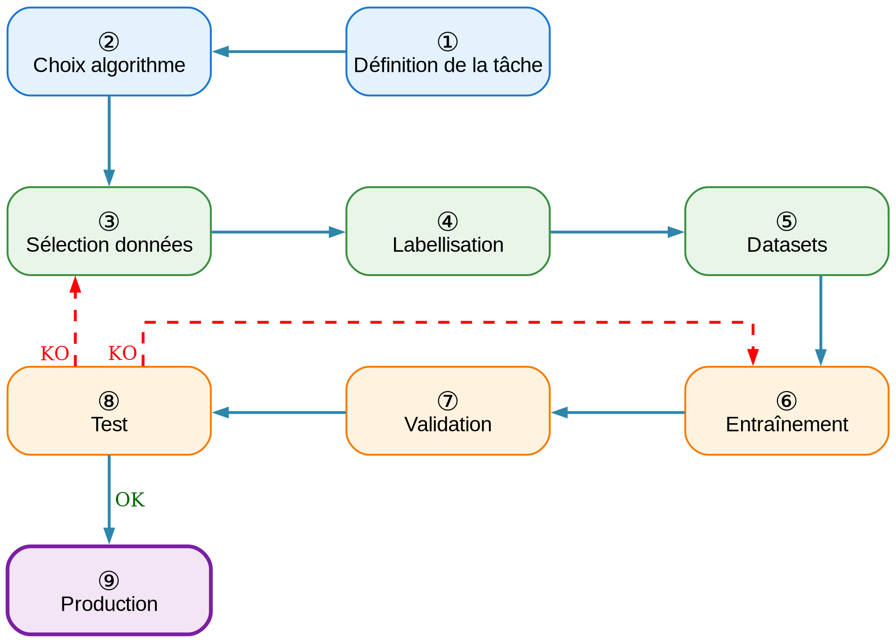
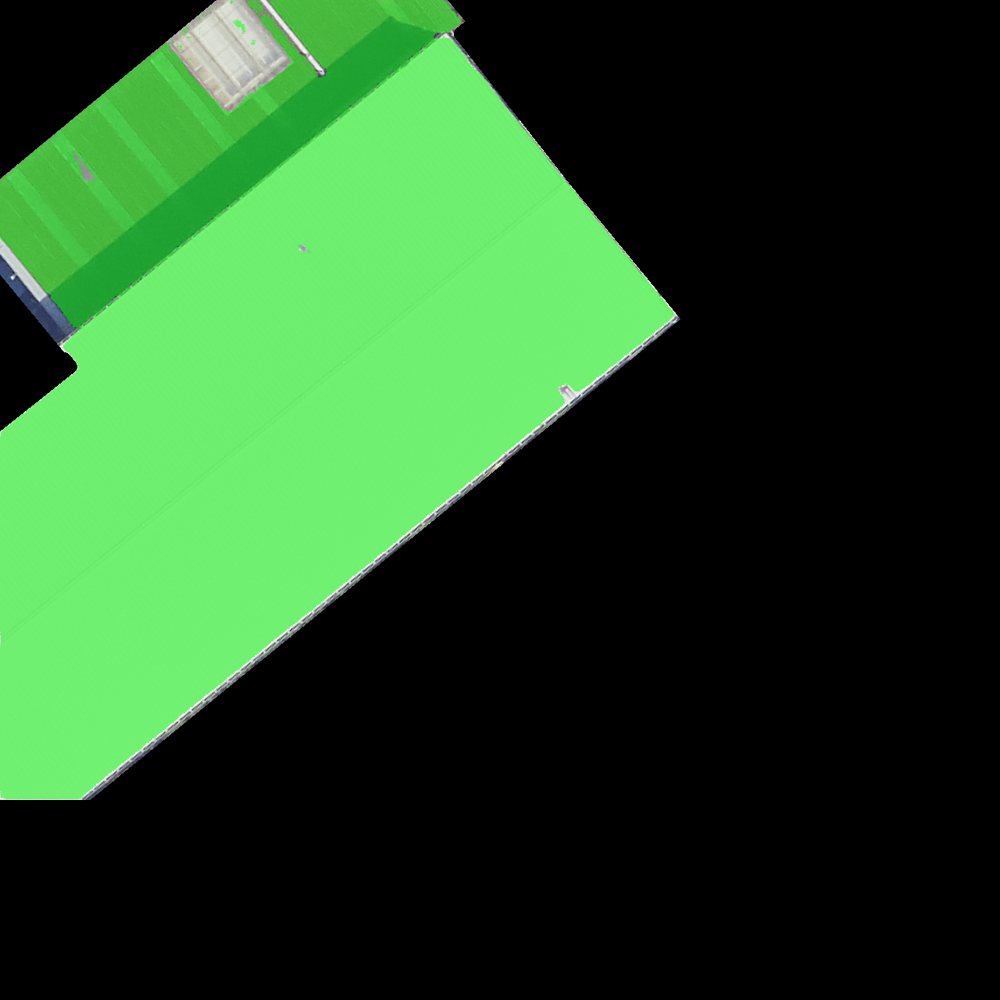

# Abstract {#abstract .unnumbered}

The energy transition and urban densification require optimizing land use. Rooftops offer significant potential for solar panel installation, but the lack of precise inventory of available surfaces complicates energy planning. This work proposes a machine learning-based method to automatically identify free spaces on rooftops in the Canton of Geneva.

The methodology (Figure [1](#fig:abstract_ch3_resume_machine_learning_supervise){reference-type="ref" reference="fig:abstract_ch3_resume_machine_learning_supervise"}) uses semantic segmentation of high-resolution orthophotos. A reference dataset was created with 530 georeferenced images of pixels from the 2019 orthophotos of <a href="../glossary.html#gloss-sitg">sitg</a>. These images were manually annotated over approximately 180 hours. Sampling was stratified according to building use (<a href="../glossary.html#gloss-sia">sia</a> category) and roof surfaces to represent the canton’s architectural diversity.

<figure id="fig:abstract_ch3_resume_machine_learning_supervise" data-latex-placement="htbp">

<figcaption>Overview of the semantic segmentation methodology for identifying free spaces on rooftops</figcaption>
</figure>

The evaluation of 93 configurations combining different encoders and decoders identified the best architectures (Table [1](#tab:abstract_top10_modeles){reference-type="ref" reference="tab:abstract_top10_modeles"}). LinkNet with the EfficientNet-B5 encoder achieves the best results with an IoU of 0.741 on the test dataset. This performance significantly exceeds that of the Swiss Territorial Data Lab (STDL), which achieved a maximum IoU of 0.40. The k-fold ensemble strategy improves performance by 0.9% to 2.0% depending on the models, which enhances prediction reliability. Pareto front analysis shows that gains become minimal beyond 25 million parameters. This allows identifying configurations that balance precision and computational complexity well.

| Model            |  IoU  | F1-Score | mAP@50 | mAP@75 | mAP@95 | Params (M) | Time (h) |
|:-----------------|:-----:|:--------:|:------:|:------:|:------:|:----------:|:--------:|
|                  |       |          |        |        |        |            |          |
| EfficientNet-B5  | 0.741 |  0.810   | 0.854  | 0.667  | 0.151  |   28.75    |  18.11   |
|                  |       |          |        |        |        |            |          |
| RegNetY-080      | 0.738 |  0.805   | 0.852  | 0.672  | 0.155  |   38.41    |   9.29   |
|                  |       |          |        |        |        |            |          |
| RegNetY-032      | 0.735 |  0.801   | 0.831  | 0.672  | 0.157  |   18.87    |  30.62   |
|                  |       |          |        |        |        |            |          |
| EfficientNetV2-S | 0.735 |  0.802   | 0.834  | 0.674  | 0.153  |   23.42    |  19.56   |
|                  |       |          |        |        |        |            |          |
| EfficientNetV2-S | 0.735 |  0.800   | 0.840  | 0.667  | 0.184  |   29.13    |  27.75   |
|                  |       |          |        |        |        |            |          |
| EfficientNet-B5  | 0.735 |  0.801   | 0.843  | 0.661  | 0.162  |   13.63    |  31.28   |
|                  |       |          |        |        |        |            |          |
| mambaout\_base   | 0.734 |  0.797   | 0.820  | 0.694  | 0.153  |   80.06    |   5.93   |
|                  |       |          |        |        |        |            |          |
| mambaout\_small  | 0.734 |  0.796   | 0.827  | 0.690  | 0.191  |   48.52    |   8.95   |
|                  |       |          |        |        |        |            |          |
| EfficientNetV2-S | 0.734 |  0.801   | 0.845  | 0.647  | 0.160  |   23.94    |  23.45   |
|                  |       |          |        |        |        |            |          |
| mambaout\_small  | 0.732 |  0.801   | 0.845  | 0.656  | 0.175  |   100.61   |   9.94   |

<em>Top 10 models by mean IoU on test dataset</em>

Qualitative validation on the <a href="../glossary.html#gloss-hepia">hepia</a> area, absent from the training data, confirms that the models generalize well. Tests show good detection of classic obstacles (solar panels, chimneys, skylights) and correct handling of light to moderate shadows, as shown in Figure [2](#fig:abstract_exemple_segmentation_reussie){reference-type="ref" reference="fig:abstract_exemple_segmentation_reussie"}. However, green roofs and accessible terraces still pose problems, suggesting improvements needed in the dataset.

<figure id="fig:abstract_exemple_segmentation_reussie" data-latex-placement="htbp">
<figure>

<figcaption>Original</figcaption>
</figure>
<figure>

<figcaption>Ground truth</figcaption>
</figure>
<figure>

<figcaption>Prediction - IoU = 0.986</figcaption>
</figure>
<figcaption>Example of successful segmentation with LinkNet + EfficientNet-B5. The model correctly predicts free spaces while excluding obstacles present on the roof</figcaption>
</figure>

This approach offers several practical advantages: fast processing (a few seconds per image versus 7 minutes for <a href="../glossary.html#gloss-sam">sam</a>), independence from available geomatic data, and visual results that meet professional expectations. Integrating this method into energy planning tools would significantly improve the assessment of solar potential at the cantonal scale.

**Keywords:**

# Résumé {#résumé .unnumbered}

La transition énergétique et la densification urbaine nécessitent d’optimiser l’utilisation du territoire. Les toitures offrent un potentiel important pour installer des panneaux solaires, mais on manque d’inventaire précis des surfaces disponibles, ce qui complique la planification énergétique. Ce travail propose une méthode basée sur le machine learning pour identifier automatiquement les espaces libres sur les toitures du canton de Genève.

La méthodologie (Figure [3](#fig:resume_ch3_resume_machine_learning_supervise){reference-type="ref" reference="fig:resume_ch3_resume_machine_learning_supervise"}) utilise la segmentation sémantique d’orthophotos haute résolution. Un dataset de référence a été créé avec 530 images géoréférencées de pixels provenant des orthophotos 2019 du <a href="../glossary.html#gloss-sitg">sitg</a>. Ces images ont été annotées manuellement pendant environ 180 heures. L’échantillonnage a été stratifié selon l’utilisation des bâtiments (catégorie <a href="../glossary.html#gloss-sia">sia</a>) et les surfaces de toitures pour représenter la diversité architecturale du canton.

<figure id="fig:resume_ch3_resume_machine_learning_supervise" data-latex-placement="htbp">

<figcaption>Vue d’ensemble de la méthodologie de segmentation sémantique pour l’identification des espaces libres sur les toitures</figcaption>
</figure>

L’évaluation de 93 configurations combinant différents encodeurs et décodeurs a permis d’identifier les meilleures architectures (Tableau [2](#tab:resume_top10_modeles){reference-type="ref" reference="tab:resume_top10_modeles"}). LinkNet avec l’encodeur EfficientNet-B5 obtient les meilleurs résultats avec un IoU de 0,741 sur le dataset de test. Cette performance dépasse nettement celle du Swiss Territorial Data Lab (STDL) qui atteignait un IoU maximal de 0,40. La stratégie d’ensemble k-fold améliore les performances de 0,9% à 2,0% selon les modèles, ce qui renforce la fiabilité des prédictions. L’analyse du front de Pareto montre que les gains deviennent minimes au-delà de 25 millions de paramètres. Cela permet d’identifier des configurations qui équilibrent bien précision et complexité de calcul.

| Modèle           |  IoU  | F1-Score | mAP@50 | mAP@75 | mAP@95 | Params (M) | Temps (h) |
|:-----------------|:-----:|:--------:|:------:|:------:|:------:|:----------:|:---------:|
|                  |       |          |        |        |        |            |           |
| EfficientNet-B5  | 0.741 |  0.810   | 0.854  | 0.667  | 0.151  |   28.75    |   18.11   |
|                  |       |          |        |        |        |            |           |
| RegNetY-080      | 0.738 |  0.805   | 0.852  | 0.672  | 0.155  |   38.41    |   9.29    |
|                  |       |          |        |        |        |            |           |
| RegNetY-032      | 0.735 |  0.801   | 0.831  | 0.672  | 0.157  |   18.87    |   30.62   |
|                  |       |          |        |        |        |            |           |
| EfficientNetV2-S | 0.735 |  0.802   | 0.834  | 0.674  | 0.153  |   23.42    |   19.56   |
|                  |       |          |        |        |        |            |           |
| EfficientNetV2-S | 0.735 |  0.800   | 0.840  | 0.667  | 0.184  |   29.13    |   27.75   |
|                  |       |          |        |        |        |            |           |
| EfficientNet-B5  | 0.735 |  0.801   | 0.843  | 0.661  | 0.162  |   13.63    |   31.28   |
|                  |       |          |        |        |        |            |           |
| mambaout\_base   | 0.734 |  0.797   | 0.820  | 0.694  | 0.153  |   80.06    |   5.93    |
|                  |       |          |        |        |        |            |           |
| mambaout\_small  | 0.734 |  0.796   | 0.827  | 0.690  | 0.191  |   48.52    |   8.95    |
|                  |       |          |        |        |        |            |           |
| EfficientNetV2-S | 0.734 |  0.801   | 0.845  | 0.647  | 0.160  |   23.94    |   23.45   |
|                  |       |          |        |        |        |            |           |
| mambaout\_small  | 0.732 |  0.801   | 0.845  | 0.656  | 0.175  |   100.61   |   9.94    |

<em>Top 10 des modèles par IoU moyen sur dataset de test</em>

La validation qualitative sur la zone de <a href="../glossary.html#gloss-hepia">hepia</a>, absente des données d’entraînement, confirme que les modèles généralisent bien. Les tests montrent une bonne détection des obstacles classiques (panneaux solaires, cheminées, verrières) et une gestion correcte des ombres légères à modérées, comme on peut le voir dans la Figure [4](#fig:resume_exemple_segmentation_reussie){reference-type="ref" reference="fig:resume_exemple_segmentation_reussie"}. Par contre, les toitures végétalisées et terrasses praticables posent encore problème, ce qui suggère des améliorations à apporter au dataset.

<figure id="fig:resume_exemple_segmentation_reussie" data-latex-placement="htbp">
<figure>

<figcaption>Original</figcaption>
</figure>
<figure>

<figcaption>Vérité terrain</figcaption>
</figure>
<figure>

<figcaption>Prédiction - IoU = 0.986</figcaption>
</figure>
<figcaption>Exemple de segmentation réussie avec LinkNet + EfficientNet-B5. Le modèle prédit correctement les espaces libres en excluant les obstacles présents sur la toiture</figcaption>
</figure>

Cette approche offre plusieurs avantages pratiques : traitement rapide (quelques secondes par image contre 7 minutes pour <a href="../glossary.html#gloss-sam">sam</a>), indépendance par rapport aux données géomatiques disponibles, et résultats visuels qui correspondent aux attentes des professionnels. Intégrer cette méthode dans les outils de planification énergétique permettrait d’améliorer l’évaluation du potentiel solaire à l’échelle du canton.

**Mots clés :**

