# État de l’art {#chap:analysis}

Ce chapitre dresse un état de l’art des avancées récentes dans la vision par ordinateur, la cartographie du potentiel solaire et l’analyse des toitures. Il examine les différentes méthodes et technologies développées dans ces domaines, en mettant l’accent sur les approches les plus innovantes et leurs applications pratiques.

## Introduction {#introduction}

L’évaluation du potentiel solaire des toitures constitue un élément clé de la transition énergétique urbaine qui sera abordé dans la deuxième section de ce chapitre. Sa précision dépend directement de la qualité et de la disponibilité des données utilisées, qui peuvent provenir de différentes sources et présenter des niveaux de détail variables.

Les méthodologies d’évaluation du potentiel solaire s’appuient principalement sur trois types de données :

1.  Données statistiques

2.  Données géomatiques

3.  Images satellite

La troisième partie de ce chapitre présente l’état de l’art du machine learning appliqué aux images. La quatrième partie traite ensuite de l’application du machine learning dans le cas du calcul du potentiel solaire. Une cinquième section sera consacrée aux datasets disponibles. Enfin, une synthèse permettra de conclure et de justifier l’approche retenue.

Les notions théoriques nécessaires pour la compréhension de ce chapitre se trouvent dans deux annexes. Le premier traite de l’énergie solaire et ses applications dans l’annexe (voir page ). Le deuxième annexe (voir page ) va permettre d’avoir les bases nécessaires pour comprendre ce qu’est le machine learning, ses limites et ses applications.

## Évaluation du potentiel solaire des toitures {#évaluation-du-potentiel-solaire-des-toitures}

### Analyse du potentiel photovoltaïque des toitures résidentielles en Andalousie {#analyse-du-potentiel-photovoltaïque-des-toitures-résidentielles-en-andalousie}

#### Contexte et objectifs {#contexte-et-objectifs}

L’étude menée par &#91;[4](../bibliography.md#ref-ordonez_analysis_2010)&#93; &#91;[4](../bibliography.md#ref-ordonez_analysis_2010)&#93; présente une analyse détaillée du potentiel de production d’énergie photovoltaïque sur les toitures résidentielles en Andalousie (Espagne). Cette région, avec une radiation solaire moyenne de 4,75 kWh/m2 par jour et une superficie de 87 597 km2, possède le plus fort potentiel solaire d’Europe.

#### Données {#données}

Les données utilisées dans cet article sont :

- Données du cadastre et les surfaces de toiture renseignées lors des autorisations de construire

- Orthophotos de google maps

#### Méthodologie {#méthodologie}

La méthodologie repose sur trois volets complémentaires :

- L’analyse statistique des données du cadastre qui répartit les logements en trois types : les maisons individuelles ou jumelées, les maisons en bande, et les immeubles collectifs

- L’estimation des surfaces type de toit réellement utilisables pour les panneaux solaires, en prenant en compte tous les obstacles (cheminées, antennes, etc.), les zones d’ombre et les autres contraintes

- L’étude de l’ensoleillement moyen de la région et des performances des systèmes photovoltaïques, basée sur les caractéristiques techniques des panneaux disponibles

#### Résultats principaux {#résultats-principaux}

L’analyse a permis d’identifier les potentiels suivants :

- La surface totale de toiture disponible est de 265,52 km2, dont 218,52 km2 (82,29%) sont effectivement utilisables pour des installations photovoltaïques

- Le potentiel de production énergétique est estimé à 9,73 GWh/an pour des panneaux IS-170 et 9,38 GWh/an pour des panneaux IS-220

- Cette production permettrait de couvrir 79% des besoins énergétiques du secteur résidentiel andalou, réduisant la dépendance énergétique extérieure à seulement 21%

#### Discussion et limites {#discussion-et-limites}

Cette recherche démontre qu’il est possible d’estimer le potentiel solaire des toitures à partir de données déjà existantes, sans qu’il soit nécessaire d’investir dans l’acquisition de nouvelles données.

La méthodologie utilisée, bien que statistiquement solide, présente certaines limites. Notamment, elle s’appuie uniquement sur les données cadastrales issues des autorisations de construire et des enquêtes gouvernementales. En &#91;[4](../bibliography.md#ref-ordonez_analysis_2010)&#93;, lors de la rédaction de l’article, les auteurs se sont basés sur des données de 2000-2007. Actuellement, ils disposent de données <a href="../glossary.html#gloss-lidar">LiDAR</a> &#91;[5](../bibliography.md#ref-nacional_plan_nodate)&#93; qui permettraient une évaluation plus précise et exhaustive du potentiel solaire pour l’Andalousie.

### Cadastre solaire Genevois {#cadastre-solaire-genevois}

Il y a une multitude d’article dédiés à l’étude du potentiel solaire, la région de Genève est l’une des régions du monde avec le plus d’articles publiés après Wuhan (Chine) &#91;[6](../bibliography.md#ref-drozd_evaluating_2025)&#93;. &#91;[7](../bibliography.md#ref-thebault_large-scale_2022)&#93; &#91;[7](../bibliography.md#ref-thebault_large-scale_2022)&#93; ont analyser la pertinence de la pose de panneaux solaire <a href="../glossary.html#gloss-pv">PV</a> au niveau du <a href="../glossary.html#gloss-grandgeneve">Grand Genève</a>.

#### Contexte et objectifs {#contexte-et-objectifs-1}

Le premier cadastre solaire de Genève &#91;[8](../bibliography.md#ref-desthieux_etude_2011)&#93; date de 2011. Il est réalisé par <a href="../glossary.html#gloss-hepia">HEPIA</a>, l’<a href="../glossary.html#gloss-epfl">EPFL</a> et le Politecnico di Milano, financé par les Services Industriels Genevois et le Service de l’énergie du canton (actuellement l’<a href="../glossary.html#gloss-ocen">OCEN</a>). Elle vise à cartographier précisément le potentiel solaire sur les toitures genevoises. Les données utilisées sont :

- Données <a href="../glossary.html#gloss-lidar">LiDAR</a> de 2009 (4-6 points/m2) &#91;[9](../bibliography.md#ref-sitg_nuages_2009)&#93;

- Empreinte au sol des toitures issues du modèle vecteur 3D du bâti sur le canton de 2005

- Données météo horaires issues de Meteonorm.

La méthodologie utilisée est la suivante :

- Construction d’un modèle numérique de surface 2.5D à partir de données <a href="../glossary.html#gloss-lidar">LiDAR</a> et d’empreintes au sol des bâtiments

- Calcul de l’irradiation solaire horaire sur les toits en tenant compte des ombrages (bâti, végétation, relief), à l’aide d’un outil développé sous Matlab

- Production d’indicateurs et de statistiques d’irradiation par toiture dans ArcGIS

Le résultat de l’étude est une couche vectorielle qui indique l’irradiation solaire pour la toiture d’un bâtiment. Le temps de calcul est d’environ 2000 h pour une seule machine.

Une deuxième phase du cadastre est effectuée en 2014 &#91;[10](../bibliography.md#ref-desthieux_etude_2014)&#93; qui permet d’améliorer la modélisation des toitures, le calcul l’irradiation solaire et de réaliser certains prédimensionnements :

- Estimation de production d’électricité

- Estimations pour le solaire thermique

- Indicateurs économiques

Cette mise à jour positionne le cadastre solaire comme outil d’aide à la décision. Le rendu de l’étude est constitué de plusieurs couches vectorielles. La figure [2.1](#fig:cadastre_solaire_2014){reference-type="ref" reference="fig:cadastre_solaire_2014"} illustre les informations disponibles.

<figure id="fig:cadastre_solaire_2014" data-latex-placement="H">
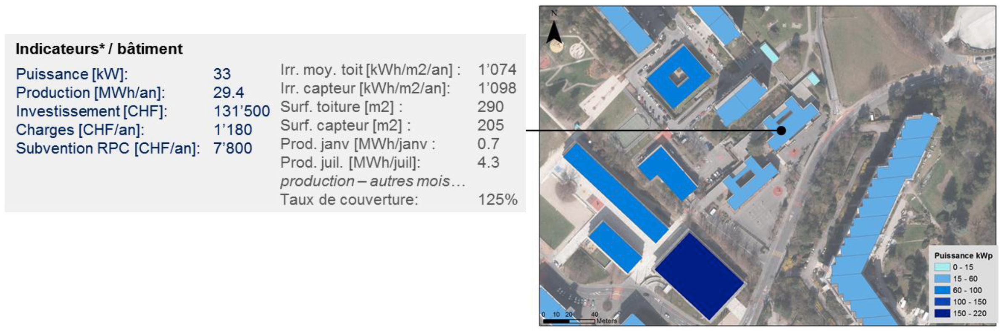
<figcaption>Image d’exemple avec une partie des informations disponibles par bâtiment [<a href="../bibliography.html#ref-desthieux_etude_2014" role="doc-biblioref">10</a>].</figcaption>
</figure>

En 2016, le cadastre a été mis à jour &#91;[3](../bibliography.md#ref-desthieux_solar_2018)&#93;. Les principales nouveautés sont :

- L’utilisation des données <a href="../glossary.html#gloss-lidar">LiDAR</a> de 2013 &#91;[11](../bibliography.md#ref-sitg_nuages_2013)&#93;

- L’amélioration des algorithmes de calcul du potentiel solaire

- Utilisation d’un cluster (24 machines / projet CTI IceBOUND) pour réaliser les calculs (environ 900h)

Dès 2018, plusieurs mises à jour &#91;[3](../bibliography.md#ref-desthieux_solar_2018)&#93; sont effectuées. Les principales nouveautés sont :

- Prise en compte des toitures et des façades des bâtiments pour l’évaluation du potentiel solaire

- Amélioration des algorithmes de calcul du modèle de ciel

- Réécriture du code Matlab en Java

- Expansion du cadastre solaire au Grand Genève (canton de Genève, district de Nyon, et pôle métropolitain du Genevois Français)

En 2020, l’article &#91;[12](../bibliography.md#ref-stendardo_gpu-enabled_2020)&#93; de &#91;[12](../bibliography.md#ref-stendardo_gpu-enabled_2020)&#93; aborde la question de l’optimisation des calculs pour le cadastre du Grand Genève. Les auteurs proposent l’utilisation des <a href="../glossary.html#gloss-gpu">GPU</a> pour réduire considérablement les temps de traitement. Cette amélioration répond à un défi croissant : chaque nouvelle version du cadastre intègre davantage de données et requiert des calculs plus précis, ce qui allonge inévitablement les temps d’exécution. L’optimisation du code devient donc un aspect fondamental pour la viabilité du projet.

<figure id="fig:cadastre_solaire_gpu" data-latex-placement="H">
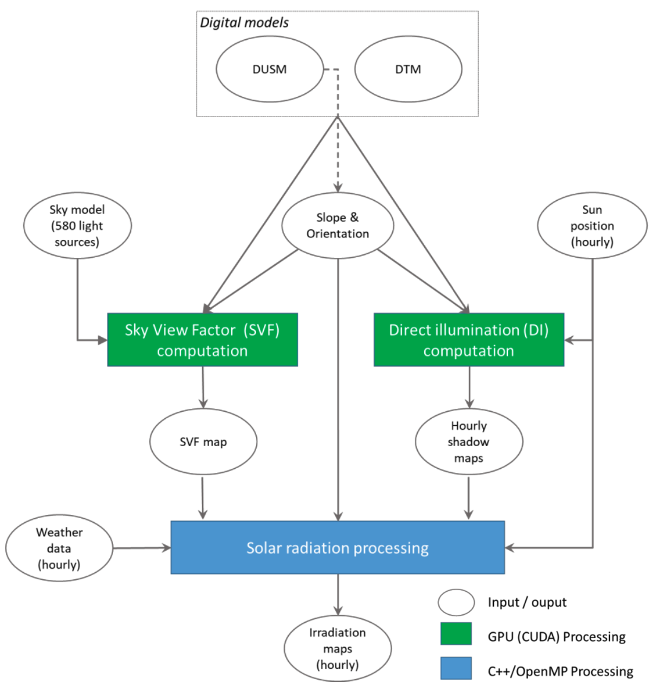
<figcaption>Schéma pour le calcul d’une tuile [<a href="../bibliography.html#ref-stendardo_gpu-enabled_2020" role="doc-biblioref">12</a>]</figcaption>
</figure>

La Figure [2.2](#fig:cadastre_solaire_gpu){reference-type="ref" reference="fig:cadastre_solaire_gpu"} montre comment le traitement a été repensé pour chaque tuile de km. Les parties du code Java qui pouvaient être massivement parallélisées ont été réécrites en CUDA &#91;[13](../bibliography.md#ref-nvidia_cuda_nodate)&#93;, ce qui permet de tirer parti des <a href="../glossary.html#gloss-gpu">GPU</a> au lieu de s’appuyer uniquement sur les <a href="../glossary.html#gloss-cpu">CPU</a>. Les autres parties critiques du code ont été optimisées en C++ &#91;[14](../bibliography.md#ref-noauthor_c_2025)&#93;. Cette approche a permis de réduire considérablement le temps de traitement par tuile (Figure [2.3](#fig:cadastre_solaire_gpu_evolution_temps){reference-type="ref" reference="fig:cadastre_solaire_gpu_evolution_temps"}).

<figure id="fig:cadastre_solaire_gpu_evolution_temps" data-latex-placement="H">

<figcaption>Évolution des temps de calcul par tuile pour le cadastre solaire (2011-2020).</figcaption>
</figure>

#### Données {#données-1}

Le cadastre genevois et du <a href="../glossary.html#gloss-grandgeneve">Grand Genève</a> &#91;[15](../bibliography.md#ref-desthieux_cadastre_nodate)&#93; utilisent plusieurs sources de données. Pour la région de Genève, <a href="../glossary.html#gloss-sitg">SITG</a> a mis à disposition les données <a href="../glossary.html#gloss-lidar">LiDAR</a> relevées les années:

- 2009 &#91;[9](../bibliography.md#ref-sitg_nuages_2009)&#93; avec une densité de 5 points/m2. La précision altimétrique est de ± 20 cm sur surface dure et la précision planimétrique est estimée à 30 cm environ.

- 2013 &#91;[11](../bibliography.md#ref-sitg_nuages_2013)&#93; avec une densité de 15 points/m2. La précision altimétrique est de ± 10 cm sur surface dure et la précision planimétrique est estimée à 20 cm environ.

- 2017 &#91;[16](../bibliography.md#ref-sitg_nuages_2017)&#93; avec une densité de 25 points/m2. La précision altimétrique est de ± 10 cm sur surface dure et la précision planimétrique est estimée à 20 cm environ.

En ce qui concerne la région de Nyon, les données <a href="../glossary.html#gloss-lidar">LiDAR</a> relevées en 2019 &#91;[17](../bibliography.md#ref-etat_de_vaud_lidar_nodate)&#93; et finalement, pour la France, les données <a href="../glossary.html#gloss-lidar">LiDAR</a> relevées en 2014 &#91;[18](../bibliography.md#ref-ign_ign_nodate)&#93; par le <a href="../glossary.html#gloss-ign">IGN</a>.

Les données vectorielles proviennent des mêmes fournisseurs de données et ne sont pas spécifiées dans les articles. Les données météo proviennent de Météonorm.

#### Méthodologie {#méthodologie-1}

La méthodologie &#91;[3](../bibliography.md#ref-desthieux_solar_2018)&#93; pour la création du cadastre suit les étapes suivantes :

- Collecte des données

- Construction du modèle 3D

- Calcul des ombrages

- Calcul de l’irradiation solaire en chaque point des toits et façades

- Calcul des indicateurs et visualisation des résultats

La Figure [2.4](#fig:cadastre_solaire_methodologie){reference-type="ref" reference="fig:cadastre_solaire_methodologie"} résume ces points.

<figure id="fig:cadastre_solaire_methodologie" data-latex-placement="H">
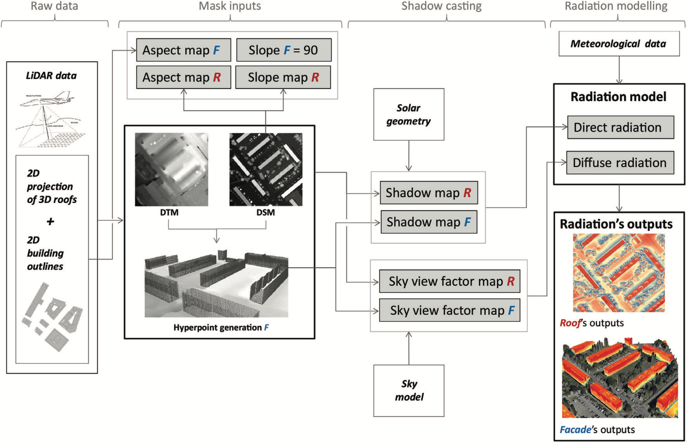
<figcaption>Méthodologie utilisée pour la création du cadastre solaire [<a href="../bibliography.html#ref-desthieux_solar_2018" role="doc-biblioref">3</a>]</figcaption>
</figure>

##### Collecte des données {#collecte-des-données}

La première étape est d’obtenir les données nécessaires (“Raw data” sur la Figure [2.4](#fig:cadastre_solaire_methodologie){reference-type="ref" reference="fig:cadastre_solaire_methodologie"}). À partir des données <a href="../glossary.html#gloss-lidar">LiDAR</a>, deux modèles 3D de la ville sont construits: un modèle numérique de surface (<a href="../glossary.html#gloss-mns">MNS</a> ou en anglais <a href="../glossary.html#gloss-dsm">DSM</a>) qui représente la surface supérieure des bâtiments et de la végétation, et un modèle numérique de terrain (<a href="../glossary.html#gloss-mnt">MNT</a> ou en anglais <a href="../glossary.html#gloss-dtm">DTM</a>) qui représente le sol nu sans les bâtiments.

Les contours et empreintes des toits et bâtiments sont aussi récupérés à partir de données cadastrales existantes, en 2D et 3D. Ils serviront à délimiter précisément les toits et façades.

##### Construction du modèle 3D détaillé {#construction-du-modèle-3d-détaillé}

La deuxième étape consiste à construire un modèle 3D détaillé de la ville (“mask inputs” sur la Figure [2.4](#fig:cadastre_solaire_methodologie){reference-type="ref" reference="fig:cadastre_solaire_methodologie"}), qui servira de base aux calculs d’ensoleillement. Ce modèle s’appuie sur les données récoltées lors de l’étape précédente.

Le processus débute par la transformation du modèle numérique de surface (<a href="../glossary.html#gloss-dsm">DSM</a>) et du modèle numérique de terrain (<a href="../glossary.html#gloss-dtm">DTM</a>) en images 3D appelées rasters. Ces rasters fonctionnent comme une grille matricielle qui recouvre l’ensemble du territoire urbain, où chaque pixel stocke une valeur d’altitude. Le <a href="../glossary.html#gloss-dsm">DSM</a> et le <a href="../glossary.html#gloss-dtm">DTM</a> constituent ainsi des représentations matricielles qui enregistrent l’élévation de chaque point du territoire étudié.

Deux modèles 3D distincts sont ensuite générés : un modèle dédié aux toitures et un second pour les façades. Cette approche combine le <a href="../glossary.html#gloss-dsm">DSM</a> issu des données <a href="../glossary.html#gloss-lidar">LiDAR</a> avec les informations cadastrales vectorielles qui délimitent les contours des bâtiments. Cette fusion permet d’obtenir une représentation tridimensionnelle où chaque élément architectural (toits et façades) est individualisé et géoréférencé.

Pour chaque pixel du modèle 3D des toitures, deux paramètres géométriques essentiels sont calculés : la pente (inclinaison par rapport à l’horizontale) et l’orientation azimutale (exposition cardinale). Ces paramètres influencent directement la quantité d’irradiation reçue et jouent un rôle déterminant dans l’estimation du potentiel solaire. Une toiture horizontale captera par exemple davantage d’énergie solaire qu’une surface fortement inclinée exposée vers le nord.

La modélisation des façades présente une complexité supplémentaire car la représentation raster ne permet pas de bien représenter les surfaces verticales. Pour contourner cette limitation, des points supplémentaires appelés “hyperpoints” sont distribués le long des façades (Figure [2.5](#fig:cadastre_solaire_hyperpoints){reference-type="ref" reference="fig:cadastre_solaire_hyperpoints"}). Cette méthode permet de discrétiser chaque façade en une série de points verticaux géolocalisés, sur lesquels les calculs d’ensoleillement peuvent être appliqués avec précision.

<figure id="fig:cadastre_solaire_hyperpoints" data-latex-placement="H">
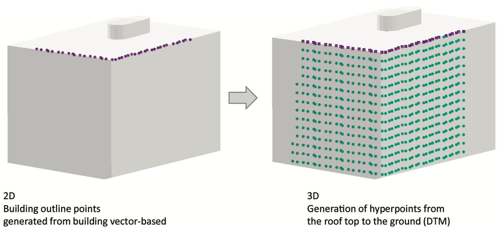
<figcaption>Méthode de création des hyperpoints sur les façades [<a href="../bibliography.html#ref-desthieux_solar_2018" role="doc-biblioref">3</a>]</figcaption>
</figure>

Cette phase de modélisation produit un jumeau numérique détaillé du territoire urbain, composé de deux modèles 3D complémentaires pour les toitures et les façades. Cette représentation numérique intègre tous les paramètres géométriques nécessaires (altitudes, pentes, orientations) pour permettre une estimation précise de l’ensoleillement en tout point de l’espace urbain modélisé.

Ce jumeau numérique constitue la base géospatiale sur laquelle s’appuieront les étapes suivantes de la méthodologie. Les algorithmes de simulation des ombres portées et de calcul du potentiel solaire exploiteront cette représentation tridimensionnelle pour quantifier les ressources énergétiques disponibles sur l’ensemble du territoire étudié.

##### Calcul des zones d’ombre {#calcul-des-zones-dombre}

La troisième étape consiste à calculer les zones d’ombre sur les toits et les façades des bâtiments (“mask inputs” sur Figure [2.4](#fig:cadastre_solaire_methodologie){reference-type="ref" reference="fig:cadastre_solaire_methodologie"}). Cette analyse est cruciale car les zones ombragées présentent un potentiel solaire significativement inférieur aux zones bien exposées au soleil.

Le calcul s’appuie sur le jumeau numérique 3D de la ville créé précédemment, qui contient toutes les informations nécessaires sur la géométrie des bâtiments et du relief environnant. Un algorithme de simulation reproduit la course du soleil heure par heure tout au long de l’année, en projetant les ombres correspondantes sur le modèle 3D.

L’ombrage constitue l’un des facteurs les plus déterminants pour la performance d’une installation solaire. Pour analyser précisément son impact, trois catégories principales d’ombrages sont identifiées:

- Les ombrages proches: causés par des éléments situés à proximité tel que des bâtiments voisins ou directement sur le toit comme les cheminées, antennes ou systèmes de ventilation.

- Les ombrages lointains: proviennent du relief naturel (collines, montagnes) ou des grands bâtiments environnants. L’évaluation de leur impact nécessite une étude complète du masque solaire sur l’ensemble de l’année, car leur influence varie considérablement selon les saisons et la position du soleil.

- Les ombrages saisonniers: générés par des éléments variables comme la végétation ou l’accumulation de neige. Ces ombrages évoluent au cours des saisons et nécessitent une gestion adaptative par un entretien régulier et une conception appropriée de l’installation.

<figure id="fig:cadastre_solaire_ombrage" data-latex-placement="H">
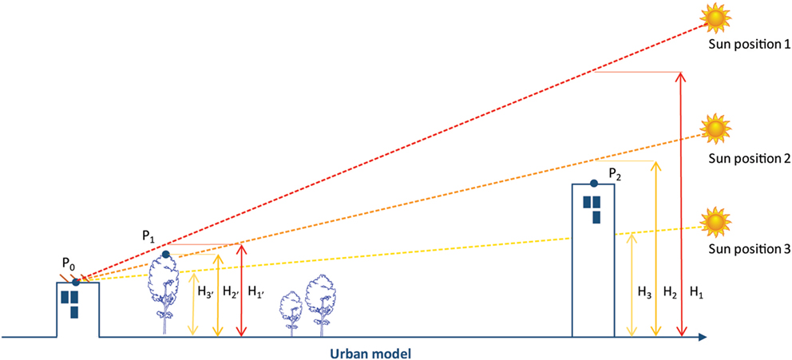
<figcaption>Illustration des différents types d’ombrages [<a href="../bibliography.html#ref-desthieux_solar_2018" role="doc-biblioref">3</a>]</figcaption>
</figure>

La Figure [2.6](#fig:cadastre_solaire_ombrage){reference-type="ref" reference="fig:cadastre_solaire_ombrage"} illustre ces concepts d’ombrage à travers trois situations caractéristiques. À la position 1, le soleil n’est obstrué par aucun obstacle, le point *P*0 reçoit donc un ensoleillement direct. À la position 2, un arbre projette une ombre sur *P*0, créant un ombrage saisonnier dont l’intensité varie selon le type de végétation et la période de l’année. La position 3 représente une situation typique en milieu urbain où un bâtiment plus élevé projette une ombre sur les structures plus basses. Cette configuration peut correspondre à un ombrage proche ou lointain selon la distance et les dimensions du bâtiment obstructeur.

Cette analyse produit des cartes d’ombrage qui indiquent, pour chaque heure de la journée, quelles zones des toits et façades sont à l’ombre ou exposées au soleil. Ces cartes constituent une donnée fondamentale pour le calcul final du potentiel solaire.

En complément de l’ombrage direct, le modèle calcule également le facteur de vue du ciel (sky view factor). Ce paramètre mesure la portion de ciel visible depuis un point précis de la ville. Si une personne se tient à un point donné (représenté en rouge sur la Figure [2.7](#fig:cadastre_solaire_svf){reference-type="ref" reference="fig:cadastre_solaire_svf"}) et observe le ciel dans toutes les directions, certaines portions seront masquées par les bâtiments, la végétation, ou le relief.

<figure id="fig:cadastre_solaire_svf" data-latex-placement="H">
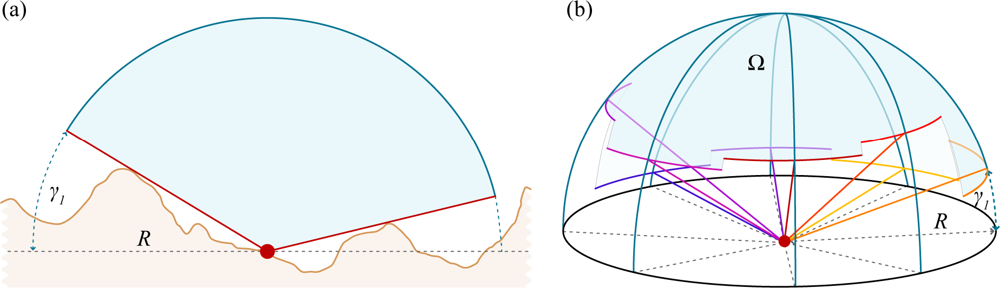
<figcaption>Le sky view factor (SVF) indique la proportion de ciel visible depuis un point [<a href="../bibliography.html#ref-zaksek_sky-view_2011" role="doc-biblioref">19</a>]</figcaption>
</figure>

Le facteur de vue du ciel s’exprime en pourcentage: 100% correspond à une vue entièrement dégagée (comme au sommet d’une tour ou d’une colline), tandis que 0% indique un point complètement obstrué (sous un porche ou dans un tunnel). Ce facteur détermine la quantité de lumière naturelle et de rayonnement solaire diffus (indirect) reçue en ce point, en complément du rayonnement direct.

L’intégration des cartes d’ombrage avec le facteur de vue du ciel fournit une caractérisation complète des conditions d’ensoleillement pour chaque point de la ville. Cette analyse prend en compte à la fois les ombres portées par les obstacles proches et les masques créés par les éléments lointains, constituant ainsi une base solide pour le calcul définitif du potentiel solaire.

##### Modélisation du rayonnement solaire {#modélisation-du-rayonnement-solaire}

La quatrième étape consiste à modéliser la quantité d’énergie solaire reçue en chaque point des toits et des façades (“Radiation modelling” sur Figure [2.4](#fig:cadastre_solaire_methodologie){reference-type="ref" reference="fig:cadastre_solaire_methodologie"}), en tenant compte des conditions météorologiques locales et de la position du soleil dans le ciel.

Cette modélisation s’appuie d’abord sur l’acquisition de données météorologiques précises pour la zone étudiée :

- Le rayonnement solaire global, c’est-à-dire la quantité totale d’énergie solaire reçue sur une surface horizontale.

- La part de rayonnement qui arrive en ligne droite du soleil (rayonnement direct).

- La part de rayonnement qui arrive de façon indirecte, après avoir été diffusée par les nuages et l’atmosphère (rayonnement diffus).

La modélisation utilise ensuite des algorithmes qui reproduisent la position exacte du soleil dans le ciel à chaque heure de la journée et à chaque période de l’année. Cette approche permet de calculer l’angle avec lequel les rayons du soleil frappent chaque point des toits et des façades.

La quantité d’énergie reçue en un point dépend fortement de son orientation (est, sud, ouest) et de son inclinaison (surface horizontale, verticale ou inclinée). Une surface orientée plein sud et inclinée à 45° recevra par exemple beaucoup plus d’énergie qu’une façade verticale orientée au nord.

Les modèles de rayonnement utilisent des équations mathématiques pour calculer précisément la quantité d’énergie directe et diffuse reçue en chaque point, en fonction de l’ensemble de ces paramètres géométriques et temporels.

Ces modèles intègrent également les effets d’ombrage calculés à l’étape précédente. Ainsi, un point sera considéré comme ne recevant aucune énergie directe s’il se trouve à l’ombre à l’instant considéré. Le facteur de vue du ciel est également pris en compte, traduisant la portion de ciel visible depuis chaque point. Moins il y a de ciel visible à cause des bâtiments et du relief alentour, moins il y aura de rayonnement diffus reçu.

Cette analyse produit une estimation fine de la quantité d’énergie solaire reçue par chaque mètre carré des toits et façades, heure par heure, tout au long de l’année. Ces données permettent ensuite d’identifier les zones les plus favorables pour l’installation de systèmes solaires photovoltaïques ou thermiques.

##### Résultats de la simulation {#résultats-de-la-simulation}

L’ensemble de ce processus de simulation produit des résultats concrets et directement exploitables sous plusieurs formes. Ces résultats (“Roof outputs” et “façade outputs” sur Figure [2.4](#fig:cadastre_solaire_methodologie){reference-type="ref" reference="fig:cadastre_solaire_methodologie"}) comprennent :

- Des cartes de rayonnement solaire détaillées pour les toits et façades, visualisant la distribution spatiale du potentiel énergétique

- Des valeurs d’énergie agrégées par pan de toit, façade, et bâtiment entier, permettant une analyse à différentes échelles

- Des indicateurs pratiques comme la production d’énergie potentielle et la rentabilité économique des installations solaires

Ces données constituent une base d’aide à la décision pour l’identification des sites les plus propices au déploiement de systèmes solaires, que ce soit à l’échelle d’un bâtiment individuel ou dans le cadre d’une planification énergétique territoriale.

#### Résultats principaux {#résultats-principaux-1}

L’ensemble des résultats de simulation est mis à disposition des citoyens et des professionnels sur le géoportail cartographique de <a href="../glossary.html#gloss-sitg">SITG</a> (Figure [2.8](#fig:cadastre_solaire_couche_vec_sitg){reference-type="ref" reference="fig:cadastre_solaire_couche_vec_sitg"}). Ces données peuvent être visualisées sous forme de couches cartographiques, intégrées aux autres informations territoriales disponibles sur la plateforme.

<figure id="fig:cadastre_solaire_couche_vec_sitg" data-latex-placement="H">
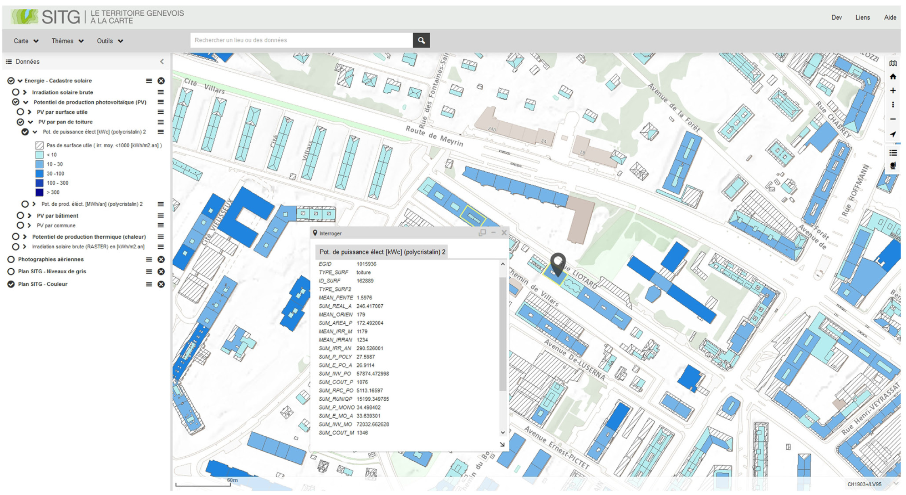
<figcaption>Visualisation des couches vectorielles sur l’interface <a href="../glossary.html#gloss-sitg">SITG</a> [<a href="../bibliography.html#ref-desthieux_solar_2018" role="doc-biblioref">3</a>]</figcaption>
</figure>

Un site web spécifiquement dédié au cadastre solaire a également été développé (Figure [2.9](#fig:cadastre_solaire_sitg_labs){reference-type="ref" reference="fig:cadastre_solaire_sitg_labs"}). Cette interface permet à tout utilisateur de rechercher une adresse et de visualiser simplement le potentiel solaire du bâtiment correspondant. L’outil fournit des estimations de production d’énergie et des analyses de rentabilité économique.

<figure id="fig:cadastre_solaire_sitg_labs" data-latex-placement="H">
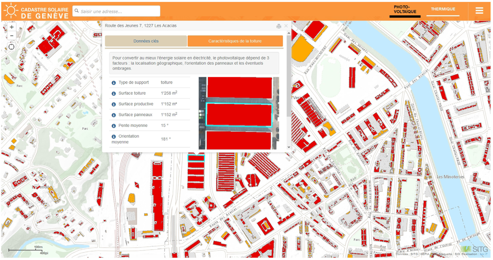
<figcaption>Interface utilisateur du cadastre solaire destinée au grand public [<a href="../bibliography.html#ref-desthieux_solar_2018" role="doc-biblioref">3</a>]</figcaption>
</figure>

Cette mise à disposition publique des données transforme le cadastre solaire en un outil stratégique pour encourager le développement de l’énergie solaire à Genève. Il accompagne aussi bien les projets individuels de particuliers que les planifications énergétiques à l’échelle territoriale, facilitant ainsi la transition vers des sources d’énergie renouvelables.

#### Discussion et limites {#discussion-et-limites-1}

L’article de &#91;[3](../bibliography.md#ref-desthieux_solar_2018)&#93; &#91;[3](../bibliography.md#ref-desthieux_solar_2018)&#93; présente une méthodologie complète pour évaluer le potentiel solaire d’une région. Cette approche explore notamment le potentiel des façades, qui constitue un gisement énergétique intéressant mais encore peu exploité. Dans le cadre de ce travail, les façades ne sont pas considérées, leur utilisation étant souvent limitée par des contraintes esthétiques, légales (notamment pour les bâtiments protégés) ou simplement par méconnaissance de leurs avantages. Si certains bâtiments récents intègrent désormais des panneaux solaires en façade, ces installations sont relativement rares.

Le calculateur a été validée de manière indépendante par l’Université de Genève, ce qui confirme la robustesse de la méthodologie. Un atout majeur réside dans l’utilisation des données relatives aux superstructures &#91;[20](../bibliography.md#ref-sitg_superstructures_nodate)&#93;, qui permet de prendre en compte les ombres projetées par ces éléments sur le reste de la toiture. Cependant, cette couche de données présente certaines limitations, la plupart des toitures comportent des éléments techniques tels que des gaines de ventilation ou des monoblocs ne sont pas systématiquement répertoriés dans la couche des superstructures. Ces surfaces pourraient potentiellement être considérées comme utilisables pour l’installation de panneaux solaires, puisqu’elles ne sont pas formellement classées comme superstructures. En définitive, c’est le niveau d’irradiation solaire et la présence ou non d’ombrage qui déterminent véritablement si une surface peut être exploitée efficacement pour la production d’énergie solaire.

### ToitSolaire {#toitsolaire}

Ce chapitre présente l’application toitsolaire.ch &#91;[21](../bibliography.md#ref-bfe_wie_nodate)&#93; et sa documentation technique &#91;[22](../bibliography.md#ref-klauser_energie_nodate)&#93; qui a été rédigée par l’Office fédéral de l’énergie (<a href="../glossary.html#gloss-ofen">OFEN</a>) ainsi que Meteotest &#91;[23](../bibliography.md#ref-meteotest_wir_2025)&#93;.

#### Contexte et objectifs {#contexte-et-objectifs-2}

L’application toitsolaire.ch, développée par l’<a href="../glossary.html#gloss-ofen">OFEN</a>, constitue un cadastre solaire pour l’ensemble du territoire suisse et sert d’instrument d’encouragement pour l’utilisation de l’énergie solaire.

Ce projet s’inscrit dans la volonté fédérale de favoriser la transition énergétique en fournissant aux propriétaires et aux professionnels un outil permettant d’évaluer rapidement le potentiel solaire des toitures et des façades des bâtiments suisses. L’objectif principal est d’offrir une plateforme en ligne accessible qui présente de manière claire et précise le potentiel d’exploitation de l’énergie solaire pour chaque bâtiment, tant sur les toitures (toitsolaire.ch) que sur les façades (facade-au-soleil.ch).

#### Données {#données-2}

Le projet s’appuie sur trois types de données principales :

- Données climatiques

  - Rayonnement solaire et températures (2011-2020) avec résolution d’environ 2 km, fournies par MétéoSuisse et dérivées de données satellitaires

- Données géographiques

  - Géométries des bâtiments en 3D (toits et façades) issues du modèle swissBUILDINGS3D 2.0

  - Modèles numériques de terrain (swissALTI3D, resolution 2m)

  - Modèles numériques de surface (swissSURFACE3D, résolution 0,5m)

  - Modèle SRTM (résolution environ 100m)

- Données statistiques

  - Registre fédéral des bâtiments et des logements (RegBL) pour estimer les besoins en chaleur des bâtiments

#### Méthodologie {#méthodologie-2}

Le traitement des données commence par l’analyse des géométries, suivi par le calcul du rayonnement solaire sur les surfaces et se termine par leur classification.

##### Traitement des géométries {#traitement-des-géométries}

Les données 3D des bâtiments sont converties en polygones 2D pour les toits (vue d’oiseau) et en polylignes 2D pour les façades. L’orientation, l’inclinaison et la surface de chaque pan de toit sont calculées lors de cette étape de transformation géométrique.

La Figure [2.10](#fig:ch2_montoitsolaire_01_mns){reference-type="ref" reference="fig:ch2_montoitsolaire_01_mns"} présente un exemple d’élévation de surface <a href="../glossary.html#gloss-mns">MNS</a> (Modèle Numérique de Surface).

<figure id="fig:ch2_montoitsolaire_01_mns" data-latex-placement="H">
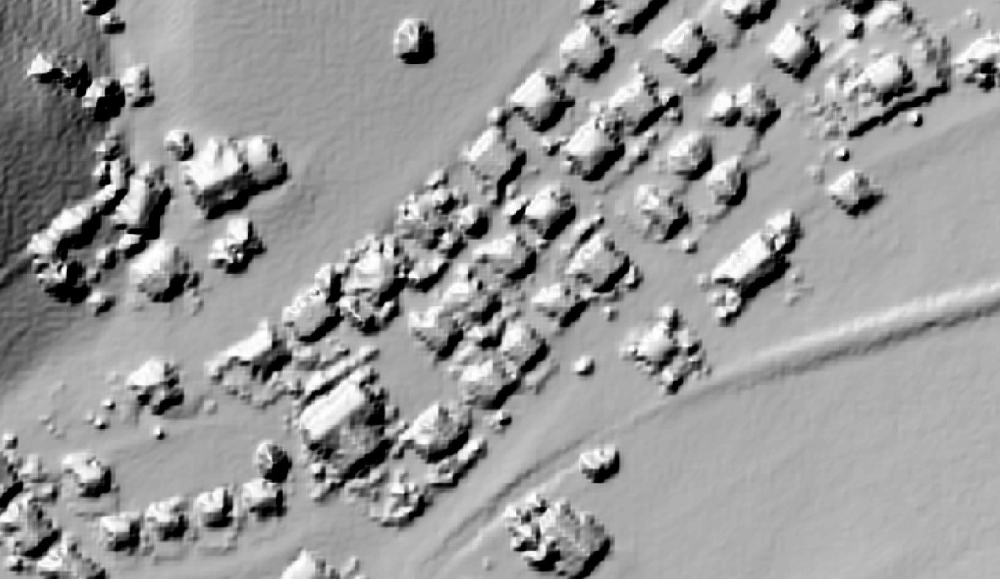
<figcaption><a href="../glossary.html#gloss-mns">MNS</a> [<a href="../bibliography.html#ref-bfe_wie_nodate" role="doc-biblioref">21</a>]</figcaption>
</figure>

Sur ce même exemple, la Figure [2.11](#fig:ch2_montoitsolaire_02_mns_3d){reference-type="ref" reference="fig:ch2_montoitsolaire_02_mns_3d"} superpose les bâtiments en 3D au modèle numérique de surface, illustrant la combinaison des données altimétriques et volumétriques.

<figure id="fig:ch2_montoitsolaire_02_mns_3d" data-latex-placement="H">
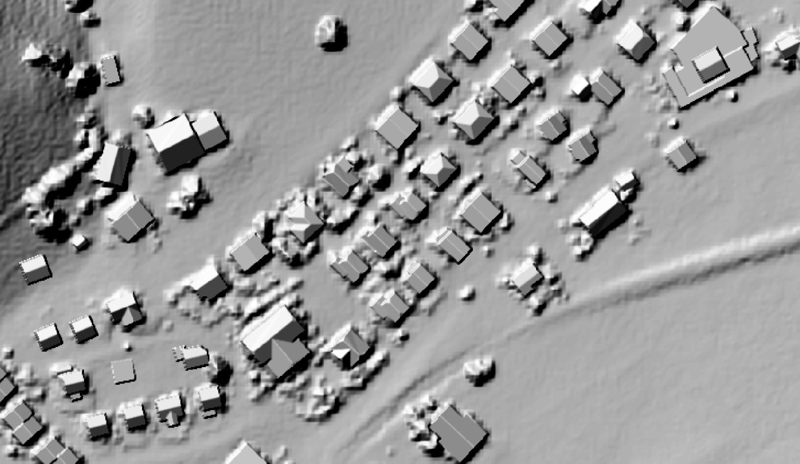
<figcaption><a href="../glossary.html#gloss-mns">MNS</a> avec bâtiments 3D [<a href="../bibliography.html#ref-bfe_wie_nodate" role="doc-biblioref">21</a>]</figcaption>
</figure>

La Figure [2.12](#fig:ch2_montoitsolaire_03_3d_vectoriel1){reference-type="ref" reference="fig:ch2_montoitsolaire_03_3d_vectoriel1"} illustre la conversion des bâtiments 3D en données vectorielles bidimensionnelles, processus essentiel pour la suite des calculs.

<figure id="fig:ch2_montoitsolaire_03_3d_vectoriel1" data-latex-placement="H">
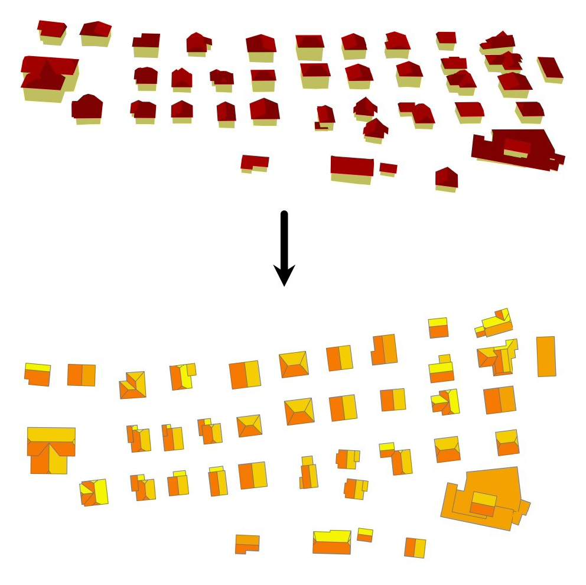
<figcaption>Réduction des données 3D de swissBUILDINGS3D 2.0 en polygones 2D [<a href="../bibliography.html#ref-bfe_wie_nodate" role="doc-biblioref">21</a>]</figcaption>
</figure>

ArcGIS permet de convertir les données 3D en vectorielles à l’aide d’entités multipatch, qui représentent les arêtes et limites des surfaces tridimensionnelles. Dans la Figure [2.13](#fig:ch2_montoitsolaire_04_3d_vectoriel2){reference-type="ref" reference="fig:ch2_montoitsolaire_04_3d_vectoriel2"}, les surfaces partielles (multipatch) sont délimitées par des lignes bleu clair.

<figure id="fig:ch2_montoitsolaire_04_3d_vectoriel2" data-latex-placement="H">
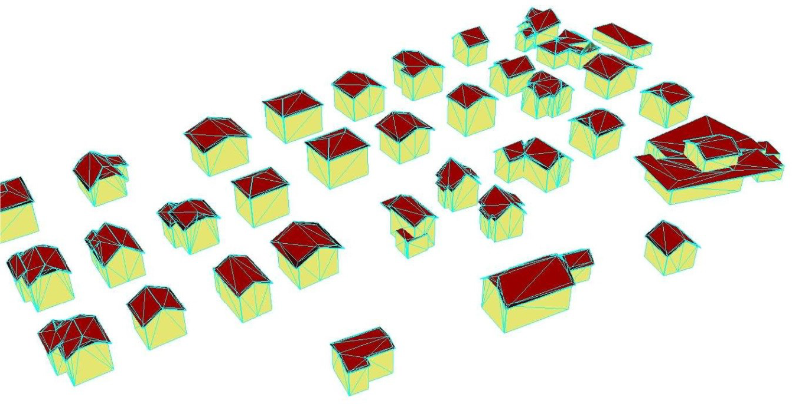
<figcaption>Fonctions multipatch 3D sur les données swissBUILDINGS3D 2.0 [<a href="../bibliography.html#ref-bfe_wie_nodate" role="doc-biblioref">21</a>]</figcaption>
</figure>

Ces entités multipatch sont ensuite converties en polygones 2D. La Figure [2.14](#fig:ch2_montoitsolaire_05_3d_vectoriel3){reference-type="ref" reference="fig:ch2_montoitsolaire_05_3d_vectoriel3"} présente deux exemples de toiture avec une lucarne et illustre comment cette géométrie complexe est simplifiée en représentation bidimensionnelle.

<figure id="fig:ch2_montoitsolaire_05_3d_vectoriel3" data-latex-placement="H">
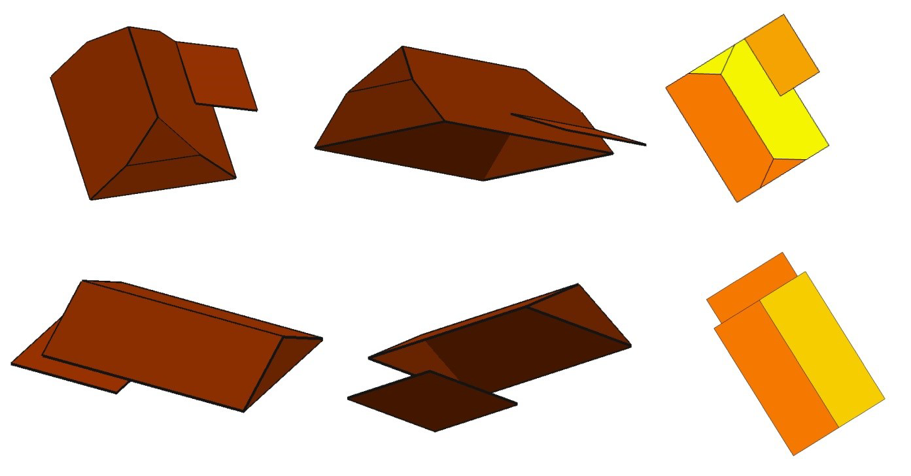
<figcaption>Exemples de surfaces de toitures imbriquées issues de swissBUILDINGS3D 2.0 [<a href="../bibliography.html#ref-bfe_wie_nodate" role="doc-biblioref">21</a>]</figcaption>
</figure>

##### Calcul du rayonnement solaire {#calcul-du-rayonnement-solaire}

Trois horizons d’ombrage sont calculés pour chaque surface :

- Ombrage lointain (montagnes, collines) dans un rayon de 25 km

- Ombrage moyen (voisinage) dans un rayon de 1 km

- Ombrage proche (local) dans un rayon de 100 m

Le rayonnement solaire sur les surfaces inclinées est calculé à l’aide du modèle anisotrope de Perez, qui tient compte du rayonnement direct, diffus et réfléchi. Les calculs sont effectués heure par heure sur la période 2011-2020.

##### Calcul des rendements photovoltaïque et thermique {#calcul-des-rendements-photovoltaïque-et-thermique}

Le rendement électrique est calculé en multipliant le rayonnement solaire total par un rendement de module de 19% et un ratio de performance de 80%. Pour le solaire thermique, la méthode est plus complexe :

- Estimation des besoins en chaleur du bâtiment à partir des données du RegBL

- Dimensionnement d’une installation solaire thermique adaptée à ces besoins

- Calcul du rendement thermique à l’aide d’une formule d’approximation validée

- Conversion en métriques pratiques (nombre de douches possibles, pourcentage des besoins de chauffage couverts)

##### Classification {#classification}

Les surfaces sont classées selon leur potentiel solaire, de “faible” à “excellent”, en fonction du rayonnement solaire annuel moyen :

- Pour les toits : &lt; 800, 800-1000, 1000-1200, 1200-1400, &gt; 1400 kWh/m²/an

- Pour les façades : &lt; 600, 600-800, 800-1000, 1000-1200, &gt; 1200 kWh/m²/an

#### Résultats principaux {#résultats-principaux-2}

Le projet a permis d’analyser environ 10 millions de pans de toit en Suisse, fournissant pour chacun des données géométriques et le potentiel solaire (<a href="../glossary.html#gloss-pv">PV</a> et solaire thermique) comme données principales.

##### Données géométriques {#données-géométriques}

Surface utilisable, orientation et inclinaison.

##### Potentiel photovoltaïque {#potentiel-photovoltaïque}

- Rayonnement solaire global moyen (kWh/m²/an)

- Rayonnement solaire global total (kWh/an)

- Production électrique estimée (kWh/an)

##### Potentiel thermique solaire {#potentiel-thermique-solaire}

- Rayonnement solaire global moyen et total

- Production thermique estimée

- Pourcentage des besoins de chauffage couverts

##### Classification {#classification-1}

Catégorisation de chaque surface selon son aptitude à l’exploitation solaire.

##### Paramètres mensuels {#paramètres-mensuels}

Pour chaque mois, des paramètres permettent de calculer le rayonnement sur surface inclinée à partir du rayonnement horizontal direct et diffus.

#### Discussion et limites {#discussion-et-limites-2}

L’objectif de cet outil est très similaire au cadastre solaire genevois mais pour l’ensemble de la Suisse. Une différence majeure entre les deux approches réside dans l’utilisation de données 3D des bâtiments au lieu de données <a href="../glossary.html#gloss-lidar">LiDAR</a>. Cette méthode simplifie les calculs car les bâtiments présentent une géométrie beaucoup plus simplifiée que celle obtenue à partir des données <a href="../glossary.html#gloss-lidar">LiDAR</a>. Cependant, cette simplification géométrique présente un risque de surestimation du potentiel solaire dû au manque de précision des données 3D.

La modélisation météorologique semble plus sophistiquée que celle du cadastre genevois. L’actualisation des données dépendra principalement des relevés <a href="../glossary.html#gloss-lidar">LiDAR</a> réalisés par swisstopo, mais en principe ceux-ci sont plus fréquents que pour le cadastre solaire genevois, permettant ainsi une mise à jour plus régulière des informations.

## Machine learning appliqué aux images {#machine-learning-appliqué-aux-images}

Ce chapitre présente l’état de l’art du machine learning appliqué aux images. Deux modèles de référence pour la segmentation d’images y sont décrits en détail. Ces modèles peuvent être utilisés directement ou adaptés pour des tâches spécifiques à l’aide de nouveaux datasets, en exploitant leurs connaissances pré-acquises.

### YOLOv12: Attention-Centric Real-Time Object Detectors {#subsec:yolov12_attention_centric}

#### Contexte et objectifs {#contexte-et-objectifs-3}

Le mécanisme d’attention &#91;[24](../bibliography.md#ref-noauthor_what_2024)&#93; &#91;[25](../bibliography.md#ref-vaswani_attention_2023)&#93; constitue une technique de machine learning qui permet aux réseaux de neurones de traiter sélectivement les données d’entrée en attribuant des poids variables aux différents éléments selon leur pertinence contextuelle. Inspiré par la capacité humaine à se concentrer sélectivement sur des détails importants, ce mécanisme calcule mathématiquement des poids d’attention qui reflètent l’importance relative de chaque partie d’une séquence d’entrée.

Contrairement aux approches traditionnelles qui traitent uniformément toutes les données, l’attention offre une flexibilité cruciale. Elle permet d’examiner simultanément l’ensemble d’une séquence et de capturer les dépendances à long terme, tandis que les CNN restent intrinsèquement locaux et les RNN (réseaux de neurones récurrents) traitent les données de manière séquentielle. Cette capacité à créer des représentations dynamiques explique l’adoption massive de l’attention dans les architectures modernes comme les Transformers.

Dans le domaine de la détection d’objets en temps réel, les réseaux de neurones convolutionnels (CNN) de la famille YOLO constituent l’approche de référence. Les mécanismes d’attention, popularisés par les Vision Transformers, offrent cependant de meilleures capacités de modélisation grâce à leur aptitude à capturer les dépendances globales dans l’image. Le défi majeur réside dans le coût computationnel élevé de l’attention : sa complexité croît quadratiquement avec la taille de l’image (*O*(*n*2)), tandis que les convolutions croissent linéairement (*O*(*n*)).

YOLOv12 relève ce défi en proposant le premier framework YOLO centré sur l’attention qui atteint la vitesse des modèles CNN traditionnels tout en conservant les avantages de performance de l’attention. L’objectif est de démontrer qu’il est possible de remettre en question la domination des CNN dans l’écosystème YOLO.

YOLOv12 peut être utilisé directement ou servir de base pour spécialiser le modèle dans des tâches spécifiques avec un nouveau dataset, s’inscrivant alors dans une approche de transfer learning. YOLO se décline en plusieurs modèles spécialisés (Figure [2.15](#fig:ch2_yolo_00_type_modeles){reference-type="ref" reference="fig:ch2_yolo_00_type_modeles"}) pour la détection, la segmentation, la classification, l’analyse de pose et la détection d’objets avec boîte orientée.

<figure id="fig:ch2_yolo_00_type_modeles" data-latex-placement="H">
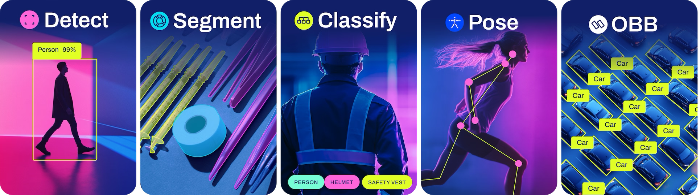
<figcaption>Modèles de YOLOv12 [<a href="../bibliography.html#ref-ultralytics_computer_nodate" role="doc-biblioref">26</a>]</figcaption>
</figure>

Deux clarifications s’imposent concernant le modèle de segmentation. Premièrement, ce modèle utilise la détection pour localiser les objets à segmenter, il est donc capable de générer des boîtes englobantes autour des masques de segmentation. Cette détection constitue une partie essentielle de son processus d’apprentissage.

Deuxièmement, la dénomination de ce modèle en tant que segmentation instance n’est pas correcte : il s’agit d’un hybride entre détection et segmentation sémantique, réalisant les deux opérations simultanément. Il ne s’agit pas d’un modèle de segmentation d’instance qui n’assigne pas de classe aux masques segmentés, mais bien d’un modèle qui attribue une classe à chaque masque segmenté.

#### Données {#données-3}

L’évaluation utilise le dataset de référence MS COCO 2017 &#91;[27](../bibliography.md#ref-coco_coco_nodate)&#93; pour la détection d’objets. Cinq variantes de modèles sont développées (YOLOv12-N/S/M/L/X) correspondant à différentes tailles et complexités. L’entraînement suit le protocole standard : 600 époques avec l’optimiseur SGD, augmentations de données classiques (Mosaic, Mixup, copy-paste). Les performances sont mesurées sur GPU T4 avec TensorRT FP16 pour assurer la reproductibilité.

#### Méthodologie {#méthodologie-3}

YOLOv12 introduit trois innovations clés pour rendre l’attention efficace :

- Réduction de la complexité (Area Attention)

- Stabilisation de l’entraînement (R-ELAN)

- Améliorations architecturales

##### Area Attention {#area-attention}

Plutôt que de calculer l’attention sur toute l’image (coûteux), la carte de caractéristiques est divisée en zones rectangulaires (par défaut 4 segments). L’attention n’est calculée qu’à l’intérieur de chaque zone, réduisant la complexité de moitié tout en préservant un champ réceptif suffisant. C’est l’équivalent de regarder plusieurs « fenêtres » de l’image simultanément plutôt que l’image entière.

Le mécanisme d’attention (Figure [2.21](#fig:ch2_yolo_mecanismes_attention){reference-type="ref" reference="fig:ch2_yolo_mecanismes_attention"}) local est simplifié par rapport aux autres alternatives (Figures [2.16](#fig:ch2_yolo_01_attention_area_criss_cross){reference-type="ref" reference="fig:ch2_yolo_01_attention_area_criss_cross"}, [2.17](#fig:ch2_yolo_02_attention_area_window){reference-type="ref" reference="fig:ch2_yolo_02_attention_area_window"} et [2.18](#fig:ch2_yolo_03_attention_area_criss_axial){reference-type="ref" reference="fig:ch2_yolo_03_attention_area_criss_axial"}). Celui-ci divise la carte de caractéristiques en *l* segments (par défaut 4) horizontalement (Figure [2.19](#fig:ch2_yolo_04_attention_area_yolo1){reference-type="ref" reference="fig:ch2_yolo_04_attention_area_yolo1"}) ou verticalement (Figure [2.20](#fig:ch2_yolo_05_attention_area_yolo2){reference-type="ref" reference="fig:ch2_yolo_05_attention_area_yolo2"}), réduisant la complexité tout en maintenant un large champ réceptif.

<figure id="fig:ch2_yolo_mecanismes_attention" data-latex-placement="H">
<figure id="fig:ch2_yolo_01_attention_area_criss_cross">
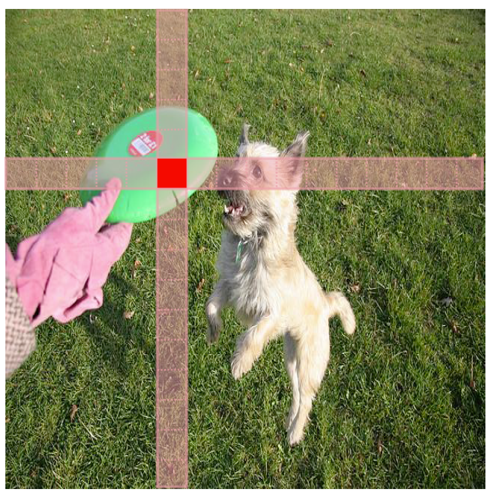
<figcaption>Mécanisme d’attention type “criss cross”</figcaption>
</figure>
<figure id="fig:ch2_yolo_02_attention_area_window">
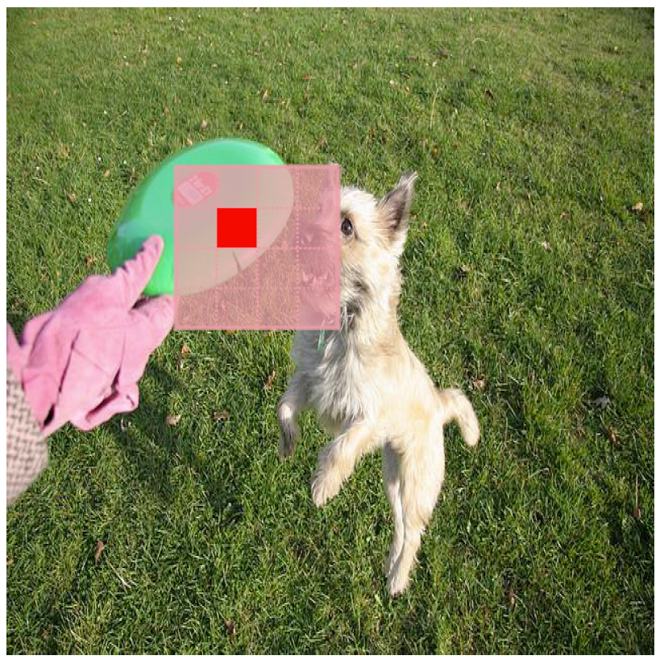
<figcaption>Mécanisme d’attention type “fenêtre”</figcaption>
</figure>
<figure id="fig:ch2_yolo_03_attention_area_criss_axial">
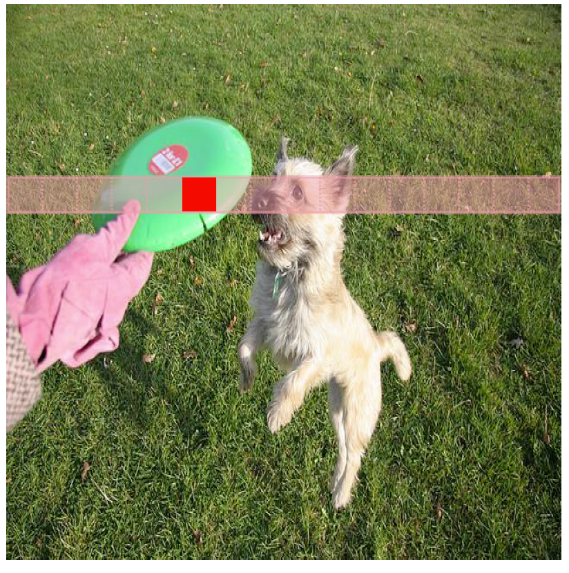
<figcaption>Mécanisme d’attention type “axial”</figcaption>
</figure>
<figure id="fig:ch2_yolo_04_attention_area_yolo1">
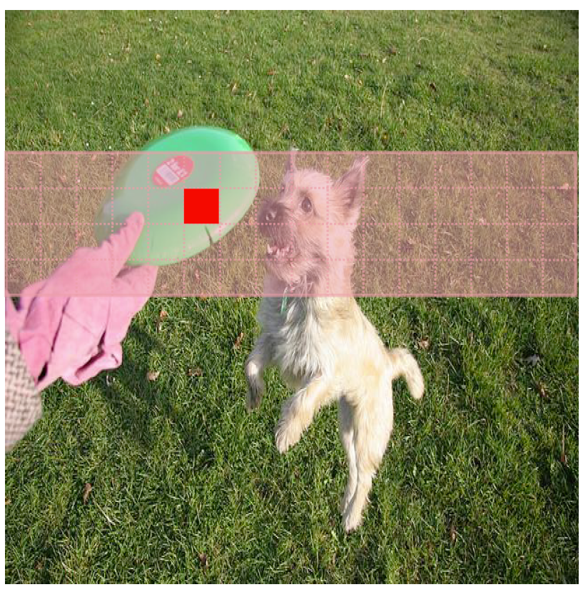
<figcaption>Mécanisme d’attention horizontal proposé dans YOLOv12</figcaption>
</figure>
<figure id="fig:ch2_yolo_05_attention_area_yolo2">
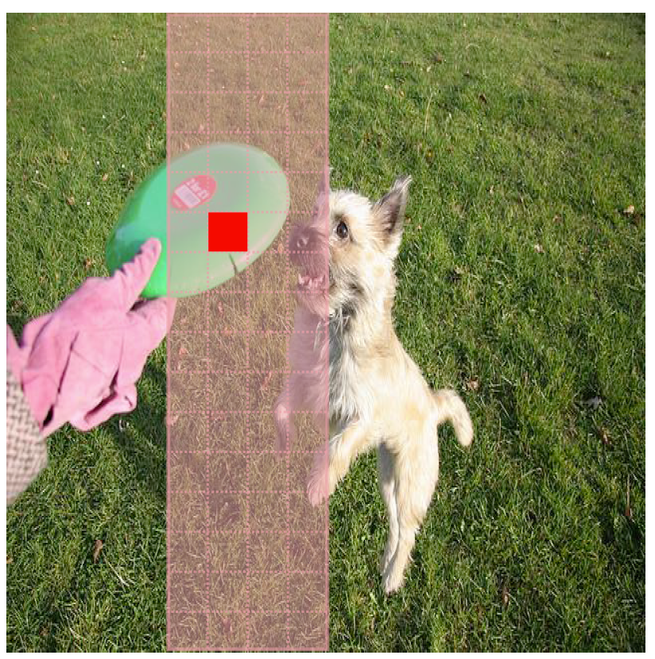
<figcaption>Mécanisme d’attention vertical proposé dans YOLOv12</figcaption>
</figure>
<figcaption>Mécanismes d’attention [<a href="../bibliography.html#ref-tian_yolov12_2025" role="doc-biblioref">28</a>]</figcaption>
</figure>

##### R-ELAN {#r-elan}

Les mécanismes d’attention rendent l’entraînement instable, particulièrement pour les gros modèles. La Figure [2.26](#fig:ch2_yolo_architecture_simplifiee){reference-type="ref" reference="fig:ch2_yolo_architecture_simplifiee"} illustre l’évolution progressive des architectures de blocs dans la famille YOLO, depuis les premières approches jusqu’à la proposition YOLOv12.

CSPNet (Figure [2.22](#fig:ch2_yolo_06_architecture_csp){reference-type="ref" reference="fig:ch2_yolo_06_architecture_csp"}), utilisé dans YOLOv4/YOLOv5, est l’architecture fondatrice qui divise le flux de données en deux branches parallèles, permettant un meilleur gradient flow et réduisant les calculs redondants. Une branche traverse directement, l’autre passe par plusieurs blocs convolutionnels avant concaténation.

ELAN (Figure [2.23](#fig:ch2_yolo_07_architecture_elan){reference-type="ref" reference="fig:ch2_yolo_07_architecture_elan"}), utilisé dans YOLOv7, correspond aux Efficient Layer Aggregation Networks qui améliorent l’agrégation de caractéristiques en connectant explicitement différentes couches. Cette architecture permet une meilleure réutilisation des caractéristiques, mais souffre de problèmes de stabilité d’optimisation, particulièrement visibles dans les gros modèles.

*C*3*K*2 (Figure [2.24](#fig:ch2_yolo_08_architecture_c3k2){reference-type="ref" reference="fig:ch2_yolo_08_architecture_c3k2"}), utilisé dans YOLOv11, est l’évolution de GELAN (Generalized ELAN) qui simplifie l’architecture tout en conservant l’efficacité. *C*3*K*2 représente un cas particulier optimisé de GELAN, adopté pour réduire la latence dans YOLOv11.

R-ELAN (Figure [2.25](#fig:ch2_yolo_09_architecture_relan){reference-type="ref" reference="fig:ch2_yolo_09_architecture_relan"}) est l’architecture de bloc proposée dans YOLOv12. La contribution majeure des Residual Efficient Layer Aggregation Networks est l’ajout d’une connexion résiduelle avec facteur d’échelle (scaling) depuis l’entrée vers la sortie, inspirée des techniques de Vision Transformers. Cette modification résout les problèmes de convergence observés avec les mécanismes d’attention, particulièrement critiques pour les modèles YOLOv12-L et YOLOv12-X qui ne convergent pas sans cette stabilisation.

<figure id="fig:ch2_yolo_architecture_simplifiee" data-latex-placement="H">
<figure id="fig:ch2_yolo_06_architecture_csp">
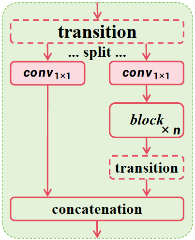
<figcaption>“CSPNet” (YOLOv4/v5)</figcaption>
</figure>
<figure id="fig:ch2_yolo_07_architecture_elan">
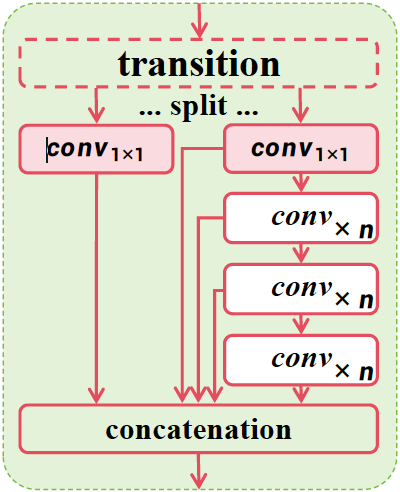
<figcaption>“ELAN” (YOLOv7)</figcaption>
</figure>
<figure id="fig:ch2_yolo_08_architecture_c3k2">
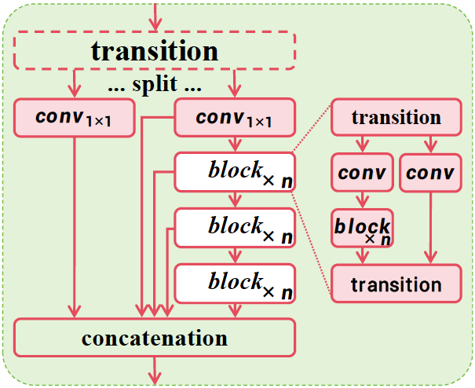
<figcaption>“\(C_3K_2\)” (YOLOv11)</figcaption>
</figure>
<figure id="fig:ch2_yolo_09_architecture_relan">
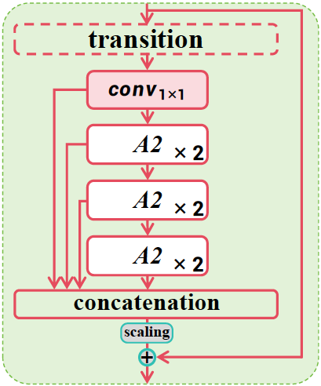
<figcaption>“R-ELAN” (YOLOv12)</figcaption>
</figure>
<figcaption>Évolution architecturale des blocs utilisés dans YOLO [<a href="../bibliography.html#ref-tian_yolov12_2025" role="doc-biblioref">28</a>]</figcaption>
</figure>

##### Améliorations architecturales {#améliorations-architecturales}

&#91;[28](../bibliography.md#ref-tian_yolov12_2025)&#93; introduisent plusieurs optimisations architecturales cruciales pour adapter efficacement les mécanismes d’attention au contexte temps réel de YOLO.

FlashAttention &#91;[29](../bibliography.md#ref-dao_flashattention_2022)&#93; résout le problème fondamental d’accès mémoire des transformers. Traditionnellement, l’attention stocke des matrices intermédiaires volumineuses en mémoire GPU lente (HBM), créant un goulot d’étranglement. FlashAttention optimise ces accès mémoire, réduisant significativement la latence sans perte de précision.

YOLOv12 introduit une innovation architecturale contre-intuitive : la suppression complète de l’encodage positionnel traditionnel des Vision Transformers. Cette décision simplifie drastiquement l’architecture en éliminant l’étape d’ajout explicite d’information positionnelle aux embeddings d’entrée.

Pour préserver l’information spatiale nécessaire, YOLOv12 utilise un position perceiver : une convolution séparable 7 × 7 appliquée directement aux valeurs d’attention *V*. Cette approche exploite les propriétés intrinsèques de la convolution pour encoder implicitement la position spatiale. L’effet de lissage du noyau convolutionnel préserve la cohérence positionnelle locale tout en capturant les relations spatiales dans un voisinage étendu.

Cette méthode s’avère plus efficace que l’encodage positionnel traditionnel car elle intègre l’information spatiale dans le flux de calcul de l’attention, évitant ainsi les opérations d’addition préliminaires. Le résultat est une architecture plus simple, plus rapide, et paradoxalement plus performante pour les tâches de détection temps réel.

La réduction du ratio MLP (Multilayer Perceptron) de 4.0 vers 1.2 rééquilibre la charge computationnelle entre les blocs d’attention et les réseaux feed-forward. Dans les Vision Transformers standards, le MLP consomme 75 % des calculs ; YOLOv12 privilégie l’attention (plus bénéfique pour la détection) en réduisant la taille des MLP.

#### Résultats principaux {#résultats-principaux-3}

YOLOv12 établit un nouveau compromis vitesse-précision optimal qui démontre la viabilité des mécanismes d’attention pour la détection temps réel.

Les performances surpassent systématiquement les modèles existants. YOLOv12-N atteint 40.6% mAP en 1.64 ms, dépassant YOLOv11-N de 1.2% mAP à vitesse équivalente. Cette supériorité se maintient sur toutes les échelles de modèles.

L’efficacité computationnelle est remarquable face aux détecteurs bout-à-bout. YOLOv12-S (9.3 M paramètres) surpasse RT-DETR-R18 &#91;[30](../bibliography.md#ref-zhao_detrs_2024)&#93; (20 M paramètres) avec 42 % de vitesse supplémentaire. Il utilise seulement 36 % des calculs et 47 % des paramètres.

Les cartes d’activation (Figure [2.27](#fig:ch2_yolo_10_perception){reference-type="ref" reference="fig:ch2_yolo_10_perception"}) révèlent une amélioration qualitative notable, avec des contours d’objets plus nets et une activation de premier plan plus précise comparé à YOLOv10/v11, illustrant concrètement les bénéfices des mécanismes d’attention optimisés.

<figure id="fig:ch2_yolo_10_perception" data-latex-placement="H">
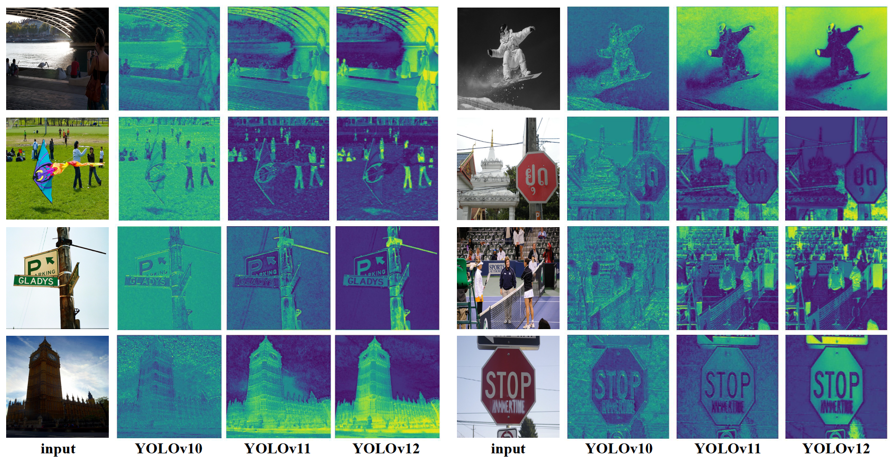
<figcaption>Perception des objets dans YOLOv10, YOLOv11 et YOLOv12 [<a href="../bibliography.html#ref-tian_yolov12_2025" role="doc-biblioref">28</a>]</figcaption>
</figure>

#### Discussion et limites {#discussion-et-limites-3}

YOLOv12 représente une avancée majeure en démontrant que les mécanismes d’attention peuvent être rendus suffisamment efficaces pour la détection temps réel.

Si l’étude démontre théoriquement qu’il est possible de rendre l’attention suffisamment efficace pour la détection temps réel, l’impact pratique reste mitigé. &#91;[31](../bibliography.md#ref-khanam_review_2025)&#93; &#91;[31](../bibliography.md#ref-khanam_review_2025)&#93; révèlent que YOLOv12 est à peine plus performant que ses prédécesseurs avec une architecture relativement complexe et plus gourmande en énergie.

La contrainte matérielle constitue une limitation majeure souvent sous-estimée. La dépendance exclusive à FlashAttention restreint l’utilisation aux GPU d’architecture Turing ou plus récente (RTX 20/30/40, A100, H100), excluant de facto une large base d’utilisateurs équipés de matériel plus ancien. Cette limitation est particulièrement problématique pour les applications industrielles où les cycles de renouvellement matériel sont longs. Cela affecte également les applications edge, dans lesquelles les ressources sont limitées et l’efficience énergétique du modèle est un paramètre critique.

### Segment Anything Model 2 : Segmentation d’images et de vidéos {#subsec:sam2_segment_anything_2024}

#### Contexte et objectifs {#contexte-et-objectifs-4}

Avant de présenter le modèle Segment Anything 2 (<a href="../glossary.html#gloss-sam2">SAM 2</a>), il est important de rappeler le modèle Segment Anything (<a href="../glossary.html#gloss-sam">SAM</a>) qui a été publié en &#91;[32](../bibliography.md#ref-kirillov_segment_2023)&#93;.

##### Segment Anything Model (<a href="../glossary.html#gloss-sam">SAM</a>) {#par:sam_segment_anything_2023}

SAM &#91;[32](../bibliography.md#ref-kirillov_segment_2023)&#93; est un modèle de segmentation d’images développé par Meta AI. L’objectif de Segment Anything est de générer des masques de segmentation de haute qualité pour n’importe quel objet d’une image à partir de prompts simples comme des points ou des boîtes. Cela lui permet d’effectuer diverses tâches de segmentation de manière flexible sans avoir besoin d’être entraîné à nouveau pour chacune d’entre elles.

Le modèle Segment Anything (<a href="../glossary.html#gloss-sam">SAM</a>) comporte trois éléments principaux :

- Encodeur d’images

- “Prompt encoder”

- Décodeur de masques

La Figure [2.28](#fig:ch2_sam2_01_fonctionnement_sam){reference-type="ref" reference="fig:ch2_sam2_01_fonctionnement_sam"} permet d’avoir une vue d’ensemble des différentes parties de SAM.

<figure id="fig:ch2_sam2_01_fonctionnement_sam" data-latex-placement="H">
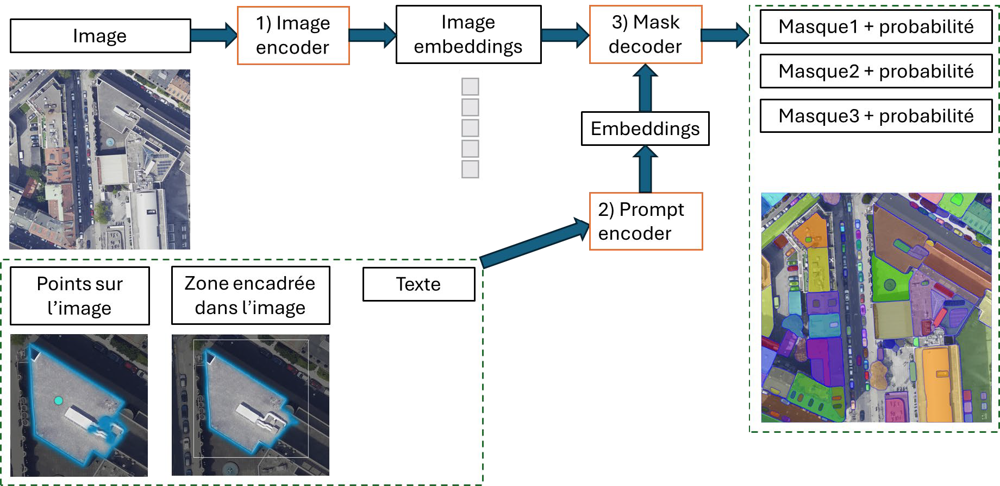
<figcaption>Fonctionnement de segment anything (<a href="../glossary.html#gloss-sam">SAM</a>)</figcaption>
</figure>

Le premier élément est l’encodeur d’images (“1” sur la Figure [2.28](#fig:ch2_sam2_01_fonctionnement_sam){reference-type="ref" reference="fig:ch2_sam2_01_fonctionnement_sam"}). L’encodeur d’image est un réseau de neurones qui a été pré-entraîné à l’aide d’une technique d’apprentissage auto-supervisé appelée Masked Autoencoder (MAE). L’encodeur prend une image en entrée et la fait passer par une série de couches d’auto-attention (self-attention), ce qui permet au modèle de capturer le contexte global et les relations entre les différentes parties de l’image. La sortie de l’encodeur d’image est l’image embedding, qui est une représentation vectorielle compacte à hautes dimensions d’une image d’entrée qui capture ses caractéristiques essentielles et ses informations spatiales.

Le deuxième élément est le prompt encoder (“2” sur la Figure [2.28](#fig:ch2_sam2_01_fonctionnement_sam){reference-type="ref" reference="fig:ch2_sam2_01_fonctionnement_sam"}). SAM fonctionne avec une interface graphique, la Figure [2.29](#fig:ch2_sam2_02_prompt_encoder){reference-type="ref" reference="fig:ch2_sam2_02_prompt_encoder"} montre l’interface graphique développée par Meta AI pour tester SAM.

<figure id="fig:ch2_sam2_02_prompt_encoder" data-latex-placement="H">
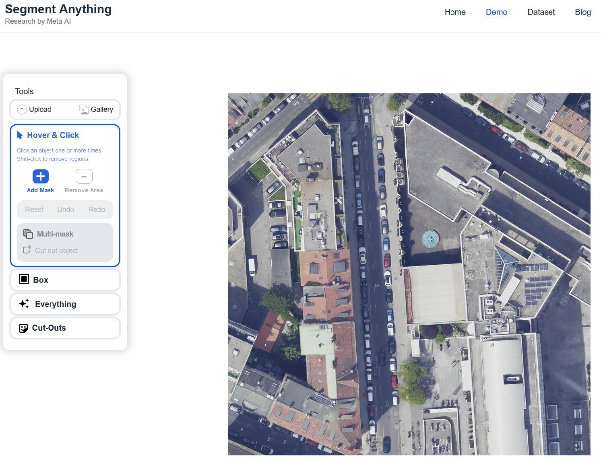
<figcaption>Interface graphique de démonstration de SAM [<a href="../bibliography.html#ref-fair_segment_nodate" role="doc-biblioref">33</a>]</figcaption>
</figure>

A l’aide des outils à gauche de la Figure [2.29](#fig:ch2_sam2_02_prompt_encoder){reference-type="ref" reference="fig:ch2_sam2_02_prompt_encoder"}, il est possible de sélectionner un point (Figure [2.30](#fig:ch2_sam2_03_prompt1){reference-type="ref" reference="fig:ch2_sam2_03_prompt1"}) ou sélectionner une partie de l’image avec une boite rectangulaire (Figure [2.31](#fig:ch2_sam2_04_prompt2){reference-type="ref" reference="fig:ch2_sam2_04_prompt2"}). Le modèle va alors segmenter la partie de l’image (voir Figure [2.32](#fig:ch2_sam2_prompt_exemple_point_rectangle){reference-type="ref" reference="fig:ch2_sam2_prompt_exemple_point_rectangle"}).

<figure id="fig:ch2_sam2_prompt_exemple_point_rectangle" data-latex-placement="H">
<figure id="fig:ch2_sam2_03_prompt1">
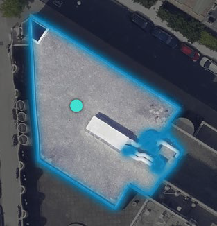
<figcaption>Exemple de sélection de masque avec un point</figcaption>
</figure>
<figure id="fig:ch2_sam2_04_prompt2">
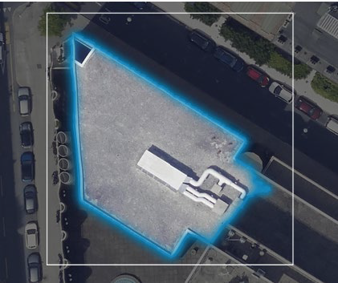
<figcaption>Exemple de sélection de masque avec une boite rectangulaire</figcaption>
</figure>
<figcaption>Interface graphique de démonstration de SAM [<a href="../bibliography.html#ref-fair_segment_nodate" role="doc-biblioref">33</a>]</figcaption>
</figure>

SAM permet aussi de décrire avec du texte ce que l’on souhaite segmenter sur l’image. Le prompt encoder va convertir toutes les informations (points, boite rectangulaire, texte) en une représentation vectorielle (embeddings) unique pour toutes les données renseignées. Cette représentation vectorielle sera ensuite utilisée pour le mask decoder.

La troisième partie est le mask decoder (“3” sur la Figure [2.28](#fig:ch2_sam2_01_fonctionnement_sam){reference-type="ref" reference="fig:ch2_sam2_01_fonctionnement_sam"}). Le mask decoder va utiliser les représentations vectorielles de l’encodeur d’images (“1” sur la Figure [2.28](#fig:ch2_sam2_01_fonctionnement_sam){reference-type="ref" reference="fig:ch2_sam2_01_fonctionnement_sam"}), ainsi que celles du prompt encoder (“2” sur la Figure [2.28](#fig:ch2_sam2_01_fonctionnement_sam){reference-type="ref" reference="fig:ch2_sam2_01_fonctionnement_sam"}) pour segmenter l’image en différents masques. Chacun de ces masques est une polyligne fermée, comme indiqué sur la Figure [2.33](#fig:ch2_sam2_05_masques){reference-type="ref" reference="fig:ch2_sam2_05_masques"}. Le modèle indique aussi la probabilité (confidence) qu’il estime que la segmentation est juste.

<figure id="fig:ch2_sam2_05_masques" data-latex-placement="H">
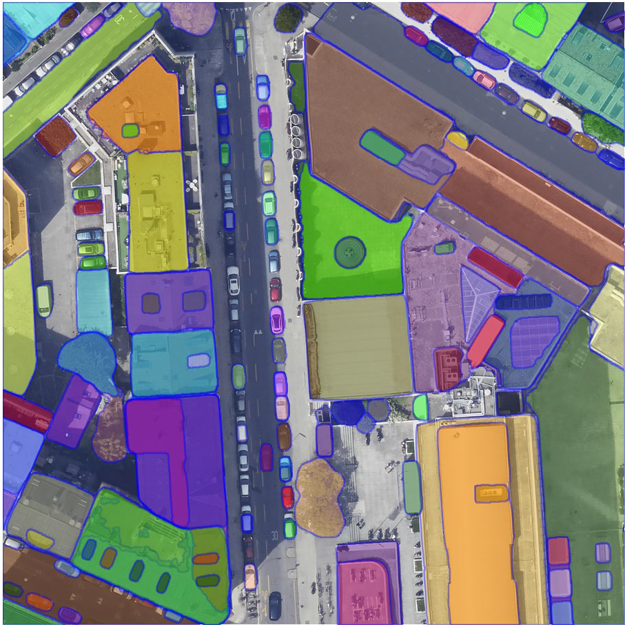
<figcaption>Interface graphique de démonstration de SAM. Exemple de segmentation</figcaption>
</figure>

Meta AI a accordé une attention particulière à la création du dataset SA-1B, utilisé pour entraîner le modèle SAM. Ce dataset est une collection d’images et de masques annotés pour la segmentation, avec 11 millions d’images et 1,1 milliard de masques. L’objectif principal de Meta AI était de constituer un ensemble de données plus représentatif et diversifié que les datasets existants, afin d’améliorer les performances et la généralisation des modèles de segmentation.

Le dataset couvre environ 70 pays et a été annoté manuellement par des travailleurs qualifiés. Les images ont été triées selon leur géolocalisation et leur niveau de revenu, afin d’assurer une représentativité adéquate des différents groupes socio-économiques. La Figure [2.36](#fig:ch2_sam2_sa1b_diversite_pays){reference-type="ref" reference="fig:ch2_sam2_sa1b_diversite_pays"} représente l’origine et la distribution des images utilisées par pays.

<figure id="fig:ch2_sam2_sa1b_diversite_pays" data-latex-placement="H">
<figure id="fig:ch2_sam2_06_dataset_sa1b_pays1">
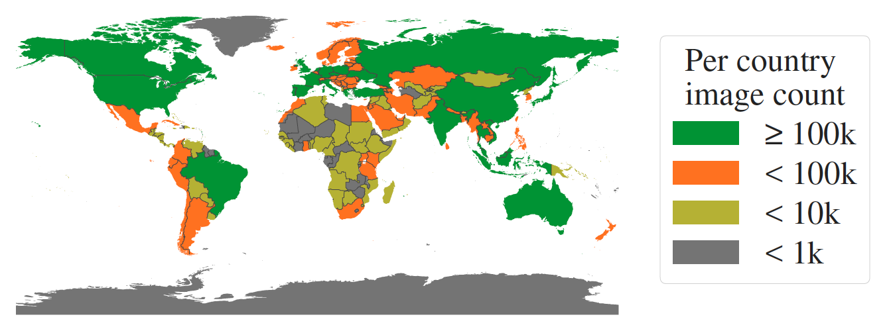
<figcaption>Carte de monde avec les pays les plus représentés dans le dataset SA-1B</figcaption>
</figure>
<figure id="fig:ch2_sam2_07_dataset_sa1b_pays2">
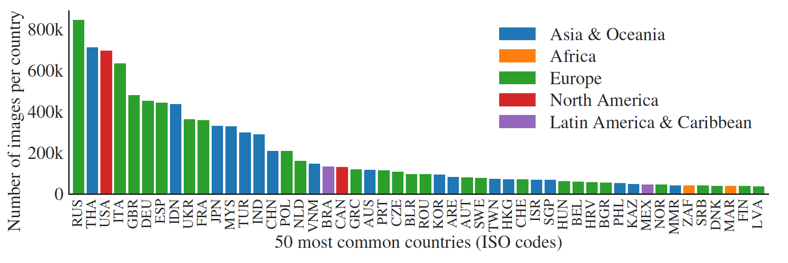
<figcaption>Distribution des images par pays dans le dataset SA-1B</figcaption>
</figure>
<figcaption>Origine des images qui forment le dataset SA-1B utilisé pour l’entrainement de SAM [<a href="../bibliography.html#ref-kirillov_segment_2023" role="doc-biblioref">32</a>]</figcaption>
</figure>

Le dataset contient des annotations précises pour chaque objet dans chaque image, ce qui en fait un outil utile pour les chercheurs et les développeurs travaillant sur des applications de segmentation.

Dans la Figure [2.37](#fig:ch2_sam2_08_eval_sam_humain){reference-type="ref" reference="fig:ch2_sam2_08_eval_sam_humain"}, Meta AI a demandé a des personnes d’évaluer la qualité de la segmentation sur 7 datasets différents. SAM est plus performant que le modèle RITM &#91;[34](../bibliography.md#ref-sofiiuk_reviving_2021)&#93; dans tous les cas.

<figure id="fig:ch2_sam2_08_eval_sam_humain" data-latex-placement="H">
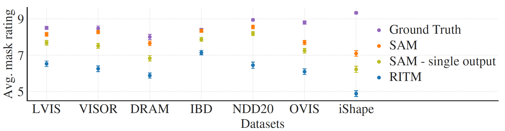
<figcaption>Evaluation par des humains de la qualité des masques générés par SAM et RITM [<a href="../bibliography.html#ref-kirillov_segment_2023" role="doc-biblioref">32</a>]</figcaption>
</figure>

Dans une autre comparaison (Figure [2.38](#fig:ch2_sam2_09_eval_sam_miou){reference-type="ref" reference="fig:ch2_sam2_09_eval_sam_miou"}), l’objectif est de comparer plusieurs modèles qui effectuent de la segmentation sur 23 datasets. SAM a un mIoU plus élevé que les autres modèles.

<figure id="fig:ch2_sam2_09_eval_sam_miou" data-latex-placement="H">
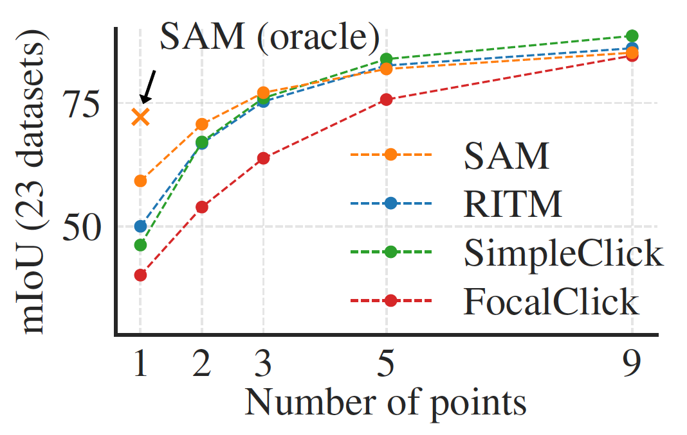
<figcaption>Comparatif de mIoU sur 23 datasets de SAM [<a href="../bibliography.html#ref-kirillov_segment_2023" role="doc-biblioref">32</a>]</figcaption>
</figure>

La Figure [2.38](#fig:ch2_sam2_09_eval_sam_miou){reference-type="ref" reference="fig:ch2_sam2_09_eval_sam_miou"} inclus également un résultat “oracle”, dans lequel la plus pertinente des 3 segmentations de SAM est sélectionnée en les comparant à la vérité terrain, plutôt que de sélectionner le masque avec la confidence la plus élevée. Cela révèle l’impact de l’ambiguïté sur l’évaluation automatique.

Pour conclure, jusqu’a l’arrivée de SAM2 en &#91;[35](../bibliography.md#ref-ravi_sam_2024)&#93;, l’état de l’art en segmentation d’image était SAM. Il est plus performant que tous les autres modèles existants qui réalisent cette tâche.

##### Segment Anything Model 2 (<a href="../glossary.html#gloss-sam2">SAM 2</a>) {#segment-anything-model-2-sam2}

L’article &#91;[35](../bibliography.md#ref-ravi_sam_2024)&#93; présente Segment Anything Model 2 (<a href="../glossary.html#gloss-sam2">SAM 2</a>), une extension du modèle de segmentation SAM vers le domaine vidéo. Alors que SAM révolutionna la segmentation d’images en 2023, les vidéos représentent une part croissante du contenu multimédia et nécessitent une localisation temporelle pour des applications critiques en réalité augmentée/virtuelle, robotique et véhicules autonomes.

&#91;[35](../bibliography.md#ref-ravi_sam_2024)&#93; identifient les défis spécifiques à la segmentation vidéo : changements d’apparence dus au mouvement, déformations, occlusions, variations d’éclairage, et qualité souvent inférieure aux images statiques. L’objectif est de développer un système universel capable de “segmenter n’importe quoi dans les vidéos” avec la même facilité que SAM pour les images.

Le travail introduit la tâche PVS (Promptable Visual Segmentation) qui généralise la segmentation interactive d’images aux vidéos, permettant de fournir des prompts (clics, boîtes, masques) sur n’importe quelle frame pour définir et raffiner des segments spatio-temporels appelés “masklets”.

La Figure [2.42](#fig:ch2_sam2_fonctionnement){reference-type="ref" reference="fig:ch2_sam2_fonctionnement"} représente une vue d’ensemble montrant la tâche PVS (Figure [2.39](#fig:ch2_sam2_pvs){reference-type="ref" reference="fig:ch2_sam2_pvs"}), l’architecture <a href="../glossary.html#gloss-sam2">SAM 2</a> (Figure [2.40](#fig:ch2_sam2_model){reference-type="ref" reference="fig:ch2_sam2_model"}) et le processus de collecte de données (Figure [2.41](#fig:ch2_sam2_data){reference-type="ref" reference="fig:ch2_sam2_data"}).

<figure id="fig:ch2_sam2_fonctionnement" data-latex-placement="H">
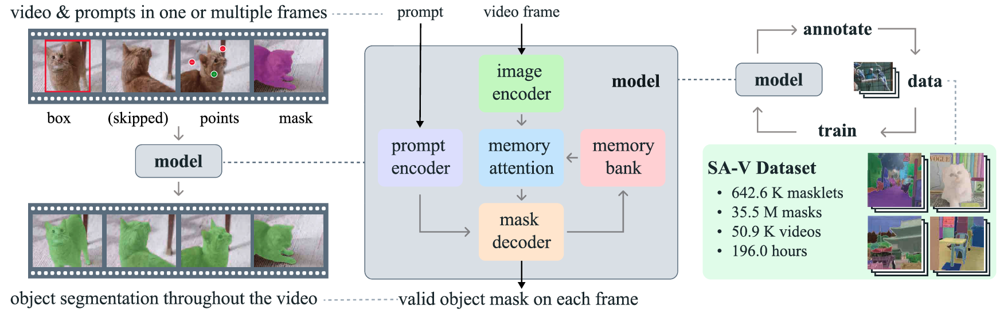
<figure id="fig:ch2_sam2_pvs">

</figure>
<figure id="fig:ch2_sam2_model">

</figure>
<figure id="fig:ch2_sam2_data">

</figure>
<figcaption>Fonctionnement SAM2 [<a href="../bibliography.html#ref-ravi_sam_2024" role="doc-biblioref">35</a>]</figcaption>
</figure>

#### Données {#données-4}

Les auteurs développent un moteur de données (data engine) en trois phases pour créer le dataset SA-V, le plus grand dataset de segmentation vidéo à ce jour. Le processus évolue de l’annotation manuelle pure vers l’assistance progressive par <a href="../glossary.html#gloss-sam2">SAM 2</a> :

- Phase 1 : Annotation manuelle photogramme par photogramme avec SAM (37.8s/photogramme)

- Phase 2 : SAM + propagation temporelle par <a href="../glossary.html#gloss-sam2">SAM 2</a> (7.4s/photogramme)

- Phase 3 : <a href="../glossary.html#gloss-sam2">SAM 2</a> complet avec mémoire temporelle (4.5s/photogramme)

Le dataset final SA-V comprend 50.9K vidéos avec 642.6K masklets (190.9K manuels + 451.7K automatiques), représentant 53× plus de masques que tout dataset VOS existant. La diversité géographique couvre 47 pays, avec annotation de segments entiers et de parties d’objets, sans contraintes catégorielles.

Un processus de vérification qualité garantit la cohérence temporelle des annotations, avec classification “satisfaisant/non-satisfaisant” par des annotateurs dédiés.

#### Méthodologie {#méthodologie-4}

<a href="../glossary.html#gloss-sam2">SAM 2</a> adopte une architecture (Figure [2.43](#fig:ch2_sam2_11_architecture_sam2){reference-type="ref" reference="fig:ch2_sam2_11_architecture_sam2"}) de traitement en flux continu (streaming) qui analyse les vidéos photogramme par photogramme, équipée d’un système de mémoire sophistiqué pour préserver le contexte temporel entre les images. Cette approche permet un traitement en temps réel de vidéos de longueur arbitraire. Les composants clés incluent :

- Encodeur d’image : Utilise l’architecture Hiera, un transformateur de vision hiérarchique pré-entraîné avec la méthode MAE (Masked Autoencoder). Cette structure hiérarchique extrait des caractéristiques visuelles à différentes résolutions spatiales, des détails fins aux motifs globaux.

- Module d’attention mémoire : Composé de L couches de transformateurs qui conditionnent les caractéristiques de l’image actuelle en fonction des informations stockées en mémoire des images précédentes, permettant une cohérence temporelle.

- Banque mémoire : Système de stockage organisé en files d’attente FIFO (premier entré, premier sorti) qui conserve les informations de N photogrammes récents et de M photogrammes contenant des instructions utilisateur. Inclut également des “pointeurs d’objets” (object pointers), des vecteurs compacts encodant l’information sémantique de haut niveau sur l’objet suivi.

- Décodeur de masque : Architecture similaire à celle de SAM original, augmentée d’une tête de prédiction supplémentaire qui détermine si l’objet d’intérêt est visible ou caché dans le photogramme actuel, gérant ainsi les disparitions temporaires d’objets.

<figure id="fig:ch2_sam2_11_architecture_sam2" data-latex-placement="H">
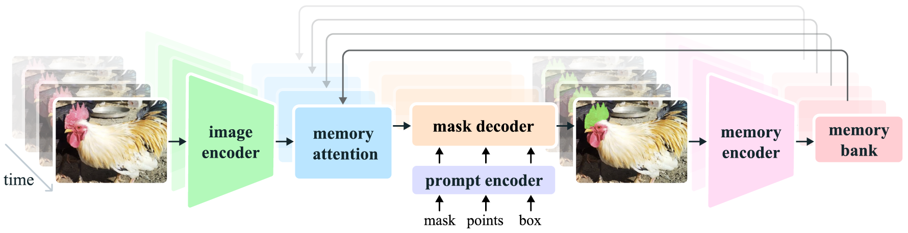
<figcaption>Architecture SAM2 [<a href="../bibliography.html#ref-ravi_sam_2024" role="doc-biblioref">35</a>]</figcaption>
</figure>

##### Stratégie d’entraînement {#stratégie-dentraînement}

L’entraînement de <a href="../glossary.html#gloss-sam2">SAM 2</a> simule des sessions d’annotation interactive réelles pour apprendre au modèle à gérer efficacement les interactions utilisateur dans le contexte vidéo. Le processus d’apprentissage s’appuie sur des séquences de 8 images consécutives extraites de vidéos d’entraînement.

Pour chaque séquence, les chercheurs simulent le comportement d’un annotateur humain en sélectionnant jusqu’à 2 images qui recevront des instructions explicites (prompts). Les prompts initiaux suivent une distribution réaliste : masque de segmentation correct dans 50% des cas, clic simple sur l’objet dans 25% des cas, et boîte englobante dans les 25% restants. Des clics correctifs supplémentaires sont introduits de manière probabiliste durant l’entraînement pour simuler les corrections qu’un utilisateur réel effectuerait face à une segmentation imparfaite.

L’objectif pédagogique consiste à apprendre au modèle à prédire la segmentation temporelle complète (masklet) sur l’ensemble des 8 images de la séquence, en s’appuyant uniquement sur ces quelques instructions partielles et en exploitant sa mémoire temporelle.

##### Fonctionnement en inférence interactive {#fonctionnement-en-inférence-interactive}

Une fois entraîné, <a href="../glossary.html#gloss-sam2">SAM 2</a> effectue la segmentation interactive selon un processus en deux étapes qui exploite sa mémoire temporelle pour maintenir la cohérence des masques à travers les séquences d’images (Figure [2.44](#fig:ch2_sam2_12_entrainement_sam2){reference-type="ref" reference="fig:ch2_sam2_12_entrainement_sam2"}).

La première étape consiste en la sélection initiale de l’objet cible (frame 1, step 1 sur Figure [2.44](#fig:ch2_sam2_12_entrainement_sam2){reference-type="ref" reference="fig:ch2_sam2_12_entrainement_sam2"}). L’utilisateur fournit des invites sur une image de référence : les points verts correspondent aux zones à inclure dans la segmentation, tandis que les points rouges représentent les régions à exclure. Dans l’exemple, <a href="../glossary.html#gloss-sam2">SAM 2</a> identifie le segment de l’objet d’intérêt (la langue) dans l’image 1, puis propage automatiquement ce segment aux images suivantes pour former un masque temporel continu.

<figure id="fig:ch2_sam2_12_entrainement_sam2" data-latex-placement="H">
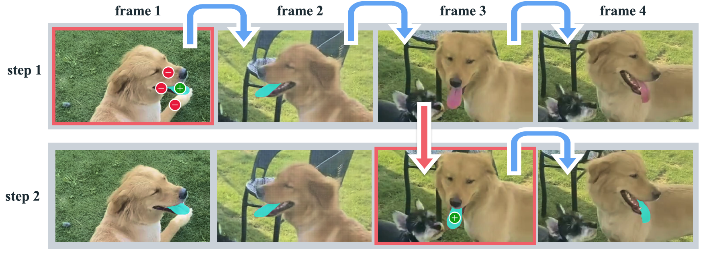
<figcaption>Processus de segmentation interactive avec <a href="../glossary.html#gloss-sam2">SAM 2</a> : sélection initiale et raffinement par mémoire temporelle [<a href="../bibliography.html#ref-ravi_sam_2024" role="doc-biblioref">35</a>]</figcaption>
</figure>

La seconde étape intervient lors des situations de perte de suivi. Il arrive que <a href="../glossary.html#gloss-sam2">SAM 2</a> perde la trace de l’objet au cours de la propagation temporelle, comme observé l’exemple (frame 3, step 1 sur Figure [2.44](#fig:ch2_sam2_12_entrainement_sam2){reference-type="ref" reference="fig:ch2_sam2_12_entrainement_sam2"}). Dans ce cas, l’utilisateur peut corriger le masque en fournissant une invite supplémentaire (frame 3, step 2 sur Figure [2.44](#fig:ch2_sam2_12_entrainement_sam2){reference-type="ref" reference="fig:ch2_sam2_12_entrainement_sam2"}) dans une nouvelle image de la séquence.

L’avantage de <a href="../glossary.html#gloss-sam2">SAM 2</a> réside dans sa capacité à raffiner la segmentation grâce à la mémoire temporelle. Un seul clic dans l’image suffit pour récupérer l’objet perdu et relancer la propagation correcte pour la suite de la séquence. Cette approche contraste favorablement avec les méthodes découplées combinant SAM et un tracker vidéo traditionnel, qui nécessiteraient de recommencer entièrement le processus de segmentation, obligeant l’utilisateur à fournir plusieurs clics dans le frame 3 (Figure [2.44](#fig:ch2_sam2_12_entrainement_sam2){reference-type="ref" reference="fig:ch2_sam2_12_entrainement_sam2"}) comme lors de l’annotation initiale. La mémoire temporelle de <a href="../glossary.html#gloss-sam2">SAM 2</a> réduit ainsi considérablement l’effort d’annotation requis pour maintenir un suivi précis des objets dans les vidéos.

#### Résultats principaux {#résultats-principaux-4}

<a href="../glossary.html#gloss-sam2">SAM 2</a> démontre des performances supérieures sur de multiples benchmarks, validant son efficacité dans trois domaines d’application principaux.

##### Segmentation vidéo interactive {#segmentation-vidéo-interactive}

Les évaluations en segmentation vidéo interactive menées sur 9 datasets densément annotés démontrent la supériorité de <a href="../glossary.html#gloss-sam2">SAM 2</a> par rapport aux méthodes de référence qui combinent SAM avec des trackers vidéo spécialisés (SAM+XMem++ &#91;[36](../bibliography.md#ref-bekuzarov_xmem_2023)&#93; &#91;[37](../bibliography.md#ref-noauthor_mbzuai-metaversexmem2_2025)&#93; et SAM+Cutie &#91;[38](../bibliography.md#ref-cheng_putting_2024)&#93; &#91;[39](../bibliography.md#ref-cheng_hkchengrexcutie_2025)&#93;). Ces tests ont été réalisés avec un protocole standardisé de 3 clics par photogramme, les résultats complets sont présentés dans la Figure [2.47](#fig:ch2_sam2_resultats_sam2_segmentation_video){reference-type="ref" reference="fig:ch2_sam2_resultats_sam2_segmentation_video"}.

L’évaluation s’organise selon deux protocoles distincts qui reflètent différents scénarios d’usage pratique. Le premier mode, appelé évaluation hors ligne (offline), permet d’effectuer plusieurs passes successives à travers une vidéo. Cette approche autorise l’annotateur à sélectionner de manière stratégique les images sur lesquelles intervenir, en se basant sur l’analyse des erreurs de modèle les plus critiques identifiées lors des passes précédentes (Figure [2.45](#fig:ch2_sam2_13_resultats_sam2_segmentation_video_offline){reference-type="ref" reference="fig:ch2_sam2_13_resultats_sam2_segmentation_video_offline"}).

Le second mode correspond à l’évaluation en ligne (online), qui simule un contexte d’annotation en temps réel. Dans cette configuration, les images sont annotées au cours d’un unique passage séquentiel à travers la vidéo, sans possibilité de retour en arrière ou d’optimisation a posteriori (Figure [2.46](#fig:ch2_sam2_14_resultats_sam2_segmentation_video_online){reference-type="ref" reference="fig:ch2_sam2_14_resultats_sam2_segmentation_video_online"}). Ce protocole reflète davantage les contraintes rencontrées lors d’applications pratiques où l’annotation doit s’effectuer de manière continue.

<figure id="fig:ch2_sam2_resultats_sam2_segmentation_video" data-latex-placement="H">
<figure id="fig:ch2_sam2_13_resultats_sam2_segmentation_video_offline">
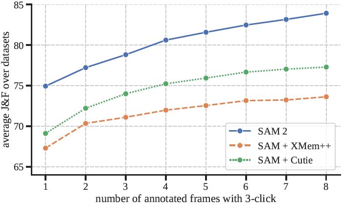
<figcaption>Evaluation en mode offline</figcaption>
</figure>
<figure id="fig:ch2_sam2_14_resultats_sam2_segmentation_video_online">
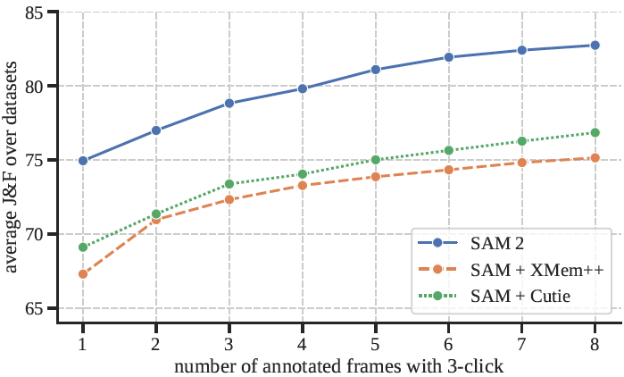
<figcaption>Evaluation en mode online</figcaption>
</figure>
<figcaption>Zero-shot accuracy sur 9 datasets de segmentation vidéo interactive [<a href="../bibliography.html#ref-ravi_sam_2024" role="doc-biblioref">35</a>]</figcaption>
</figure>

##### Segmentation d’objets vidéo semi-supervisée {#segmentation-dobjets-vidéo-semi-supervisée}

Pour la segmentation d’objets vidéo semi-supervisée (VOS - Video Object Segmentation), <a href="../glossary.html#gloss-sam2">SAM 2</a> démontre d’excellentes capacités dans un contexte d’annotation minimale. Cette tâche consiste à segmenter et suivre un objet à travers une séquence vidéo complète en ne disposant que d’une seule annotation manuelle sur la première image de la vidéo. Le modèle doit ensuite propager automatiquement cette segmentation initiale sur toutes les images suivantes, en gérant les défis comme les changements d’apparence, les occlusions temporaires, et les variations d’éclairage.

<a href="../glossary.html#gloss-sam2">SAM 2</a> établit de nouveaux records de performance sur 17 datasets de référence. Les évaluations utilisent la métrique J&F, qui combine l’accuracy de la segmentation (mesure J, basée sur l’intersection sur union des masques) et l’accuracy des contours (mesure F, évaluant la qualité des frontières d’objets). Cette métrique composite, exprimée en pourcentage, reflète fidèlement la qualité globale de la segmentation temporelle.

Les gains sont particulièrement remarquables sur les benchmarks les plus exigeants du domaine (Figure [2.1](#tab:ch2_sam2_resultats_sam2_vos_zeroshot){reference-type="ref" reference="tab:ch2_sam2_resultats_sam2_vos_zeroshot"}). Sur le dataset MOSE &#91;[40](../bibliography.md#ref-noauthor_mose_nodate)&#93;, reconnu pour sa complexité avec des objets subissant des transformations importantes et des occlusions prolongées, <a href="../glossary.html#gloss-sam2">SAM 2</a> atteint 76.6% de score J&F contre 71.7% pour la meilleure méthode précédente (Cutie-base+), soit une amélioration absolue de 4.9 points. Sur DAVIS 2017 &#91;[41](../bibliography.md#ref-noauthor_davis_nodate)&#93;, le benchmark historique de référence en segmentation vidéo, <a href="../glossary.html#gloss-sam2">SAM 2</a> obtient 90.2% contre 88.1% pour les approches existantes, établissant un nouveau standard de performance.

| Method     | 1-click | 3-click | 5-click | bounding box | ground-truth mask |
|:-----------|:-------:|:-------:|:-------:|:------------:|:-----------------:|
| SAM+XMem++ |  56.9   |  68.4   |  70.6   |     67.6     |       72.7        |
| SAM+Cutie  |  56.7   |  70.1   |  72.2   |     69.4     |       74.1        |
| SAM 2      |  64.7   |  75.3   |  77.6   |     74.4     |       79.3        |

<em>Zero-shot accuracy sur 17 datasets vidéo avec différents types de prompts. Accuracy moyenne pour chaque type de prompt (1, 3 ou 5 clics, boîtes englobantes, ou masques de vérité terrain) appliqué sur la première image de chaque vidéo &#91;[35](../bibliography.md#ref-ravi_sam_2024)&#93;</em>

Ces résultats sont d’autant plus remarquables que <a href="../glossary.html#gloss-sam2">SAM 2</a>, contrairement aux méthodes spécialisées qu’il surpasse, reste un modèle généraliste capable de segmenter n’importe quel objet sans restriction catégorielle, démontrant ainsi la puissance de son approche unifiée.

##### Segmentation d’images {#segmentation-dimages}

En segmentation d’images, <a href="../glossary.html#gloss-sam2">SAM 2</a> maintient et améliore significativement les performances de son prédécesseur sur une suite étendue de 37 datasets, incluant les 23 benchmarks originaux de SAM. L’évaluation utilise la métrique mIoU (mean Intersection over Union), qui mesure la précision moyenne de segmentation en calculant le rapport entre l’intersection et l’union des masques prédits et réels, exprimé en pourcentage.

Le Tableau [2.2](#tab:ch2_sam2_resultats_segmentation_image_miou){reference-type="ref" reference="tab:ch2_sam2_resultats_segmentation_image_miou"} présente une analyse comparative détaillée des performances de SAM et <a href="../glossary.html#gloss-sam2">SAM 2</a>. Les résultats sont organisés par domaine d’application et montrent les scores mIoU moyens pour 1 et 5 clics utilisateur. Les métriques correspondent aux moyennes calculées sur les 23 datasets originellement utilisés pour l’évaluation de SAM (SA-23), subdivisés entre datasets d’images et de vidéos, ainsi qu’aux résultats sur 14 datasets vidéo supplémentaires évalués en inférence directe.

| Model | Data  | 1 (5) click mIoU |             |             |              |   FPS |
|:------|:------|:----------------:|:-----------:|:-----------:|:------------:|------:|
| 3-6   |       |    SA-23 All     | SA-23 Image | SA-23 Video | 14 new Video |       |
| SAM   | SA-1B |   58.1 (81.3)    | 60.8 (82.1) | 54.5 (80.3) | 59.1 (83.4)  |  21.7 |
| SAM 2 | SA-1B |   58.9 (81.7)    | 60.8 (82.1) | 56.4 (81.2) | 56.6 (83.7)  | 130.1 |
| SAM 2 | mix   |   61.9 (83.5)    | 63.3 (83.8) | 60.1 (83.2) | 69.6 (85.8)  | 130.1 |

<em>Performances de <a href="../glossary.html#gloss-sam2">SAM 2</a> en inférence directe sur la tâche de segmentation d’images évaluées sur 37 datasets &#91;[35](../bibliography.md#ref-ravi_sam_2024)&#93;.</em>

Les résultats révèlent plusieurs éléments importants. Premièrement, si le modèle est entrainé uniquement sur le dataset SA-1B (comme SAM original), <a href="../glossary.html#gloss-sam2">SAM 2</a> atteint 58.9% de mIoU avec un seul clic contre 58.1% pour SAM, démontrant une amélioration modeste mais par contre le gain de vitesse est remarquable : 130.1 contre 21.7 images par seconde, soit environ 6 fois plus rapide. Ce gain provient principalement de l’architecture Hiera plus compacte et optimisée.

Deuxièmement, l’entraînement conjoint sur données image-vidéo (configuration “mix” dans le Tableau [2.2](#tab:ch2_sam2_resultats_segmentation_image_miou){reference-type="ref" reference="tab:ch2_sam2_resultats_segmentation_image_miou"}) révèle tout le potentiel de l’approche multimodale de <a href="../glossary.html#gloss-sam2">SAM 2</a>. Les performances grimpent à 61.9% de mIoU moyen, avec des gains particulièrement marqués sur les données vidéo : 69.6% sur les 14 nouveaux datasets vidéo contre 56.6% pour la version entraînée uniquement sur images. Cette amélioration illustre comment l’apprentissage temporel enrichit la compréhension spatiale du modèle.

Cette capacité d’adaptation automatique à de nouveaux domaines sans réentraînement constitue un atout majeur pour les applications pratiques, où la diversité des données d’entrée est souvent imprévisible.

#### Discussion et limites {#discussion-et-limites-4}

Malgré ses performances remarquables, <a href="../glossary.html#gloss-sam2">SAM 2</a> présente certaines limitations techniques identifiées par les auteurs.

Les principales défaillances concernent les discontinuités temporelles (changements de plan brutaux), les scènes visuellement encombrées, les occlusions prolongées et le traitement de vidéos très longues. Néanmoins, l’architecture interactive permet de récupérer rapidement d’erreurs par des prompts correctifs sur n’importe quel photogramme.

Les limitations de précision spatiale se manifestent avec les objets comportant des détails très fins (cheveux, contours complexes), particulièrement en mouvement rapide, ainsi qu’avec les objets d’apparence très similaire que le modèle peut confondre en s’appuyant principalement sur les caractéristiques visuelles.

Sur le plan architectural, <a href="../glossary.html#gloss-sam2">SAM 2</a> traite chaque objet indépendamment sans communication inter-objets, partageant uniquement les embeddings d’images. Cette approche ignore les relations spatiales et temporelles entre objets, qui pourraient enrichir la compréhension de scène.

Les auteurs proposent plusieurs améliorations : intégration d’une modélisation explicite du mouvement (flux optique, prédicteurs de trajectoire), incorporation d’informations contextuelles partagées entre objets, et automatisation partielle du processus d’annotation par des métriques de confiance automatiques.

Malgré ces limitations, <a href="../glossary.html#gloss-sam2">SAM 2</a> représente une avancée considérable vers la segmentation universelle d’objets dans les images et vidéos, ouvrant de nouvelles possibilités pour la réalité augmentée, la robotique autonome, les systèmes de conduite assistée et l’édition vidéo professionnelle.

## Machine learning appliqué au calcul du potentiel solaire {#machine-learning-appliqué-au-calcul-du-potentiel-solaire}

Ce chapitre explore l’état de l’art du machine learning appliqué aux données géomatiques et aux images satellite, avec comme objectif le calcul du potentiel solaire. La première sous-section examine en détail le travail réalisé par <a href="../glossary.html#gloss-stdl">STDL</a>, suivie de deux autres articles présentant chacun des approches différentes pour le calcul du potentiel solaire.

### Détection des objets présents sur les toitures et identification des espaces libres {#subsec:stdl_analyse}

Ce sous-section va traiter en détail le projet &#91;[2](../bibliography.md#ref-herny_detection_2024)&#93; réalisé par l’équipe du Swiss Territorial Data Lab (<a href="../glossary.html#gloss-stdl">STDL</a>) pour identifier les objets présents sur les toitures.

#### Résumé {#résumé}

Les toits libres offrent un potentiel important pour l’installation de nouvelles infrastructures, comme les panneaux solaires et les toits végétalisés, afin de s’adapter au changement climatique. Cependant, il est souvent difficile d’évaluer ce potentiel en raison du manque d’inventaire des objets existants sur les toits.

Dans le cadre d’un projet &#91;[2](../bibliography.md#ref-herny_detection_2024)&#93; du <a href="../glossary.html#gloss-stdl">STDL</a> avec le Canton de Genève, trois méthodes ont été développées pour identifier automatiquement les surfaces occupées et libres sur les toits. Ces méthodes et leurs résultats sont :

- La classification des pans de toit

  - Classification avec un algorithme “random forrest”

  - Données : couche vectorielle “CAD\_BATIMENTS\_HORSOL\_TOIT” &#91;[42](../bibliography.md#ref-sitg_toits_nodate)&#93;

  - Precision globale 83%. Precision d’environ 93% pour la classe “potentiellement libre” et 76% pour la classe “occupé”

  - Demande très peu de ressources informatiques. Plaît aux experts

- La segmentation des données <a href="../glossary.html#gloss-lidar">LiDAR</a>

  - Algorithmes spécifiques pour segmentation nuage de points <a href="../glossary.html#gloss-lidar">LiDAR</a> en polygones

  - Données : données <a href="../glossary.html#gloss-lidar">LiDAR</a> du canton de Genève 2019 &#91;[43](../bibliography.md#ref-sitg_nuages_2019)&#93;

  - F1-score = 0.76 et mIoU = 0.40

  - Polygones de détection ne sont pas lisses et ne plaisent pas aux experts

- La segmentation d’images

  - Librairie python “segment-geospatial” &#91;[44](../bibliography.md#ref-wu_samgeo_2023)&#93; basé sur segment anything model (<a href="../glossary.html#gloss-sam">SAM</a>) pour détecter et segmenter les objets

  - Données : Orthophotos du canton de Genève 2019 &#91;[45](../bibliography.md#ref-sitg_orthophotos_nodate)&#93;

  - F1-score = 0.75 et mIoU = 0.37

  - Demande beaucoup de ressources informatiques

Les résultats des trois méthodes ont été jugés satisfaisants par les experts, 70% à 95% des résultats étant considérés comme acceptables. Compte tenu de la qualité des résultats et du temps de calcul, seule la méthode de classification a été retenue pour une application au niveau cantonal.

#### Introduction {#introduction-1}

Pour répondre aux défis de la crise climatique et de la transition écologique, il est important que les collectivités locales adaptent leurs politiques d’aménagement du territoire. Une mesure efficace consiste à utiliser les toits pour installer de nouvelles infrastructures, telles que des panneaux solaires ou des toits végétalisés, afin de minimiser l’impact sur l’utilisation des sols.

Cependant, il est essentiel d’avoir une connaissance précise de la surface disponible et des infrastructures existantes afin de planifier les futurs investissements. Malheureusement, ces informations sont souvent rares et difficiles à tenir à jour, en particulier dans les grandes villes. Cela peut être dû à la complexité des toitures et au nombre croissant d’objets présents. Afin de remédier à cela, l’utilisation d’images aériennes à haute résolution ainsi que des données <a href="../glossary.html#gloss-lidar">LiDAR</a> est de plus en plus intéressante. Ces technologies permettent de mieux comprendre le potentiel des toits et de suivre leur évolution.

Dans un contexte d’urbanisation croissante, il est essentiel de développer des méthodes numériques avancées pour exploiter au mieux les ressources des toits et créer des villes durables.

#### Parties prenantes {#parties-prenantes}

Les principales parties prenantes dans ce projet sont :

- Swiss Territorial Data Lab (<a href="../glossary.html#gloss-stdl">STDL</a>)

- Office cantonal de l’énergie du Canton de Genève (<a href="../glossary.html#gloss-ocen">OCEN</a>)

- Office cantonal de l’agriculture et de la nature du Canton de Genève (<a href="../glossary.html#gloss-ocan">OCAN</a>)

Le <a href="../glossary.html#gloss-stdl">STDL</a> a pour but de résoudre les problématiques concrètes des administrations publiques en utilisant la science des données appliquée aux géodonnées &#91;[46](../bibliography.md#ref-stdl_swiss_nodate)&#93;.

Dans le comité de pilotage du <a href="../glossary.html#gloss-stdl">STDL</a> se trouvent:

- Office fédéral de topographie swisstopo

- Office fédéral de la statistique (OFS)

- Conférence des services cantonaux de la géoinformation et du cadastre (CGC)

- Ville de Zurich

- République et canton de Genève

- République et canton de Neuchâtel

- Canton des Grisons

L’office cantonal de l’énergie du Canton de Genève (<a href="../glossary.html#gloss-ocen">OCEN</a>) a pour but de conduire la politique énergétique du canton, notamment en maîtrisant et en réduisant la consommation. Il veille à assurer les conditions d’un approvisionnement durable et fiable en encourageant la production et l’utilisation d’énergies renouvelables et indigènes pour se substituer aux énergies nucléaire et fossile. &#91;[47](../bibliography.md#ref-etat_de_geneve_office_nodate-1)&#93;

L’Office cantonal de l’agriculture et de la nature (<a href="../glossary.html#gloss-ocan">OCAN</a>) promeut la biodiversité et garantit l’intégration de la nature comme de l’agriculture dans l’espace urbain. &#91;[48](../bibliography.md#ref-etat_de_geneve_office_nodate)&#93;

#### Données {#données-5}

<a href="../glossary.html#gloss-sitg">SITG</a> dispose d’une grande quantité de données géographiques, les données suivantes ont été utilisées dans le cadre de ce projet :

- Nuage de points <a href="../glossary.html#gloss-lidar">LiDAR</a> de l’année 2019 &#91;[43](../bibliography.md#ref-sitg_nuages_2019)&#93;

- Orthophotos de l’année 2019 &#91;[45](../bibliography.md#ref-sitg_orthophotos_nodate)&#93;

- Couche <a href="../glossary.html#gloss-sitg">SITG</a> d’emprise des toitures des bâtiments hors sol “CAD\_BATIMENTS\_HORSOL\_TOIT” &#91;[42](../bibliography.md#ref-sitg_toits_nodate)&#93;

##### <a href="../glossary.html#gloss-lidar">LiDAR</a> {#lidar}

Les données <a href="../glossary.html#gloss-lidar">LiDAR</a> 2019 &#91;[43](../bibliography.md#ref-sitg_nuages_2019)&#93; de l’État de Genève ont une densité de 25 points/m2. La précision altimétrique est de ± 10 cm sur surface dure et la précision planimétrique est estimée à 20 cm environ. Le vol de l’avion a été réalisé en mars 2019.

Chaque point a une classe assignée dont les principales sont :

- 1 - Non classifié

- 2 – Sol

- 3 - Basse végétation (&lt; 50cm)

- 5 - Haute végétation (&gt; 50cm)

- 6 – Bâtiments

- 7 - Points bas ou isolés

- 9 – Eau

- 13 - Ponts, passerelles

- 15 - Sol (points complémentaires)

- 16 – Bruit

- 19 - Points mesurés hors périmètre de l’acquisition

##### Orthophotos {#orthophotos}

Le canton de Genève a réalisé en mai 2019 des images aériennes de haute résolution &#91;[45](../bibliography.md#ref-sitg_orthophotos_nodate)&#93; de tout le canton qui ont ensuite été converties en true orthophotos. En annexe, la sous-section à la page  présente en détail ce que sont les orthophotos, les différents types et comment elles sont produites.

Ces orthophotos ont la particularité de ne pas avoir de décalage vis-à-vis d’un modèle numérique du terrain, donc les couches vectorielles devraient s’aligner avec les orthophotos. Chaque pixel représente 5 cm.

##### Couche vectorielle d’emprise au sol des toitures {#couche-vectorielle-demprise-au-sol-des-toitures}

<a href="../glossary.html#gloss-sitg">SITG</a> dispose d’une couche vectorielle d’emprise des toitures des bâtiments hors sol “CAD\_BATIMENTS\_HORSOL\_TOIT” &#91;[42](../bibliography.md#ref-sitg_toits_nodate)&#93;. Cette couche provient de la numérisation 3D des bâtiments. La Figure [2.48](#fig:stdl_01_couche_vectorielle){reference-type="ref" reference="fig:stdl_01_couche_vectorielle"} représente un exemple de cette couche avec une orthophoto en fond d’image.

<figure id="fig:stdl_01_couche_vectorielle" data-latex-placement="H">
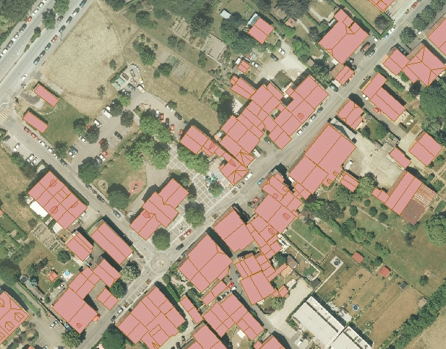
<figcaption>Image d’exemple de la couche vectorielle d’emprise au sol des bâtiments “CAD_BATIMENTS_HORSOL_TOIT” [<a href="../bibliography.html#ref-sitg_toits_nodate" role="doc-biblioref">42</a>]</figcaption>
</figure>

Cette couche est régulièrement mise à jour. <a href="../glossary.html#gloss-stdl">STDL</a> a utilisé les données de mars 2023 pour son projet. Les superstructures sont des éléments qui dépassent de la toiture tel qu’une cheminée, cage d’ascenseur, lucarne, etc. ne sont pas représentés dans cette couche. Tout ce qui est en dessous de 9 m2 ne figure pas dans cette couche.

##### Vérité terrain {#vérité-terrain}

La Figure [2.49](#fig:stdl_02_verite_terrain){reference-type="ref" reference="fig:stdl_02_verite_terrain"} représente les bâtiments choisis par <a href="../glossary.html#gloss-stdl">STDL</a> pour la vérité terrain.

<figure id="fig:stdl_02_verite_terrain" data-latex-placement="H">
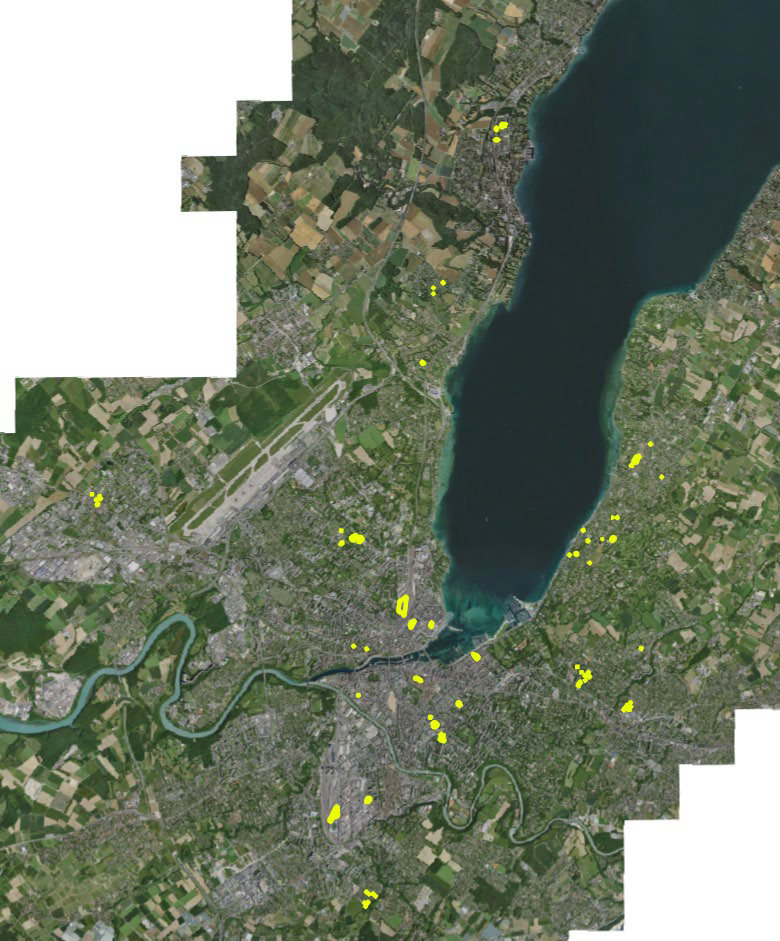
<figcaption>Bâtiments choisis par <a href="../glossary.html#gloss-stdl">STDL</a> pour la vérité terrain dans le Canton de Genève. Images de <a href="../glossary.html#gloss-sitg">SITG</a></figcaption>
</figure>

Ces bâtiments se distribuent de la manière suivante :

- 7 bâtiments administratifs (toiture plate)

- 18 bâtiments industriels (toiture plate)

- 97 bâtiments de logement (toiture en pente/plate)

Les données ont été labellisées selon les classes suivantes :

<figure id="fig:stdl_03_classes" data-latex-placement="H">
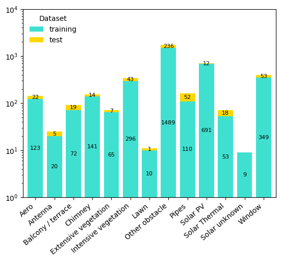
<figcaption>Classes et répartition des datasets</figcaption>
</figure>

Chaque méthode utilisée dans ce projet nécessite la création de vérité terrain spécifique.

#### Classification des pans de toits {#classification-des-pans-de-toits}

Cette méthode consiste à utiliser les données vectorielles de l’emprise des toitures, les labelliser à l’aide des données <a href="../glossary.html#gloss-lidar">LiDAR</a> et ensuite appliquer un algorithme random forest (similaire a un arbre de décision).

##### Données {#données-6}

Les données utilisées sont la couche vectorielle de l’emprise des toitures, ainsi que les données <a href="../glossary.html#gloss-lidar">LiDAR</a>.

La rugosité et l’intensité sont deux informations complémentaires fournies par les nuages de points <a href="../glossary.html#gloss-lidar">LiDAR</a>. La rugosité mesure la variation locale de l’altitude des points et reflète la texture de la surface. Une rugosité élevée indique la présence d’obstacles. L’intensité mesure la quantité d’énergie réfléchie par la surface et dépend des propriétés de réflectance des matériaux. Elle varie selon le type de surface et peut aider à distinguer différents matériaux.

Pour constituer le dataset (vérité terrain), <a href="../glossary.html#gloss-stdl">STDL</a> a annoté la couche vectorielle de l’emprise des toitures avec l’aide des données <a href="../glossary.html#gloss-lidar">LiDAR</a>. Les 3 classes résultantes sont :

- Occupé : pas de surface disponible

- Possiblement libre : probablement libre

- Non défini : le nuage de point <a href="../glossary.html#gloss-lidar">LiDAR</a> n’a pas classifié cette zone comme “bâtiment”

##### Méthodologie {#méthodologie-5}

La méthodologie se décompose en trois étapes principales : la préparation des données <a href="../glossary.html#gloss-lidar">LiDAR</a>, la classification par seuils manuels et la classification par forêt aléatoire (random forest).

La première étape est la préparation des données <a href="../glossary.html#gloss-lidar">LiDAR</a> :

- L’intensité du signal <a href="../glossary.html#gloss-lidar">LiDAR</a> est interpolée par une méthode de pondération inverse à la distance pour obtenir une valeur continue en chaque point.

- Un modèle numérique de terrain (<a href="../glossary.html#gloss-mnt">MNT</a>) est généré à partir des points <a href="../glossary.html#gloss-lidar">LiDAR</a> pour représenter la surface du sol.

- La rugosité de la surface est calculée à partir du <a href="../glossary.html#gloss-mnt">MNT</a> à une échelle de 1 m pour caractériser les variations locales de hauteur.

- Des statistiques zonales (moyenne, médiane, écart-type, etc.) sont calculées pour l’intensité et la rugosité sur chaque pan de toit.

La deuxième étape est la classification par seuils manuels :

- Les pans de toit de moins de 2 m2 sont automatiquement classés comme “occupés” car trop petits pour des installations.

- Les pans avec moins de 25% de points classés comme “bâtiment” (données <a href="../glossary.html#gloss-lidar">LiDAR</a>) sont classés en “non défini” par manque d’information.

- Pour les autres pans

  - Des seuils sont fixés empiriquement sur 4 variables :

    - La marge d’erreur et l’écart-type de l’intensité

    - La rugosité médiane

    - Le pourcentage de recouvrement avec des pixels non classés comme “bâtiment” (données <a href="../glossary.html#gloss-lidar">LiDAR</a>)

  - Si un pan dépasse le seuil pour au moins une variable, il est classé comme “occupé”, sinon il est “potentiellement libre”.

- Cette classification est validée manuellement par des experts sur un échantillon de 650 pans de toit.

La troisième étape est la classification par random forrest (RF)

- Deux forêts aléatoires sont entraînées, une pour chaque office (<a href="../glossary.html#gloss-ocen">OCEN</a> et <a href="../glossary.html#gloss-ocan">OCAN</a>), en utilisant les seuils validés comme référence.

- Les données sont divisées en 80% pour l’entraînement et 20% pour le test.

- 14 variables sont utilisées pour construire les arbres de décision, dont les statistiques zonales d’intensité et de rugosité.

- L’importance relative de chaque variable dans la classification est calculée.

- Les forêts sont évaluées sur l’échantillon test pour mesurer leur performance.

##### Résultats {#résultats}

Les résultats obtenus sont détaillés dans le Tableau [2.3](#tab:stdl_01_resultats_classification){reference-type="ref" reference="tab:stdl_01_resultats_classification"} :

|  | Manual threshold classification |  |  | RF classification |  |  |
|:---|:--:|:--:|:--:|:--:|:--:|:--:|
| 2-7 | Global | Occupied | Potentially free | Global | Occupied | Potentially free |
| OCAN | 79% | 70% | 91% | 86% | 78% | 96% |
| OCEN | 77% | 72% | 82% | 83% | 74% | 91% |

<em>Résultats obtenus par les deux algorithmes de classification</em>

La classification avec RF est plus performante que les seuils manuels, avec des taux de satisfaction augmentant de 7 et 6 points pour <a href="../glossary.html#gloss-ocan">OCAN</a> et <a href="../glossary.html#gloss-ocen">OCEN</a> respectivement.

La Figure [2.51](#fig:stdl_04_rf_resultats){reference-type="ref" reference="fig:stdl_04_rf_resultats"} présente un aperçu des résultats obtenus.

<figure id="fig:stdl_04_rf_resultats" data-latex-placement="H">
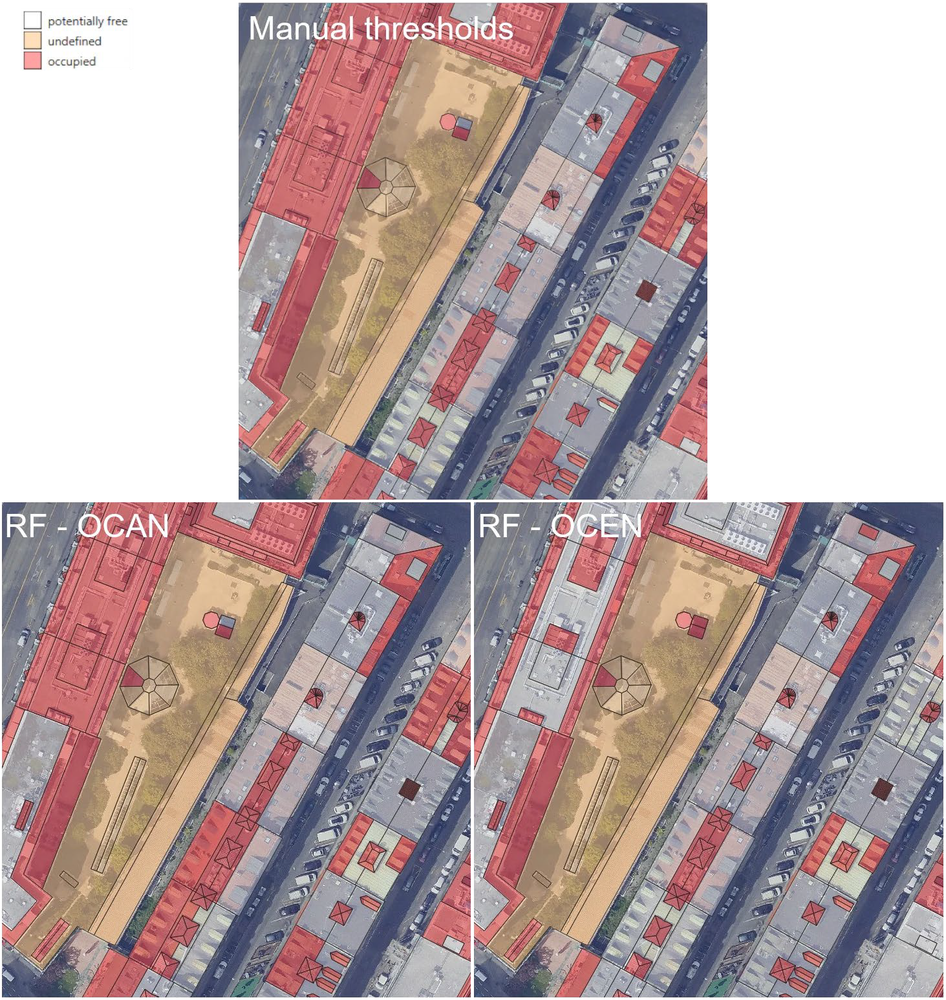
<figcaption>Comparatif des différents algorithmes de classification [<a href="../bibliography.html#ref-herny_detection_2024" role="doc-biblioref">2</a>]</figcaption>
</figure>

Les critères par office sont relativement différents, l’<a href="../glossary.html#gloss-ocen">OCEN</a> semble classifier plus de surfaces comme “possiblement libre” (blanc) que l’<a href="../glossary.html#gloss-ocan">OCAN</a>. Une matrice de confiance aurait permis de mieux évaluer les résultats.

##### Discussion des résultats (<a href="../glossary.html#gloss-stdl">STDL</a>) {#discussion-des-résultats-stdl}

Dans son rapport <a href="../glossary.html#gloss-stdl">STDL</a> fait une analyse des résultats obtenus dans lequel ils traitent les points suivants :

- Comparaison des deux méthodes de classification

- Classification des petits pans de toit

- Différences entre les deux random forrest

- Pertinence de la méthodologie

Le premier point soulevé est une comparaison de la classification par seuils et celle avec la random forrest :

- Les deux méthodes donnent des résultats satisfaisants, mais la forêt aléatoire est plus performante.

- La forêt aléatoire utilise 14 variables, contre seulement 4 pour les seuils manuels.

- Le choix des variables pour les seuils manuels était pertinent mais incomplet.

- Les seuils manuels sont simples à mettre en place mais nécessitent des tests manuels fastidieux.

- La forêt aléatoire est automatisée mais a besoin d’une vérité terrain.

Le deuxième point est la classification des petits pans de toit :

- Avec les seuils manuels, les petits pans sont souvent classés comme “occupés” à cause de leur rugosité médiane élevée.

- La rugosité des petits pans est plus influencée par leur environnement à cause de l’échelle de calcul (1 m).

- La rugosité minimale, importante dans la forêt aléatoire, dépend fortement de la taille du pan.

- Bien que potentiellement utilisables, les petits pans dégagés sont difficiles à exploiter et moins prioritaires.

- Le fait que l’algorithme les classe souvent comme occupés convient aux experts.

Le troisième point traite des raisons des différences entre les deux random forrest (une par office) :

- Les différences de résultats entre les offices (<a href="../glossary.html#gloss-ocan">OCAN</a> et <a href="../glossary.html#gloss-ocen">OCEN</a>) s’expliquent par leurs besoins distincts.

- Pour l’<a href="../glossary.html#gloss-ocan">OCAN</a> (végétalisation), une rugosité médiane élevée est tolérée.

- Pour l’<a href="../glossary.html#gloss-ocen">OCEN</a> (solaire), une grande surface continue et une faible rugosité minimale sont requises.

Le quatrième point est la pertinence de la méthodologie utilisée :

- Les surfaces “potentiellement libres” doivent être examinées plus en détail.

- Les surfaces “occupées” sont considérées comme inutilisables.

- Les experts sont satisfaits des résultats obtenus.

- Il est prévu d’appliquer la méthode à plus grande échelle.

- La classification n’évalue que l’occupation, sans considérer la pente ou le matériau.

- L’intensité <a href="../glossary.html#gloss-lidar">LiDAR</a> peut varier entre les acquisitions, affectant potentiellement les résultats.

#### Segmentation <a href="../glossary.html#gloss-lidar">LiDAR</a> {#segmentation-lidar}

##### Données {#données-7}

Les données utilisées sont des nuages de points <a href="../glossary.html#gloss-lidar">LiDAR</a>, qui fournissent une représentation 3D précise des surfaces de toiture. Les toits sont délimités à partir d’une couche vectorielle existante, produite manuellement pour garantir sa qualité. Les points <a href="../glossary.html#gloss-lidar">LiDAR</a> sont filtrés pour ne conserver que ceux situés au-dessus de l’altitude minimale de chaque toit.

##### Méthodologie {#méthodologie-6}

La méthode proposée vise à détecter automatiquement les objets présents sur les toits, en supposant que chaque pan de toit peut être approximé par un plan et que les obstacles en dépassent. Le processus se déroule en plusieurs étapes :

1.  Segmentation des plans de toit dans le nuage de points 3D à l’aide de l’algorithme RANSAC (RANdom SAmple Consensus), qui permet d’identifier les plans dominants.

2.  Application de l’algorithme DBSCAN (Density-Based Spatial Clustering of Applications with Noise) sur les points de chaque plan potentiel pour éliminer le bruit et ne retenir que le plus grand cluster.

3.  Considération des points restants comme des obstacles, regroupés à nouveau avec DBSCAN.

4.  Transformation des clusters de points en polygones concaves à l’aide de l’algorithme “alpha shape”, en appliquant des seuils sur leur surface projetée pour distinguer les plans des obstacles.

5.  Optimisation des hyperparamètres des algorithmes RANSAC et DBSCAN, ainsi que des seuils de surface, sur un jeu de données d’entraînement, en tenant compte du type de bâtiment et de toit.

6.  Post-traitement des polygones détectés par lissage et fusion pour améliorer leur aspect visuel et créer une partition des surfaces occupées et libres sur chaque toit.

##### Résultats {#résultats-1}

Les experts de l’<a href="../glossary.html#gloss-ocen">OCEN</a> et l’<a href="../glossary.html#gloss-ocan">OCAN</a> n’ont pas apprécié les images résultantes (Figure [2.52](#fig:stdl_05_exemple_segmentation_lidar){reference-type="ref" reference="fig:stdl_05_exemple_segmentation_lidar"}) car ils s’attendaient à des polygones plus semblables aux couches vectorielles (par exemple Figure [2.48](#fig:stdl_01_couche_vectorielle){reference-type="ref" reference="fig:stdl_01_couche_vectorielle"}). <a href="../glossary.html#gloss-stdl">STDL</a> a pourtant bien simplifié les polygones pour améliorer leur rendu visuel.

<figure id="fig:stdl_05_exemple_segmentation_lidar" data-latex-placement="H">
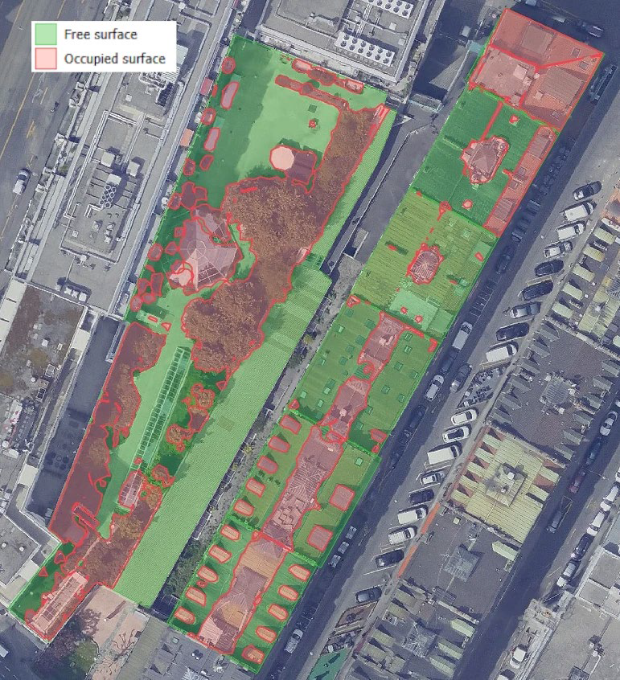
<figcaption>Image d’exemple de la segmentation <a href="../glossary.html#gloss-lidar">LiDAR</a> [<a href="../bibliography.html#ref-herny_detection_2024" role="doc-biblioref">2</a>]</figcaption>
</figure>

L’algorithme obtient un F1-score de 0.77 et un mIoU (mean Intersection over Union) de 0.38 sur l’ensemble des données de test. Le Tableau [2.4](#tab:stdl_02_resultats_segmentation_lidar){reference-type="ref" reference="tab:stdl_02_resultats_segmentation_lidar"} ci-dessous résume les principales métriques obtenues.

| Ground truth             | Precision | Recall | f1 score | mIoU | Relative error (%) |
|:-------------------------|:---------:|:------:|:--------:|:----:|:------------------:|
| adapted GT, training set |   0.77    |  0.77  |   0.77   | 0.42 |         11         |
| whole GT, training set   |   0.78    |  0.77  |   0.78   | 0.35 |         38         |
| whole GT, test set       |   0.75    |  0.80  |   0.77   | 0.38 |         26         |

<em>Métriques obtenus par la segmentation <a href="../glossary.html#gloss-lidar">LiDAR</a></em>

Les objets de plus de 1 m2 (Figure [2.53](#fig:stdl_06_segmentation_lidar_surfaces){reference-type="ref" reference="fig:stdl_06_segmentation_lidar_surfaces"}) et situés à plus de 1 m (Figure [2.54](#fig:stdl_07_segmentation_lidar_distances){reference-type="ref" reference="fig:stdl_07_segmentation_lidar_distances"}) du bord du toit sont bien détectés, avec des F1-score entre 0.82 et 0.92.

<figure id="fig:stdl_06_segmentation_lidar_surfaces" data-latex-placement="H">
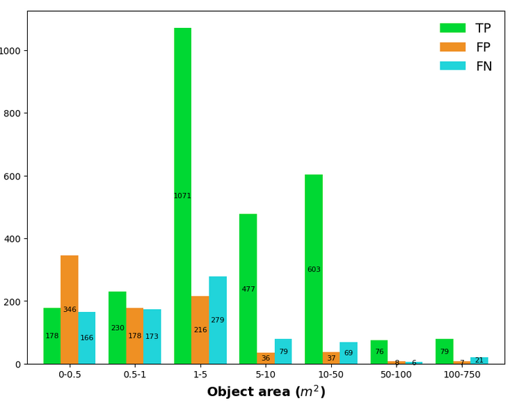
<figcaption>Influence de la distance des objets au bord du toit selon la surface de l’objet dans la segmentation <a href="../glossary.html#gloss-lidar">LiDAR</a> [<a href="../bibliography.html#ref-herny_detection_2024" role="doc-biblioref">2</a>]</figcaption>
</figure>

Les objets (Figure [2.54](#fig:stdl_07_segmentation_lidar_distances){reference-type="ref" reference="fig:stdl_07_segmentation_lidar_distances"}) qui ont leur centroïde a plus d’un mètre du bord du toit sont bien labellisés. Le F1-score est entre 0.80 et 0.85 pour ces objets. Cependant, les objets qui ont leur centroïde proche du bord (moins d’un mètre) ne sont pas bien détectés et ont 65% de faux positif (FP), ce qui indique que la segmentation n’est pas fiable à cette distance.

<figure id="fig:stdl_07_segmentation_lidar_distances" data-latex-placement="H">
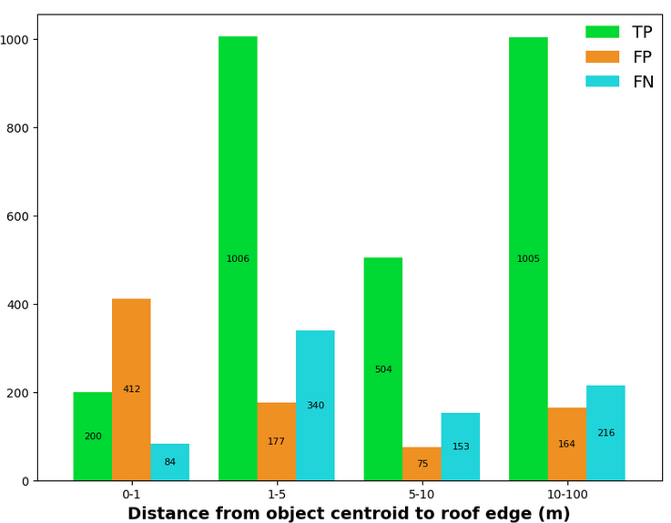
<figcaption>Influence de la distance du centre des objets au bord du toit dans la segmentation <a href="../glossary.html#gloss-lidar">LiDAR</a> [<a href="../bibliography.html#ref-herny_detection_2024" role="doc-biblioref">2</a>]</figcaption>
</figure>

La plupart (Tableau [2.5](#tab:stdl_03_resultats_segmentation_lidar_classes){reference-type="ref" reference="tab:stdl_03_resultats_segmentation_lidar_classes"}) des classes d’objets (bouches d’aération, balcons, végétation intensive, panneaux solaires) ont des recalls supérieurs à 0.80. Cependant, les antennes et les objets bas (fenêtres, végétation extensive, pelouses) sont plus difficiles à détecter.

| Object class         | Recall |
|:---------------------|:------:|
| Antenna              |  0.24  |
| Pipe                 |  0.59  |
| Lawn                 |  0.70  |
| Other obstacle       |  0.70  |
| Extensive vegetation |  0.72  |
| Window               |  0.76  |
| Chimney              |  0.79  |
| Aero                 |  0.83  |
| Solar thermal        |  0.83  |
| Intensive vegetation |  0.88  |
| Solar unknown        |  0.89  |
| Balcony / terrace    |  0.90  |
| Solar photovoltaic   |  0.92  |

<em>Recall par classe pour la segmentation LiDAR</em>

La surface occupée (Tableau [2.6](#tab:stdl_04_resultats_segmentation_lidar_affectation){reference-type="ref" reference="tab:stdl_04_resultats_segmentation_lidar_affectation"}) totale est sous-estimée de 38% par rapport à la vérité terrain.

|  | Administrative | Industrial | Residential | Flat | Mixed | Pitched |
|:---|:--:|:--:|:--:|:--:|:--:|:--:|
| Area labeled as occupied | 4,986 | 32,720 | 19,399 | 54,875 | 1,386 | 844 |
| Area detected as occupied | 1,195 | 20,953 | 12,986 | 30,980 | 3,052 | 1,102 |
| Detection rate (%) | 24% | 64% | 67% | 56% | 220% | 131% |
| Total area | 6,692 | 78,011 | 33,278 | 108,415 | 5,018 | 4,584 |

<em>Récapitulatif des surfaces détectées et vérité terrain pour la segmentation <a href="../glossary.html#gloss-lidar">LiDAR</a></em>

Les experts (Tableau [2.7](#tab:stdl_05_resultats_segmentation_lidar_experts){reference-type="ref" reference="tab:stdl_05_resultats_segmentation_lidar_experts"}) sont au moins partiellement satisfaits par plus de 69% des toits segmentés.

| Evaluation          | OCAN | OCEN |
|:--------------------|:----:|:----:|
| Not satisfied       | 22%  | 31%  |
| Partially satisfied | 54%  | 33%  |
| Satisfied           | 24%  | 36%  |

<em>Evaluation des experts pour la segmentation <a href="../glossary.html#gloss-lidar">LiDAR</a></em>

##### Discussion des résultats (<a href="../glossary.html#gloss-stdl">STDL</a>) {#discussion-des-résultats-stdl-1}

La méthode prouve sa capacité à détecter les objets sur les toits, en particulier ceux de grande taille et éloignés des bords. Cependant, la délimitation précise des formes reste perfectible, comme en témoigne le faible mIoU. L’estimation de la surface occupée est moyenne, avec une erreur importante liée à la sous-détection des objets bas. Les faux positifs sont souvent de petite taille et situés près des bords, parfois à cause de l’absence de barrières dans la vérité terrain.

Les bâtiments administratifs et les toits en pente posent des difficultés spécifiques, nécessitant des hyperparamètres adaptés.

Malgré des résultats honorables, l’aspect visuel des détections reste à améliorer pour une utilisation opérationnelle par les experts. Des développements futurs pourraient inclure l’automatisation de la production de la couche vectorielle des toits et l’ajustement de formes géométriques simples sur les clusters de points pour obtenir des détections plus précises et esthétiques.

#### Segmentation d’image {#segmentation-dimage}

##### Données {#données-8}

Les données utilisées sont :

- True orthophotos &#91;[45](../bibliography.md#ref-sitg_orthophotos_nodate)&#93;

- Couche vectorielle des toitures modifiée comme pour la segmentation <a href="../glossary.html#gloss-lidar">LiDAR</a>

##### Méthodologie {#méthodologie-7}

La Figure [2.55](#fig:stdl_08_methodo_segmentation_images){reference-type="ref" reference="fig:stdl_08_methodo_segmentation_images"} ci-dessous représente les principales étapes utilisées pour réaliser la segmentation d’image.

<figure id="fig:stdl_08_methodo_segmentation_images" data-latex-placement="H">
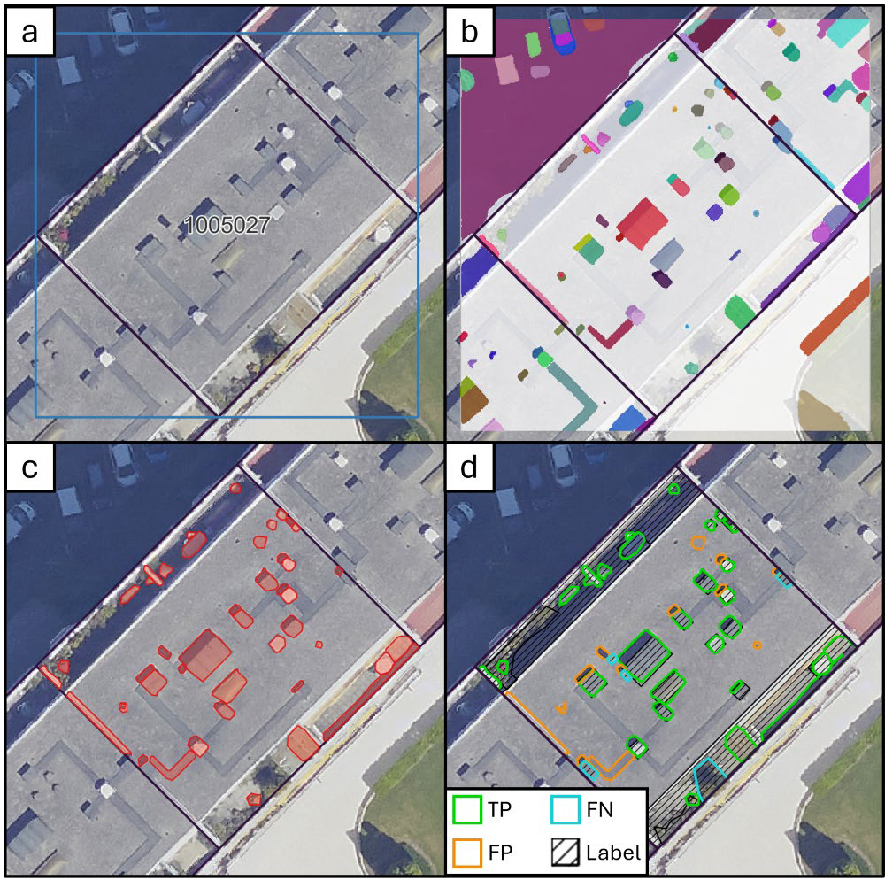
<figcaption>Méthodologie pour la segmentation d’images [<a href="../bibliography.html#ref-herny_detection_2024" role="doc-biblioref">2</a>]</figcaption>
</figure>

La première étape est la préparation des orthophotos (Figure [2.55](#fig:stdl_08_methodo_segmentation_images){reference-type="ref" reference="fig:stdl_08_methodo_segmentation_images"} “a”). Celle-ci commence par le découpage des orthophotos avec les données vectorielles des toitures (délimitation des toitures) pour ne conserver que la toiture à segmenter. La ligne bleue représente la marge de 1 mètre (zone tampon) pour faciliter la tâche de l’algorithme. Ensuite chaque toiture fera l’objet d’une tuile (une toiture par image).

La deuxième étape est la segmentation de l’image (Figure [2.55](#fig:stdl_08_methodo_segmentation_images){reference-type="ref" reference="fig:stdl_08_methodo_segmentation_images"} “b”). Le modèle segment anything model (<a href="../glossary.html#gloss-sam">SAM</a>) est utilisé via la librairie Python “segment-geospatial” &#91;[44](../bibliography.md#ref-wu_samgeo_2023)&#93; car cette libraire permet d’utiliser SAM sur des orthophotos tout en conservant les données géospatiales. SAM va segmenter les objets sur la toiture dans chaque tuile, ce qui va produire un masque par objet segmenté.

La troisième étape est la vectorisation des objets (Figure [2.55](#fig:stdl_08_methodo_segmentation_images){reference-type="ref" reference="fig:stdl_08_methodo_segmentation_images"} “c”). Dans cette étape, les masques segmentés sont convertis en données vectorielles. Certains de ces polygones sont supprimés basé sur des critères géométriques :

- Polygone de moins de 0.2 m2

- Polygones qui occupent plus de 90% de la surface de la toiture

- Polygones qui ont une surface de plus de 50% de la toiture et qui n’ont pas d’intersection avec la toiture

La quatrième étape est l’optimisation des hyperparamètres (Figure [2.55](#fig:stdl_08_methodo_segmentation_images){reference-type="ref" reference="fig:stdl_08_methodo_segmentation_images"} “d”) de SAM et l’évaluation de ses résultats avec la vérité terrain.

La logique est que tout ce qui n’est pas segmenté à l’intérieur du périmètre de la toiture est une surface libre.

##### Résultats {#résultats-2}

La Figure [2.56](#fig:stdl_09_segmentation_image_resultats){reference-type="ref" reference="fig:stdl_09_segmentation_image_resultats"} représente un exemple de résultat de la segmentation de plusieurs toitures. La segmentation rencontre des difficultés avec certains éléments de toiture tel que les puits de lumière.

<figure id="fig:stdl_09_segmentation_image_resultats" data-latex-placement="H">
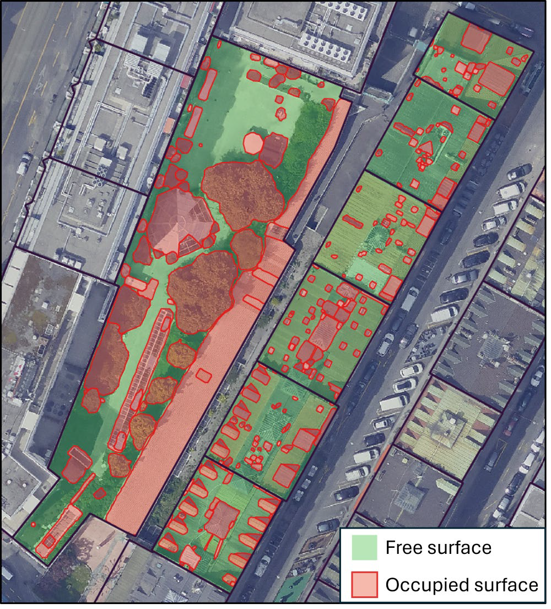
<figcaption>Exemple d’image résultat de la segmentation d’images [<a href="../bibliography.html#ref-herny_detection_2024" role="doc-biblioref">2</a>]</figcaption>
</figure>

Les métriques obtenues (Tableau [2.8](#tab:stdl_06_segmentation_image_resultats){reference-type="ref" reference="tab:stdl_06_segmentation_image_resultats"}) sur le dataset de test sont un F1-score de 0.73 et mIoU de 0.37.

| Dataset         | Precision | Recall | f1 score | mIoU | Relative error (%) |
|:----------------|:---------:|:------:|:--------:|:----:|:------------------:|
| Training subset |   0.73    |  0.78  |   0.75   | 0.41 |         7          |
| Training        |   0.75    |  0.82  |   0.78   | 0.37 |         42         |
| Test            |   0.75    |  0.71  |   0.73   | 0.37 |         23         |

<em>Métriques obtenues par la segmentation d’images</em>

Les petits objets (Figure [2.57](#fig:stdl_10_segmentation_image_taille){reference-type="ref" reference="fig:stdl_10_segmentation_image_taille"}) avec une surface de moins d’un mètre carré sont moins bien détectés (AP d’environ 0.60). Les objets de plus d’un mètre carré sont mieux détectés (AP d’environ 0.83).

<figure id="fig:stdl_10_segmentation_image_taille" data-latex-placement="H">
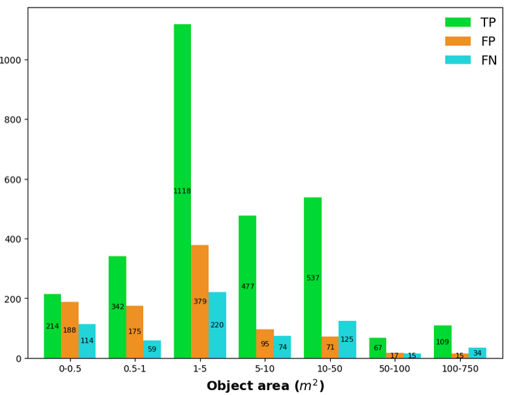
<figcaption>Objets segmentés selon taille en m2 pour la segmentation d’images [<a href="../bibliography.html#ref-herny_detection_2024" role="doc-biblioref">2</a>]</figcaption>
</figure>

Comme pour la segmentation <a href="../glossary.html#gloss-lidar">LiDAR</a>, la segmentation d’image fonctionne moins bien au bord de la toiture (Figure [2.58](#fig:stdl_11_segmentation_image_distance){reference-type="ref" reference="fig:stdl_11_segmentation_image_distance"}). La precision est de 0.77 pour les centroïde d’objets a plus d’un mètre du bord de la toiture contre seulement 0.51 pour ceux a moins d’un mètre.

<figure id="fig:stdl_11_segmentation_image_distance" data-latex-placement="H">
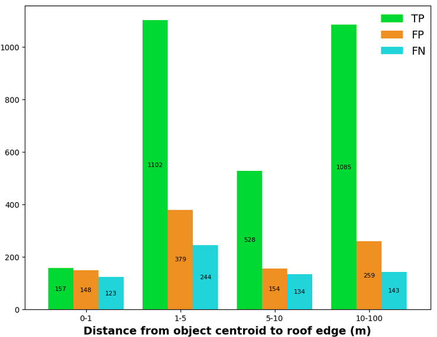
<figcaption>Centroïde des objets segmentés selon la distance au borde de la toiture pour la segmentation d’images [<a href="../bibliography.html#ref-herny_detection_2024" role="doc-biblioref">2</a>]</figcaption>
</figure>

Les experts sont au minimum partiellement satisfait de 86% des résultats (Tableau [2.9](#tab:stdl_07_segmentation_image_resultats_experts){reference-type="ref" reference="tab:stdl_07_segmentation_image_resultats_experts"}).

| Evaluation          | OCAN | OCEN |
|:--------------------|:----:|:----:|
| Not satisfied       |  6%  | 14%  |
| Partially satisfied | 40%  | 49%  |
| Satisfied           | 54%  | 37%  |

<em>Evaluation des experts pour la segmentation d’images</em>

##### Discussion résultats (<a href="../glossary.html#gloss-stdl">STDL</a>) {#discussion-résultats-stdl}

Points forts de cette approche :

- Bonne capacité générale à détecter et segmenter correctement les objets

- Métriques cohérentes

- Forme des objets détectés généralement bien reproduite

Limites constatées de la méthodologie utilisée :

- Difficulté à détecter les objets tel que les gaines ou d’autres petits objets

- Sensibilité aux changements de couleurs (saleté, ombres, pans de toit) pouvant être interprétés comme des objets

- Temps de calcul important (12 minutes pour 25 bâtiments), mise à l’échelle du canton (plus de 80’000 bâtiments) compliquée

- Nécessité des true orthophotos, plus rares et coûteuses que les orthophotos standards

Potentielles améliorations :

- Fine-tuning du modèle SAM

- Méthodes pour atténuer la présence d’ombres dans les images

- Adaptation de la méthodologie pour utiliser des orthophotos standard

#### Combinaison {#combinaison}

Ce chapitre va traiter la combinaison des résultats de 2 méthodologies différentes pour améliorer les résultats finaux.

##### Données {#données-9}

Les données utilisées sont le résultat des méthodologies de segmentation <a href="../glossary.html#gloss-lidar">LiDAR</a> et celui de la segmentation d’images. Ce sont des données vectorielles.

##### Méthodologie {#méthodologie-8}

Deux méthodes de combinaison des résultats ont été testées.

La première est la concaténation des objets détectés à partir des couches vectorielles produites par les segmentations <a href="../glossary.html#gloss-lidar">LiDAR</a> et d’images.

La deuxième est la jointure spatiale des résultats de la segmentation <a href="../glossary.html#gloss-lidar">LiDAR</a> et d’images. Dans ce cas, il faut :

- Sélectionner les polygones qui se chevauchent entre les couches vectorielles des segmentations <a href="../glossary.html#gloss-lidar">LiDAR</a> et d’images.

- Conserver les polygones issus de la segmentation d’images car ils fournissent une meilleure délimitation

##### Résultats {#résultats-3}

Les couches vectorielles obtenues n’ont pas été évaluées par les experts. Le Tableau [2.10](#tab:stdl_08_ensemble_resultats){reference-type="ref" reference="tab:stdl_08_ensemble_resultats"} ci-dessous résume les principales métriques obtenues.

| Combination method | Precision | Recall | f1 score | mIoU | Relative error (%) |
|:-------------------|:---------:|:------:|:--------:|:----:|:------------------:|
| Concatenation      |   0.68    |  0.94  |   0.79   | 0.45 |         8          |
| Spatial join       |   0.81    |  0.69  |   0.75   | 0.33 |         48         |

<em>Métriques obtenues par les méthodes de combinaison</em>

En complément du Tableau [2.10](#tab:stdl_08_ensemble_resultats){reference-type="ref" reference="tab:stdl_08_ensemble_resultats"}, le Tableau [2.11](#tab:stdl_09_resultats_methodos){reference-type="ref" reference="tab:stdl_09_resultats_methodos"} récapitule l’ensemble des métriques des méthodologies. La méthodologie de classification des pans de toit n’a pas de métrique, elle n’est donc pas incluse dans le tableau.

| Méthodologie | Precision | Recall | F1-score | mIoU | Relative error &#91;%&#93; |
|:---|:--:|:--:|:--:|:--:|:--:|
| Segmentation <a href="../glossary.html#gloss-lidar">LiDAR</a> | 0.75 | 0.80 | 0.77 | 0.38 | 26 |
| Segmentation d’image | 0.75 | 0.71 | 0.73 | 0.37 | 23 |
| Concaténation | 0.68 | 0.94 | 0.79 | 0.45 | 8 |
| Jointure spatiale | 0.81 | 0.69 | 0.75 | 0.33 | 48 |

<em>Comparatif des résultats des différentes méthodologies</em>

Les F1-scores des deux méthodes de combinaison sont proches, autour de 0.77, ce qui suggère des performances globales similaires.

La concaténation obtient un recall exceptionnel de 0.94, détectant presque toutes les surfaces occupées. En contrepartie, la précision diminue d’environ 8 points, indiquant plus de faux positifs dans les résultats.

La jointure spatiale fait le choix inverse : elle améliore la précision de 6 points en réduisant les détections erronées, mais perd 8 points de recall, manquant davantage de surfaces réellement occupées.

Le mIoU favorise nettement la concaténation avec un gain de plus de 10 points, reflétant une segmentation de meilleure qualité. Cette tendance se confirme pour l’estimation des surfaces : la concaténation maintient l’erreur relative sous 10% tandis que la jointure spatiale atteint environ 50%.

##### Discussion des résultats (<a href="../glossary.html#gloss-stdl">STDL</a>) {#discussion-des-résultats-stdl-2}

Les points positifs de cette approche sont :

- La combinaison des résultats permet de moduler les résultats en favorisant soit la précision soit le recall selon les besoins

- La valeur élevée du recall obtenue par concaténation prouve la complémentarité des deux méthodes pour détecter différents objets

La valeur de recall élevée obtenue avec la concaténation prouve la complémentarité des deux méthodes pour la détection d’objets différents. Une valeur de recall plus élevée tend à favoriser le mIoU, puisque plus d’objets sont détectés (TP), malgré l’ajout de faux positifs (FP). La surface de l’objet détecté est donc améliorée, mais l’ajout de FP contribue également à la réduction de l’erreur relative sur la surface occupée, ce qui doit être analysé avec soin.

L’utilisation des couches vectorielles des toits et superstructures produites par l’État de Genève, bien qu’incomplètes, pourrait améliorer les résultats.

#### Conclusion {#conclusion}

<a href="../glossary.html#gloss-stdl">STDL</a> a exploré trois méthodes pour détecter les objets sur les toits à partir de données <a href="../glossary.html#gloss-lidar">LiDAR</a>, d’orthophotos et vectorielles. Toutes les méthodes ont fourni des résultats satisfaisants, avec une précision de 85% pour la classification d’occupation et un F1-score d’environ 0,77 pour les méthodes de segmentation. Les bénéficiaires ont été satisfaits des résultats dans au moins 70% des cas.

La méthode de classification a été sélectionnée en raison de ses bonnes performances et résultats obtenus.

La combinaison des résultats de segmentation permet d’améliorer soit la précision, soit le recall, et le croisement des sources d’information peut améliorer la précision des résultats.

Il est important de noter que ces résultats sont des indications qui doivent être vérifiées par un expert métier. Des paramètres supplémentaires, tels que le matériau du toit et le potentiel solaire, ne sont pas pris en compte.

#### Analyse critique {#analyse-critique}

##### Général {#général}

Le projet étant encore dans sa phase initiale explorative, il ne tient pas compte de l’orientation des toitures pour évaluer le potentiel solaire de chacune d’entre elle. L’exposition au soleil est en effet un facteur essentiel pour la pose de panneaux solaire. L’exclusion de toitures sur la base des données du cadastre solaire pourrait éventuellement éviter de traiter les toitures à l’ombre.

La végétalisation de toitures impose des défis considérables d’un point de vue génie civil, en effet les toitures ne sont souvent pas prévues pour porter des charges tel que de la terre végétale. Même dans le cas des panneaux solaires, pas toutes les toitures peuvent supporter la charge. Par exemple une toiture en fibrociment (toiture typique des hangars) n’aura probablement pas la capacité pour accueillir des panneaux solaires, cela pourrait être un critère d’exclusion.

L’échantillon de bâtiments du dataset ne semble pas très équilibré entre les différentes classes <a href="../glossary.html#gloss-sia">SIA</a> de bâtiments &#91;[49](../bibliography.md#ref-sia_sia-shop_nodate)&#93;. En effet, les piscines couvertes, écoles, dépôts, hôpitaux ont pas mal en commun en ce qui concerne les toitures, elles seront probablement plates avec des éléments de ventilation ou froid. Les logements collectifs sont probablement plus complexes à segmenter car en général les toitures sont déjà assez occupées.

##### Classification des pans de toiture {#classification-des-pans-de-toiture}

Les données de la couche vectorielle d’emprise au sol des bâtiments ne donnent pas un aperçu complet de la toiture, en effet les superstructures se trouvent dans une autre couche vectorielle. Même si ce n’est pas mentionné, les deux couches ont probablement été fusionnées.

Dans le rapport de <a href="../glossary.html#gloss-stdl">STDL</a>, il manque une matrice de confusion. Cela aurait permis d’avoir une meilleure appréciation des performances obtenues par les différentes variantes utilisées.

##### Segmentation <a href="../glossary.html#gloss-lidar">LiDAR</a> {#segmentation-lidar-1}

Le choix d’utiliser les données <a href="../glossary.html#gloss-lidar">LiDAR</a> de 2019 avec les orthophotos de 2019 est tout à fait logique. Des données <a href="../glossary.html#gloss-lidar">LiDAR</a> plus récentes et avec plus de densité existent mais il n’y a pas de true orthophoto après 2019 qui servirait de vérité terrain. Cela enlèverait aussi la possibilité de comparer les différents modèles de segmentation sur des données similaires.

##### Segmentation d’images {#segmentation-dimages-1}

La stratégie utilisée pour la segmentation d’images est très futée. La stratégie est principalement :

- Segmentation avec SAM

- Enlever certains masques trop petits ou qui sont en dehors de la toiture

- Tout ce qui n’a pas de masque devient donc une surface disponible

<a href="../glossary.html#gloss-stdl">STDL</a> l’a déjà indiqué dans son rapport, après avoir expérimenté avec SAM, il est tout de même très sensible aux ombrages. L’approche fonctionne moyennement bien avec un mIoU de 0.37.

En revanche, la stratégie de faire une tuile par toiture semble compliquée et le temps nécessaire est relativement long (12 minutes pour 25 bâtiments).

La segmentation à l’aide d’un algorithme de machine learning supervisé semble plus pertinente, l’inférence d’une image prend moins d’une minute pour un modèle de type YOLO et celle-ci peut contenir plusieurs bâtiments.

##### Combinaison des résultats {#combinaison-des-résultats}

<a href="../glossary.html#gloss-stdl">STDL</a> n’a pas inclus dans leur rapport un tableau qui récapitule les résultats des différentes méthodologies utilisées. C’est donc difficile d’avoir une idée des résultats globaux.

##### Résultats {#résultats-4}

Le Tableau [2.11](#tab:stdl_09_resultats_methodos){reference-type="ref" reference="tab:stdl_09_resultats_methodos"} permet d’avoir une vue d’ensemble des résultats et la concaténation est fort intéressante.

La concaténation des résultats des deux méthodes de segmentation (<a href="../glossary.html#gloss-lidar">LiDAR</a> et image) permet d’obtenir un recall élevé, ce qui signifie que la grande majorité des objets présents dans la vérité terrain (GT) sont détectés. Ce recall élevé s’explique par le fait que les deux méthodes ont des forces complémentaires : chacune est capable de détecter des types d’objets différents que l’autre méthode peut manquer.

Par exemple, la segmentation d’image peut mieux détecter les objets fins et bas, tandis que la segmentation <a href="../glossary.html#gloss-lidar">LiDAR</a> peut mieux gérer les changements de couleur et détecter les gaines.

Un recall plus élevé a tendance à améliorer la métrique mIoU (mean Intersection over Union), car davantage d’objets GT sont correctement détectés (vrais positifs, TP), même si cela s’accompagne également de l’ajout de faux positifs (FP). Le mIoU mesure la qualité de la segmentation en calculant le chevauchement moyen entre les objets détectés et les objets GT. Avec plus de TP, le numérateur du mIoU augmente, ce qui améliore le score global.

De plus, un recall élevé permet une meilleure estimation de la surface occupée par les objets détectés. Cependant, l’ajout de FP lors de la concaténation peut également contribuer à cette surface occupée, ce qui peut réduire artificiellement l’erreur relative par rapport à la surface occupée réelle (calculée à partir de la GT). Il est donc important d’interpréter ce résultat avec prudence, car une faible erreur relative sur la surface occupée ne signifie pas nécessairement que la segmentation est parfaite, mais peut être influencée par la présence de FP.

### SolarNet plus {#subsec:solar_net_plus}

#### Contexte et objectifs {#contexte-et-objectifs-5}

&#91;[50](../bibliography.md#ref-li_deep_2024)&#93; présentent SolarNet+ &#91;[50](../bibliography.md#ref-li_deep_2024)&#93;, un framework basé sur l’apprentissage profond qui vise à estimer avec précision le potentiel solaire des toitures urbaines. Cet article est la suite de l’article &#91;[51](../bibliography.md#ref-li_solarnet_2023)&#93; SolarNet par les mêmes auteurs principaux

Contrairement aux méthodes existantes, SolarNet+ prend en compte simultanément l’orientation des toits et les superstructures présentes (cheminées, fenêtres, etc.) qui réduisent la surface disponible pour l’installation de panneaux solaires. Cette approche permet d’éviter une surestimation du potentiel solaire et offre une évaluation plus précise pour soutenir la planification énergétique durable et les objectifs de neutralité carbone.

#### Données {#données-10}

L’étude utilise principalement le jeu de données RID (Roof Information Dataset). Le dataset est décrit en détail dans la sous-section [2.5.1](#subsec:rid_roof_information_dataset){reference-type="ref" reference="subsec:rid_roof_information_dataset"}.

Le dataset consiste en 1880 images satellite en provenance de google. Les images disposent des annotations suivantes:

- Les segments de toiture et leur orientation (plat, N, E, S, W)

- Éléments de toiture

  - Panneau PV

  - Lucarne

  - Fenêtre

  - Échelle

  - Cheminée

  - Ombrage

  - Arbre/végétation

  - Fond d’image (background)

  - Inconnu

La Figure [2.59](#fig:rid_dataset_sample){reference-type="ref" reference="fig:rid_dataset_sample"} représente une image d’exemple ainsi que ses annotations. Le jeu de données est divisé en dataset d’entraînement (70%), de validation (10%) et de test (20%).

<figure id="fig:rid_dataset_sample" data-latex-placement="H">
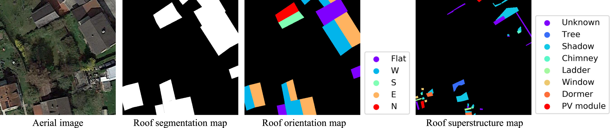
<figcaption>Exemple d’image du dataset RID [<a href="../bibliography.html#ref-li_deep_2024" role="doc-biblioref">50</a>]</figcaption>
</figure>

#### Méthodologie {#méthodologie-9}

SolarNet+ utilise une approche en deux étapes :

1.  Un réseau de neurones multi fonctions (partie 1 de la Figure [2.60](#fig:solar_net_plus_methodo){reference-type="ref" reference="fig:solar_net_plus_methodo"}) va réaliser les opérations suivantes sur chaque image:

    - Segmenter l’image pour avoir le masque de la toiture ainsi que son orientation géographique (“Roof orientation map” de la Figure [2.60](#fig:solar_net_plus_methodo){reference-type="ref" reference="fig:solar_net_plus_methodo"}).

    - Segmenter les éléments de toiture pour identifier tous les obstacles qui s’y trouvent (“Roof superstructure map” de la Figure [2.60](#fig:solar_net_plus_methodo){reference-type="ref" reference="fig:solar_net_plus_methodo"}).

    - Extraire les surfaces exploitables de toiture par superposition des masques. Cette étape consiste à soustraire les zones occupées par les obstacles (“Roof superstructure map”) des segments de toiture identifiés (“Roof orientation map”), permettant ainsi d’isoler les surfaces disponibles.

2.  Estimer le potentiel solaire pour chaque surface identifiée (partie 2 de la Figure [2.60](#fig:solar_net_plus_methodo){reference-type="ref" reference="fig:solar_net_plus_methodo"}) qui comprend :

    - Hypothèses de base pour le calcul :

      - Panneau PV 1.7 m2 avec 400 Wc

      - Pente toiture 30° pour toutes les orientations sauf toiture plate 0°

      - Pans de toiture de moins de 5 m2 ne sont pas considérés comme surface disponible

    - Calcul du nombre maximum de panneaux installables sur chaque segment de toiture disponible, en tenant compte des contraintes géométriques. La Figure [2.61](#fig:solar_net_plus_placement_pv){reference-type="ref" reference="fig:solar_net_plus_placement_pv"} présente deux exemples, avec et sans obstacles sur la toiture. Le placement des panneaux commence du côté gauche en bas et va éviter les obstacles présents.

    - Acquisition des données d’irradiation solaire spécifiques à chaque orientation via l’API PVGIS

    - Estimation de l’énergie annuelle générée pour chaque pans de toiture en multipliant le nombre de panneaux installables par la production unitaire correspondant à l’orientation

    - Additionner les potentiels de tous les pans de toiture pour obtenir le potentiel solaire total du bâtiment

<figure id="fig:solar_net_plus_methodo" data-latex-placement="H">
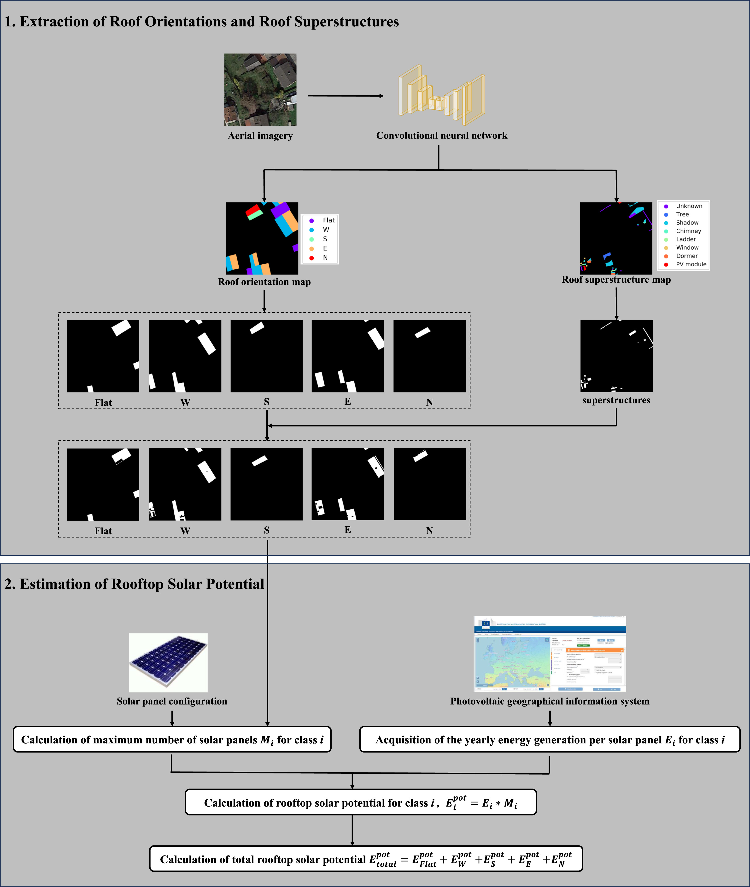
<figcaption>Méthodologie SolarNet+ [<a href="../bibliography.html#ref-li_deep_2024" role="doc-biblioref">50</a>]</figcaption>
</figure>

<figure id="fig:solar_net_plus_placement_pv" data-latex-placement="H">
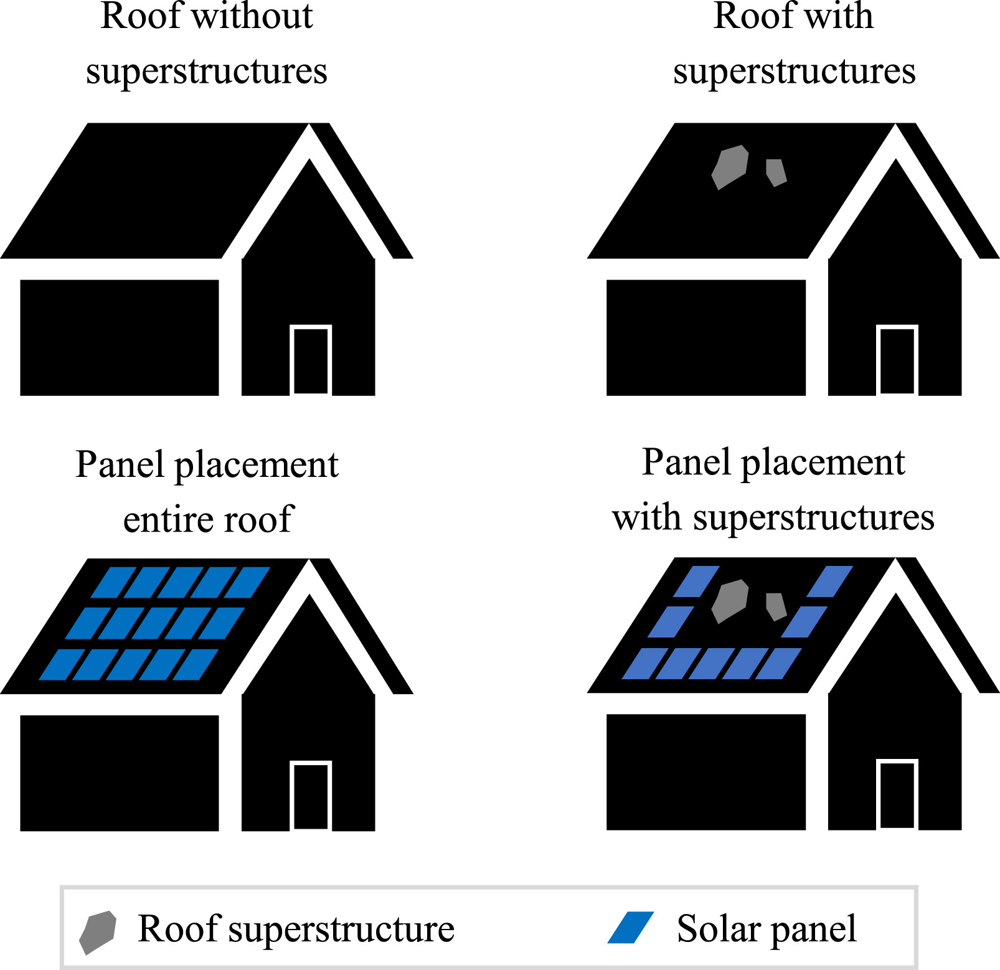
<figcaption>Placement des panneaux solaire [<a href="../bibliography.html#ref-li_deep_2024" role="doc-biblioref">50</a>]</figcaption>
</figure>

La Figure [2.62](#fig:solar_net_plus_exemple_methodo){reference-type="ref" reference="fig:solar_net_plus_exemple_methodo"} permet d’avoir un aperçu des différentes phases du calcul de potentiel solaire. En allant de gauche à droite dans la lecture de la Figure [2.62](#fig:solar_net_plus_exemple_methodo){reference-type="ref" reference="fig:solar_net_plus_exemple_methodo"}, les deux premières images indiquent l’irradiation solaire avec et sans les obstacles. En bas à gauche de ces deux images, il y a une toiture avec plusieurs obstacles détectés (trous), sans les obstacles son irradiation solaire est bonne, mais avec les obstacles son irradiation solaire totale est réduite. La troisième image représente le placement des panneaux solaires. Finalement la quatrième image, représente le potentiel solaire total par pan de toiture selon le nombre de panneaux solaire placés dans la troisième image et l’irradiation solaire de la deuxième image.

<figure id="fig:solar_net_plus_exemple_methodo" data-latex-placement="H">
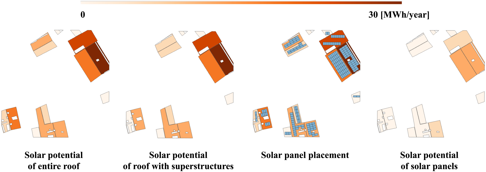
<figcaption>Exemple d’application de la méthodologie [<a href="../bibliography.html#ref-li_deep_2024" role="doc-biblioref">50</a>]</figcaption>
</figure>

#### Résultats principaux {#résultats-principaux-5}

- SolarNet+ surpasse les réseaux concurrents en termes de précision pour la prédiction de l’orientation des toits et des superstructures avec les meilleures performances en mIoU et OA.

- L’étude montre que négliger les superstructures conduit à une surestimation de 42% du nombre de panneaux solaires installables.

- La précision d’estimation du potentiel solaire atteint un %RMSE de 19,92% par rapport la vérité terrain (détail des résultats dans la Table [2.12](#tab:solar_net_plus_comparaison_quant){reference-type="ref" reference="tab:solar_net_plus_comparaison_quant"}).

|  |  |  |  |  |
|:---|---:|---:|---:|---:|
| **Méthode** | **Nombre de panneaux** | **Potentiel solaire** | **RMSE** | **%RMSE** |
|  | **installables** | **(MWh/an)** | **(MWh/an)** |  |
| U-Net | 25 855 | 8484,28 | 12,77 | 21,49 |
| FC-DenseNet | 29 316 | 9544,90 | 20,85 | 35,10 |
| Efficient-UNet | 23 842 | 7754,68 | 16,85 | 28,37 |
| DeepLab V3+ | 28 152 | 9153,37 | 25,14 | 42,32 |
| Srivastava et al. | 24 987 | 8125,64 | 12,63 | 21,27 |
| Bischke et al. | 25 749 | 8446,82 | 14,34 | 24,13 |
| Mou & Zhu | 24 945 | 8075,86 | 14,22 | 23,93 |
| **SolarNet+** | **24 541** | **7967,34** | **11,83** | **19,92** |
| Ground truth | 24 279 | 7959,76 | \- | \- |

<em>Résultats quantitatifs du potentiel solaire sur le dataset RID &#91;[50](../bibliography.md#ref-li_deep_2024)&#93;</em>

#### Discussion et limites {#discussion-et-limites-5}

- La démarche utilisée par cet article est assez unique, c’est le seul article qui va aussi loin dans la segmentation des toitures et l’identification des obstacles. Le dataset RID est disponible librement et il a été réalisé par les auteurs de cet article.

- Les auteurs ont testé le modèle avec des images satellite de Bruxelles (le dataset RID inclus seulement Wartenberg à Munich), mais les performances diminuent en raison des différences architecturales et des superstructures non rencontrées dans les données d’entraînement (balcons, éléments technique de ventilation/climatisation, etc.).

- Le modèle ne prend pas en compte les ombrages, ce qui peut réduire significativement l’irradiation solaire reçue par un pan de toiture.

- Les auteurs suggèrent d’intégrer des données 3D et cela semble une bonne initiative pour des futures évolutions du framework. Avec des données <a href="../glossary.html#gloss-lidar">LiDAR</a>, ils pourraient nettement améliorer la phase de post-processing des pans de toiture en intégrant les ombrages et une meilleure estimation des pentes des toitures.

### Quantification of the suitable rooftop area for solar panel installation from overhead imagery using Convolutional Neural Networks {#subsec:castello_quantification_2021}

#### Contexte et objectifs {#contexte-et-objectifs-6}

Cet article &#91;[52](../bibliography.md#ref-castello_quantification_2021)&#93; présente une approche innovante pour quantifier les surfaces disponibles sur les toitures pour l’installation de panneaux solaires photovoltaïques. Face au défi de l’évaluation précise du potentiel solaire à grande échelle, &#91;[52](../bibliography.md#ref-castello_quantification_2021)&#93; proposent une méthode combinant le deep learning, la vision par ordinateur et des données de bâtiments 3D.

#### Méthodologie {#méthodologie-10}

L’approche utilise un réseau de neurones convolutif (CNN) basé sur l’architecture U-Net, adapté pour la segmentation sémantique d’images aériennes à haute résolution. Le modèle a été entraîné sur 524 images (orthophotos de swisstopo 2015) de taille 250x250 pixels de Genève, avec une résolution spatiale de 0,25 m/pixel. Les données d’entraînement ont été annotées manuellement (classe unique “libre”) pour identifier les zones disponibles sur les toits. Ces données ne sont pas disponibles.

La méthodologie comporte trois étapes principales :

1.  Traitement des images aériennes par le CNN pour identifier les surfaces disponibles

2.  Post-traitement géospatial combinant les résultats avec la couche <a href="../glossary.html#gloss-sitg">SITG</a> des toitures

3.  Les toitures de moins de 10 m2 ne sont pas considérées comme toiture disponible

Les auteurs ont également implémenté diverses techniques d’augmentation de données et optimisé les hyperparamètres du modèle pour améliorer ses performances.

#### Résultats principaux {#résultats-principaux-6}

Le CNN développé atteint :

- Une accuracy de 93% dans l’identification des surfaces disponibles

- Un score d’Intersection over Union (IoU) de 64%

- Une sous-estimation moyenne de 8% des surfaces disponibles par rapport aux annotations manuelles

Le Tableau [2.13](#tab:castello_quantification_resultats){reference-type="ref" reference="tab:castello_quantification_resultats"} ci-dessous détaille les résultats obtenus:

|            |  IoU   | Accuracy | Recall | Precision | F1-score |
|:-----------|:------:|:--------:|:------:|:---------:|:--------:|
| Training   | 0.8823 |  0.9794  | 0.9299 |  0.9437   |  0.9367  |
| Validation | 0.7211 |  0.9464  | 0.8360 |  0.8508   |  0.8433  |
| Test       | 0.6420 |  0.9307  | 0.7522 |  0.7874   |  0.7693  |

<em>Performances du modèle U-Net développé</em>

Le modèle réussit à détecter automatiquement les obstacles présents sur les toits, y compris les panneaux solaires existants, fenêtres, cheminées, équipements techniques et zones ombragées. L’étude révèle que la fraction médiane de la surface disponible varie selon la taille des toits :

- 61% pour les grands toits (&gt;500 m2)

- 77% pour les toits moyens (100-500 m2)

- 80% pour les petits toits (10-100 m2)

La Figure [2.65](#fig:castello_quantification_image_resultat){reference-type="ref" reference="fig:castello_quantification_image_resultat"} permet de voir deux exemples de résultat.

<figure id="fig:castello_quantification_image_resultat" data-latex-placement="H">
<figure id="fig:castello_quantification_image_resultat1">
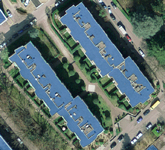
<figcaption>Grandes toitures plates</figcaption>
</figure>
<figure id="fig:castello_quantification_image_resultat2">
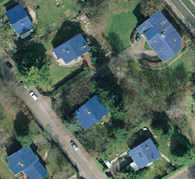
<figcaption>Toitures en pente</figcaption>
</figure>
<figcaption>Images d’exemple [<a href="../bibliography.html#ref-castello_quantification_2021" role="doc-biblioref">52</a>] du résultat après inférence. Les zones bleus sont les espaces disponibles.</figcaption>
</figure>

La comparaison avec d’autres méthodes d’estimation &#91;[53](../bibliography.md#ref-walch_big_2020)&#93; montre que les approches existantes tendent à surestimer la surface disponible sur les grands toits et à sous-estimer celle des petits toits.

#### Discussion et limites {#discussion-et-limites-6}

L’article présente une approche prometteuse pour quantifier les surfaces de toiture disponibles pour l’installation solaire. Le modèle U-Net atteint un IoU de 64% et une accuracy de 93% sur les données de test, avec la capacité notable d’exclure automatiquement les zones ombragées des toits.

La comparaison avec les méthodes existantes &#91;[53](../bibliography.md#ref-walch_big_2020)&#93; révèle des différences selon la taille des bâtiments. Pour les grandes toitures, le modèle CNN estime une fraction médiane de surface disponible de 39% contre 66% pour l’approche de référence, suggérant une surestimation des méthodes à grande échelle. Pour les petites toitures, la tendance s’inverse avec 47% contre 32%.

Le modèle sous-estime en moyenne de 8% la surface réellement disponible par rapport à la vérité terrain. Cette sous-estimation est principalement observée sur les petites toitures (&lt; 100 m2). Les limites identifiées incluent la difficulté à détecter les lucarnes, construites dans le même matériau que le toit, et les zones de “toits verts” avec végétation.

L’étude se limite au centre de Genève avec 524 images principalement résidentielles. Les auteurs mentionnent 12 heures de labellisation manuelle sans préciser la répartition du travail. Pour une extension nationale, ils proposent l’ajout d’un canal infrarouge et l’utilisation d’images plus récentes à haute résolution.

## Datasets disponibles {#sec:dataset_disponible}

Quelques datasets de qualité sont disponibles actuellement. Ce chapitre va parcourir certains d’entre eux.

### Roof Information Dataset for Computer Vision-Based Photovoltaic Potential Assessment (RID) {#subsec:rid_roof_information_dataset}

#### Contexte et objectifs {#contexte-et-objectifs-7}

Malgré l’existence de dataset pour la segmentation des toitures des bâtiments ou la détection de panneaux solaires, aucun d’entre eux ne permet la segmentation sémantique complète des toitures et de leurs éléments. Dans ce contexte, &#91;[54](../bibliography.md#ref-krapf_ridroof_2022)&#93; présentent le Roof Information Dataset (RID) &#91;[54](../bibliography.md#ref-krapf_ridroof_2022)&#93;, premier dataset public de segmentation de toitures et de leurs éléments.

#### Données {#données-11}

Le RID se compose d’images aériennes géo-référencées et d’annotations.

Les images sont des photos aériennes à haute résolution (environ 10 cm/pixel) centrées sur chaque bâtiment, téléchargées via l’API Google Maps Static pour la zone rurale de Wartenberg en Allemagne. Ces images sont géo-référencées au format GeoTIFF.

Les annotations sont des images rasterisées au format PNG

Les principaux chiffres-clés de ce dataset :

- 1880 bâtiments uniques répartis sur une zone de 1,5 km2 (4,9 km2 avec superposition)

- 4520 polygones de segments de toiture classés selon leur orientation géographique, en tout 5 classes :

  - Nord, sud, est et ouest

  - Toiture plate

- 12359 polygones de superstructures répartis en 9 classes :

  - Panneau PV

  - Lucarne

  - Fenêtre

  - Échelle

  - Cheminée

  - Ombrage

  - Arbre/végétation

  - Fond d’image (background)

  - Inconnu

Les annotations sont fournies en deux versions différentes. La version initiale a été réalisées par cinq annotateurs. Ensuite deux annotateurs supplémentaires ont corrigés et compléter les annotations initiales. La Figure [2.66](#fig:rid_dataset_image_sample){reference-type="ref" reference="fig:rid_dataset_image_sample"} représente avec une image d’exemple les différences entre les annotations.

<figure id="fig:rid_dataset_image_sample" data-latex-placement="H">
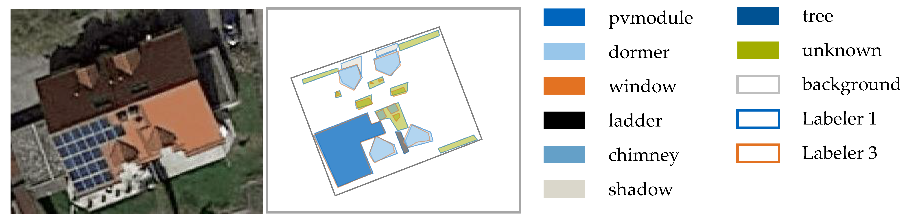
<figcaption>Exemple d’image du dataset, ainsi que les différentes annotations des annotateurs [<a href="../bibliography.html#ref-krapf_rid_2021" role="doc-biblioref">55</a>]</figcaption>
</figure>

La Figure [2.67](#fig:rid_dataset_distribution_classes){reference-type="ref" reference="fig:rid_dataset_distribution_classes"} représente la distribution des éléments de toiture par classe.

<figure id="fig:rid_dataset_distribution_classes" data-latex-placement="H">
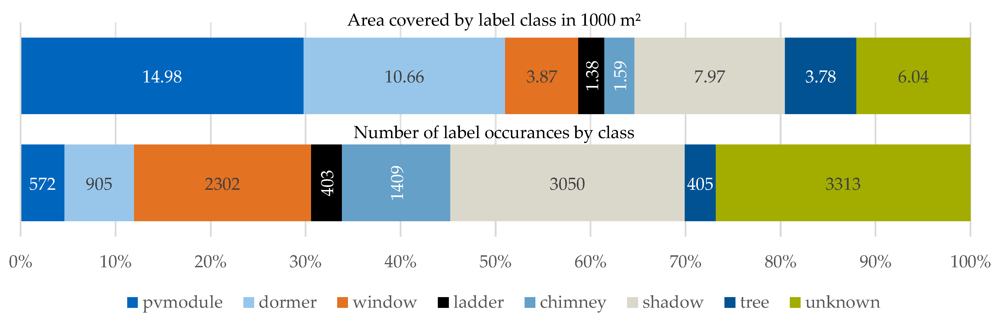
<figcaption>Distribution des classes dans le dataset des éléments de toiture [<a href="../bibliography.html#ref-krapf_ridroof_2022" role="doc-biblioref">54</a>]</figcaption>
</figure>

Le dataset est disponible en ligne &#91;[55](../bibliography.md#ref-krapf_rid_2021)&#93; ainsi que le code &#91;[56](../bibliography.md#ref-krapf_tumftmrid_2025)&#93;.

#### Méthodologie {#méthodologie-11}

Le processus de création du dataset s’est déroulé en plusieurs phases :

1.  Sélection de la zone d’étude :

    - Zone rurale de Wartenberg (Munich) choisie pour offrir des images de qualité variable (contraste, ombres, distorsions) afin d’améliorer la capacité des modèles à s’adapter à des conditions variables

2.  Acquisition des données :

    - Téléchargement d’images aériennes via l’API Google Maps

    - Résolution d’environ 10 cm/pixel, suffisante pour identifier les petites éléments présents sur les toitures comme les cheminées

3.  Processus d’annotation initial :

    - Développement d’un outil d’annotation personnalisé permettant de dessiner des polygones sur l’interface Google Maps Dynamic API

    - Annotation par cinq membres universitaires suivant un ensemble de règles prédéfini

    - Deux tâches d’annotation distinctes : segments de toiture (classes N, S, W, O, plat) et les éléments présents sur les toitures.

4.  Évaluation de la qualité d’annotation :

    - Expérience d’annotation comparative sur 26 bâtiments sélectionnés pour contenir au moins 15 occurrences de chaque classe de superstructure

    - Analyse de l’accord entre annotateurs pour identifier les classes les plus difficiles à annoter

5.  Processus de révision :

    - Utilisation de l’outil CVAT (Computer Vision Annotation Tool) permettant un zoom plus important

    - Révision par deux annotateurs n’ayant pas participé à l’annotation initiale pour limiter les biais

    - Attention particulière aux classes ayant montré un faible accord inter-annotateurs

6.  Répartition manuelle des données en dataset d’entraînement, validation et test :

    - Division géographique (et non aléatoire) pour éviter le chevauchement entre ensembles d’entraînement et de test

    - Création de cinq configurations de partitionnement différentes pour la validation croisée (cross-validation)

7.  Application à l’estimation du potentiel photovoltaïque :

    - Entraînement de réseaux de neurones (U-Net et Panoptic FPN) pour la détection des éléments de toiture

    - Conversion des masques de segmentation en géométries vectorielles

    - Calcul du potentiel photovoltaïque en tenant compte des éléments de toiture

#### Résultats principaux {#résultats-principaux-7}

L’article présente plusieurs catégories de résultats :

1.  Qualité des annotations :

    - Forte variabilité de l’accord inter-annotateurs (IoU) selon les classes

    - Classes avec bon accord : lucarnes (0,70) et panneaux solaires (0,68)

    - Classes problématiques : objets inconnus (0,15), échelles (0,22)

    - IoU moyen global de 0,48 pour l’annotation initiale et performance plus élevée après révision

2.  Performances des réseaux de neurones :

    - U-Net et Panoptic FPN entraînés et testés sur les deux versions du dataset

    - Meilleure performance : U-Net avec IoU moyen de 0,42-0,44 sur le jeu de test initial

    - Performance améliorée à 0,45-0,46 sur les annotations révisées

    - Réseaux capables de compenser partiellement les incohérences d’annotation

    - Détection performante des panneaux solaires (IoU 0,69) et lucarnes (IoU 0,60)

3.  Impact sur l’évaluation du potentiel photovoltaïque :

    - La prise en compte des éléments de toiture réduit significativement le potentiel PV estimé

    - Réduction de 20,5% avec annotations manuelles et 15,0% avec prédictions du réseau

    - Avec une approche de placement réaliste des modules, réduction de 31,1%

    - Impact très variable selon les toitures : de moins de 5% pour 39% des toits à plus de 70% pour 10% des toits

    - L’exclusion des segments déjà équipés de panneaux solaires réduit le potentiel de 29,5%

Ces résultats démontrent l’importance de considérer les éléments de toiture dans l’évaluation du potentiel solaire des toitures et valident l’approche par apprentissage profond sur images aériennes comme alternative viable aux méthodes basées sur <a href="../glossary.html#gloss-lidar">LiDAR</a>, malgré les défis liés à la qualité des annotations.

#### Discussion et limites {#discussion-et-limites-7}

Le dataset se concentre sur une zone rurale allemande et ne représente pas adéquatement d’autres styles architecturaux. Comme indiqué dans la section [2.4.2](#subsec:solar_net_plus){reference-type="ref" reference="subsec:solar_net_plus"} qui fait référence a un article postérieur du même auteur, le dataset n’est pas adapté au milieu urbain de Bruxelles. Les classes sont trop spécifiques au rural allemand, dans le cas de Bruxelles, il manque les classes pour des éléments typiquement urbains tel que les ventilation/climatisation.

Il y a une forte disproportion entre les classes d’éléments de toiture, avec certaines classes très peu représentées et d’autres classes étant dans toutes les images (cas classe “background”).

L’article s’intéresse aussi à la variabilité de la qualité d’annotation. Les annotateurs ne sont pas toujours d’accord sur les annotations (polygone) et les classes. La qualité des annotations a un impact sur la performance des modèles. Les variations dans les annotations sont aussi en partie dues a la résolution des images, celle-ci peux être insuffisante pour clairement identifier et annoter les petits objets.

Les résultats des deux modèles sont encourageants, mais doivent être pris comme point de départ pour améliorer la qualité du dataset.

### Autres dataset {#autres-dataset}

Le dataset de la section précédente est le seul disponible en ligne qui permet de faire de la segmentation sémantique des éléments de toiture. La plupart des articles ne partagent pas leur dataset, plusieurs hypothèses sont possible:

- Contraintes contractuelles avec les fournisseurs d’images qui limitent leur diffusion

- Les datasets annotés représentent un investissement considérable en temps et ressources, constituant un capital intellectuel précieux pour de futures publications ou demandes de financement.

- Difficultés liées au stockage et à la distribution de volumes importants de données géospatiales, ainsi qu’à la maintenance d’une infrastructure adéquate pour supporter l’accès externe.

- L’effort nécessaire pour documenter, nettoyer et préparer un dataset à usage public dépasse souvent les ressources disponibles ou allouées dans le cadre du projet initial.

- Manque de reconnaissance académique formelle pour le partage de données comparativement aux publications d’articles, et parfois politiques institutionnelles restrictives concernant la propriété intellectuelle.

La section suivante décrit les datasets disponibles pour les panneaux solaire PV, cela reste tout de même en lien avec l’identification des éléments de toiture.

#### Datasets dédiés aux panneaux solaires PV {#datasets-dédiés-aux-panneaux-solaires-pv}

Plusieurs datasets spécifiques à la détection et segmentation des panneaux solaires photovoltaïques sont disponibles dans la littérature scientifique. La plateforme Roboflow Universe &#91;[57](../bibliography.md#ref-roboflow_roboflow_nodate)&#93;, qui héberge plus de 500’000 datasets, propose une dizaine de datasets dédiés à la segmentation sémantique ou à la classification des panneaux solaires. Cependant, ces datasets présentent généralement des limitations importantes: nombre restreint d’images et annotations de qualité variable.

Parmi les datasets plus significatifs, celui publié par &#91;[58](../bibliography.md#ref-kasmi_crowdsourced_2023)&#93; &#91;[58](../bibliography.md#ref-kasmi_crowdsourced_2023), [59](../bibliography.md#ref-kasmi_crowdsourced_2022)&#93; se distingue par son approche collaborative. Son objectif principal est la détection binaire de panneaux solaires PV dans des images satellite. Ce dataset a la particularité d’avoir été prévu pour être enrichi continuellement grâce à un système de labellisation participatif accessible via GitHub &#91;[60](../bibliography.md#ref-gabrielkasmi_gabrielkasmibdappv_2025)&#93;. À ce jour, il recense environ 28’000 installations photovoltaïques sur plus de 33’000 images satellite. Ses sources de données sont l’IGN (Institut national de l’information géographique et forestière) ainsi que Google.

Un autre dataset notable a été publié par &#91;[61](../bibliography.md#ref-thebault_comprehensive_2025)&#93; &#91;[61](../bibliography.md#ref-thebault_comprehensive_2025)&#93;. Baptisé FRPV &#91;[62](../bibliography.md#ref-thebault_frpv_2025)&#93;, ce dataset a été utilisé pour évaluer le potentiel solaire photovoltaïque en France. Il combine des images provenant de l’IGN et de Google Maps, pour un total de 23’709 images contenant des installations photovoltaïques et 45’418 images sans installation PV, offrant ainsi un corpus équilibré pour l’entraînement de modèles de classification.

## Solutions commerciales existantes {#solutions-commerciales-existantes}

Quelques entreprises offrent des solutions pour réaliser un cadastre solaire sur la base de leur données. Dans tous les cas leur méthodologie ou les données utilisées ne sont pas disponible.

Solargis &#91;[63](../bibliography.md#ref-solargis_regional_nodate)&#93; est une société spécialisée dans le domaine solaire. Cette entreprise propose diverses solutions pour planifier toutes les phases de projet, depuis la modélisation d’un site jusqu’au suivi et à l’optimisation des performances des panneaux solaires en phase d’exploitation. Elle offre également des prestations de création de cadastres solaires pour des régions entières. L’entreprise utilise notamment le machine learning &#91;[64](../bibliography.md#ref-solargis_temporal_nodate)&#93; pour analyser les données météorologiques historiques et réaliser des prévisions de production d’énergie. Bien qu’elle analyse des images satellite pour réaliser ses cadastres, elle n’indique pas la méthodologie employée.

L’entreprise Picterra &#91;[65](../bibliography.md#ref-picterra_infrastructure_nodate)&#93; offre des solutions pour l’utilisation de machine learning sur des données géomatiques. Entre autres, ils proposent l’estimation du potentiel solaire d’une région. Une autre entreprise suisse, Urbio, &#91;[66](../bibliography.md#ref-urbio_urbio_nodate)&#93; offre aussi des prestations similaires à Picterra mais plus axées sur la planification énergétique.

Google Projet Sunroof &#91;[67](../bibliography.md#ref-google_project_nodate)&#93; exploite les données de Google pour évaluer le potentiel solaire des différentes régions. Cette plateforme propose également quelques conseils pour l’obtention de subventions. Bien que les données générées soient accessibles au public, Google ne les produit que pour les municipalités et régions qui souscrivent à leurs services. Cette solution est actuellement limitée aux USA.

## Synthèse {#synthèse}

L’analyse de l’état de l’art révèle trois approches principales pour l’évaluation du potentiel solaire des toitures, chacune présentant des avantages et limitations spécifiques.

Les méthodes traditionnelles basées sur les données <a href="../glossary.html#gloss-lidar">LiDAR</a> et cadastrales, illustrées par les cadastres solaires genevois et suisse (ToitSolaire), offrent une couverture territoriale complète et disposent des validations nécessaires du point de vue académique. Cependant, elles souffrent des mêmes limitations, il n’y pas actuellement de cartographie précise des toitures. Par conséquent, sans la prise en compte de tous les obstacles présents sur les toitures, le potentiel solaire sera surestimé.

Les approches par machine learning supervisé, exemplifiées par les travaux de &#91;[52](../bibliography.md#ref-castello_quantification_2021)&#93; et &#91;[50](../bibliography.md#ref-li_deep_2024)&#93;, démontrent une capacité prometteuse à identifier automatiquement les surfaces disponibles et les obstacles sur les toitures. Ces méthodes atteignent des performances satisfaisantes (IoU de 64% pour &#91;[52](../bibliography.md#ref-castello_quantification_2021)&#93;, %RMSE de 19,92% pour SolarNet+) mais restent limitées par la disponibilité et la qualité des données d’entraînement annotées.

L’étude du <a href="../glossary.html#gloss-stdl">STDL</a> illustre la complémentarité des différentes sources de données (<a href="../glossary.html#gloss-lidar">LiDAR</a>, orthophotos, données vectorielles) et techniques (classification, segmentation), mais révèle également des limitations importantes qui questionnent la viabilité opérationnelle de ces approches.

Bien que la combinaison par concaténation des résultats de segmentation <a href="../glossary.html#gloss-lidar">LiDAR</a> et d’images atteigne un F1-score de 0,79 avec un recall de 0,94, les performances individuelles restent modestes avec des mIoU de seulement 0,38 et 0,37 respectivement. Les temps de calcul s’avèrent prohibitifs pour un déploiement à grande échelle : 12 minutes pour traiter 25 bâtiments en segmentation d’images rendraient l’application au canton de Genève (plus de 80’000 bâtiments) difficilement envisageable.

La qualité visuelle des résultats, particulièrement pour la segmentation <a href="../glossary.html#gloss-lidar">LiDAR</a>, ne satisfait pas les experts métier qui jugent les polygones générés inadéquats pour une utilisation opérationnelle. Ces limitations, associées à l’absence de prise en compte de paramètres essentiels comme l’orientation des toitures pour le calcul du potentiel solaire, démontrent que malgré l’intérêt conceptuel d’approches hybrides, leur maturité technologique reste insuffisante pour remplacer les méthodes traditionnelles éprouvées.

Concernant les données disponibles, le dataset RID constitue actuellement la seule ressource publique permettant la segmentation sémantique complète des éléments de toiture. Cependant, sa limitation à un contexte rural allemand restreint sa généralisation à d’autres environnements urbains.

Les limites identifiées pointent vers la nécessité de combiner les approches traditionnelles éprouvées avec les techniques de machine learning, condition nécessaire au développement de datasets couvrant une plus grande diversité architecturale. L’exploitation conjointe d’images aériennes et d’informations géomatiques approfondies s’impose comme l’approche la plus prometteuse pour obtenir un cadastre solaire fiable.

C’est précisément dans cette direction que s’oriente le présent travail, qui propose une méthodologie hybride combinant segmentation par deep learning et données géospatiales. Les développements méthodologiques et techniques de cette approche seront détaillés au chapitre suivant.
