# Méthodologie {#chap:proposition_modele}

Ce chapitre va explorer la création d’un modèle de machine learning de A à Z.

## Introduction {#introduction-2}

La création d’un modèle de machine learning consiste en plusieurs phases distinctes. La Figure [3.1](#fig:ch3_resume_machine_learning_supervise){reference-type="ref" reference="fig:ch3_resume_machine_learning_supervise"} résume les principales étapes et servira de fil conducteur pour ce chapitre.

<figure id="fig:ch3_resume_machine_learning_supervise" data-latex-placement="H">

<figcaption>Résumé de machine learning supervisé</figcaption>
</figure>

La première étape consiste à définir la tâche et à sélectionner l’algorithme approprié. La deuxième phase porte sur la création d’un dataset d’entraînement adapté aux besoins spécifiques du modèle. Enfin, une fois les performances du modèle validées, celui-ci peut être déployé en production. L’Annexe [6](../appendices/A1-fondamentaux-ml.md#chap:fondamentaux_ml){reference-type="ref" reference="chap:fondamentaux_ml"} présente l’ensemble des termes et concepts de machine learning utilisés dans ce chapitre.

Une section dédiée expose ensuite les différentes pistes explorées mais non retenues. Cette démarche, essentielle dans tout projet de recherche, mérite d’être valorisée car elle permet de comprendre le cheminement vers une solution viable. Le chapitre se conclut par une synthèse des points-clés développés.

La création d’un dataset dédié à la segmentation sémantique représente un défi considérable en termes de temps et de ressources. L’examen des datasets disponibles (Section [2.5](../chapters/02-analysis.md#sec:dataset_disponible){reference-type="ref" reference="sec:dataset_disponible"}) révèle une carence majeure, seul le dataset RID propose des annotations pour l’identification des espaces libres sur toitures. Ce dataset présente toutefois des limitations importantes, avec des images concentrées sur un contexte architectural spécifique (rural allemand) et des performances dégradées lors des tests sur d’autres typologies bâties, comme le démontrent les essais menés en milieu urbain bruxellois.

## Tâche {#tâche}

La tâche à accomplir consiste à identifier les espaces disponibles sur les toitures. La segmentation des différents obstacles en classes distinctes telles que cheminées, gaines, velux n’a pas été retenue car cela aurait significativement complexifié la création du dataset pour finalement présenter une utilité limitée.

Cette tâche est identique à celle de <a href="../glossary.html#gloss-stdl"><span data-acronym-label="stdl" data-acronym-form="singular+abbrv">stdl</span></a> présentée à la sous-section (voir page ), mais l’approche utilisée sera différente.

## Algorithme {#algorithme}

Une fois la tâche définie, il faut déterminer une approche. <a href="../glossary.html#gloss-stdl"><span data-acronym-label="stdl" data-acronym-form="singular+abbrv">stdl</span></a> a exploré 3 approches différentes:

- La classification des pans de toit

- La segmentation des données <a href="../glossary.html#gloss-lidar"><span data-acronym-label="lidar" data-acronym-form="singular+short">lidar</span></a>

- La segmentation d’images

Leur segmentation d’images est réalisée avec Segment Anything Model (<a href="../glossary.html#gloss-sam"><span data-acronym-label="sam" data-acronym-form="singular+abbrv">sam</span></a>). <a href="../glossary.html#gloss-sam"><span data-acronym-label="sam" data-acronym-form="singular+abbrv">sam</span></a> effectue de la segmentation instance et divise l’image en polygones mais n’assigne pas de classe aux objets. Les résultats doivent être post-traités pour identifier les espaces disponibles. Un autre point délicat est le temps de traitement important (12 minutes pour 25 bâtiments).

La segmentation sémantique est une autre option explorée par &#91;[52](../bibliography.md#ref-castello_quantification_2021)&#93; dans la sous-section (voir page ). Ils l’ont utilisée pour exactement la même tâche avec un dataset limité au centre-ville de Genève. Les résultats obtenus avec un IoU supérieur à 0,60 sur leur dataset de test sont très encourageants.

La segmentation sémantique est le type d’algorithme retenu. Les autres pistes explorées mais qui n’ont pas été retenues sont détaillées dans la section (voir page ).

## Sélection des données {#sélection-des-données}

La sélection des données va dépendre de l’algorithme utilisé. Dans ce cas, la segmentation sémantique d’image va principalement utiliser des orthophotos et des données vectorielles. Les données utilisées proviennent de <a href="../glossary.html#gloss-sitg"><span data-acronym-label="sitg" data-acronym-form="singular+abbrv">sitg</span></a>:

- Données vectorielles

  - Bâtiments hors-sol “CAD\_BATIMENT\_HORSOL” &#91;[68](../bibliography.md#ref-sitg_batiments_nodate)&#93;

  - Toits des bâtiments “CAD\_BATIMENTS\_HORSOL\_TOIT” &#91;[42](../bibliography.md#ref-sitg_toits_nodate)&#93;

  - Superstructures des toits des bâtiments “CAD\_BATIMENT\_HORSOL\_TOIT\_SP” &#91;[20](../bibliography.md#ref-sitg_superstructures_nodate)&#93;

  - Communes genevoises “CAD\_COMMUNE” &#91;[69](../bibliography.md#ref-sitg_communes_nodate)&#93;

- Données raster (images)

  - Orthophotos 2019 &#91;[45](../bibliography.md#ref-sitg_orthophotos_nodate)&#93;

### Orthophotos {#orthophotos-1}

Les orthophotos de 2019 (Figure [3.2](#fig:ch3_dataset_methodo_01_orthophoto_2019){reference-type="ref" reference="fig:ch3_dataset_methodo_01_orthophoto_2019"}) ont été sélectionnées car ce sont les seules true-orthophotos disponibles sur <a href="../glossary.html#gloss-sitg"><span data-acronym-label="sitg" data-acronym-form="singular+abbrv">sitg</span></a> avec une résolution de 7 cm par pixel. Selon un document de <a href="../glossary.html#gloss-sitg"><span data-acronym-label="sitg" data-acronym-form="singular+abbrv">sitg</span></a> &#91;[70](../bibliography.md#ref-etat_de_geneve_inventaire_2025)&#93;, ils ont réalisé plusieurs survols du canton en 2024 pour acquérir de nouvelles true-orthophotos avec une résolution de 3.6 cm par pixel, ces orthophotos ne sont pas encore disponibles sur <a href="../glossary.html#gloss-sitg"><span data-acronym-label="sitg" data-acronym-form="singular+abbrv">sitg</span></a>.

La sous-section (voir page ) parcourt en détail les types d’orthophotos les plus utilisées dans la géomatique.

<figure id="fig:ch3_dataset_methodo_01_orthophoto_2019" data-latex-placement="H">
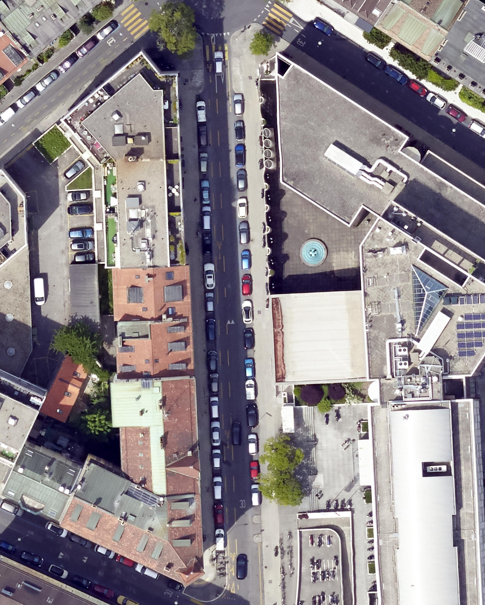
<figcaption>Orthophotos 2019</figcaption>
</figure>

#### Obtention des données {#obtention-des-données}

Les orthophotos peuvent être commandées gratuitement via leur service pour données volumineuses &#91;[71](../bibliography.md#ref-sitg_commande_nodate)&#93;. Une autre option est de télécharger tuile à tuile sur leur site dédié (Figure [3.3](#fig:ch3_donnees_sitg_orthophotos_telechargement_web){reference-type="ref" reference="fig:ch3_donnees_sitg_orthophotos_telechargement_web"}).

<figure id="fig:ch3_donnees_sitg_orthophotos_telechargement_web" data-latex-placement="H">
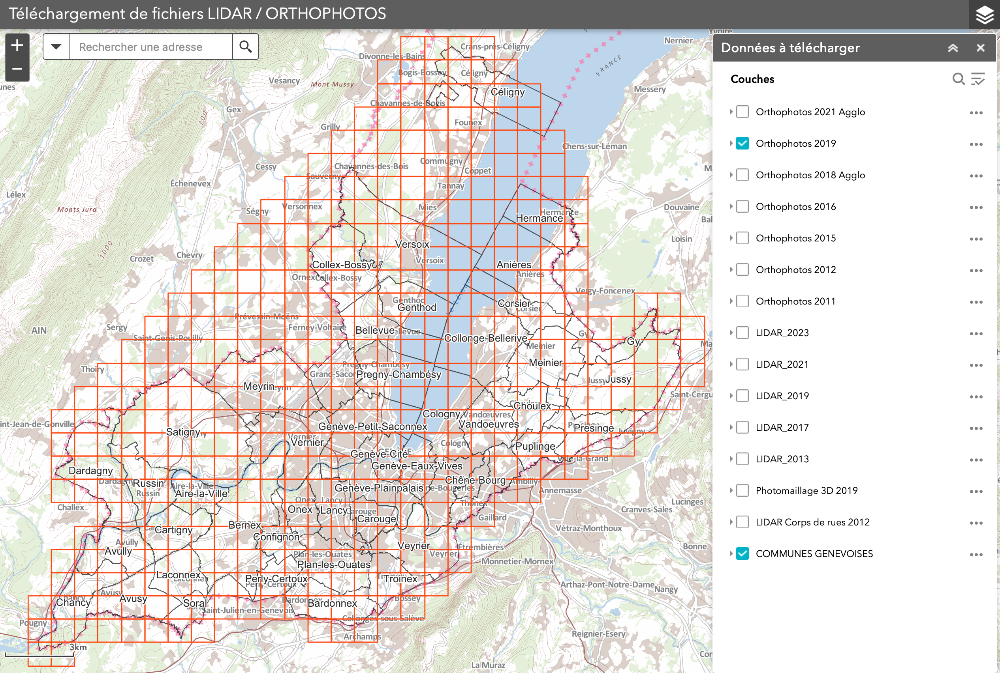
<figcaption>Site dédié au téléchargement des orthophotos et données <a href="../glossary.html#gloss-lidar"><span data-acronym-label="lidar" data-acronym-form="singular+short">lidar</span></a> <span class="citation" data-cites="sitg_commande_nodate">[<a href="../bibliography.html#ref-sitg_commande_nodate" role="doc-biblioref">71</a>]</span></figcaption>
</figure>

Chacune des 436 tuiles couvre une superficie de 1 km<sup>2</sup>. L’ensemble de ces données représente environ 700 GB et est stocké au format GeoTIFF. Ce format présente l’avantage de conserver les informations géographiques associées à chaque image, notamment la géolocalisation des quatre coins et le système de coordonnées de référence (<a href="../glossary.html#gloss-crs"><span data-acronym-label="crs" data-acronym-form="singular+abbrv">crs</span></a>) utilisé. Le Tableau [3.1](#tab:chiffre_cle_orthophoto_2019){reference-type="ref" reference="tab:chiffre_cle_orthophoto_2019"} présente un résumé de ces caractéristiques techniques.

| **Paramètre**    |            **Valeur** |
|:-----------------|----------------------:|
| *Couverture*     |                       |
| Surface totale   | 436.00 km<sup>2</sup> |
| Nombre de tuiles |                   436 |
| Taille tuile     | 1000.00 m × 1000.00 m |
| *Stockage*       |                       |
| Taille totale    |              682.92   |
| Taille par tuile |             1603.91   |

<span id="tab:chiffre_cle_orthophoto_2019"></span>

<p class="thesis-caption"><em>Chiffres-clés orthophotos 2019</em></p>
### Données vectorielles {#données-vectorielles}

Les données vectorielles choisies sont régulièrement mises à jour, il n’y a pas de version par année comme pour les orthophotos. La sous-section (voir page ) permet d’avoir un aperçu de ce que sont les données vectorielles.

#### Bâtiments hors-sol {#bâtiments-hors-sol}

La couche vectorielle “CAD\_BATIMENTS\_HORSOL” &#91;[68](../bibliography.md#ref-sitg_batiments_nodate)&#93; recense tous les bâtiments du Canton de Genève qui sont bien ancrés au sol. Cette couche n’inclus pas les bâtiments qui sont sous-terrains. La Figure [3.4](#fig:ch3_dataset_methodo_02_batiment_horsol){reference-type="ref" reference="fig:ch3_dataset_methodo_02_batiment_horsol"} permet d’observer ces polygones qui représentent les bâtiments en jaune.

Cette couche vectorielle est enrichie de données tabulaires associées à chacun des polygones. Les données utilisées sont l’“<a href="../glossary.html#gloss-egid"><span data-acronym-label="egid" data-acronym-form="singular+short">egid</span></a>” et “NOMEN\_CLASSE”. L’<a href="../glossary.html#gloss-egid"><span data-acronym-label="egid" data-acronym-form="singular+short">egid</span></a> est un identifiant unique pour tous les bâtiments en Suisse. “NOMEN\_CLASSE” identifie l’usage du bâtiment et va permettre de définir une classe <a href="../glossary.html#gloss-sia"><span data-acronym-label="sia" data-acronym-form="singular+short">sia</span></a>.

<figure id="fig:ch3_dataset_methodo_02_batiment_horsol" data-latex-placement="H">
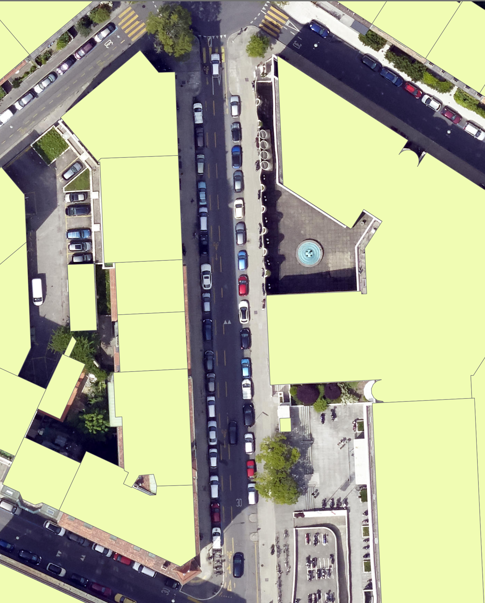
<figcaption>Couche vectorielle bâtiments hors-sol</figcaption>
</figure>

#### Toits des bâtiments {#toits-des-bâtiments}

La couche vectorielle “CAD\_BATIMENTS\_HORSOL\_TOIT” &#91;[42](../bibliography.md#ref-sitg_toits_nodate)&#93; regroupe toutes les toitures des bâtiments hors-sol du Canton de Genève (Figure [3.5](#fig:ch3_dataset_methodo_03_batiment_horsol_toiture){reference-type="ref" reference="fig:ch3_dataset_methodo_03_batiment_horsol_toiture"}). Un <a href="../glossary.html#gloss-egid"><span data-acronym-label="egid" data-acronym-form="singular+short">egid</span></a> est associé à chacun des polygones des toitures.

<figure id="fig:ch3_dataset_methodo_03_batiment_horsol_toiture" data-latex-placement="H">
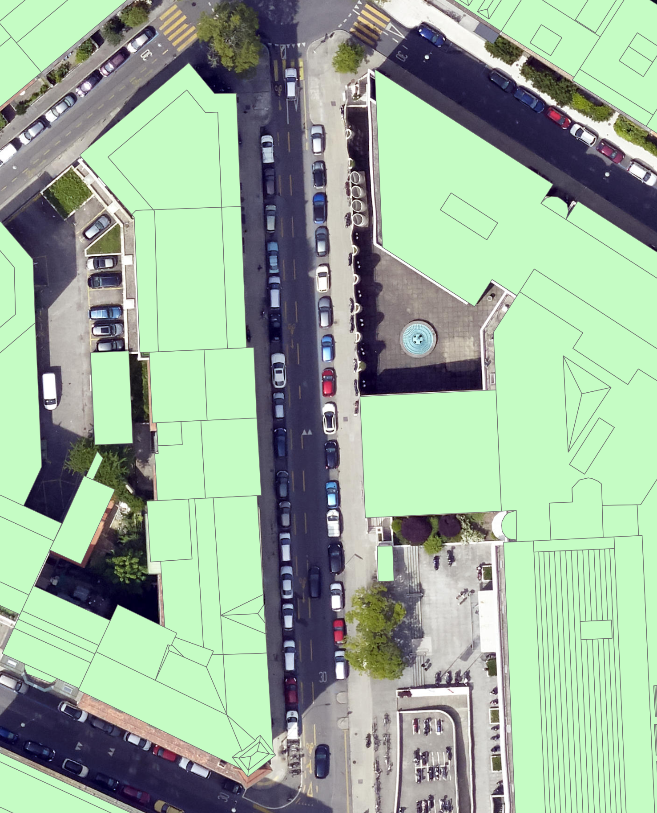
<figcaption>Couche vectorielle toits des bâtiments</figcaption>
</figure>

#### Superstructures des toits des bâtiments {#superstructures-des-toits-des-bâtiments}

La couche vectorielle “CAD\_BATIMENT\_HORSOL\_TOIT\_SP” &#91;[42](../bibliography.md#ref-sitg_toits_nodate)&#93; recense les éléments de toiture (superstructures) d’une surface inférieure à 9 m<sup>2</sup> présents sur les toitures des bâtiments hors-sol du Canton de Genève (Figure [3.6](#fig:ch3_dataset_methodo_04_batiment_horsol_toiture_sp){reference-type="ref" reference="fig:ch3_dataset_methodo_04_batiment_horsol_toiture_sp"}). Un <a href="../glossary.html#gloss-egid"><span data-acronym-label="egid" data-acronym-form="singular+short">egid</span></a> est associé à chacun des polygones de ces superstructures.

<figure id="fig:ch3_dataset_methodo_04_batiment_horsol_toiture_sp" data-latex-placement="H">
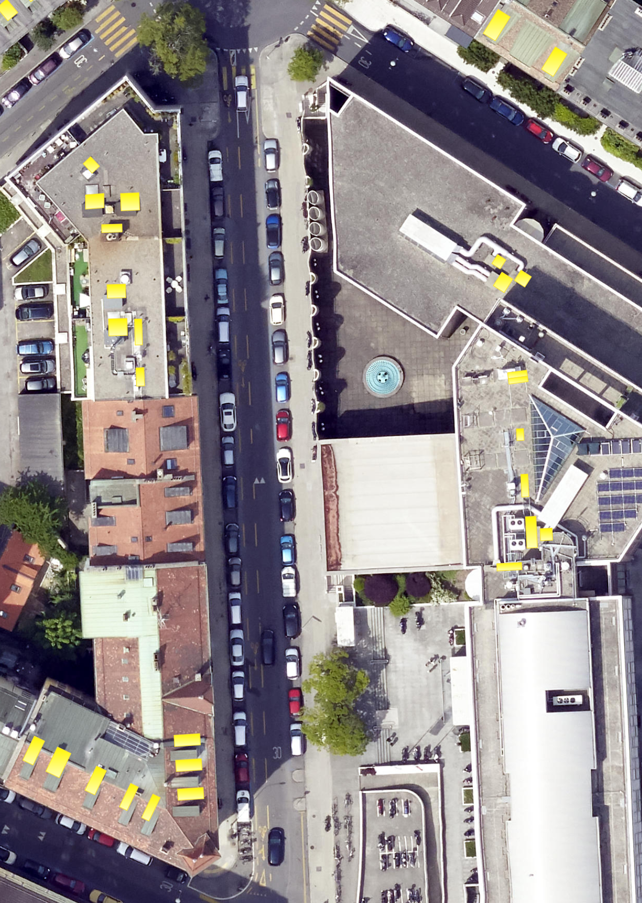
<figcaption>Couche vectorielle superstructures des toits des bâtiments</figcaption>
</figure>

Cette couche est présentée ici car c’est ce qu’il y a de plus proche à un recueil systématique des obstacles sur les toitures. Elle ne sera pas utilisée. Son utilisation a été explorée dans la section (voir page ).

#### Obtention des données {#obtention-des-données-1}

Les données vectorielles sont disponibles directement sur <a href="../glossary.html#gloss-sitg"><span data-acronym-label="sitg" data-acronym-form="singular+abbrv">sitg</span></a> dans plusieurs formats (GDB, GML, KML ou SHP). Il est également possible d’y accéder via l’<a href="../glossary.html#gloss-api"><span data-acronym-label="api" data-acronym-form="singular+abbrv">api</span></a> REST d’ArcGIS.

Pour faciliter le traitement, toutes les données sont converties au format GPKG &#91;[72](../bibliography.md#ref-noauthor_ogc_nodate)&#93;. Ce format, très utilisé en géomatique, a l’avantage d’être robuste et de regrouper toutes les données dans un seul fichier.

## Labellisation {#labellisation}

Une fois que les données sont sélectionnées, l’étape suivante est la labellisation. Cette étape se divise en plusieurs parties:

- Préparation des données

- Sélection des données pour le dataset

- Labellisation (annotations)

- Post-traitement des données annotées

### Préparation des données {#préparation-des-données}

Les données sélectionnées nécessitent d’être analysées, transformées et validées avant de pouvoir les annoter.

#### Données vectorielles {#données-vectorielles-1}

La Figure [3.7](#fig:ch3_preparation_donnees_01_etl){reference-type="ref" reference="fig:ch3_preparation_donnees_01_etl"} résume les principales étapes pour les données vectorielles.

<figure id="fig:ch3_preparation_donnees_01_etl" data-latex-placement="H">
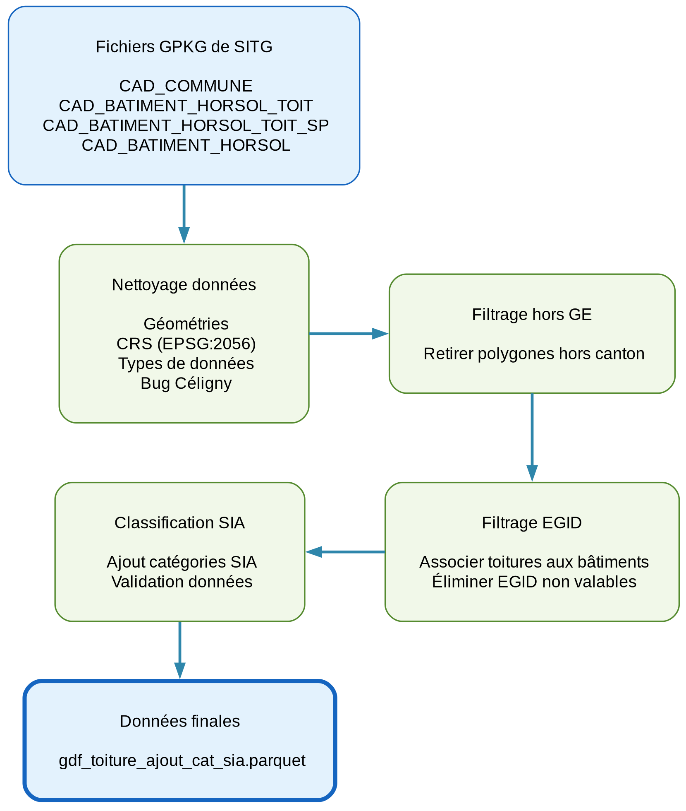
<figcaption>Principales étapes de la préparation des données vectorielles</figcaption>
</figure>

##### Nettoyage des données {#nettoyage-des-données}

Les deux principales librairies Python utilisées pour la manipulation des données vectorielles sont Pandas &#91;[73](../bibliography.md#ref-mckinney_pandas_nodate)&#93; et GeoPandas &#91;[74](../bibliography.md#ref-noauthor_geopandas_nodate)&#93;. Pandas est la librairie la plus populaire pour la manipulation des données tabulaires. GeoPandas étend ces fonctionnalités aux données géospatiales en intégrant la gestion des géométries et l’ensemble des opérations spatiales telles que les jointures spatiales.

Le but de cette étape est de vérifier la qualité des données de base. Les géométries (polygones) constituent une donnée essentielle en géomatique. Elles doivent être valides (polygones fermés) et utiliser le bon système de coordonnées de référence (<a href="../glossary.html#gloss-crs"><span data-acronym-label="crs" data-acronym-form="singular+abbrv">crs</span></a>).

Le type des différentes colonnes est également important. Le schéma des données définit les types attendus pour chaque colonne de chaque couche (voir Tableau [3.2](#tab:exemple_types_couche_toitures){reference-type="ref" reference="tab:exemple_types_couche_toitures"}).

| **Colonne**     |         **Type** |
|:----------------|-----------------:|
| objectid        |            int64 |
| egid            |          float64 |
| altitude\_min   |          float64 |
| altitude\_max   |          float64 |
| date\_leve      | datetime64&#91;ms&#93; |
| SHAPE\_\_Length |          float64 |
| SHAPE\_\_Area   |          float64 |
| globalid        |           object |
| geometry        |         geometry |

<span id="tab:exemple_types_couche_toitures"></span>

<p class="thesis-caption"><em>Exemple de types pour la couche des toitures</em></p>
Cette étape de vérification est essentielle pour les opérations de jointure entre les différentes couches de données. Les colonnes servant de clés de jointure doivent avoir des types compatibles. Par exemple, une colonne de type int64 (nombres entiers) ne peut pas être directement jointe avec une colonne de type float64 (nombres à virgule flottante) sans conversion préalable. Toutes les colonnes doivent être vérifiées et converties si nécessaire au bon type.

La visualisation des données permet de détecter certains problèmes difficilement visibles dans les données tabulaires. Par exemple, la couche des communes téléchargée via l’<a href="../glossary.html#gloss-api"><span data-acronym-label="api" data-acronym-form="singular+abbrv">api</span></a> REST d’ArcGIS (Figure [3.8](#fig:ch3_preparation_donnees_02_bug_celigny){reference-type="ref" reference="fig:ch3_preparation_donnees_02_bug_celigny"}) présentait des géométries invalides (commune de Céligny), c’est-à-dire que les polygones n’étaient pas fermés et étaient donc systématiquement supprimés.

Pour résoudre ce problème et par cohérence, toutes les données ont été téléchargées à nouveau directement depuis <a href="../glossary.html#gloss-sitg"><span data-acronym-label="sitg" data-acronym-form="singular+abbrv">sitg</span></a>. Ces nouvelles données ne présentaient pas ce problème, ce qui suggère que l’erreur vient du processus de téléchargement via QGIS.

<figure id="fig:ch3_preparation_donnees_02_bug_celigny" data-latex-placement="H">
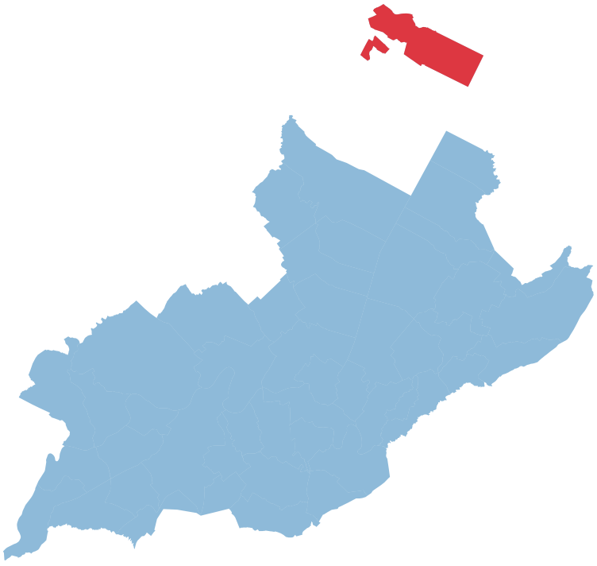
<figcaption>Problème avec la commune de Céligny</figcaption>
</figure>

##### Filtrer polygones hors canton {#filtrer-polygones-hors-canton}

Certains polygones se trouvent en dehors du canton de Genève. Le filtre est assez simple, tout ce qui n’est pas à l’intérieur d’une commune genevoise est considéré comme hors canton.

La Figure [3.9](#fig:ch3_preparation_donnees_03_hors_canton){reference-type="ref" reference="fig:ch3_preparation_donnees_03_hors_canton"} illustre les toitures situées hors canton. Au total, 1436 polygones ont été supprimés, principalement des bâtiments du CERN &#91;[75](../bibliography.md#ref-cern_home_nodate)&#93;.

<figure id="fig:ch3_preparation_donnees_03_hors_canton" data-latex-placement="H">
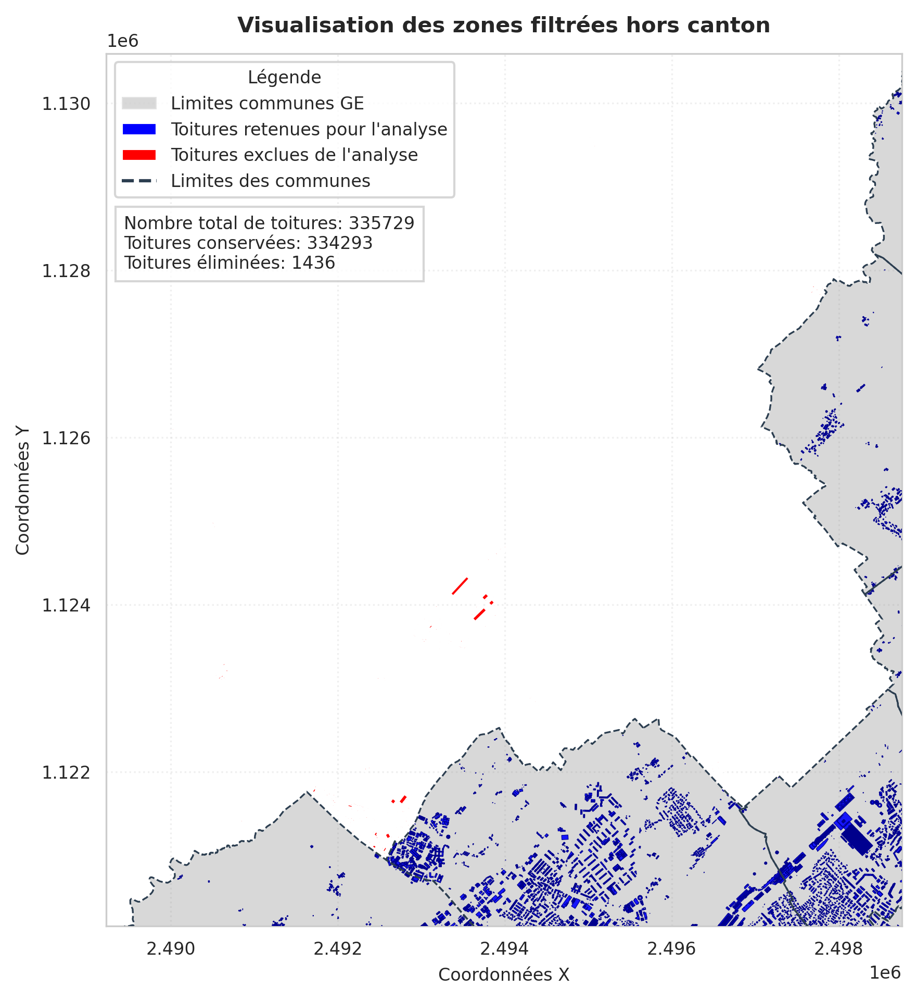
<figcaption>Visualisation des toitures hors canton de Genève</figcaption>
</figure>

##### Filtrer les <a href="../glossary.html#gloss-egid"><span data-acronym-label="egid" data-acronym-form="singular+short">egid</span></a> {#filtrer-les-egid}

Le filtre appliqué précédemment a éliminé une grande partie des <a href="../glossary.html#gloss-egid"><span data-acronym-label="egid" data-acronym-form="singular+short">egid</span></a> invalides, mais il est important de bien vérifier car l’<a href="../glossary.html#gloss-egid"><span data-acronym-label="egid" data-acronym-form="singular+short">egid</span></a> est la clé de jointure entre toutes les couches.

L’<a href="../glossary.html#gloss-egid"><span data-acronym-label="egid" data-acronym-form="singular+short">egid</span></a> minimum de la couche des bâtiments hors-sol est utilisé comme filtre (Code [&#91;code:filtre\_egid&#93;](#code:filtre_egid){reference-type="ref" reference="code:filtre_egid"}) pour identifier les <a href="../glossary.html#gloss-egid"><span data-acronym-label="egid" data-acronym-form="singular+short">egid</span></a> invalides. Cette vérification détecte un total de 24 <a href="../glossary.html#gloss-egid"><span data-acronym-label="egid" data-acronym-form="singular+short">egid</span></a> invalides dans la couche des toitures.

```python
    # EGID bizarre
    egid_bizarre = gdf_cad_batiment_horsol["egid"].min()
    
    print("EGID min de gdf_cad_batiment_horsol:", egid_bizarre)
    print("Nombre de toitures avec un EGID en dessous (invalide):")
    
    print(f"\t{gdf_toiture[gdf_toiture['egid'] < egid_bizarre].shape[0]} \
    dans gdf_toiture_1_filtre_canton")
    
    print(f"\t{gdf_toiture_sp[gdf_toiture_sp['egid'] < egid_bizarre].shape[0]} \
    dans gdf_toiture_sp_1_filtre_canton")
``` ```text
    EGID min de gdf_cad_batiment_horsol: 295074
    Nombre de toitures avec un EGID en dessous (invalide):
        22 dans gdf_toiture_1_filtre_canton
        2 dans gdf_toiture_sp_1_filtre_canton
        0 dans gdf_cad_batiment_horsol
```

<span id="code:filtre_egid"></span>

<p class="thesis-caption"><em>Code 1 — Filtre <a href="../glossary.html#gloss-egid"><span data-acronym-label="egid" data-acronym-form="singular+short">egid</span></a></em></p>

##### Classification <a href="../glossary.html#gloss-sia"><span data-acronym-label="sia" data-acronym-form="singular+short">sia</span></a> {#classification-sia}

En Suisse, chaque bâtiment peut être classé selon son utilisation en 12 catégories définies par la norme SIA 380/1 &#91;[49](../bibliography.md#ref-sia_sia-shop_nodate)&#93; (Tableau [3.3](#tab:categories_batiments_sia_380_1){reference-type="ref" reference="tab:categories_batiments_sia_380_1"}). Cette classification est importante pour l’analyse des caractéristiques des toitures, une toiture de logement collectif ne ressemblera pas à celle d’une usine ou d’une piscine.

| **N°** | **Catégories de bâtiment** | **Affectations (exemples)** |
|:--:|:---|:---|
| I | Habitat collectif | Immeubles locatifs et en propriété par appartement, résidences et logements pour personnes âgées, hôtels, immeubles et résidences de vacances, homes pour enfants ou adolescents, centres d’hébergement diurne, homes pour handicapés, centres d’accueil pour toxicomanes, casernes, établissements pénitentiaires |
| II | Habitat individuel | Villas individuelles ou jumelées, maisons de vacances, villas en chaînettes |
| III | Administration | Bâtiments administratifs privés et publics, locaux avec guichets, cabinets médicaux, bibliothèques, musées, centres culturels, centres informatiques, centres de télécommunication, studios de radio/télévision |
| IV | Écoles | Bâtiments scolaires de tous niveaux, jardins d’enfants et crèches, locaux d’enseignement, centres de formation, palais des congrès, laboratoires, instituts de recherche, locaux communautaires, centres de loisirs |
| V | Commerce | Locaux commerciaux de tous genres, y compris centres commerciaux, halles pour foires commerciales |
| VI | Restauration | Restaurants (y compris cuisines), cafétérias, cantines, dancings, discothèques |
| VII | Lieux de rassemblement | Théâtres, salles de concerts, salles de cinéma, églises, salles funéraires, salles des fêtes, halles sportives avec tribunes |
| VIII | Hôpitaux | Hôpitaux, cliniques psychiatriques, homes médicalisés, homes pour personnes âgées, centres de réhabilitation, locaux de soins |
| IX | Industrie | Fabriques, usines, centres artisanaux, ateliers, centres d’entretien, gares, caserne de pompiers |
| X | Dépôts | Entrepôts, centre de distribution |
| XI | Installations sportives | Halles de gymnastique et de sport, salles de gymnastique, halles de tennis, bowlings, centres de fitness, vestiaires (pour installations sportives) |
| XII | Piscines couvertes | Piscines couvertes, bassins de natation, saunas, bains thermaux |

<span id="tab:categories_batiments_sia_380_1"></span>

<p class="thesis-caption"><em>Catégories de bâtiments <a href="../glossary.html#gloss-sia"><span data-acronym-label="sia" data-acronym-form="singular+short">sia</span></a> selon la norme <a href="../glossary.html#gloss-sia"><span data-acronym-label="sia" data-acronym-form="singular+short">sia</span></a> 380/1:2016 &#91;[49](../bibliography.md#ref-sia_sia-shop_nodate)&#93;</em></p>
Cette information n’est pas incluse directement dans la couche des bâtiments hors-sol, par contre la destination est renseignée pour chaque <a href="../glossary.html#gloss-egid"><span data-acronym-label="egid" data-acronym-form="singular+short">egid</span></a>. Le Code [&#91;code:assigner\_categorie\_sia&#93;](#code:assigner_categorie_sia){reference-type="ref" reference="code:assigner_categorie_sia"} montre un exemple de conversion pour la première catégorie <a href="../glossary.html#gloss-sia"><span data-acronym-label="sia" data-acronym-form="singular+short">sia</span></a>.

```python
    def assign_sia_category(destination):
        """
        Attribue une catégorie SIA 380/1:2016 en fonction de la destination du bâtiment.
        """
        # Conversion en minuscules pour la comparaison
        dest = str(destination).lower()
    
        # ===== CATÉGORIE I - HABITAT COLLECTIF =====
        habitat_collectif = [
            "hab plusieurs logements",
            "résidence meublée",
            "foyer",
            "hôtel",
            "autre héberg. collectif",
            "etab. pénitenciaire",
            "internat",
            "hab. - rez activités",
            "habitation - activités",
        ]
        if any(term in dest for term in habitat_collectif):
            return "I habitat collectif"
    
    gdf_cad_batiment_horsol['sia_cat'] = gdf_cad_batiment_horsol['destination'].apply(assign_sia_category)
```

<span id="code:assigner_categorie_sia"></span>

<p class="thesis-caption"><em>Code 2 — Exemple de conversion entre la destination et la première catégorie <a href="../glossary.html#gloss-sia"><span data-acronym-label="sia" data-acronym-form="singular+short">sia</span></a></em></p>

La première vérification consiste à s’assurer que tous les <a href="../glossary.html#gloss-egid"><span data-acronym-label="egid" data-acronym-form="singular+short">egid</span></a> possèdent une catégorie <a href="../glossary.html#gloss-sia"><span data-acronym-label="sia" data-acronym-form="singular+short">sia</span></a> et à analyser la distribution de ces catégories. Le Code [&#91;code:categorie\_sia\_distribution\_verification&#93;](#code:categorie_sia_distribution_verification){reference-type="ref" reference="code:categorie_sia_distribution_verification"} inclut une instruction “assert” qui interrompt le script si tous les <a href="../glossary.html#gloss-egid"><span data-acronym-label="egid" data-acronym-form="singular+short">egid</span></a> ne disposent pas d’une catégorie assignée.

```python
    print(gdf_cad_batiment_horsol["sia_cat"].value_counts())
    print(f"Nombre de valeurs manquantes dans sia_cat: {gdf_cad_batiment_horsol["sia_cat"].isna().sum()}")
    assert gdf_cad_batiment_horsol["sia_cat"].isna().sum() == 0
``` ```text
    sia_cat
    II habitat individuel         29420
    IX industrie                  16947
    X dépôts                      16575
    I habitat collectif           15337
    III administration             1836
    IV écoles                       746
    VII lieux de rassemblement      520
    V commerce                      415
    XI installations sportives      257
    VIII hôpitaux                   233
    VI restauration                 205
    XII piscines couvertes           11
    Name: count, dtype: int64
    Nombre de valeurs manquantes dans sia_cat: 0
```

<span id="code:categorie_sia_distribution_verification"></span>

<p class="thesis-caption"><em>Code 3 — Distribution des catégories <a href="../glossary.html#gloss-sia"><span data-acronym-label="sia" data-acronym-form="singular+short">sia</span></a> et vérification des données.</em></p>

<figure id="fig:ch3_preparation_donnees_categorie_sia_01_barplot" data-latex-placement="H">
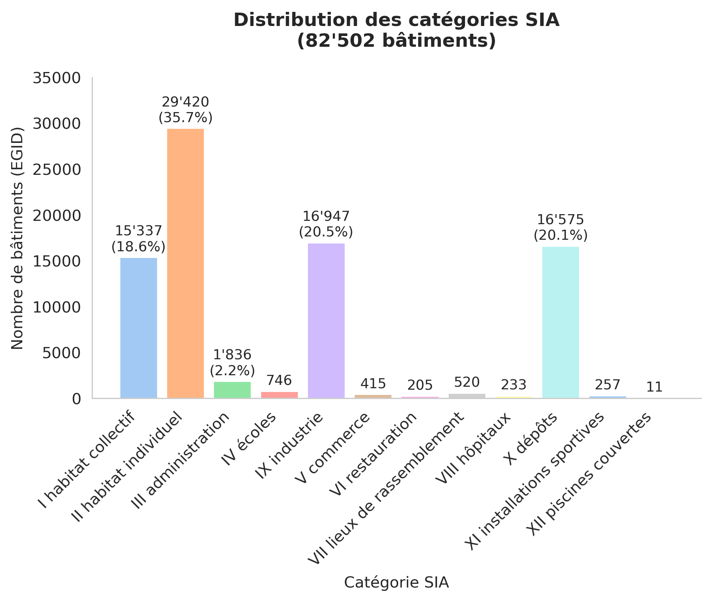
<figcaption>Distribution des catégories <a href="../glossary.html#gloss-sia"><span data-acronym-label="sia" data-acronym-form="singular+short">sia</span></a> pour la couche des bâtiments hors-sol</figcaption>
</figure>

La Figure [3.10](#fig:ch3_preparation_donnees_categorie_sia_01_barplot){reference-type="ref" reference="fig:ch3_preparation_donnees_categorie_sia_01_barplot"} illustre la distribution des bâtiments par catégorie <a href="../glossary.html#gloss-sia"><span data-acronym-label="sia" data-acronym-form="singular+short">sia</span></a>. Cette distribution est assez déséquilibrée. Le canton de Genève est très urbain et densément peuplé, ce qui explique la prédominance des logements collectifs et individuels.

Certaines catégories comme les piscines couvertes sont peu représentées. Cette rareté peut s’expliquer par une incertitude sur la qualité des données renseignées dans la destination du bâtiment. Par exemple, un complexe sportif avec une piscine couverte pourrait avoir seulement la destination “complexe sportif”.

Les catégories <a href="../glossary.html#gloss-sia"><span data-acronym-label="sia" data-acronym-form="singular+short">sia</span></a> (Tableau [3.3](#tab:categories_batiments_sia_380_1){reference-type="ref" reference="tab:categories_batiments_sia_380_1"}) indiquent des exemples de bâtiments pour chacune des catégories mais il n’y a pas de liste complète. Certains cas sont entre deux catégories, un centre de massage peut être classé comme commerce ou comme hôpital (locaux de soins).

##### Données finales {#données-finales}

Les données finales (Tableau [3.4](#tab:gdf_toiture_ajout_cat_sia_parquet_head){reference-type="ref" reference="tab:gdf_toiture_ajout_cat_sia_parquet_head"}) comprennent plusieurs colonnes essentielles; L’“EGID” permet d’associer chaque toiture à un bâtiment, la colonne “geometry” contient la géométrie du polygone dans le système de coordonnées suisse, et “sia\_cat” indique la catégorie <a href="../glossary.html#gloss-sia"><span data-acronym-label="sia" data-acronym-form="singular+short">sia</span></a> du bâtiment.

Les colonnes d’identification “objectid” et “globalid” permettent respectivement d’identifier chaque polygone de manière unique au sein de la couche et à travers l’ensemble des couches de <a href="../glossary.html#gloss-sitg"><span data-acronym-label="sitg" data-acronym-form="singular+abbrv">sitg</span></a>.

| objectid | egid | globalid | geometry | sia\_cat |
|---:|:---|:---|:---|:---|
| 204857 | 295010023 | 96076844-3ED9-464... | MULTIPOLYGON (((2... | II habitat individuel |
| 204873 | 295010485 | 987C8B52-793B-4BB... | MULTIPOLYGON (((2... | II habitat individuel |
| 7630 | 295510865 | E3C6375D-ECCC-4A0... | MULTIPOLYGON (((2... | X dépôts |

<span id="tab:gdf_toiture_ajout_cat_sia_parquet_head"></span>

<p class="thesis-caption"><em>Principales colonnes de gdf\_toiture\_ajout\_cat\_sia.parquet</em></p>
Le format choisi pour le stockage du fichier est le geoparquet &#91;[76](../bibliography.md#ref-noauthor_geoparquet_nodate)&#93;. Ce format étend le standard open source parquet &#91;[77](../bibliography.md#ref-noauthor_parquet_nodate)&#93; en y intégrant toutes les spécificités nécessaires à la gestion des données géospatiales. Il combine ainsi les avantages de performance du format parquet (compression efficace, lecture rapide) avec la gestion native des géométries.

#### Orthophotos {#subsubsec:decoupe_orthophoto_tuile}

##### Dimensions des orthophotos et contraintes {#dimensions-des-orthophotos-et-contraintes}

Les 416 orthophotos sont des fichiers au format GeoTIFF de dimensions pixels. Cependant, la plupart des réseaux de neurones convolutifs sont entraînés sur des images de tailles comprises entre et pixels, correspondant aux standards des architectures classiques. Le découpage de ces orthophotos est nécessaire pour adapter les données aux contraintes des modèles.

##### Processus de découpage {#processus-de-découpage}

La Figure [3.11](#fig:ch3_preparation_donnees_orthophotos_01_etl){reference-type="ref" reference="fig:ch3_preparation_donnees_orthophotos_01_etl"} décrit les étapes de ce processus de découpage. Chaque tuile générée mesure pixels ( mètres) avec un recouvrement de 256 pixels (12,80 mètres) avec les tuiles adjacentes. Ce recouvrement garantit qu’aucun bâtiment ne soit coupé aux bordures des tuiles.

<figure id="fig:ch3_preparation_donnees_orthophotos_01_etl" data-latex-placement="H">
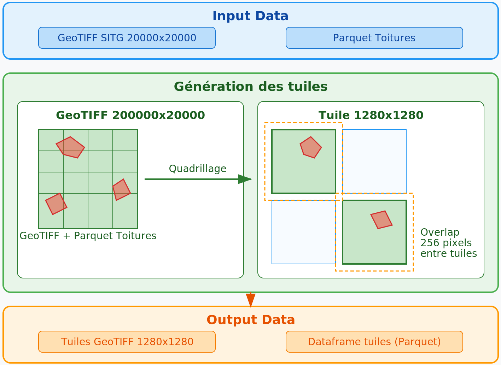
<figcaption>Découpe des orthophotos en tuiles 1280x1280 pixels avec recouvrement</figcaption>
</figure>

##### Zone urbaine {#zone-urbaine}

La Figure [3.12](#fig:ch3_preparation_donnees_orthophotos_02_exemple_decoupe_orthophoto1){reference-type="ref" reference="fig:ch3_preparation_donnees_orthophotos_02_exemple_decoupe_orthophoto1"} illustre la démarche adoptée. Pour chaque orthophoto, l’algorithme charge d’abord l’image et identifie toutes les toitures situées dans son périmètre.

Un quadrillage de tuiles de pixels avec un recouvrement de 256 pixels est ensuite créé. Le processus parcourt le quadrillage de manière itérative, du coin supérieur gauche vers le coin inférieur droit. Seules les tuiles contenant au moins une toiture sont conservées et sauvegardées; les tuiles vides sont rejetées. Dans ce cas, 388 tuiles ont été retenues sur les 400 tuiles possibles par orthophoto.

Dans les zones urbaines caractérisées par une forte densité de bâtiments, chaque orthophoto génère un nombre élevé de tuiles. Cette concentration de données est particulièrement intéressante pour l’entraînement du modèle, car elle offre une grande variété d’exemples architecturaux dans un espace géographique restreint.

<figure id="fig:ch3_preparation_donnees_orthophotos_02_exemple_decoupe_orthophoto1" data-latex-placement="H">
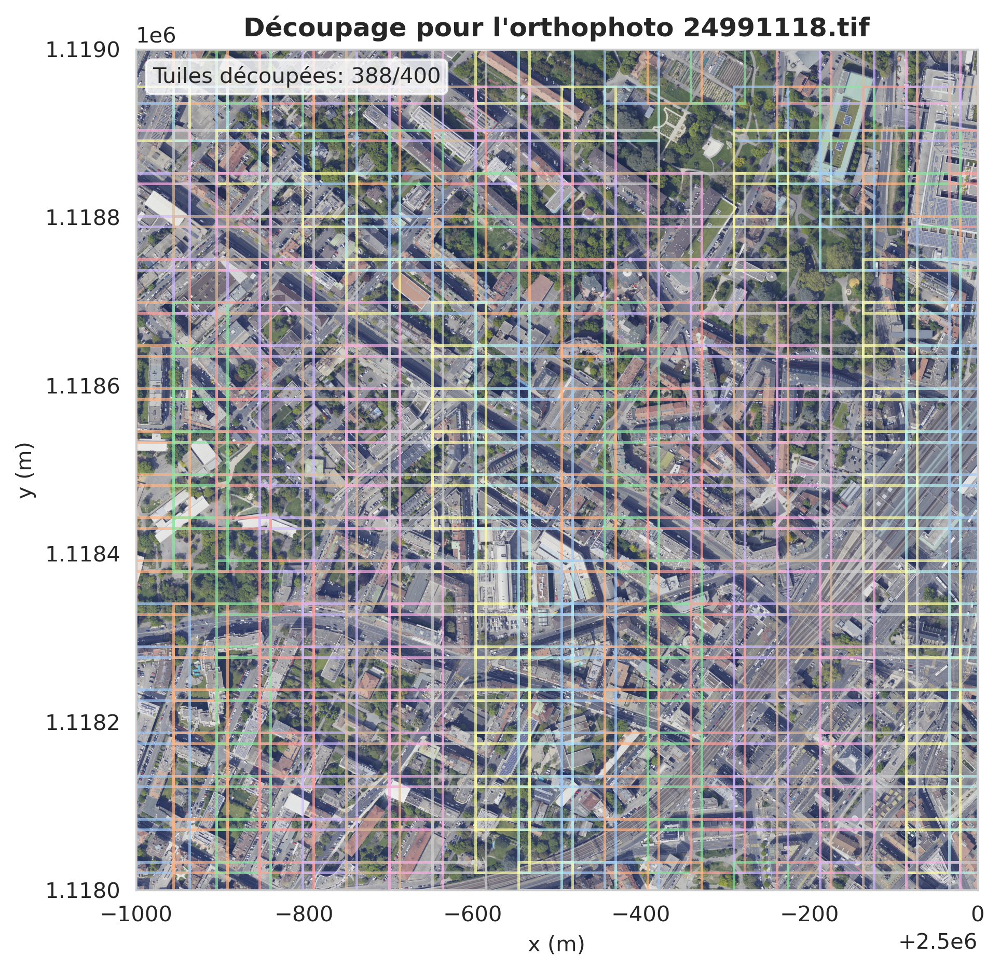
<figcaption>Exemple de découpage d’une orthophoto en tuiles pour une zone urbaine</figcaption>
</figure>

La Figure [3.13](#fig:ch3_preparation_donnees_orthophotos_03_exemple_decoupe_orthophoto2){reference-type="ref" reference="fig:ch3_preparation_donnees_orthophotos_03_exemple_decoupe_orthophoto2"} présente le calepinage des tuiles conservées. Cette représentation illustre plus clairement le principe de recouvrement que la Figure [3.12](#fig:ch3_preparation_donnees_orthophotos_02_exemple_decoupe_orthophoto1){reference-type="ref" reference="fig:ch3_preparation_donnees_orthophotos_02_exemple_decoupe_orthophoto1"}, une tuile peut être entièrement entourée par d’autres tuiles qui se chevauchent avec elle.

Il convient de noter que toutes les tuiles générées ne présentent pas des dimensions de pixels. Les tuiles situées en bordure droite de la Figure [3.13](#fig:ch3_preparation_donnees_orthophotos_03_exemple_decoupe_orthophoto2){reference-type="ref" reference="fig:ch3_preparation_donnees_orthophotos_03_exemple_decoupe_orthophoto2"} sont plus étroites (tuile 18), de même que celles situées en partie basse (tuile 371).

Ces cas particuliers seront traités après la finalisation de l’annotation. La priorité a été donnée à l’obtention de distributions de tuiles identiques pour l’ensemble des orthophotos, afin d’avoir une cohérence dans le processus de découpage et post-traitement.

<figure id="fig:ch3_preparation_donnees_orthophotos_03_exemple_decoupe_orthophoto2" data-latex-placement="H">
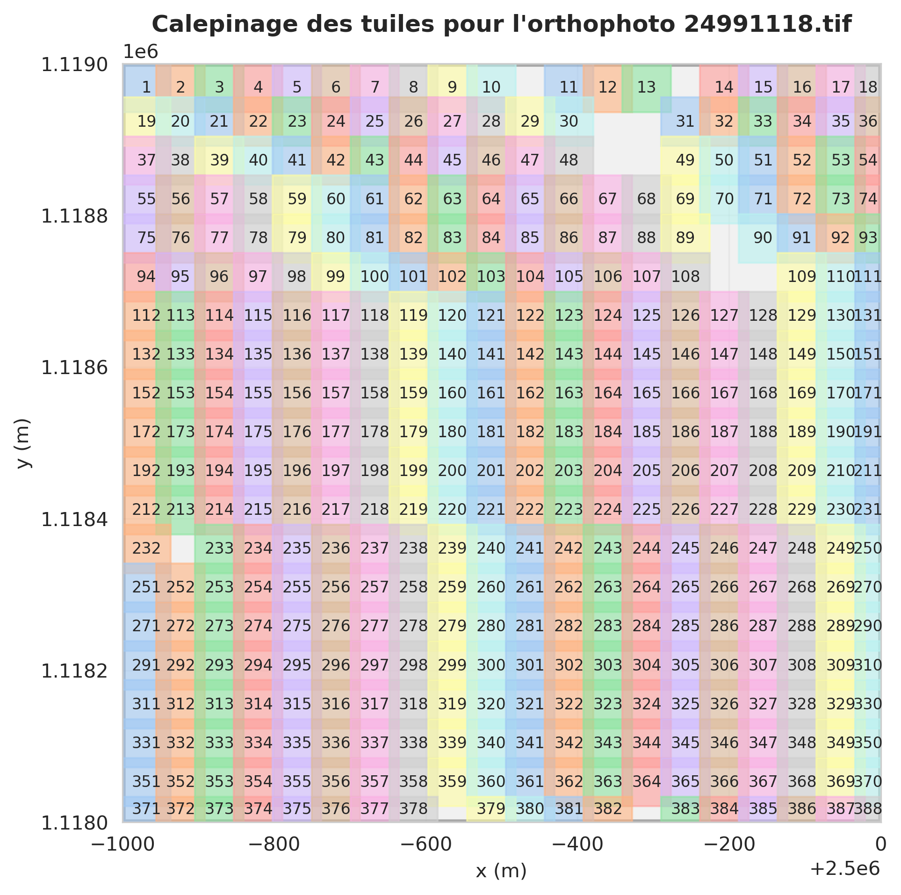
<figcaption>Calepinage des tuiles découpées pour la zone urbaine</figcaption>
</figure>

La tuile 258 (Figure [3.14](#fig:ch3_preparation_donnees_orthophotos_04a_exemple_decoupe_orthophoto3){reference-type="ref" reference="fig:ch3_preparation_donnees_orthophotos_04a_exemple_decoupe_orthophoto3"}), située à proximité de <a href="../glossary.html#gloss-hepia"><span data-acronym-label="hepia" data-acronym-form="singular+abbrv">hepia</span></a>, illustre bien cette complexité. Chaque tuile peut avoir jusqu’à 8 zones de recouvrement avec ses voisines (Figure [3.15](#fig:ch3_preparation_donnees_orthophotos_04_exemple_decoupe_orthophoto3){reference-type="ref" reference="fig:ch3_preparation_donnees_orthophotos_04_exemple_decoupe_orthophoto3"}) au nord (238), nord-est (239), est (259), sud-est (279), sud (278), sud-ouest (277), ouest (257) et nord-ouest (237). Seule la zone centrale de pixels n’a aucun recouvrement et constitue la partie unique de chaque tuile.

<figure id="fig:ch3_preparation_donnees_orthophotos_04a_exemple_decoupe_orthophoto3" data-latex-placement="H">
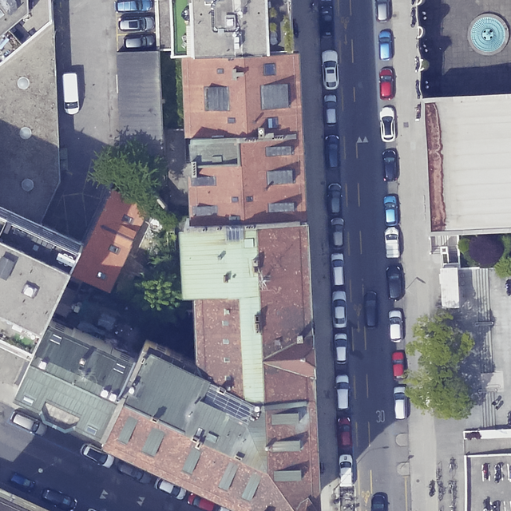
<figcaption>Tuile 258</figcaption>
</figure>

<figure id="fig:ch3_preparation_donnees_orthophotos_04_exemple_decoupe_orthophoto3" data-latex-placement="H">
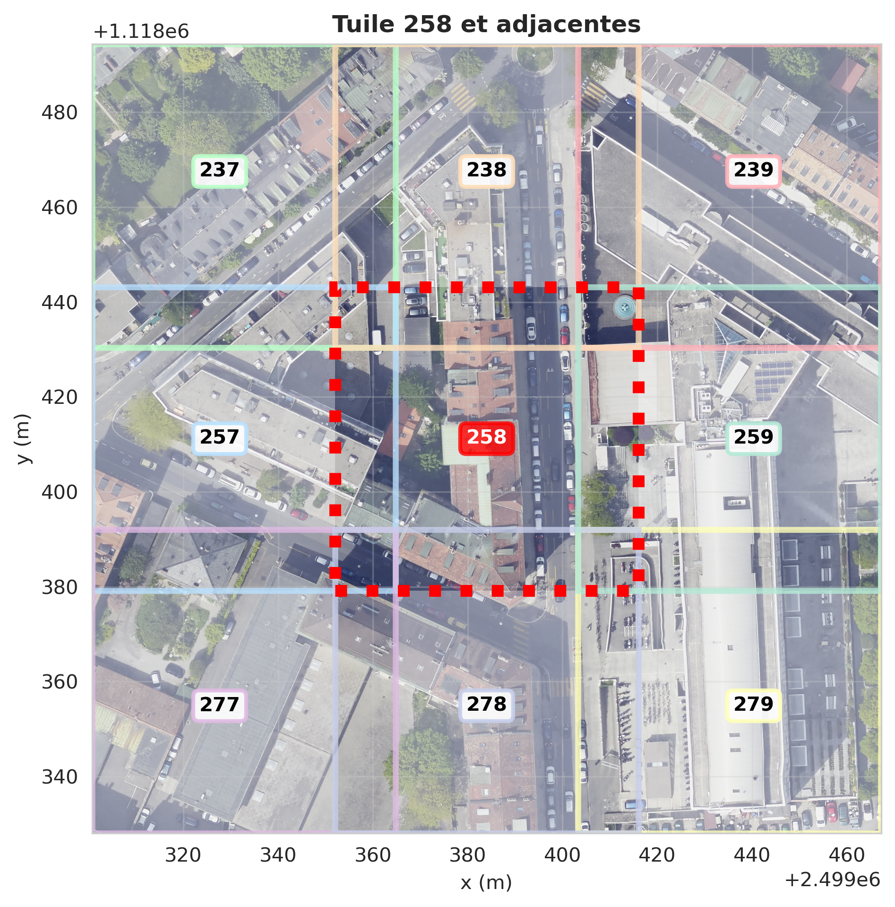
<figcaption>Recouvrement pour la tuile 258</figcaption>
</figure>

##### Zone rurale {#zone-rurale}

La Figure [3.16](#fig:ch3_preparation_donnees_orthophotos_05_exemple_decoupe_orthophoto4){reference-type="ref" reference="fig:ch3_preparation_donnees_orthophotos_05_exemple_decoupe_orthophoto4"} illustre le découpage dans une zone plus rurale. Ces zones présentent des caractéristiques architecturales très différentes des zones urbaines, avec notamment des villas individuelles, des bâtiments agricoles et des constructions plus dispersées sur le territoire. Cette diversité typologique est nécessaire pour constituer un dataset riche et varié.

<figure id="fig:ch3_preparation_donnees_orthophotos_05_exemple_decoupe_orthophoto4" data-latex-placement="H">
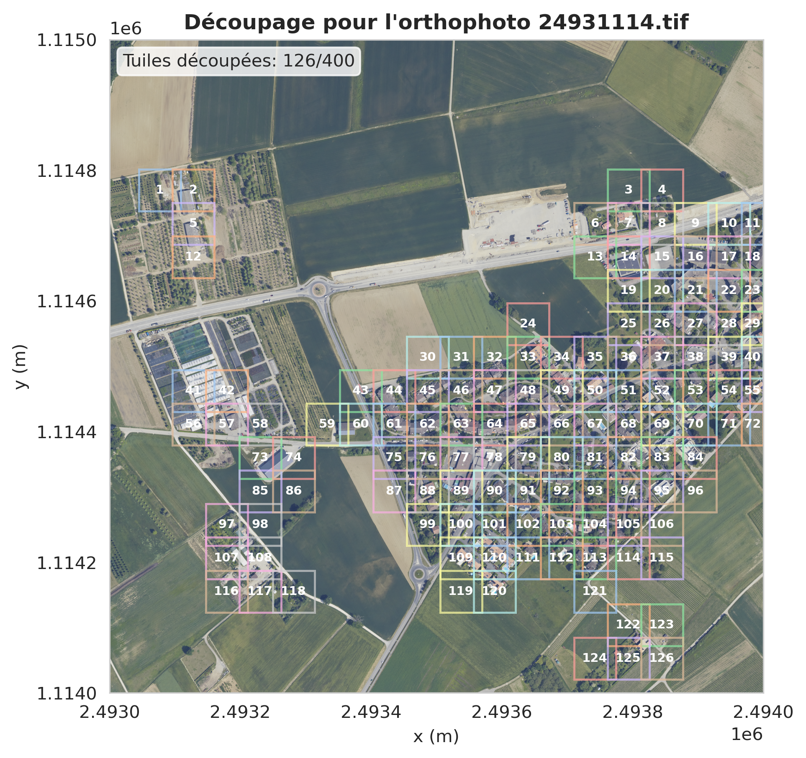
<figcaption>Exemple de découpage d’une orthophoto en tuiles pour une zone rurale</figcaption>
</figure>

Comme observé précédemment, cette figure révèle également quelques bugs dans le script de traitement des tuiles, avec des tuiles manquantes par endroits (nord 41-42). Cependant, l’analyse à l’échelle du canton (Figure [3.17](#fig:ch3_preparation_donnees_orthophotos_07_exemple_decoupe_orthophoto6){reference-type="ref" reference="fig:ch3_preparation_donnees_orthophotos_07_exemple_decoupe_orthophoto6"}) confirme que ces erreurs ponctuelles ne compromettent pas la qualité globale du découpage.

<figure id="fig:ch3_preparation_donnees_orthophotos_07_exemple_decoupe_orthophoto6" data-latex-placement="H">
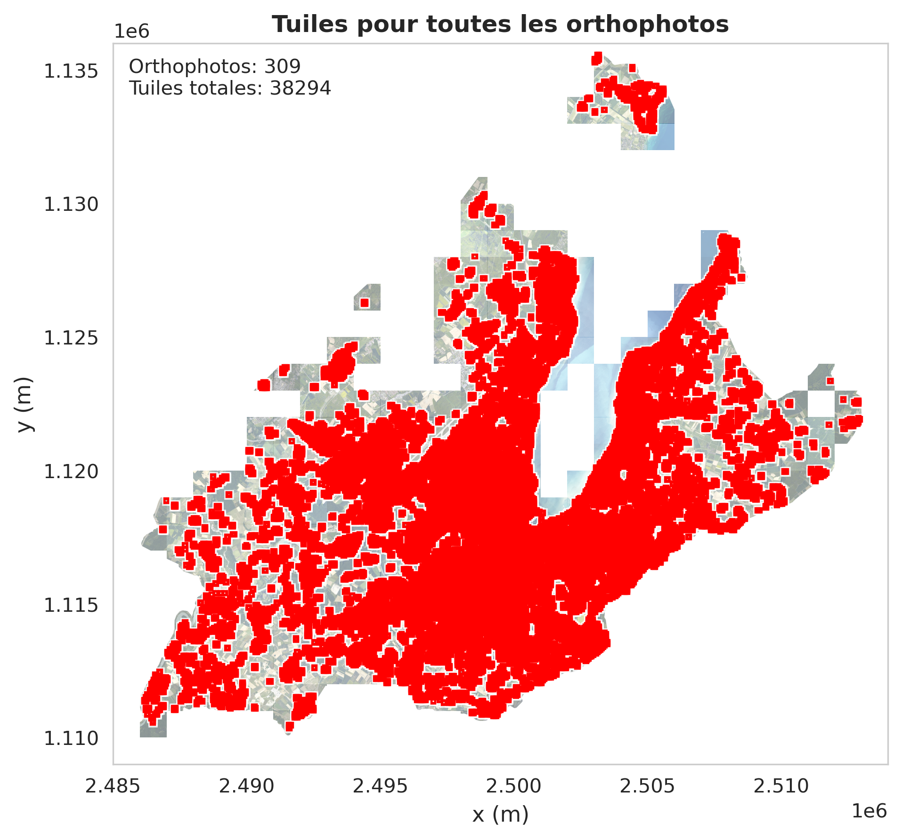
<figcaption>Tuiles découpées pour toutes les orthophotos</figcaption>
</figure>

##### Implémentation {#implémentation}

Le Code [&#91;code:pseudo\_code\_decoupe\_orthophotos\_tuiles\_1280\_1280&#93;](#code:pseudo_code_decoupe_orthophotos_tuiles_1280_1280){reference-type="ref" reference="code:pseudo_code_decoupe_orthophotos_tuiles_1280_1280"} utilise du pseudo-code pour expliquer les étapes de découpage. Les principales librairies employées sont rasterio &#91;[78](../bibliography.md#ref-noauthor_rasterio_nodate)&#93; et shapely &#91;[79](../bibliography.md#ref-noauthor_shapely_nodate)&#93;. Rasterio permet la manipulation des données raster (orthophotos), tandis que shapely offre une boîte à outils complète pour le traitement des géométries et données géospatiales.

```text
    DÉBUT process_geotiff_with_buildings(geotiff, gdf_batiments, output)
        
        // Chargement des données
        CHARGER les géométries des bâtiments depuis le gdf_batiments
        OUVRIR le fichier GeoTIFF source
        
        // Préparation spatiale
        REPROJETER les bâtiments dans le même système de coordonnées que le GeoTIFF
        CRÉER un index spatial pour optimiser les requêtes géométriques
        FILTRER les bâtiments qui intersectent avec le GeoTIFF sélectionné
        
        // Découpage en tuiles
        CALCULER le nombre de tuiles nécessaires (largeur x hauteur / taille_tuile)
        
        POUR chaque position de tuile (i, j) FAIRE
            DÉFINIR la fenêtre de la tuile courante (1024x1024 pixels)
            CALCULER l'emprise géographique de la tuile
            CRÉER la zone de recouvrement autour de la tuile (1280x1280 pixels)
            
            // Détection des bâtiments
            RECHERCHER les bâtiments qui intersectent la zone tamponnée
            
            SI aucun bâtiment trouvé ALORS
                PASSER à la tuile suivante
            SINON
                EXTRAIRE les données raster de la zone tamponnée
                SAUVEGARDER la tuile au format GeoTIFF
                ENREGISTRER les métadonnées (géométries, identifiants, coordonnées)
            FIN SI
        FIN POUR
        
        SAUVEGARDER toutes les métadonnées dans un fichier Parquet
        RETOURNER le chemin du fichier de métadonnées
        
    FIN process_geotiff_with_buildings
```

<span id="code:pseudo_code_decoupe_orthophotos_tuiles_1280_1280"></span>

<p class="thesis-caption"><em>Code 4 — Pseudo-code pour la découpe des orthophotos 20000x20000 pixels en tuiles de 1280x1280 pixels</em></p>

La gestion de la mémoire peut devenir critique, chaque orthophoto occupant 1,4 Go. Il est possible de paralléliser la tâche, mais cela nécessite une machine disposant de suffisamment de mémoire RAM.

Lors de l’exécution, le principal goulot d’étranglement est l’accès aux images plutôt que le traitement. Si plusieurs images sont ouvertes simultanément, le système de stockage n’est pas toujours suffisamment rapide et constitue le facteur limitant. Avec une configuration de 4 cœurs et 64 Go de RAM, le processus complet a pris environ 2 heures.

##### Métadonnées {#métadonnées}

Le fichier parquet résultant (Tableau [3.5](#tab:ch3_preparation_donnees_orthophotos_parquet_resultat){reference-type="ref" reference="tab:ch3_preparation_donnees_orthophotos_parquet_resultat"}) va être essentiel pour la sélection des données du dataset, il inclut tous les éléments nécessaires pour clairement identifier les toitures ainsi que les tuiles associées.

| **Nom de la colonne** | **Type** | **Description** |
|:---|:---|:---|
| geotiff\_path | object | Chemin vers le fichier GeoTIFF source |
| tile\_path | object | Chemin vers le fichier de tuile généré |
| tile\_id | object | Identifiant unique de la tuile |
| tile\_row | int64 | Numéro de ligne de la tuile dans la grille |
| tile\_col | int64 | Numéro de colonne de la tuile dans la grille |
| tile\_bounds | object | Limites géographiques de la tuile |
| buffered\_bounds | object | Limites géographiques avec zone tampon |
| tile\_size | int64 | Taille de la tuile en pixels |
| buffer\_size | int64 | Taille de la zone tampon en pixels |
| tile\_pixel\_size | object | Résolution spatiale du pixel de la tuile |
| objectid | int64 | Identifiant dans la couche des toitures |
| egid | int64 | <a href="../glossary.html#gloss-egid"><span data-acronym-label="egid" data-acronym-form="singular+short">egid</span></a> |
| altitude\_min | float64 | Altitude minimale de la toiture |
| altitude\_max | float64 | Altitude maximale de la toiture |
| date\_leve | datetime64&#91;ns&#93; | Date de levé de la toiture |
| SHAPE\_\_Length | float64 | Périmètre de la géométrie en mètres |
| SHAPE\_\_Area | float64 | Surface de la géométrie en mètres carrés |
| globalid | object | Identifiant global unique dans <a href="../glossary.html#gloss-sitg"><span data-acronym-label="sitg" data-acronym-form="singular+abbrv">sitg</span></a> |
| geometry | geometry | Géométrie du polygone de toiture géoréférencé |

<span id="tab:ch3_preparation_donnees_orthophotos_parquet_resultat"></span>

<p class="thesis-caption"><em>Description des colonnes du fichier parquet résultat</em></p>
##### Résultats {#résultats-5}

Au final, le processus génère 38294 tuiles pour 77993 <a href="../glossary.html#gloss-egid"><span data-acronym-label="egid" data-acronym-form="singular+short">egid</span></a> uniques à l’échelle du canton. Étant donné qu’un bâtiment peut fréquemment se retrouver sur plusieurs tuiles en raison du recouvrement, cela représente 672253 associations toiture-tuile. Les orthophotos situées près de la zone aéroportuaire, qui incluent une partie du territoire français, ne sont pas incluses dans le périmètre d’étude.

Ces plus de 38000 tuiles constituent une base suffisante pour sélectionner les images nécessaires à la constitution d’un dataset représentatif et équilibré.

#### Sélection des données pour le dataset {#sélection-des-données-pour-le-dataset}

La sélection des données nécessite une analyse des tuiles afin d’identifier les caractéristiques des toitures présentes. Les critères retenus pour cette sélection sont la classe <a href="../glossary.html#gloss-sia"><span data-acronym-label="sia" data-acronym-form="singular+short">sia</span></a> et la surface des toitures.

##### Classe <a href="../glossary.html#gloss-sia"><span data-acronym-label="sia" data-acronym-form="singular+short">sia</span></a> {#classe-sia}

Ce critère repose sur l’hypothèse que les classes <a href="../glossary.html#gloss-sia"><span data-acronym-label="sia" data-acronym-form="singular+short">sia</span></a> regroupent des bâtiments aux caractéristiques architecturales similaires. Par exemple, les toitures industrielles sont généralement plates avec une construction légère, tandis que de nombreuses écoles ont été construites par les mêmes architectes avec des plans similaires.

Pour analyser la distribution des tuiles par classe <a href="../glossary.html#gloss-sia"><span data-acronym-label="sia" data-acronym-form="singular+short">sia</span></a>, chaque tuile peut contenir plusieurs classes représentées. La classe dite dominante correspond à celle qui est majoritaire dans une tuile donnée.

La Figure [3.18](#fig:ch3_selection_donnees_01_distribution_sia){reference-type="ref" reference="fig:ch3_selection_donnees_01_distribution_sia"} illustre la distribution des classes <a href="../glossary.html#gloss-sia"><span data-acronym-label="sia" data-acronym-form="singular+short">sia</span></a> dominantes par tuile. Cette distribution présente une forte similarité avec celle des classes <a href="../glossary.html#gloss-sia"><span data-acronym-label="sia" data-acronym-form="singular+short">sia</span></a> pour les bâtiments hors-sol (Figure [3.10](#fig:ch3_preparation_donnees_categorie_sia_01_barplot){reference-type="ref" reference="fig:ch3_preparation_donnees_categorie_sia_01_barplot"}). Cette cohérence est nécessaire pour préserver la représentativité de l’échantillon lors de la sélection du dataset.

<figure id="fig:ch3_selection_donnees_01_distribution_sia" data-latex-placement="H">
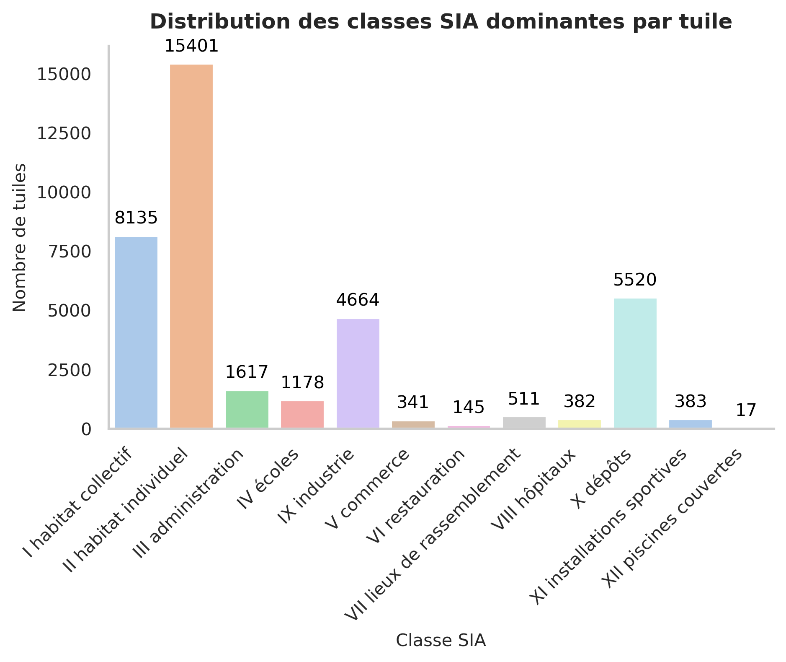
<figcaption>Distribution des classes <a href="../glossary.html#gloss-sia"><span data-acronym-label="sia" data-acronym-form="singular+short">sia</span></a> dominantes par tuile</figcaption>
</figure>

##### Surface des toitures {#surface-des-toitures}

Le deuxième critère retenu est la surface des toitures. Pour chaque tuile, la somme des surfaces de toiture est calculée, permettant ainsi de classifier les tuiles selon leur densité de couverture bâtie. Cette métrique distingue les tuiles avec une forte concentration de toitures, typiques des zones urbaines denses, de celles présentant une couverture plus éparse, caractéristiques des zones rurales ou de périphérie.

La Figure [3.19](#fig:ch3_selection_donnees_02_taille_bin){reference-type="ref" reference="fig:ch3_selection_donnees_02_taille_bin"} représente cette distribution par intervalles de surface. Les intervalles ont été choisis de manière empirique dans le but de refléter les ordres de grandeur caractéristiques des différents types de bâtiments.

<figure id="fig:ch3_selection_donnees_02_taille_bin" data-latex-placement="H">
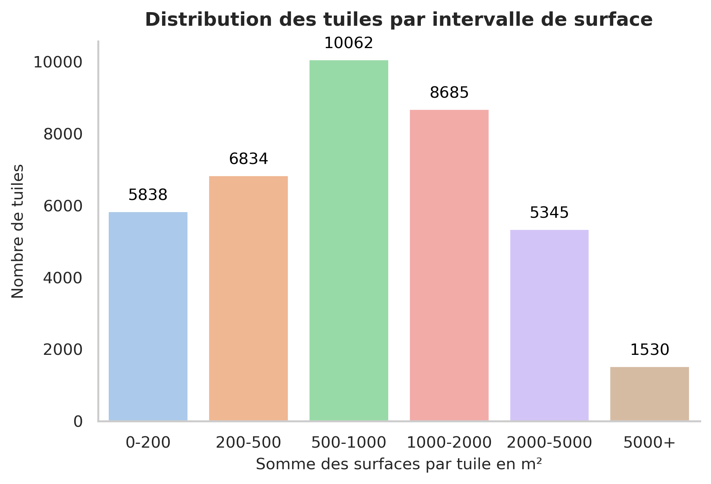
<figcaption>Distribution des surfaces de toitures par intervalles</figcaption>
</figure>

Chaque intervalle correspond à une typologie architecturale spécifique. Le plus petit intervalle (0-200 m<sup>2</sup>) inclut les petits bâtiments individuels et les villas. Le deuxième (200-500 m<sup>2</sup>) regroupe les petits bâtiments de logement collectif. Les intervalles suivants (500-1000 m<sup>2</sup>, 1000-2000 m<sup>2</sup>, 2000-5000 m<sup>2</sup>) correspondent respectivement aux logements collectifs de taille moyenne, aux grands ensembles résidentiels et aux bâtiments industriels ou commerciaux. Enfin, l’intervalle supérieur (plus de 5000 m<sup>2</sup>) regroupe les grandes infrastructures industrielles, commerciales ou publiques.

##### Échantillonnage stratifié {#échantillonnage-stratifié}

L’échantillonnage des tuiles s’effectue selon une approche stratifiée pour garantir une représentation équilibrée de chaque catégorie. Cette méthode repose sur deux critères de stratification, la classe dominante (`dominant_class`) et la catégorie de surface (`area_bin`).

La fonction `sample_tiles` (Code [&#91;code:echantillonnage\_tuiles&#93;](#code:echantillonnage_tuiles){reference-type="ref" reference="code:echantillonnage_tuiles"}) implémente cette logique d’échantillonnage avec un paramètre `random_state=42` qui permet la reproductibilité des résultats en fixant la graine du générateur de nombres aléatoires.

```python
    def sample_tiles(group, n_samples):
        """
        Échantillonne aléatoirement n_samples éléments d'un groupe.
        Si le groupe contient moins d'éléments que demandé, retourne tous les éléments.
        """
        if len(group) > n_samples:
            return group.sample(n=n_samples, random_state=42)
        else:
            return group
```

<span id="code:echantillonnage_tuiles"></span>

<p class="thesis-caption"><em>Code 5 — Fonction d’échantillonnage stratifié par groupe</em></p>

Cette stratégie utilise la méthode `groupby` pour créer des sous-groupes homogènes selon chaque combinaison des critères de stratification. La constante `SAMPLES_PER_CAT` (fixée à 8) définit le nombre maximum d’échantillons à extraire par catégorie, permettant ainsi de définir précisément la taille du dataset souhaité.

```python
    # Application de l'échantillonnage stratifié
    sampled_df = tile_groups.groupby(['dominant_class', 'area_bin']).apply(
        sample_tiles, n_samples=SAMPLES_PER_CAT
    ).reset_index(drop=True)
```

<span id="code:application_echantillonnage"></span>

<p class="thesis-caption"><em>Code 6 — Application de l’échantillonnage stratifié</em></p>

L’objectif est d’obtenir un sous-groupe homogène de 8 individus pour chaque combinaison classe <a href="../glossary.html#gloss-sia"><span data-acronym-label="sia" data-acronym-form="singular+short">sia</span></a> dominante / intervalle de surface. Avec 6 intervalles de surface définis par classe <a href="../glossary.html#gloss-sia"><span data-acronym-label="sia" data-acronym-form="singular+short">sia</span></a>, cela représente 48 individus par classe. Pour l’ensemble des 12 classes <a href="../glossary.html#gloss-sia"><span data-acronym-label="sia" data-acronym-form="singular+short">sia</span></a> considérées dans l’étude, le dataset cible comprend au total 576 individus stratifiés.

##### Résultats {#résultats-6}

L’échantillon obtenu (Figure [3.20](#fig:ch3_selection_donnees_03_selection_stacked){reference-type="ref" reference="fig:ch3_selection_donnees_03_selection_stacked"}) contient 539 échantillons au lieu de l’objectif fixé à 576. Cette différence s’explique par la rareté de certaines combinaisons classe <a href="../glossary.html#gloss-sia"><span data-acronym-label="sia" data-acronym-form="singular+short">sia</span></a> / intervalle de surface, particulièrement pour la restauration et les piscines couvertes.

Pour la restauration, seuls 2 <a href="../glossary.html#gloss-egid"><span data-acronym-label="egid" data-acronym-form="singular+short">egid</span></a> ont une surface supérieure à 5000 m<sup>2</sup> à l’échelle du canton. Ces deux individus sont donc automatiquement inclus dans la sélection pour cette combinaison spécifique, sans pouvoir atteindre l’objectif de 8 individus.

Les piscines couvertes constituent également un cas particulier avec seulement 11 <a href="../glossary.html#gloss-egid"><span data-acronym-label="egid" data-acronym-form="singular+short">egid</span></a> sur l’ensemble du canton (Figure [3.10](#fig:ch3_preparation_donnees_categorie_sia_01_barplot){reference-type="ref" reference="fig:ch3_preparation_donnees_categorie_sia_01_barplot"}). Ces bâtiments, généralement de taille conséquente avec des surfaces supérieures à 2000 m<sup>2</sup> dans la plupart des cas, ne permettent pas d’atteindre la représentation souhaitée dans tous les intervalles de surface.

<figure id="fig:ch3_selection_donnees_03_selection_stacked" data-latex-placement="H">
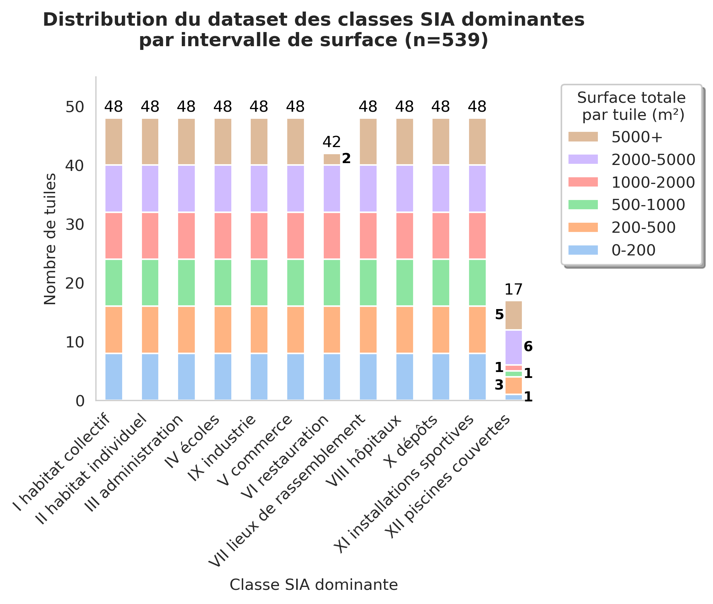
<figcaption>Sélection de l’échantillon pour le dataset</figcaption>
</figure>

L’échantillonnage stratifié permet de sélectionner de manière aléatoire les individus qui formeront les différents sous-groupes selon chaque combinaison classe <a href="../glossary.html#gloss-sia"><span data-acronym-label="sia" data-acronym-form="singular+short">sia</span></a> / intervalle de surface. La Figure [3.21](#fig:ch3_selection_donnees_04_selection_map_sia){reference-type="ref" reference="fig:ch3_selection_donnees_04_selection_map_sia"} confirme que l’échantillon inclut des tuiles réparties sur l’ensemble du canton, garantissant une bonne représentation de toutes les spécificités architecturales.

<figure id="fig:ch3_selection_donnees_04_selection_map_sia" data-latex-placement="H">
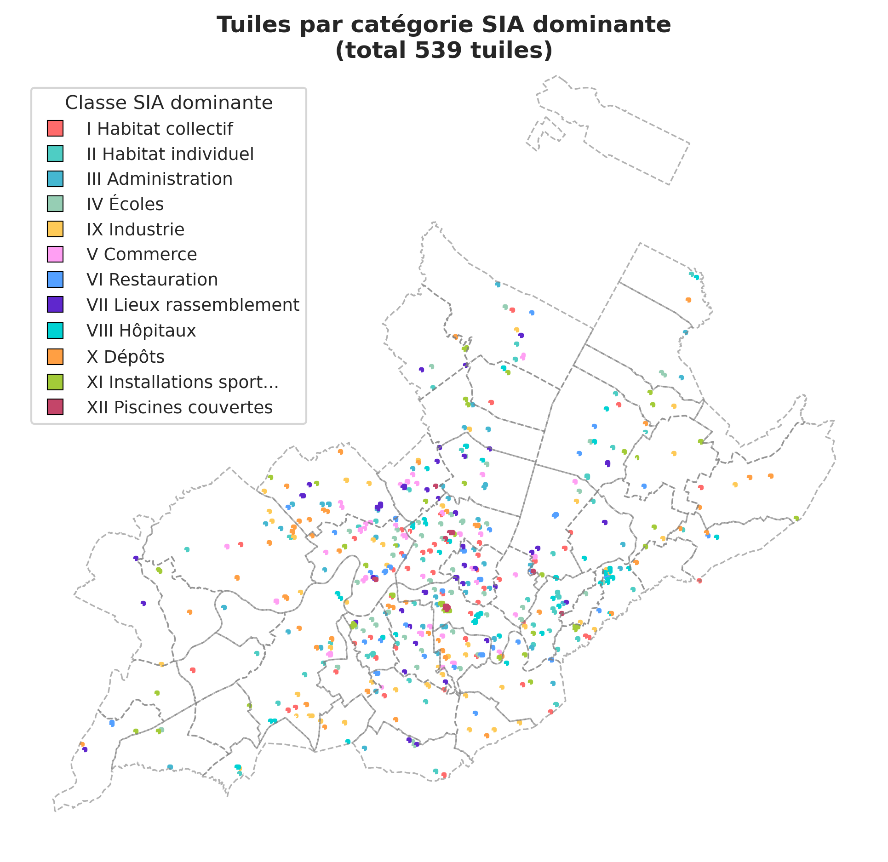
<figcaption>Échantillon sélectionné de 539 tuiles par catégorie <a href="../glossary.html#gloss-sia"><span data-acronym-label="sia" data-acronym-form="singular+short">sia</span></a></figcaption>
</figure>

#### Labellisation {#labellisation-1}

La labellisation (ou annotation) des données consiste à délimiter et classifier les zones d’intérêt sur chaque image. Ce processus permet à l’algorithme d’apprentissage supervisé d’identifier les caractéristiques visuelles spécifiques de chaque classe, lui permettant ensuite de reconnaître et segmenter ces mêmes éléments sur de nouvelles images.

Dans le cadre de cette étude, une seule classe sera définie pour identifier les espaces libres sur les toitures.

##### Outils d’annotation {#outils-dannotation}

La labellisation exige des outils spécialisés pour optimiser le processus, particulièrement pour la segmentation sémantique. Ce type d’annotation nécessite la création de polygones délimitant précisément les zones d’intérêt, ce qui implique souvent des formes géométriques complexes et irrégulières. L’intégration d’algorithmes de segmentation d’instance tels que <a href="../glossary.html#gloss-sam"><span data-acronym-label="sam" data-acronym-form="singular+abbrv">sam</span></a> constitue une aide précieuse pour automatiser la sélection et la délimitation des zones à annoter.

Le choix d’un outil approprié représente un défi important, gagner du temps dans chaque annotation devient critique quand il y a 539 images à annoter. Plusieurs solutions ont été évaluées :

- Label Studio &#91;[80](../bibliography.md#ref-label_studio_open_nodate)&#93;

- Roboflow &#91;[57](../bibliography.md#ref-roboflow_roboflow_nodate)&#93;

- Supervisely &#91;[81](../bibliography.md#ref-supervisely_supervisely_nodate)&#93;

Label Studio &#91;[80](../bibliography.md#ref-label_studio_open_nodate)&#93;, disponible depuis 2019, offre la possibilité d’intégrer des algorithmes de machine learning pour assister le processus d’annotation. Il s’agit d’une librairie Python permettant de gérer les annotations dans une base de données locale via une interface web. Cet outil n’a pas été retenu car l’utilisation d’aides à l’annotation tels que <a href="../glossary.html#gloss-sam"><span data-acronym-label="sam" data-acronym-form="singular+abbrv">sam</span></a> &#91;[82](../bibliography.md#ref-label_studio_label_nodate)&#93; est complexe à configurer dans la version gratuite, cette fonctionnalité étant principalement accessible via leur offre commerciale.

Le deuxième outil évalué est Roboflow &#91;[57](../bibliography.md#ref-roboflow_roboflow_nodate)&#93;, une plateforme web qui propose gratuitement l’annotation assistée par <a href="../glossary.html#gloss-sam"><span data-acronym-label="sam" data-acronym-form="singular+abbrv">sam</span></a>. L’un de ses principaux avantages est la possibilité d’entraîner un modèle de machine learning sur les premières images annotées, pour ensuite annoter automatiquement le reste du dataset. La version gratuite inclut l’accès à la plupart des fonctionnalités et offre quelques crédits pour l’annotation automatique.

Cet outil a été utilisé pour créer un dataset de 45 images dans le cadre d’une des pistes explorées dans la sous-section (voir page ). L’interface utilisateur est assez intuitive et ergonomique.

<figure id="fig:ch3_labellisation_01_outils_01_robolfow" data-latex-placement="H">
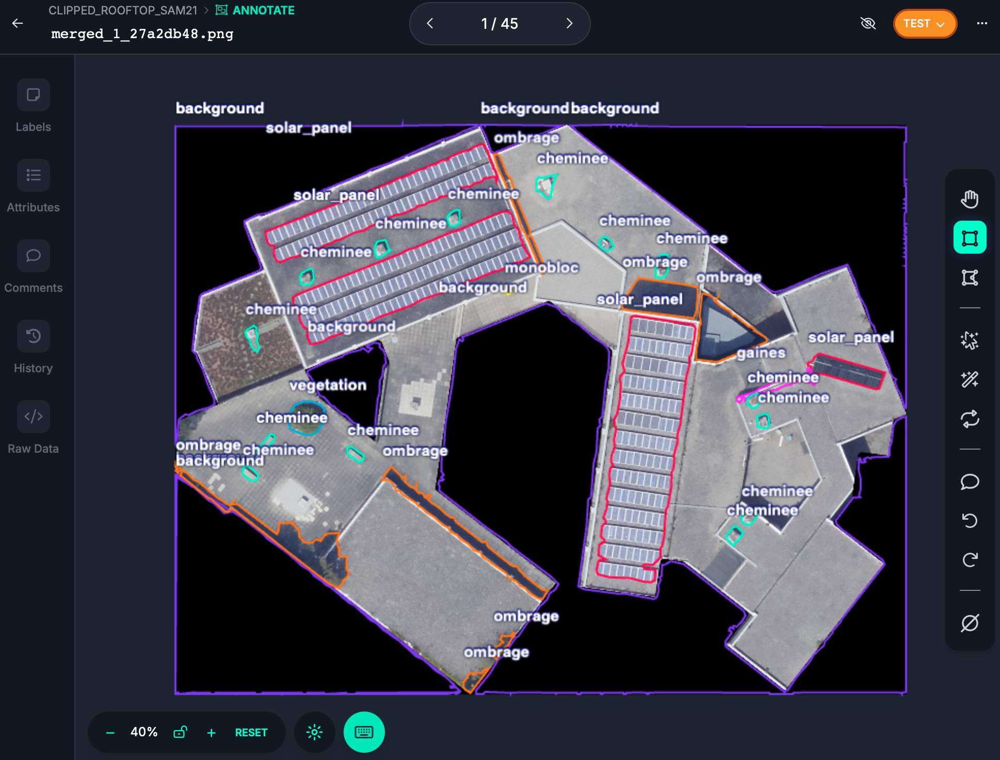
<figcaption>Interface Roboflow</figcaption>
</figure>

Malgré que Roboflow a tous les outils nécessaires pour effectuer des annotations rapides, <a href="../glossary.html#gloss-sam"><span data-acronym-label="sam" data-acronym-form="singular+abbrv">sam</span></a> (Figure [3.23](#fig:ch3_labellisation_01_outils_02_robolfow_sam){reference-type="ref" reference="fig:ch3_labellisation_01_outils_02_robolfow_sam"}) présente certaines limitations et ne permet qu’une sélection simplifiée des zones à annoter. Dans le contexte spécifique des toitures, cette approche nécessite de nombreux clics pour obtenir une annotation correspondant précisément à la zone souhaitée.

<figure id="fig:ch3_labellisation_01_outils_02_robolfow_sam" data-latex-placement="H">
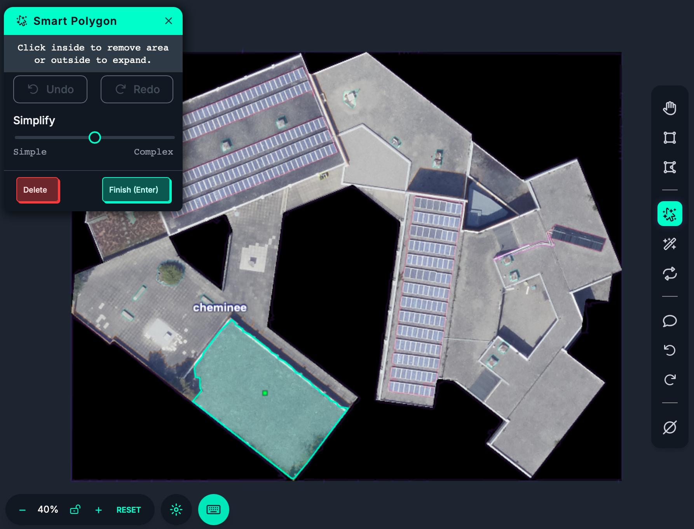
<figcaption>Exemple d’annotation avec <a href="../glossary.html#gloss-sam"><span data-acronym-label="sam" data-acronym-form="singular+abbrv">sam</span></a> dans Roboflow</figcaption>
</figure>

Si l’objectif porte sur une zone clairement délimitée, <a href="../glossary.html#gloss-sam"><span data-acronym-label="sam" data-acronym-form="singular+abbrv">sam</span></a> est suffisant. En revanche, dans des situations complexes présentant des zones d’ombrage ou des variations de contraste importantes, le processus d’annotation devient considérablement plus laborieux et chronophage.

Le troisième outil évalué, Supervisely, propose d’intégrer, en complément de SAM2, l’algorithme ClickSEG &#91;[83](../bibliography.md#ref-chen_conditional_2021)&#93; &#91;[84](../bibliography.md#ref-chen_focalclick_2022)&#93; (Figure [3.24](#fig:ch3_labellisation_01_outils_03_supervisely_modeles){reference-type="ref" reference="fig:ch3_labellisation_01_outils_03_supervisely_modeles"}). Supervisely offre la possibilité d’encadrer la zone d’intérêt (Figure [3.25](#fig:ch3_labellisation_01_outils_04_supervisely_segmentation){reference-type="ref" reference="fig:ch3_labellisation_01_outils_04_supervisely_segmentation"}) pour ensuite la segmenter automatiquement. Cette approche permet de sélectionner une toiture dans son ensemble puis de retirer les parties occupées.

En pratique, les propositions de segmentation générées par ClickSEG se sont révélées significativement plus précises et pertinentes que celles produites par SAM2.

Supervisely a été retenu comme outil de labellisation car il permet d’annoter les images avec plus de précision et rapidité que avec Roboflow. Cependant, après avoir annoté quelques images, certaines limitations sont apparues, chaque annotation génère des requêtes à leurs serveurs, et le nombre de requêtes autorisé dans la version gratuite limite l’annotation à quelques images par heure.

La version payante ne présente pas cette restriction et a été jugée pertinente à cause du gain de temps considérable qu’elle apporte. Le processus complet de labellisation s’est étalé sur environ un mois et demi, représentant environ 30 heures par semaine.

<figure id="fig:ch3_labellisation_01_outils_03_supervisely_modeles" data-latex-placement="H">
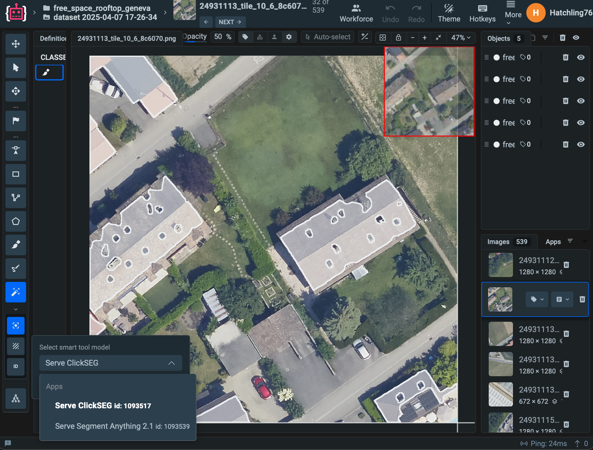
<figcaption>Modèles de segmentation disponibles dans Supervisely</figcaption>
</figure>

<figure id="fig:ch3_labellisation_01_outils_04_supervisely_segmentation" data-latex-placement="H">
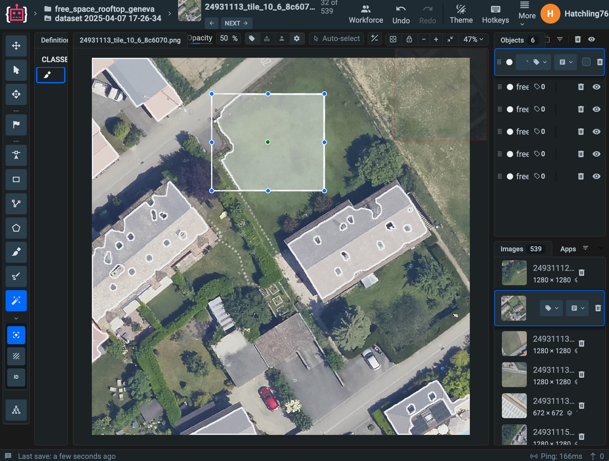
<figcaption>Labellisation avec segmentation dans Supervisely</figcaption>
</figure>

##### Critères d’annotation {#critères-dannotation}

L’annotation d’images exige de fixer certains critères pour garantir la qualité. Les éléments suivants sont considérés comme des obstacles sur les toitures:

- Balcons et terrasses praticables

- Toitures végétalisées

- Fenêtres (Velux), verrières et puits de lumière

- Lucarnes

- Cheminées, turbinettes, monoblocs, gaines

- Antennes (TV, satellite, téléphonie, ...)

- Acrotères

- Panneaux solaires (photovoltaïque et thermique)

- Constructions métalliques (support de publicité)

Le premier exemple est une toiture plate (Figure [3.28](#fig:labellisation_acrotere_exemple){reference-type="ref" reference="fig:labellisation_acrotere_exemple"}). Les éléments considérés comme obstacles sont les gaines de ventilation, les acrotères ainsi que la structure métallique. Le reste est labellisé comme toiture libre (couleur violette sur la Figure [3.27](#fig:ch3_labellisation_02_exemples_01_acrotere2){reference-type="ref" reference="fig:ch3_labellisation_02_exemples_01_acrotere2"}). Cette zone correspond à l’espace effectivement disponible sur la toiture, une fois tous les obstacles identifiés et délimités.

<figure id="fig:labellisation_acrotere_exemple" data-latex-placement="H">
<figure id="fig:ch3_labellisation_02_exemples_01_acrotere1">
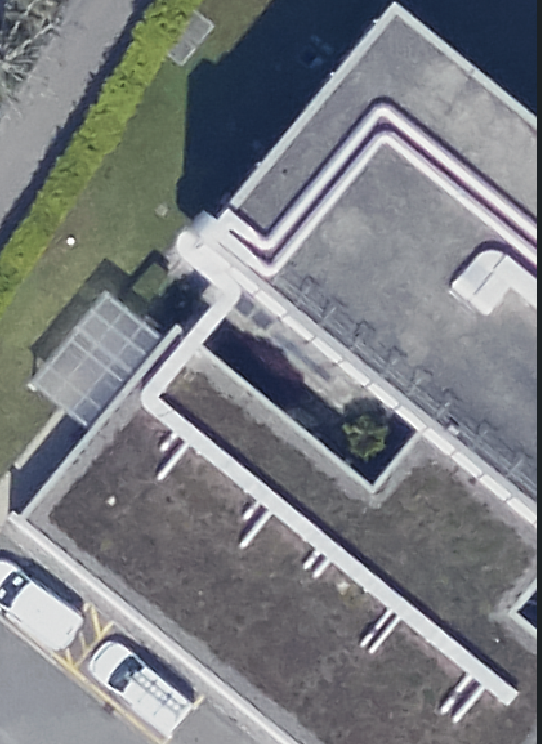
<figcaption>Original</figcaption>
</figure>
<figure id="fig:ch3_labellisation_02_exemples_01_acrotere2">
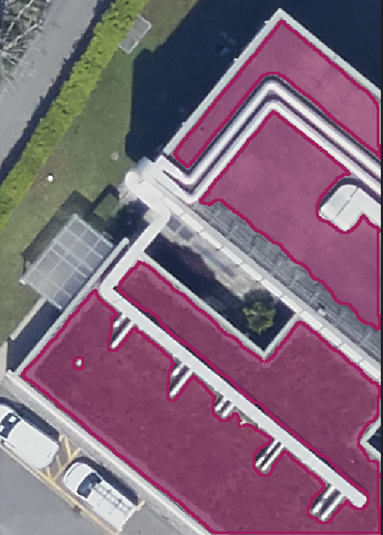
<figcaption>Labellisation</figcaption>
</figure>
<figcaption>Exemple de labellisation 1</figcaption>
</figure>

Le deuxième exemple (Figure [3.31](#fig:labellisation_lucarne_exemple){reference-type="ref" reference="fig:labellisation_lucarne_exemple"}) représente une toiture comportant des lucarnes. La zone considérée comme libre est représentée en vert sur la Figure [3.30](#fig:ch3_labellisation_02_exemples_02_lucarne2){reference-type="ref" reference="fig:ch3_labellisation_02_exemples_02_lucarne2"}. Cette délimitation exclut les lucarnes, la zone périphérique proche du bord de toiture, les équipements techniques (antennes, éléments de ventilation) ainsi que la partie arrondie visible côté nord de la toiture.

<figure id="fig:labellisation_lucarne_exemple" data-latex-placement="H">
<figure id="fig:ch3_labellisation_02_exemples_02_lucarne1">
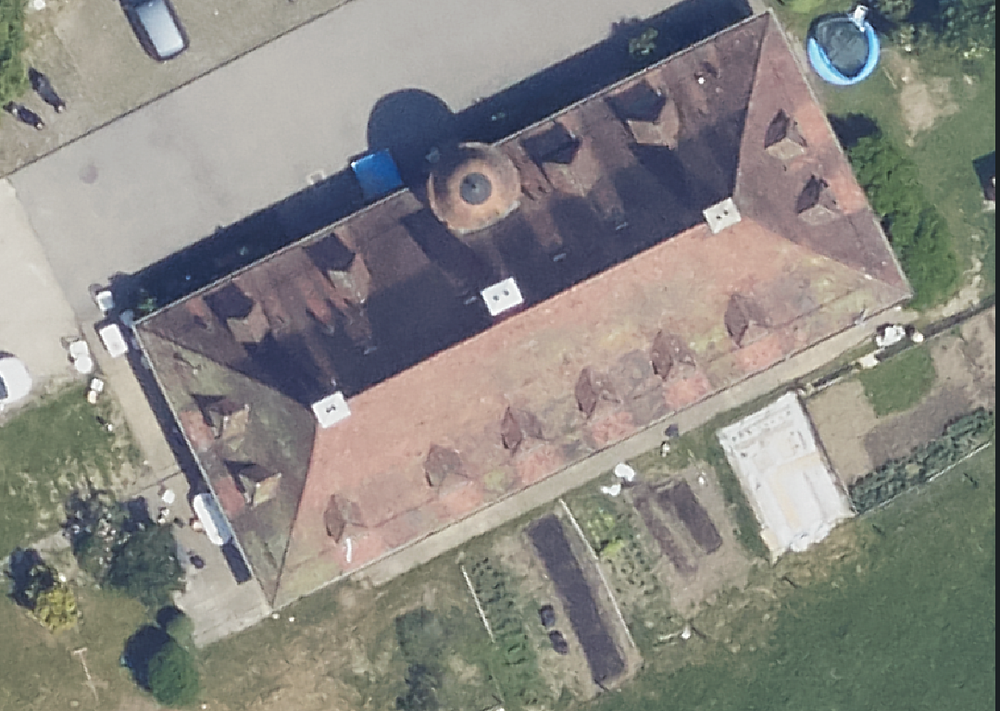
<figcaption>Original</figcaption>
</figure>
<figure id="fig:ch3_labellisation_02_exemples_02_lucarne2">
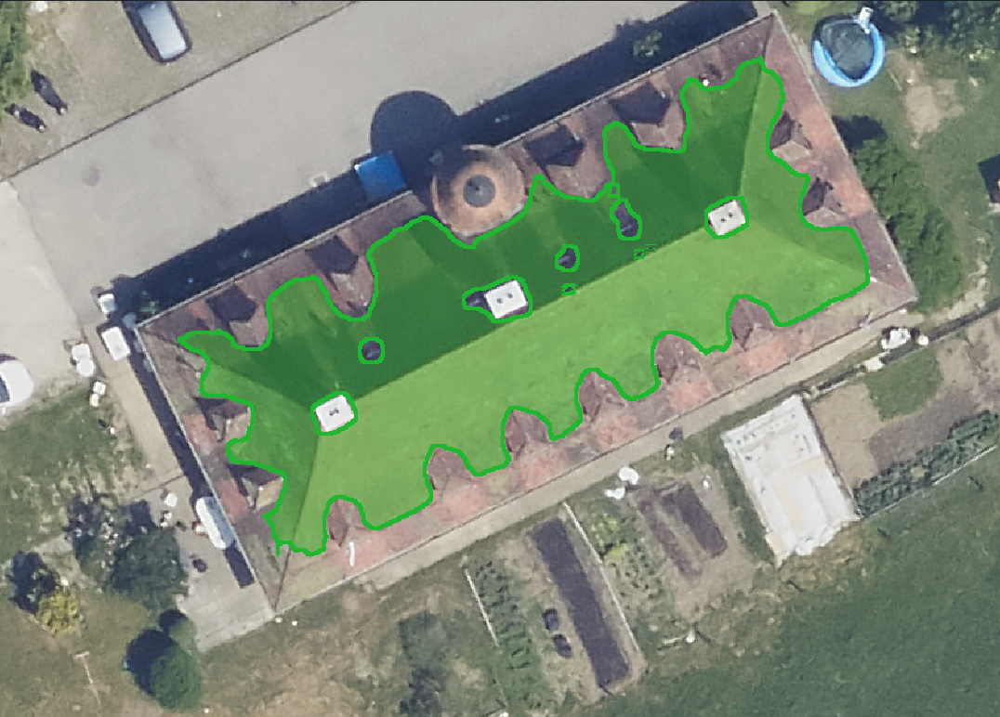
<figcaption>Labellisation</figcaption>
</figure>
<figcaption>Exemple de labellisation 2</figcaption>
</figure>

L’exemple suivant (Figure [3.34](#fig:labellisation_solaire_exemple){reference-type="ref" reference="fig:labellisation_solaire_exemple"}) représente une toiture avec des panneaux solaires existants. Les panneaux solaires, les espaces entre panneaux et les puits de lumière sont considérés comme des obstacles. Cependant, s’il y a de grands espaces entre les puits de lumière et les panneaux, ceux-ci sont considérés comme libres (couleur violette dans la Figure [3.33](#fig:ch3_labellisation_02_exemples_03_solaire2){reference-type="ref" reference="fig:ch3_labellisation_02_exemples_03_solaire2"}).

<figure id="fig:labellisation_solaire_exemple" data-latex-placement="H">
<figure id="fig:ch3_labellisation_02_exemples_03_solaire1">
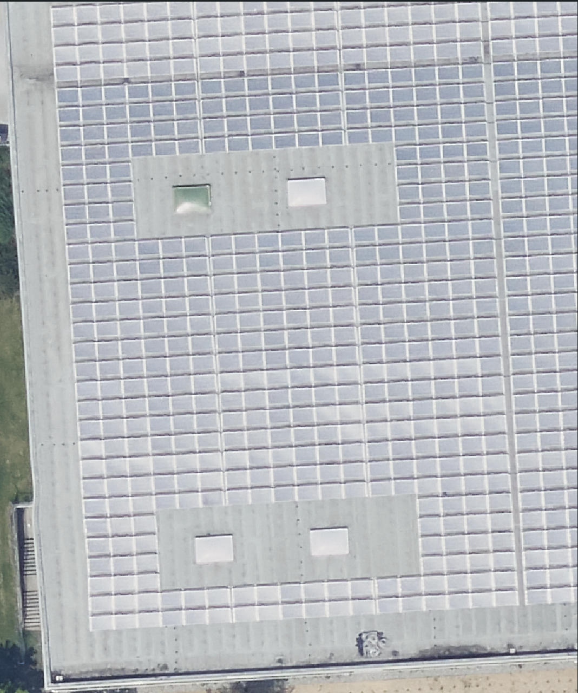
<figcaption>Original</figcaption>
</figure>
<figure id="fig:ch3_labellisation_02_exemples_03_solaire2">
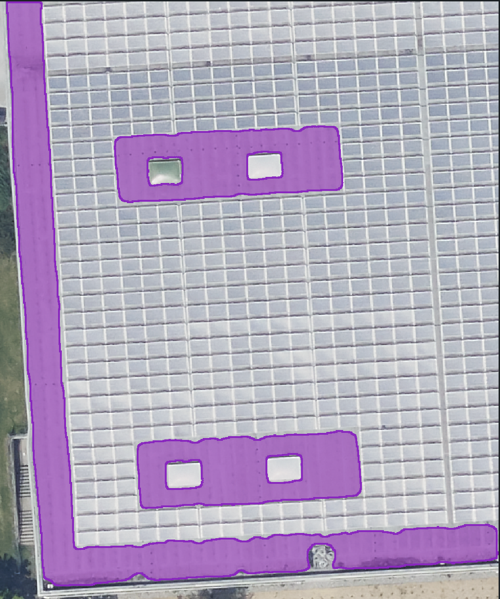
<figcaption>Labellisation</figcaption>
</figure>
<figcaption>Exemple de labellisation 3</figcaption>
</figure>

Le dataset inclut également des images qui contiennent une toiture selon la couche <a href="../glossary.html#gloss-sitg"><span data-acronym-label="sitg" data-acronym-form="singular+abbrv">sitg</span></a> des toitures mais où il n’y a pas de surface libre. Dans la Figure [3.35](#fig:ch3_labellisation_02_exemples_04_image_non_annotee){reference-type="ref" reference="fig:ch3_labellisation_02_exemples_04_image_non_annotee"}, un bâtiment est bien présent dans la zone nord-est de l’image, mais celui-ci semble être une serre vitrée. Bien qu’il soit possible d’installer des panneaux solaires semi-translucides sur ce type de toiture, celle-ci a été exclue pour éviter la confusion avec les puits de lumière, car il y a beaucoup plus de puits de lumière vitrés que de serres translucides.

L’ajout de ce type d’exemples sans toiture exploitable devrait permettre à l’algorithme de mieux comprendre les caractéristiques recherchées dans un espace libre. Cette approche pourrait également éviter que l’algorithme considère automatiquement toutes les surfaces comme libres, ce qui l’aiderait à développer une capacité de discrimination plus fine entre les espaces réellement disponibles et ceux qui ne le sont pas.

<figure id="fig:ch3_labellisation_02_exemples_04_image_non_annotee" data-latex-placement="H">
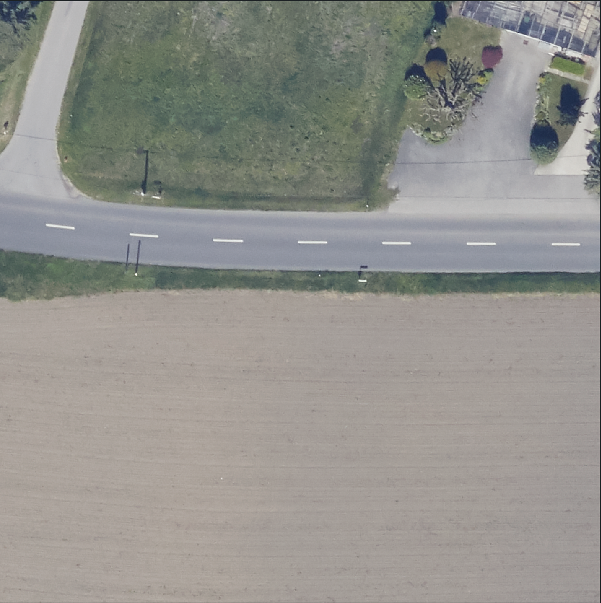
<figcaption>Exemple d’image sans aucune surface libre disponible</figcaption>
</figure>

##### Résultat {#résultat}

Le dataset obtenu consiste en 539 images accompagnées de leur masque d’annotation binaire. Le masque correspond à une image de la même taille que l’image originale, où chaque pixel prend une valeur de 1 si la toiture est libre à cet endroit, ou une valeur de 0 si cette zone correspond à un obstacle ou une surface non exploitable. Cette représentation binaire permet à l’algorithme d’apprentissage de distinguer clairement les espaces disponibles des zones occupées.

Pour des raisons de taille d’image, les images utilisées lors de l’annotation dans Supervisely sont des PNG comprimés (environ 2 Mo chacune). Une fois l’annotation finalisée, ces images sont remplacées par les fichiers originaux en format GeoTIFF (environ 5 Mo chacun) afin de préserver toutes les informations géographiques nécessaires ainsi que la qualité originale des images. Le dataset complet occupe ainsi un espace d’environ 4,4 Go en incluant tous les fichiers auxiliaires.

Supervisely propose également d’autres formats d’annotation que les masques binaires. L’outil offre notamment les formats YOLOv8, COCO, PASCAL VOC ainsi que leur propre format propriétaire.

#### Post-traitement des données annotées {#post-traitement-des-données-annotées}

Les données annotées doivent être traitées puis réparties en datasets d’entraînement, de validation et de test. Cette étape constitue une phase cruciale qui détermine la qualité de l’apprentissage du modèle et sa capacité de généralisation. La Figure [3.36](#fig:ch3_postprocessing_dataset_03_overview){reference-type="ref" reference="fig:ch3_postprocessing_dataset_03_overview"} décrit les principales phases.

<figure id="fig:ch3_postprocessing_dataset_03_overview" data-latex-placement="H">
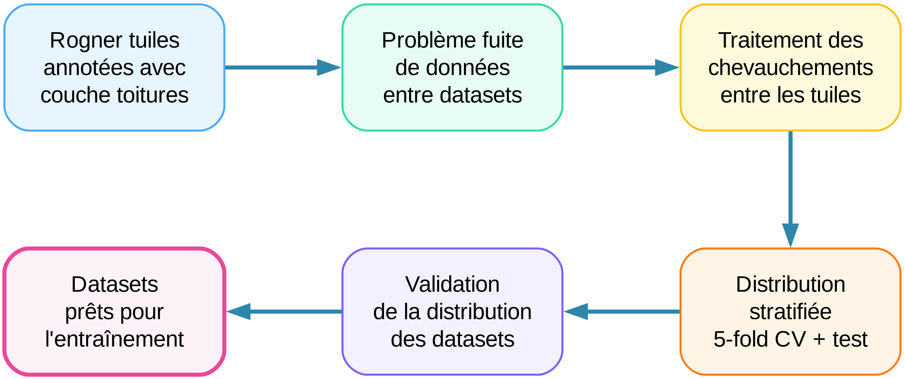
<figcaption>Principales étapes du post-traitement</figcaption>
</figure>

##### Rognage des images {#rognage-des-images}

Les données ont été annotées sur l’intégralité de l’image pour des raisons pratiques (Figure [3.37](#fig:ch3_postprocessing_dataset_01_exemple_dataset){reference-type="ref" reference="fig:ch3_postprocessing_dataset_01_exemple_dataset"}), mais il semble pertinent de retirer les zones situées en dehors des toitures (Figure [3.38](#fig:ch3_postprocessing_dataset_02_exemple_postraitement){reference-type="ref" reference="fig:ch3_postprocessing_dataset_02_exemple_postraitement"}). Cette approche permettra au modèle de se centrer spécifiquement sur les toitures, plutôt que d’apprendre à distinguer des éléments comme des voitures ou d’autres objets présents dans l’environnement urbain.

<figure id="fig:exemple_post_traitement_dataset" data-latex-placement="H">
<figure id="fig:ch3_postprocessing_dataset_01_exemple_dataset">
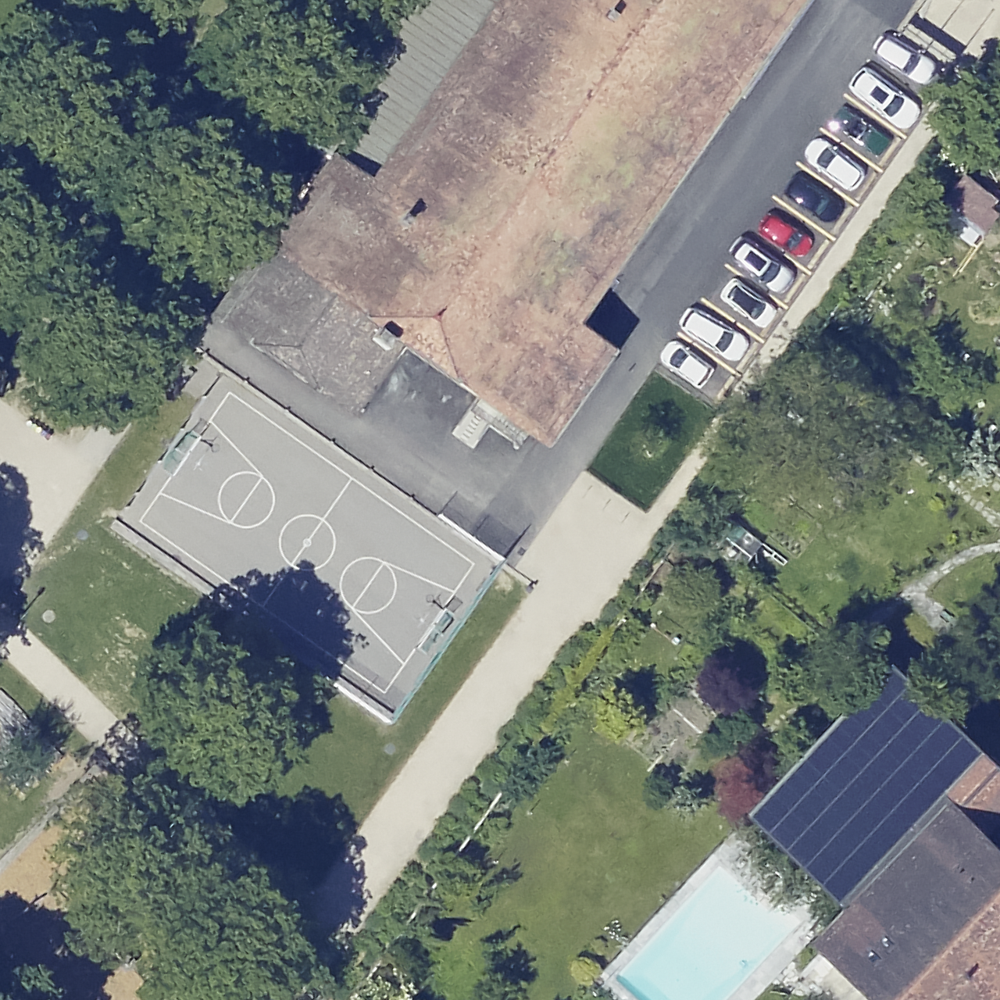
<figcaption>Tuile d’exemple</figcaption>
</figure>
<figure id="fig:ch3_postprocessing_dataset_02_exemple_postraitement">
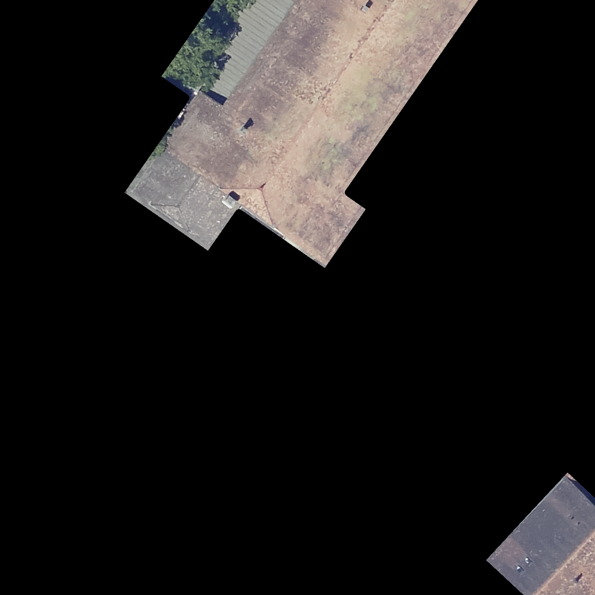
<figcaption>Tuile d’exemple après post-traitement</figcaption>
</figure>
<figcaption>Exemple de post-traitement</figcaption>
</figure>

Les images étant au format GeoTIFF, il suffit de définir à 0 (noir) toutes les zones qui n’intersectent pas avec la couche <a href="../glossary.html#gloss-sitg"><span data-acronym-label="sitg" data-acronym-form="singular+abbrv">sitg</span></a> des toitures “CAD\_BATIMENTS\_HORSOL\_TOIT”. Lors de l’annotation, il n’est pas toujours évident de distinguer une toiture d’un couvert, ce qui peut conduire à identifier des zones libres en dehors de la couche des toitures. L’opération de rognage est donc également appliquée aux annotations correspondantes, évitant ainsi que le modèle considère à tort qu’une zone masquée (pixels à 0) puisse correspondre à une toiture libre.

##### Fuite de données entre datasets {#fuite-de-données-entre-datasets}

Les tuiles présentent un recouvrement de 256 pixels qui peut causer des problèmes s’il n’est pas géré correctement. La Figure [3.40](#fig:ch3_postprocessing_dataset_04_data_leakage){reference-type="ref" reference="fig:ch3_postprocessing_dataset_04_data_leakage"} illustre cette problématique avec 3 datasets destinés à l’entraînement d’un modèle. Si les tuiles sont assignées de manière aléatoire aux différents datasets, il existe un risque que le dataset d’entraînement contienne une partie de toiture également présente dans le dataset de test. Cette situation compromet l’évaluation des performances du modèle, puisque celui-ci aura déjà été exposé à certaines zones lors de la phase d’apprentissage, faussant ainsi les résultats obtenus sur des données supposées inconnues.

<figure id="fig:ch3_postprocessing_dataset_04_data_leakage" data-latex-placement="H">
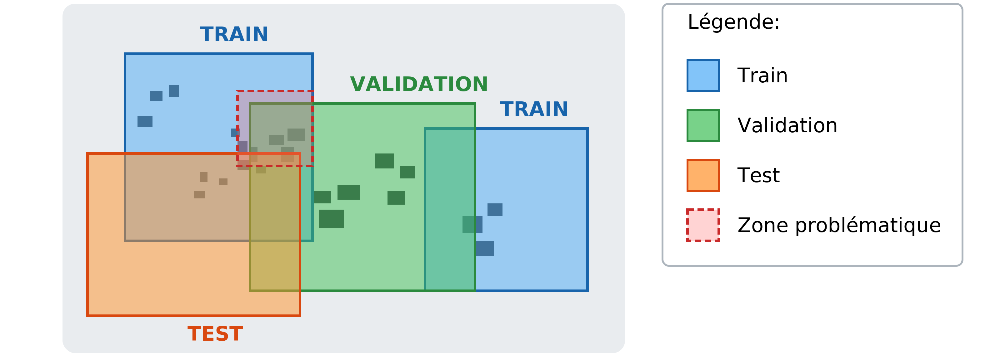
<figcaption>Fuite de données entre datasets</figcaption>
</figure>

Cette fuite de données entre datasets peut également se produire entre le dataset d’entraînement et celui de validation, ce qui conduirait le modèle à apprendre par cœur l’emplacement des toitures libres au lieu de comprendre les caractéristiques visuelles nécessaires pour identifier une toiture libre. Le modèle développerait alors une capacité de mémorisation plutôt qu’une réelle capacité de généralisation, compromettant ses performances sur de nouvelles données.

##### Traitement des chevauchements entre tuiles {#traitement-des-chevauchements-entre-tuiles}

Une des manières de résoudre le problème des fuites de données consiste en un masquage sélectif d’une des tuiles en cas de recouvrement. La Figure [3.41](#fig:ch3_postprocessing_dataset_05_traitement_chevauchement){reference-type="ref" reference="fig:ch3_postprocessing_dataset_05_traitement_chevauchement"} illustre ce processus en trois phases distinctes.

<figure id="fig:ch3_postprocessing_dataset_05_traitement_chevauchement" data-latex-placement="H">
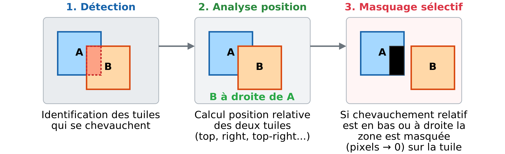
<figcaption>Traitement des chevauchements entre tuiles</figcaption>
</figure>

La première étape consiste à identifier les paires de tuiles qui se chevauchent géographiquement. La deuxième phase calcule leur position relative pour déterminer précisément les zones de recouvrement. Enfin, la troisième étape procède au masquage d’une partie spécifique dans l’une des tuiles concernées, éliminant ainsi la redondance d’information entre les datasets.

La première étape est réalisée par la fonction `find_overlapping_tiles` (Code [&#91;code:post\_traitement\_detection\_tuile\_chevauchement&#93;](#code:post_traitement_detection_tuile_chevauchement){reference-type="ref" reference="code:post_traitement_detection_tuile_chevauchement"}) qui permet d’identifier les paires de tuiles se chevauchent.

```python
    def find_overlapping_tiles(gdf, min_overlap_area=1.0):
        """
        Simple function to find overlapping tiles using spatial index.
        Returns a list of overlapping tile pairs.
        """
        overlaps = []
        n = len(gdf)
        
        # Create spatial index for fast lookups
        sindex = gdf.sindex
        
        # Check each tile against potential neighbors
        for i in range(n):
            geom1 = gdf.iloc[i]['geometry']
            tile_id1 = gdf.iloc[i]['tile_id']
            
            # Find potential overlapping tiles using bounding box
            bbox = geom1.bounds  # Get bounding box coordinates
            potential_matches = list(sindex.intersection(bbox))
            
            # Remove self-match and only check tiles with higher index
            potential_matches = [j for j in potential_matches if j > i]
            
            # Check each potential match
            for j in potential_matches:
                geom2 = gdf.iloc[j]['geometry']
                tile_id2 = gdf.iloc[j]['tile_id']
                
                # Check if geometries actually intersect
                if geom1.intersects(geom2):
                    
                    # Calculate overlap area
                    intersection = geom1.intersection(geom2)
                    overlap_area = intersection.area
                    
                    # Only keep overlaps above minimum threshold
                    if overlap_area > min_overlap_area:
                        
                        # Calculate overlap percentages
                        overlap_pct1 = (overlap_area / geom1.area) * 100
                        overlap_pct2 = (overlap_area / geom2.area) * 100
                        
                        # Store overlap information
                        overlaps.append({
                            'tile_id1': tile_id1,
                            'tile_id2': tile_id2,
                            'overlap_area': overlap_area,
                            'overlap_percentage_1': overlap_pct1,
                            'overlap_percentage_2': overlap_pct2
                        })
        
        return overlaps
```

<span id="code:post_traitement_detection_tuile_chevauchement"></span>

<p class="thesis-caption"><em>Code 7 — Détection des tuiles qui se chevauchent</em></p>

La fonction commence par créer un index spatial pour optimiser les performances de recherche. Elle divise l’espace géographique en zones hiérarchiques (rectangles englobants) et référence les géométries présentes dans chaque zone. Cette structure permet d’éviter de comparer chaque géométrie avec l’ensemble des autres lors d’opérations spatiales, réduisant considérablement le nombre de calculs nécessaires et améliorant ainsi les performances de l’algorithme.

Pour chaque tuile, la fonction identifie ensuite les candidates potentielles en utilisant les boîtes englobantes, puis vérifie si une intersection géométrique réelle existe entre elles. Lorsqu’un recouvrement est détecté et dépasse le seuil minimal défini, elle calcule la surface d’intersection ainsi que les pourcentages de recouvrement pour chacune des deux tuiles concernées. Ces informations sont finalement stockées dans un dictionnaire Python.

La deuxième étape est réalisée par la fonction `determine_relative_position` (Code [&#91;code:post\_traitement\_position\_relative\_tuiles&#93;](#code:post_traitement_position_relative_tuiles){reference-type="ref" reference="code:post_traitement_position_relative_tuiles"}) qui traite les paires de tuiles identifiées lors de l’étape précédente. Cette fonction calcule les centroïdes des deux tuiles concernées et détermine leur position relative l’une par rapport à l’autre. Cette information de positionnement sera ensuite utilisée pour décider quelle zone masquer lors du traitement des recouvrements.

```python
    def determine_relative_position(geom1, geom2):
        """
        Determine where geom1 is located relative to geom2.
        Returns: 'top', 'bottom', 'left', 'right', 'top-left', etc.
        """
        
        # Get the center points of both geometries
        center_x1, center_y1 = geom1.centroid.x, geom1.centroid.y
        center_x2, center_y2 = geom2.centroid.x, geom2.centroid.y
        
        # Compare vertical positions
        if center_y1 > center_y2:
            vertical = "top"
        elif center_y1 < center_y2:
            vertical = "bottom"
        else:
            vertical = None
        
        # Compare horizontal positions
        if center_x1 > center_x2:
            horizontal = "right"
        elif center_x1 < center_x2:
            horizontal = "left"
        else:
            horizontal = None
        
        # Combine results
        if vertical and horizontal:
            return f"{vertical}-{horizontal}"
        elif vertical:
            return vertical
        elif horizontal:
            return horizontal
        else:
            return "center"
    
```

<span id="code:post_traitement_position_relative_tuiles"></span>

<p class="thesis-caption"><em>Code 8 — Position relative des tuiles</em></p>

Finalement, la fonction `remove_overlaps` (Code [&#91;code:post\_traitement\_masquage\_selectif&#93;](#code:post_traitement_masquage_selectif){reference-type="ref" reference="code:post_traitement_masquage_selectif"}) applique un masquage sélectif aux tuiles qui se chevauchent, en ciblant spécifiquement celles situées à droite ou en bas selon leur position relative déterminée à l’étape précédente. Cette approche systématique garantit l’élimination des redondances tout en conservant l’intégrité des données dans chaque dataset.

```python
    def remove_overlaps(overlap_df, gdf_dataset, remove_positions=['right', 'bottom']):
        """
        Remove overlaps by setting overlapping pixels to 0.
        
        Args:
            overlap_df: DataFrame with overlap information
            gdf_dataset: GeoDataFrame with file paths and geometries
            remove_positions: List of positions to remove (e.g., ['right', 'bottom'])
                             Default removes right and bottom tiles
        """
        
        for idx, row in overlap_df.iterrows():
            
            # Get the two overlapping files and geometries
            file1 = gdf_dataset.iloc[row['index1']]['processed_img_path_tif']
            file2 = gdf_dataset.iloc[row['index2']]['processed_img_path_tif'] 
            geom1 = gdf_dataset.iloc[row['index1']]['geometry']
            geom2 = gdf_dataset.iloc[row['index2']]['geometry']
            
            # Decide which file to modify based on position and preferences
            position = row['relative_position']
            
            # Check if any component of the position should be removed
            should_remove_geom1 = any(pos in position for pos in remove_positions)
            
            if should_remove_geom1:
                file_to_modify = file1    # Remove from geom1 (the positioned tile)
                modify_geom = geom1
            else:
                file_to_modify = file2    # Remove from geom2 (the reference tile)
                modify_geom = geom2
                
            intersection = geom1.intersection(geom2)
            
            # Open GeoTIFF and set overlapping pixels to 0
            with rasterio.open(file_to_modify, 'r+') as src:
                
                # Convert geographic intersection to pixel coordinates
                minx, miny, maxx, maxy = intersection.bounds
                window = from_bounds(minx, miny, maxx, maxy, src.transform)
                
                # Get pixel indices
                col_start = int(window.col_off)
                row_start = int(window.row_off) 
                col_end = col_start + int(window.width)
                row_end = row_start + int(window.height)
                
                # Set pixels to 0 for all bands
                for band in range(1, src.count + 1):
                    data = src.read(band)
                    data[row_start:row_end, col_start:col_end] = 0
                    src.write(data, band)
```

<span id="code:post_traitement_masquage_selectif"></span>

<p class="thesis-caption"><em>Code 9 — Masquage sélectif</em></p>

##### Distribution stratifiées pour validation croisée {#distribution-stratifiées-pour-validation-croisée}

La segmentation sémantique nécessite de grandes quantités de données annotées. Pour exploiter au mieux celles qui sont disponibles, il convient d’aller au-delà de la répartition classique entre entraînement, validation et test. L’approche traditionnelle implique que seul le dataset d’entraînement est utilisé pour former le modèle, le dataset de validation servant à évaluer les performances pendant l’entraînement, tandis que le dataset de test n’est jamais exploité durant cette phase et reste réservé à l’évaluation finale une fois l’entraînement terminé.

Une alternative plus complexe à mettre en place consiste à utiliser une validation croisée (Figure [3.42](#fig:ch3_postprocessing_dataset_06_kfold){reference-type="ref" reference="fig:ch3_postprocessing_dataset_06_kfold"}). Cette méthode permet de diviser les données annotées en une partie d’entraînement constituée de 5 ensembles de données (“folds”) et un dataset de test distinct. L’avantage de cette approche réside dans le fait que chaque fold sert alternativement de dataset de validation. Ainsi, lors du premier entraînement, les folds 0, 1, 2 et 3 constituent l’ensemble d’entraînement tandis que le fold 4 sert de validation. Lors de l’entraînement suivant, les folds 0, 1, 2 et 4 sont utilisés pour l’entraînement et le fold 3 devient le dataset de validation. Cette rotation se poursuit jusqu’à ce que chaque fold ait servi de validation. Le dataset de test demeure quant à lui exclusivement réservé à l’évaluation finale, une fois l’ensemble du processus d’entraînement terminé.

<figure id="fig:ch3_postprocessing_dataset_06_kfold" data-latex-placement="H">
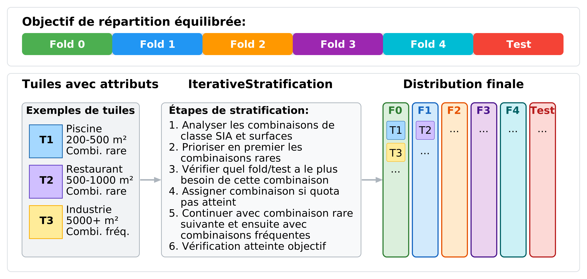
<figcaption>Répartition datasets</figcaption>
</figure>

Pour répartir les données annotées, il est nécessaire d’effectuer une stratification similaire à celle utilisée lors de la phase de sélection des données à annoter. Cette stratification analyse les combinaisons de classes <a href="../glossary.html#gloss-sia"><span data-acronym-label="sia" data-acronym-form="singular+short">sia</span></a> et d’intervalles de surface présentes dans le dataset. Les combinaisons les plus rares sont distribuées en priorité dans les différents ensembles, puis les combinaisons plus fréquentes sont réparties selon le même principe. L’objectif est de garantir que tous les datasets conservent une représentation équilibrée et représentative du dataset original annoté.

La fonction `create_stratified_dataset_splits` (Code [&#91;code:post\_traitement\_stratification&#93;](#code:post_traitement_stratification){reference-type="ref" reference="code:post_traitement_stratification"}) permet de réaliser cette stratification.

```python
    def create_stratified_dataset_splits(df, test_size=0.2, n_folds=5, max_attempts=100):
        """Generate stratified dataset splits using dominant class and area bin."""
        from sklearn.preprocessing import LabelEncoder
        from iterstrat.ml_stratifiers import IterativeStratification
        
        best_result, best_score = None, float('inf')
        
        for attempt in range(max_attempts):
            # Encode categorical variables for stratification
            encoded_classes = LabelEncoder().fit_transform(df['dominant_class'])
            encoded_areas = LabelEncoder().fit_transform(df['area_bin'])
            stratification_labels = np.column_stack([encoded_classes, encoded_areas])
            # Create train/test split
            test_splitter = IterativeStratification(n_splits=int(1/test_size), order=2)
            train_indices, test_indices = list(test_splitter.split(df.values, stratification_labels))[0]
            # Initialize dataset assignments
            df_result = df.copy()
            df_result['dataset'] = n_folds  # Test set assignment
            # Create cross-validation splits from training data
            cv_splitter = IterativeStratification(n_splits=n_folds, order=2)
            cv_splits = list(cv_splitter.split(
                df_result.iloc[train_indices].values, 
                stratification_labels[train_indices]))
            # Assign CV fold numbers
            for fold_id, (_, validation_indices) in enumerate(cv_splits):
                original_indices = train_indices[validation_indices]
                df_result.loc[original_indices, 'dataset'] = fold_id
            # Calculate stratification quality metrics
            class_cv_scores = []
            for class_name in df_result['dominant_class'].unique():
                class_subset = df_result[df_result['dominant_class'] == class_name]
                fold_counts = class_subset['dataset'].value_counts()
                fold_percentages = fold_counts / len(class_subset)
                cv_score = fold_percentages.std() / fold_percentages.mean()
                class_cv_scores.append(cv_score)
            area_cv_scores = []
            for area_name in df_result['area_bin'].unique():
                area_subset = df_result[df_result['area_bin'] == area_name]
                fold_counts = area_subset['dataset'].value_counts()
                fold_percentages = fold_counts / len(area_subset)
                cv_score = fold_percentages.std() / fold_percentages.mean()
                area_cv_scores.append(cv_score)
            # Combined quality score (lower is better)
            combined_score = np.mean(class_cv_scores) + np.mean(area_cv_scores)
            # Update best result if current attempt is better
            if combined_score < best_score:
                best_score = combined_score
                best_result = df_result.copy()
        return best_result
```

<span id="code:post_traitement_stratification"></span>

<p class="thesis-caption"><em>Code 10 — Stratification pour la répartition des données annotées</em></p>

Cette fonction utilise une approche itérative pour optimiser la qualité de la stratification multicritères. L’algorithme `IterativeStratification` a l’avantage de pouvoir traiter simultanément plusieurs variables de stratification, contrairement aux méthodes classiques limitées à une seule variable catégorielle.

L’algorithme procède par allocation séquentielle des échantillons aux différents folds. À chaque itération, il sélectionne l’échantillon dont l’affectation permettra de minimiser le déséquilibre global entre les folds pour l’ensemble des variables de stratification. Cette approche garantit une distribution homogène des combinaisons de caractéristiques, même lorsque certaines combinaisons sont rares dans le dataset.

La fonction évalue la qualité de chaque tentative de stratification en calculant un score composite basé sur le coefficient de variation (CV) des distributions. Pour chaque classe dominante et chaque intervalle de surface, le coefficient de variation est défini comme :

$$\begin{equation}
    CV = \frac{\sigma(\text{pourcentages par fold})}{\mu(\text{pourcentages par fold})}
\end{equation}$$

où *σ* représente l’écart-type et *μ* la moyenne des pourcentages de répartition entre les folds.

Un coefficient proche de zéro indique une distribution parfaitement équilibrée, tandis qu’une valeur élevée révèle des déséquilibres importants. Le score de qualité global combine les coefficients de variation moyens pour les classes dominantes et les intervalles de surface, permettant d’identifier objectivement la répartition optimale parmi les multiples tentatives générées.

Le meilleur résultat (Code [&#91;code:post\_traitement\_stratification\_resultats&#93;](#code:post_traitement_stratification_resultats){reference-type="ref" reference="code:post_traitement_stratification_resultats"}) est obtenu à l’itération 84, malgré des essais avec plus de 10000 itérations.

```text
    Target: Class CV ≤ 0.050, Area CV ≤ 0.050
      Attempt 1: Class CV: 0.106, Area CV: 0.147
      Attempt 2: Class CV: 0.099, Area CV: 0.140
      Attempt 4: Class CV: 0.102, Area CV: 0.136
      Attempt 6: Class CV: 0.113, Area CV: 0.116
      Attempt 7: Class CV: 0.117, Area CV: 0.106
      Attempt 10: Class CV: 0.109, Area CV: 0.107
      Attempt 20: Class CV: 0.124, Area CV: 0.112
      Attempt 26: Class CV: 0.111, Area CV: 0.098
      Attempt 40: Class CV: 0.127, Area CV: 0.139
      Attempt 45: Class CV: 0.122, Area CV: 0.072
      Attempt 60: Class CV: 0.119, Area CV: 0.121
      Attempt 65: Class CV: 0.090, Area CV: 0.092
      Attempt 80: Class CV: 0.121, Area CV: 0.120
      Attempt 84: Class CV: 0.086, Area CV: 0.088
      Attempt 100: Class CV: 0.136, Area CV: 0.114
    Best result: Class CV: 0.086, Area CV: 0.088
    Final distribution:
    dataset
    0    88
    1    89
    2    89
    3    88
    4    87
    5    89
```

<span id="code:post_traitement_stratification_resultats"></span>

<p class="thesis-caption"><em>Code 11 — Résultats fonction `create_stratified_dataset_splits`</em></p>

##### Validation de la distribution des datasets {#validation-de-la-distribution-des-datasets}

La validation de la distribution des datasets (Figure [3.43](#fig:ch3_postprocessing_dataset_07_validation){reference-type="ref" reference="fig:ch3_postprocessing_dataset_07_validation"}) comprend trois étapes distinctes. La première consiste à vérifier les chevauchements entre tuiles pour s’assurer de l’absence de fuites de données. La deuxième étape consiste à vérifier que les images respectent le format attendu et sont correctement structurées pour l’entraînement du modèle. Enfin, la troisième vise à déterminer la répartition optimale des datasets selon les critères de stratification définis.

<figure id="fig:ch3_postprocessing_dataset_07_validation" data-latex-placement="H">
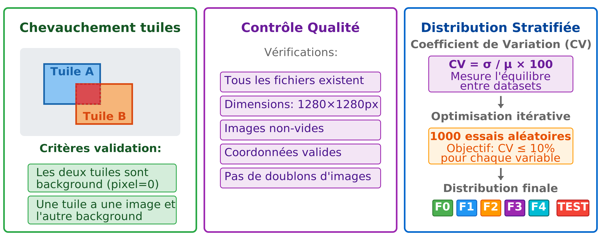
<figcaption>Validation de la distribution des datasets</figcaption>
</figure>

Le chevauchement des tuiles est vérifié après leur traitement. La Figure [3.48](#fig:exemple_post_traitement_validation_tuile_droite){reference-type="ref" reference="fig:exemple_post_traitement_validation_tuile_droite"} représente un cas où il y a un chevauchement à droite (Figure [3.44](#fig:ch3_postprocessing_dataset_08_validation_chevauchement_droite1){reference-type="ref" reference="fig:ch3_postprocessing_dataset_08_validation_chevauchement_droite1"}) avec une autre tuile (Figure [3.45](#fig:ch3_postprocessing_dataset_09_validation_chevauchement_droite2){reference-type="ref" reference="fig:ch3_postprocessing_dataset_09_validation_chevauchement_droite2"}). La première vérification consiste à compter le nombre de pixels non-nuls dans la zone de chevauchement à droite : ce pourcentage devrait être de 0%, indiquant que le masquage des images a été correctement appliqué. La deuxième vérification porte sur les annotations qui doivent être masquées exactement de la même manière que les images correspondantes. Les Figures [3.46](#fig:ch3_postprocessing_dataset_10_validation_chevauchement_droite3){reference-type="ref" reference="fig:ch3_postprocessing_dataset_10_validation_chevauchement_droite3"} et [3.47](#fig:ch3_postprocessing_dataset_11_validation_chevauchement_droite4){reference-type="ref" reference="fig:ch3_postprocessing_dataset_11_validation_chevauchement_droite4"} permettent de vérifier cette cohérence entre le masquage des images et celui des annotations.

<figure id="fig:exemple_post_traitement_validation_tuile_droite" data-latex-placement="H">
<figure id="fig:ch3_postprocessing_dataset_08_validation_chevauchement_droite1">
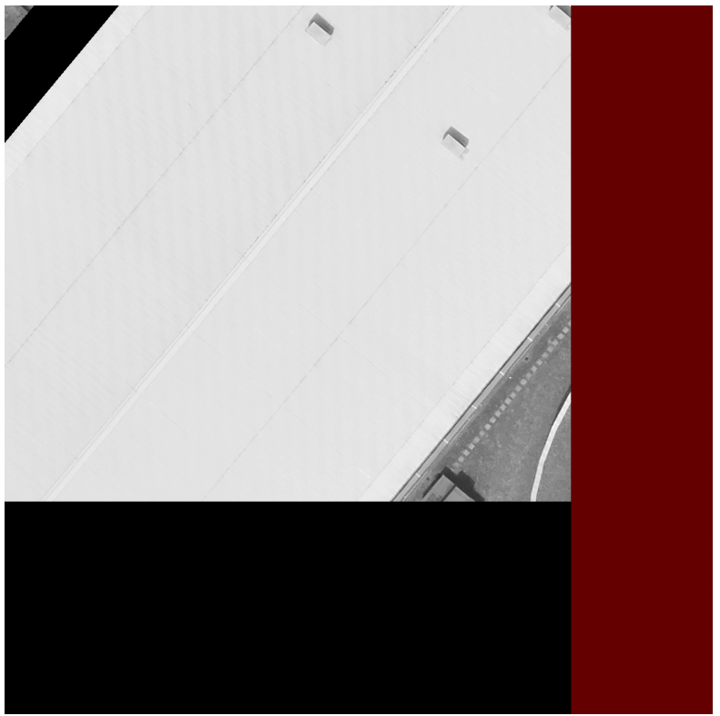
<figcaption>Tuile avec chevauchement à droite (rouge)</figcaption>
</figure>
<figure id="fig:ch3_postprocessing_dataset_09_validation_chevauchement_droite2">
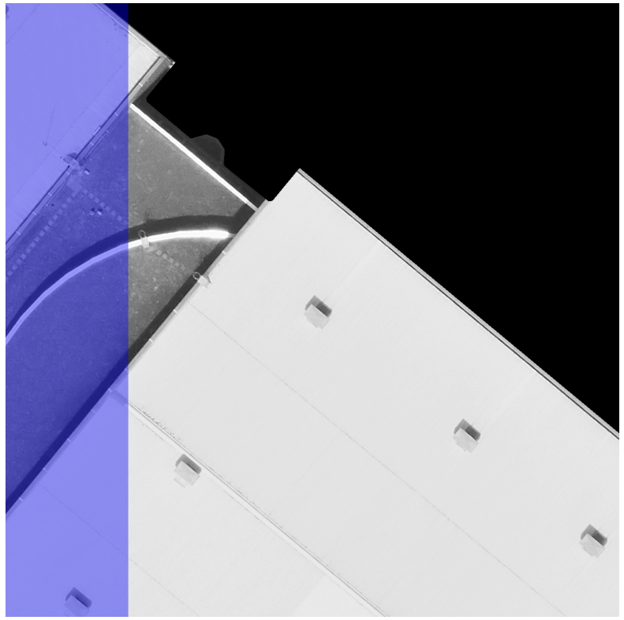
<figcaption>Tuile avec chevauchement à gauche (bleu)</figcaption>
</figure>
<figure id="fig:ch3_postprocessing_dataset_10_validation_chevauchement_droite3">
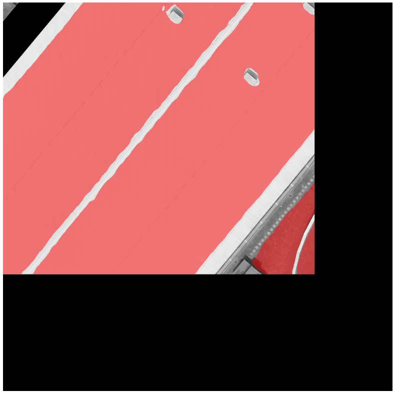
<figcaption>Tuile avec chevauchement à droite avec annotations (rouge)</figcaption>
</figure>
<figure id="fig:ch3_postprocessing_dataset_11_validation_chevauchement_droite4">
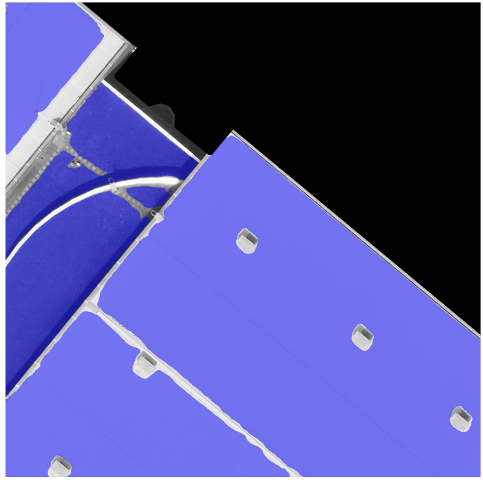
<figcaption>Tuile avec chevauchement à gauche avec annotations (bleu)</figcaption>
</figure>
<figcaption>Cas chevauchement tuile à droite</figcaption>
</figure>

La Figure [3.53](#fig:exemple_post_traitement_validation_tuile_bas){reference-type="ref" reference="fig:exemple_post_traitement_validation_tuile_bas"} illustre un cas où il y a un chevauchement dans la partie basse (Figure [3.49](#fig:ch3_postprocessing_dataset_12_validation_chevauchement_bas1){reference-type="ref" reference="fig:ch3_postprocessing_dataset_12_validation_chevauchement_bas1"}) avec une autre tuile (Figure [3.50](#fig:ch3_postprocessing_dataset_13_validation_chevauchement_bas2){reference-type="ref" reference="fig:ch3_postprocessing_dataset_13_validation_chevauchement_bas2"}). Le même processus de validation s’applique, c’est-à-dire vérification que la zone de chevauchement inférieure a été correctement masquée et que les annotations correspondantes ont subi le même traitement de masquage que les images.

<figure id="fig:exemple_post_traitement_validation_tuile_bas" data-latex-placement="H">
<figure id="fig:ch3_postprocessing_dataset_12_validation_chevauchement_bas1">
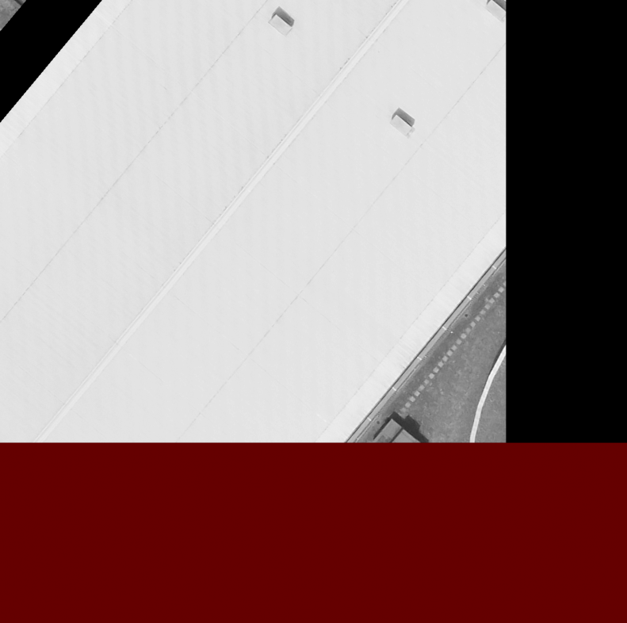
<figcaption>Tuile avec chevauchement en bas (rouge)</figcaption>
</figure>
<figure id="fig:ch3_postprocessing_dataset_13_validation_chevauchement_bas2">
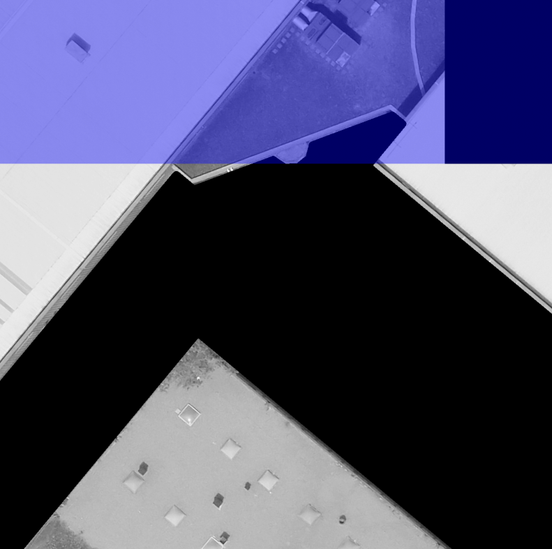
<figcaption>Tuile avec chevauchement en haut (bleu)</figcaption>
</figure>
<figure id="fig:ch3_postprocessing_dataset_14_validation_chevauchement_bas3">
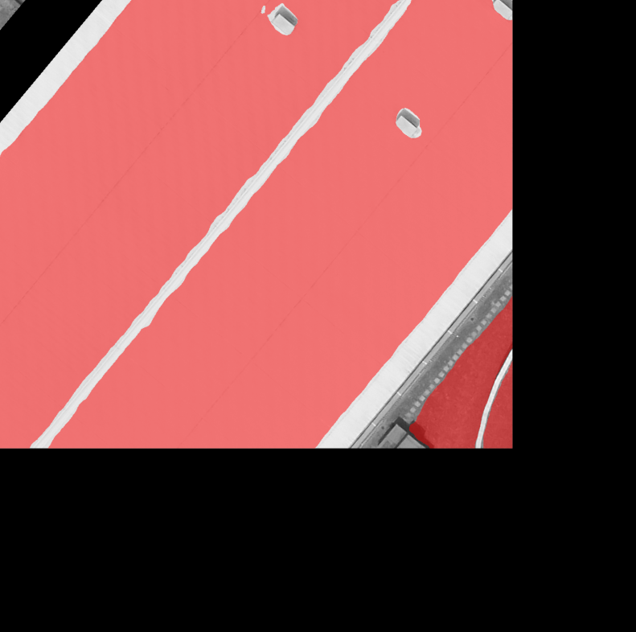
<figcaption>Tuile avec chevauchement en bas avec annotations (rouge)</figcaption>
</figure>
<figure id="fig:ch3_postprocessing_dataset_15_validation_chevauchement_bas4">
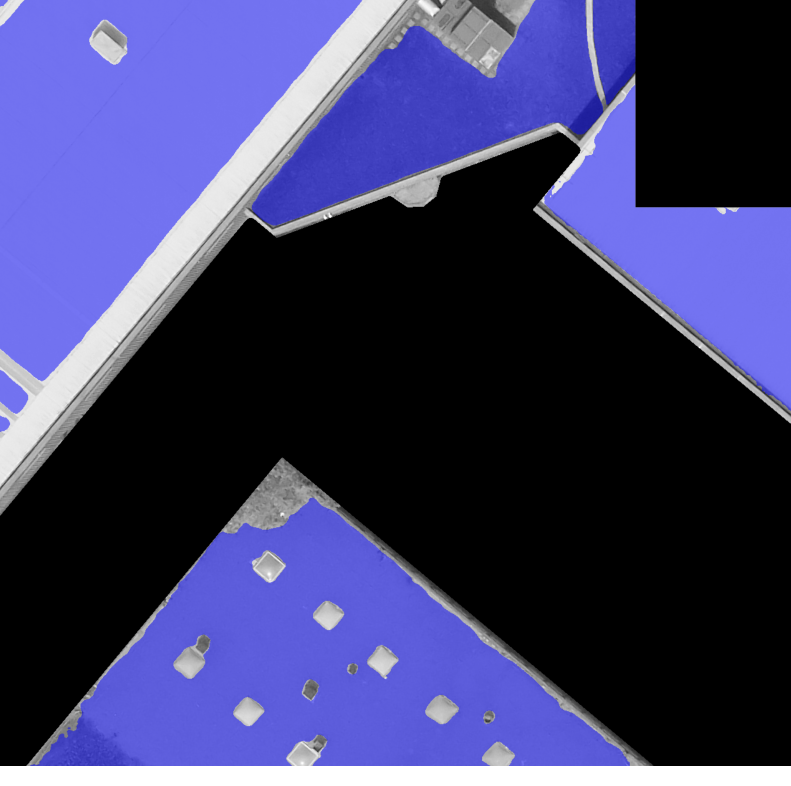
<figcaption>Tuile avec chevauchement en haut avec annotations (bleu)</figcaption>
</figure>
<figcaption>Cas chevauchement tuile en bas</figcaption>
</figure>

Suite aux vérifications de la correction des chevauchements, des vérifications supplémentaires sont nécessaires. Certaines des images qui ont été rognées ont tous leurs pixels à 0, ce qui produit des images complètement noires. Le même phénomène affecte aussi leurs annotations. Dans ce cas, l’image est supprimée du dataset car elle n’apporte aucune information utile pour l’entraînement. Au total, 9 cas sur les 539 images annotées initiales sont concernés, ce qui réduit le nombre d’images annotées à distribuer en datasets à 530.

La vérification suivante concerne la taille des images qui doivent toutes avoir des dimensions de si pixels. Cependant, comme indiqué précédemment dans la sous-section (voir page ), certaines tuiles situées aux extrémités droites et inférieures de l’orthophoto ne respectent pas ce prérequis en raison des contraintes géométriques liées au découpage de la zone d’étude. Un découpage uniforme des orthophotos a été privilégié plutôt que d’avoir des tuiles s’étendant sur plusieurs orthophotos adjacentes.

La solution adoptée (Figure [3.57](#fig:ch3_postprocessing_dataset_verification_taille){reference-type="ref" reference="fig:ch3_postprocessing_dataset_verification_taille"}) pour gérer ces tuiles consiste à ajouter des bandes noires (pixels à 0) afin d’atteindre les dimensions requises. La ligne pointillée délimite la tuile et les annotations originales au format si pixels. L’ajout de bandes noires des deux côtés permet de conserver les coordonnées géographiques correctes dans le fichier GeoTIFF.

<figure id="fig:ch3_postprocessing_dataset_verification_taille" data-latex-placement="H">
<figure id="fig:ch3_postprocessing_dataset_16_verification_taille1">
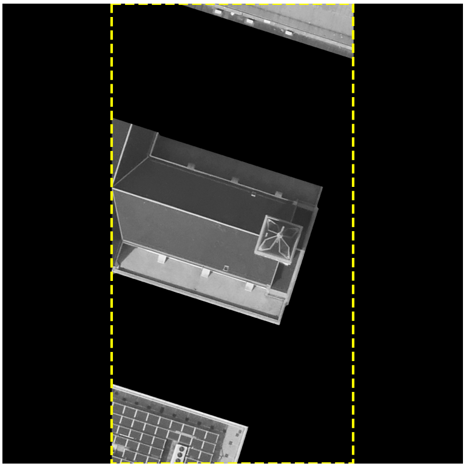
<figcaption>Tuile (ligne pointillée jaune) avec bandes noires</figcaption>
</figure>
<figure id="fig:ch3_postprocessing_dataset_17_verification_taille2">
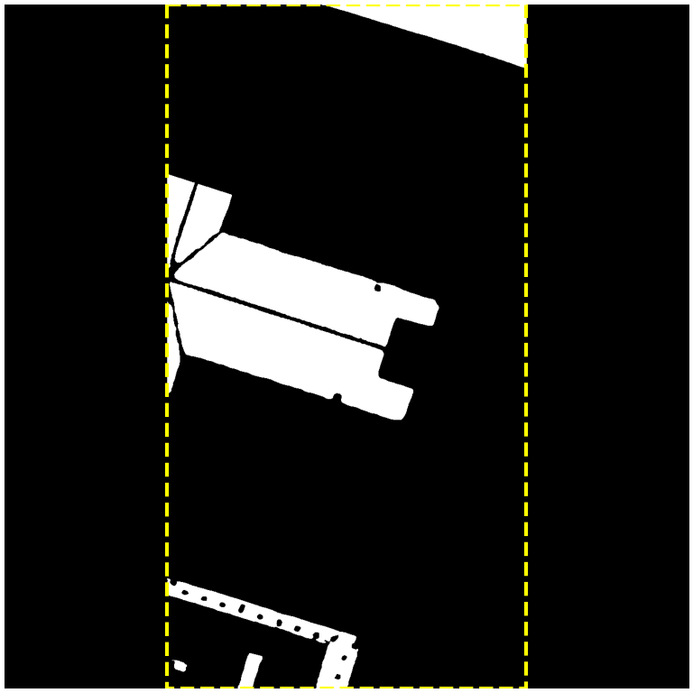
<figcaption>Annotations (ligne pointillée jaune) avec bandes noires</figcaption>
</figure>
<figure id="fig:ch3_postprocessing_dataset_18_verification_taille3">
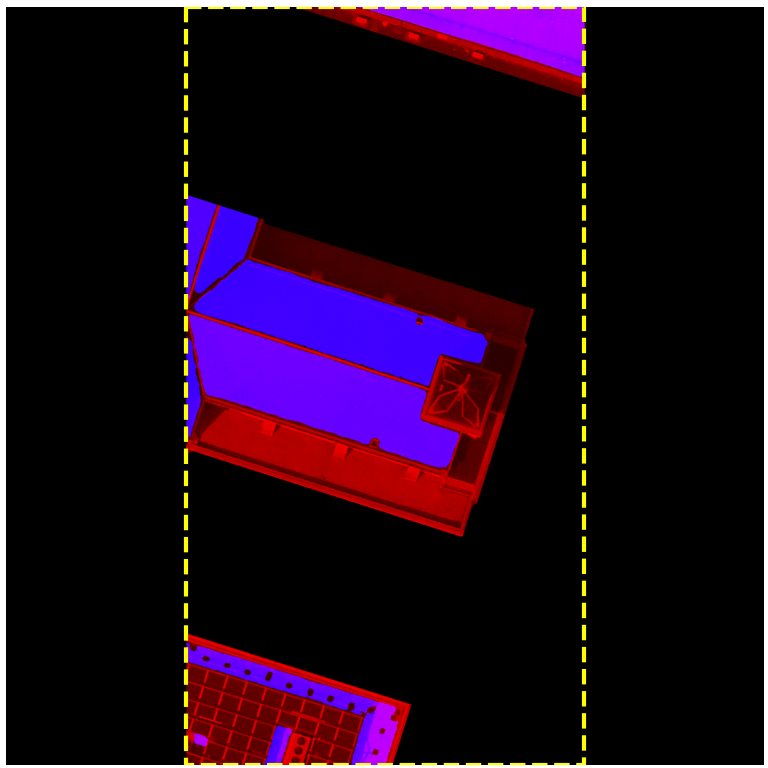
<figcaption>Tuile et annotations (ligne pointillée jaune) avec bandes noires</figcaption>
</figure>
<figcaption>Ajout de bandes noires pour convertir les tuiles et annotations (ligne pointillée jaune) au format 1280x1280 pixels</figcaption>
</figure>

Les coordonnées valides et les doublons d’images ont déjà été vérifiés lors de la sélection des images à annoter, il n’y a donc pas eu de corrections à apporter à cette étape.

Finalement, l’algorithme utilisé pour la distribution des données annotées en datasets vise une répartition optimale malgré la difficulté de réaliser une stratification avec double critère. Le coefficient de variation obtenu se situe à 8.8% pour la surface et 8.6% pour la classe, soit en dessous de l’objectif de 10% (Code [&#91;code:post\_traitement\_stratification\_resultats&#93;](#code:post_traitement_stratification_resultats){reference-type="ref" reference="code:post_traitement_stratification_resultats"}).

Les Figures [3.58](#fig:ch3_postprocessing_dataset_19_distribution_barchart_surface){reference-type="ref" reference="fig:ch3_postprocessing_dataset_19_distribution_barchart_surface"} et [3.59](#fig:ch3_postprocessing_dataset_20_distribution_barchart_classe){reference-type="ref" reference="fig:ch3_postprocessing_dataset_20_distribution_barchart_classe"} représentent respectivement la distribution des intervalles de surface et des classes <a href="../glossary.html#gloss-sia"><span data-acronym-label="sia" data-acronym-form="singular+short">sia</span></a> par dataset. La ligne pointillée en bleu indique le seuil théorique équilibré : les datasets situés au-dessus de cette ligne ont reçu plus d’images que l’objectif fixé. L’algorithme de stratification optimise au mieux la distribution, mais des compromis demeurent nécessaires pour maintenir l’équilibre global entre les différents critères de stratification.

<figure id="fig:ch3_postprocessing_dataset_19_distribution_barchart_surface" data-latex-placement="H">
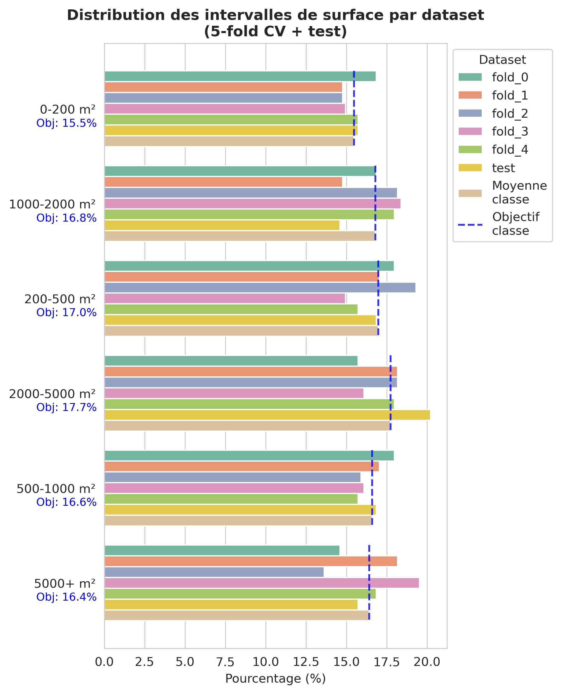
<figcaption>Distribution des intervalles de surface par dataset</figcaption>
</figure>

<figure id="fig:ch3_postprocessing_dataset_20_distribution_barchart_classe" data-latex-placement="H">
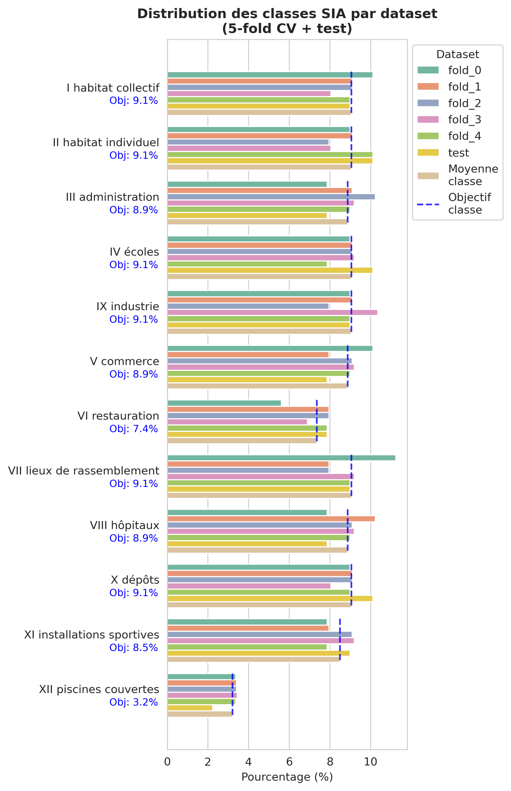
<figcaption>Distribution des classes <a href="../glossary.html#gloss-sia"><span data-acronym-label="sia" data-acronym-form="singular+short">sia</span></a> par dataset</figcaption>
</figure>

Toutes ces vérifications permettent de garantir la qualité tant des données annotées que de la distribution de celles-ci en datasets équilibrés.

## Développement du modèle {#développement-du-modèle}

Cette section traite du développement d’un modèle de machine learning sur mesure pour la tâche de segmentation sémantique des espaces libres sur les toitures.

### Architecture des modèles {#architecture-des-modèles}

#### Segmentation models pytorch {#segmentation-models-pytorch}

Segmentation models pytorch (SMP) &#91;[85](../bibliography.md#ref-noauthor_welcome_nodate)&#93; est une librairie Python spécialisée dans les modèles de segmentation.

##### Introduction aux encodeurs et décodeurs {#introduction-aux-encodeurs-et-décodeurs}

Une des architectures les plus populaires est U-Net &#91;[86](../bibliography.md#ref-ronneberger_u-net_2015)&#93; qui permet d’expliquer le fonctionnement des modèles dans SMP. U-Net est un réseau de neurones convolutionnel en forme de “U” (Figure [3.60](#fig:ch36_architecture_01_architecture_unet){reference-type="ref" reference="fig:ch36_architecture_01_architecture_unet"}) qui se divise en trois parties : l’encodeur, le décodeur et les connexions de saut (skip connections).

<figure id="fig:ch36_architecture_01_architecture_unet" data-latex-placement="H">
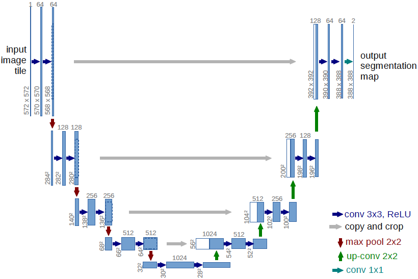
<figcaption>Architecture U-Net <span class="citation" data-cites="ronneberger_u-net_2015">[<a href="../bibliography.html#ref-ronneberger_u-net_2015" role="doc-biblioref">86</a>]</span></figcaption>
</figure>

L’encodeur capture les caractéristiques de l’image en appliquant successivement plusieurs couches convolutionnelles et des opérations de max pooling. Ce processus permet d’extraire les caractéristiques sémantiques à plusieurs échelles tout en réduisant progressivement la résolution spatiale, comme illustré dans la partie descendante de l’architecture U-Net.

Il correspond au côté gauche de la forme en “U” (Figure [3.60](#fig:ch36_architecture_01_architecture_unet){reference-type="ref" reference="fig:ch36_architecture_01_architecture_unet"}), suivant un parcours descendant. Il commence avec l’image d’entrée () située en haut à gauche et procède par des opérations successives de max pooling (représentées par les flèches rouges). Au fur et à mesure de la descente, les dimensions spatiales diminuent progressivement 572 → 284 → 140 → 68 → 32 pixels, alors que le nombre de canaux augmente 1 → 64 → 128 → 256 → 512 → 1024. L’encodeur se termine avec un format de pixels et 1024 canaux, au centre du “U”.

Le décodeur effectue le processus inverse de l’encodeur en sur-échantillonnant les cartes de caractéristiques pour retrouver la résolution originale. Il utilise des convolutions transposées (représentées par les flèches vertes) pour récupérer progressivement les détails spatiaux nécessaires aux prédictions au niveau des pixels. Ce processus correspond à la partie droite du “U” (Figure [3.60](#fig:ch36_architecture_01_architecture_unet){reference-type="ref" reference="fig:ch36_architecture_01_architecture_unet"}) et permet de reconstruire une carte de segmentation de même dimension que l’image d’entrée.

Les connexions de saut (skip connections) permettent d’établir des ponts entre l’encodeur et le décodeur pour préserver les informations spatiales à une résolution identique. Ces connexions sont représentées par des flèches grises dans la Figure [3.60](#fig:ch36_architecture_01_architecture_unet){reference-type="ref" reference="fig:ch36_architecture_01_architecture_unet"}. Sans ces connexions, les informations spatiales seraient perdues lors de la phase d’encodage.

##### Architectures testées {#architectures-testées}

SMP propose plusieurs architectures qui sont déjà prêtes à l’utilisation. Le Code [&#91;code:smp\_quick\_start\_model&#93;](#code:smp_quick_start_model){reference-type="ref" reference="code:smp_quick_start_model"} permet de créer un modèle U-Net de manière simplifiée.

```python
    import segmentation_models_pytorch as smp
    
    model = smp.Unet(
        encoder_name="resnet34",        # choose encoder, e.g. mobilenet_v2 or efficientnet-b7
        encoder_weights="imagenet",     # use `imagenet` pre-trained weights for encoder initialization
        in_channels=1,                  # model input channels (1 for gray-scale images, 3 for RGB, etc.)
        classes=3,                      # model output channels (number of classes in your dataset)
    )
```

<span id="code:smp_quick_start_model"></span>

<p class="thesis-caption"><em>Code 12 — Utilisation d’un modèle SMP &#91;[87](../bibliography.md#ref-noauthor_quick_nodate)&#93;</em></p>

En synthèse, le Tableau [&#91;tab:ch36\_architecture\_smp\_avantage\_inconvenient&#93;](#tab:ch36_architecture_smp_avantage_inconvenient){reference-type="ref" reference="tab:ch36_architecture_smp_avantage_inconvenient"} présente les avantages et inconvénients de chacune des architectures. L’architecture DeepLabV3 est disponible dans SMP mais n’est pas incluse car DeepLabV3+ est sa nouvelle version.

<span id="tab:ch36_architecture_smp_avantage_inconvenient"></span>

<table markdown="0"><thead><tr><th>Architecture</th><th>Avantages</th><th>Inconvénients</th></tr></thead><tbody><tr><td><strong>U-Net</strong></td><td><ul><li>Architecture simple et efficace</li><li>Skip connections préservant les détails fins</li><li>Excellent pour données limitées</li><li>Référence standard en segmentation médicale</li></ul></td><td><ul><li>Capacité limitée pour scènes complexes</li><li>Pas d'agrégation multi-échelle sophistiquée</li><li>Performance moindre sur objets de tailles très variées</li></ul></td></tr><tr><td><strong>FPN</strong></td><td><ul><li>Fusion multi-échelle efficace</li><li>Bonne gestion des objets de tailles variées</li><li>Architecture modulaire et flexible</li><li>Bon compromis précision/vitesse</li></ul></td><td><ul><li>Moins performant sur détails très fins</li><li>Complexité de réglage des hyperparamètres</li><li>Peut nécessiter plus de mémoire GPU</li></ul></td></tr><tr><td><strong>PSPNet</strong></td><td><ul><li>Excellent pour contexte global</li><li>Pyramid pooling efficace</li><li>Robuste aux variations d'échelle</li><li>Performant sur scènes complexes</li></ul></td><td><ul><li>Lourdeur computationnelle</li><li>Perte potentielle de détails fins</li><li>Consommation mémoire élevée</li></ul></td></tr><tr><td><strong>LinkNet</strong></td><td><ul><li>Architecture légère et rapide</li><li>Moins de paramètres que UNet</li><li>Inférence efficace</li><li>Bon pour applications temps réel</li></ul></td><td><ul><li>Précision limitée sur tâches complexes</li><li>Skip connections simplifiées</li><li>Moins de capacité représentationnelle</li></ul></td></tr><tr><td><strong>U-Net++</strong></td><td><ul><li>Skip connections denses améliorées</li><li>Meilleure propagation des gradients</li><li>Segmentation plus précise des contours</li><li>Pruning possible pour l'inférence</li></ul></td><td><ul><li>Complexité computationnelle accrue</li><li>Plus de paramètres que U-Net</li><li>Temps d'entraînement plus long</li></ul></td></tr><tr><td><strong>DeepLabV3+</strong></td><td><ul><li>Convolutions dilatées (atrous) efficaces</li><li>ASPP pour multi-échelle</li><li>Bon équilibre détails fins/contexte global</li><li>Performance SOTA sur plusieurs benchmarks</li></ul></td><td><ul><li>Architecture complexe</li><li>Hyperparamètres nombreux à ajuster</li><li>Temps d'entraînement conséquent</li></ul></td></tr><tr><td><strong>PAN</strong></td><td><ul><li>Agrégation de chemins efficace</li><li>Propagation d'information améliorée</li><li>Bonne fusion des caractéristiques</li><li>Performance solide sur objets complexes</li></ul></td><td><ul><li>Architecture relativement complexe</li><li>Paramètres additionnels</li><li>Optimisation délicate</li></ul></td></tr><tr><td><strong>UperNet</strong></td><td><ul><li>Pyramid pooling unifié</li><li>Excellent pour segmentation de scènes</li><li>Gestion efficace du contexte multi-échelle</li><li>Performance élevée sur datasets complexes</li></ul></td><td><ul><li>Consommation mémoire importante</li><li>Complexité d'implémentation</li><li>Temps d'entraînement long</li></ul></td></tr><tr><td><strong>MANet</strong></td><td><ul><li>Mécanismes d'attention sophistiqués</li><li>Focus adaptatif sur régions importantes</li><li>Bonne gestion des occultations</li><li>Amélioration de la cohérence spatiale</li></ul></td><td><ul><li>Complexité computationnelle élevée</li><li>Modules d'attention coûteux</li><li>Risque de surapprentissage</li></ul></td></tr><tr><td><strong>SegFormer</strong></td><td><ul><li>Architecture Transformer moderne</li><li>Attention globale efficace</li><li>Performance SOTA récente</li><li>Scalabilité excellente</li></ul></td><td><ul><li>Besoin de larges datasets</li><li>Coût computationnel élevé</li><li>Complexité de fine-tuning</li><li>Interprétabilité limitée</li></ul></td></tr><tr><td><strong>DPT</strong></td><td><ul><li>Transformer pour prédiction dense</li><li>Capacité de modélisation globale</li><li>Performance sur tâches variées</li><li>Architecture unifiée</li></ul></td><td><ul><li>Très coûteux en ressources</li><li>Nécessite données abondantes</li><li>Complexité d'optimisation</li><li>Inférence lente</li></ul></td></tr></tbody></table>

<p class="thesis-caption"><em>Tableau 1 — Avantages et inconvénients des architectures proposées dans SMP</em></p>

Afin d’améliorer les performances des architectures de base, il est possible d’intégrer des encodeurs plus modernes tout en conservant le décodeur d’origine. La Figure [3.61](#fig:ch36_architecture_02_architecture_taille_decodeur){reference-type="ref" reference="fig:ch36_architecture_02_architecture_taille_decodeur"} présente la taille des décodeurs des différentes architectures SMP. La taille du décodeur s’étend de 0,1M de paramètres pour PAN à 29,6M pour DPT, ce qui aura une influence sur les performances et le temps d’entraînement des modèles.

<figure id="fig:ch36_architecture_02_architecture_taille_decodeur" data-latex-placement="H">
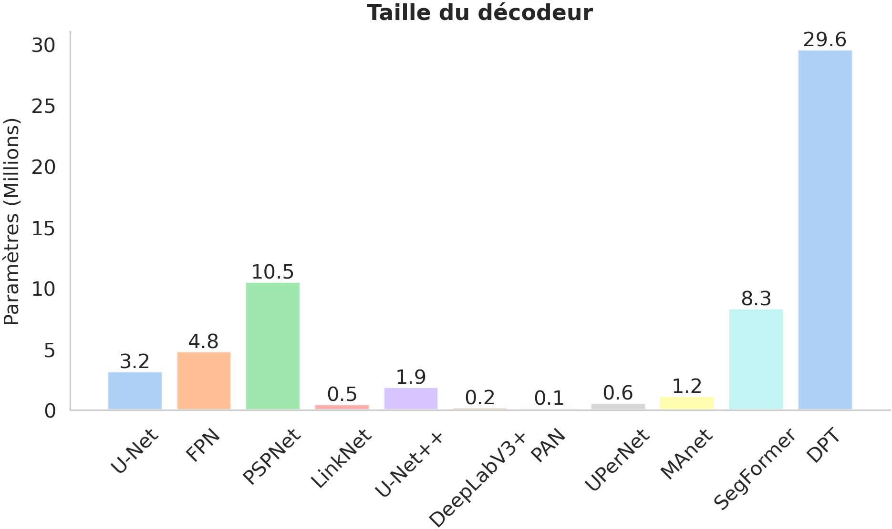
<figcaption>Taille des décodeurs des architectures SMP</figcaption>
</figure>

##### Encodeurs testés {#encodeurs-testés}

Le choix des encodeurs est crucial pour la performance du modèle de segmentation. Les encodeurs sont des modèles pré-entraînés sur tel que le dataset ImageNet &#91;[88](../bibliography.md#ref-noauthor_imagenet_nodate)&#93;, permettant d’extraire des caractéristiques pertinentes des images d’entrée. Dans SMP, une vingtaine d’encodeurs sont disponibles. En complément, Pytorch-Image-Models (timm) &#91;[89](../bibliography.md#ref-wightman_pytorch_2025)&#93; propose plus de 800 encodeurs, bien que la compatibilité entre SMP et timm ne soit pas garantie.

Les encodeurs sélectionnés sont les plus populaires et les plus performants, indépendamment de leur taille, et ont tous été pré-entraînés sur ImageNet. Cette approche permet d’accélérer l’entraînement du modèle en exploitant les caractéristiques que le modèle de base a déjà apprises. Le Tableau [&#91;tab:ch36\_encodeurs\_smp\_avantage\_inconvenient&#93;](#tab:ch36_encodeurs_smp_avantage_inconvenient){reference-type="ref" reference="tab:ch36_encodeurs_smp_avantage_inconvenient"} présente les avantages et inconvénients des encodeurs testés dans SMP.

<span id="tab:ch36_encodeurs_smp_avantage_inconvenient"></span>

<table markdown="0"><thead><tr><th>Encodeur</th><th>Avantages</th><th>Inconvénients</th></tr></thead><tbody><tr><td><strong>ResNeXt50/101</strong></td><td><ul><li>Cardinalité : nouvelle dimension de mise à l'échelle</li><li>Convolutions groupées réduisant la complexité</li><li>Architecture modulaire facile à comprendre</li><li>Équilibre efficacité/performance prouvé</li></ul></td><td><ul><li>Paramètre cardinalité à optimiser manuellement</li><li>Plus complexe qu'un ResNet standard</li><li>Consommation mémoire élevée</li><li>Nécessite optimisations hardware spécifiques</li></ul></td></tr><tr><td><strong>EfficientNet B3/B5</strong></td><td><ul><li>Scaling uniforme profondeur/largeur/résolution</li><li>Rapport performances/paramètres exceptionnel</li><li>Architecture mature et bien documentée</li><li>Transfert d'apprentissage très efficace</li><li>Famille complète de modèles (B0 à B7)</li></ul></td><td><ul><li>Entraînement long pour les grandes variantes</li><li>Nombreux hyperparamètres à ajuster</li><li>B5+ très gourmand en mémoire GPU</li></ul></td></tr><tr><td><strong>RegNetY</strong></td><td><ul><li>Design space méthodique et reproductible</li><li>Mise à l'échelle efficace et prévisible</li><li>Excellente vitesse d'inférence</li></ul></td><td><ul><li>Capacité d'expression limitée</li><li>Performance insuffisante sur tâches complexes</li><li>Nécessite recherche d'architecture préalable</li></ul></td></tr><tr><td><strong>ResNeSt200e</strong></td><td><ul><li>Mécanisme d'attention split-attention innovant</li><li>Gestion efficace des dépendances inter-canaux</li><li>Améliore significativement ResNet classique</li></ul></td><td><ul><li>Très profond (200 couches) = difficile à entraîner</li><li>Coût computationnel prohibitif</li><li>Temps d'entraînement longs</li><li>Risque de surapprentissage élevé</li></ul></td></tr><tr><td><strong>EfficientNetV2</strong></td><td><ul><li>Entraînement progressif accélérant la convergence</li><li>Blocs Fused-MBConv plus efficaces</li><li>Vitesse d'entraînement nettement supérieure</li><li>Régularisation adaptative intelligente</li><li>Optimisé pour images haute résolution</li></ul></td><td><ul><li>Configuration d'hyperparamètres complexe</li><li>Forte consommation mémoire GPU</li><li>Coût computationnel élevé à l'entraînement</li></ul></td></tr><tr><td><strong>Res2Net101</strong></td><td><ul><li>Multi-échelle granulaire dans chaque bloc</li><li>Connexions hiérarchiques sophistiquées</li><li>Amélioration claire par rapport à ResNet</li><li>Champ récepteur plus riche et varié</li></ul></td><td><ul><li>Architecture plus complexe à comprendre</li><li>Surcoût computationnel notable</li><li>Paramètres d'échelle supplémentaires</li><li>Optimisation plus délicate que ResNet</li></ul></td></tr><tr><td><strong>FastViT T8</strong></td><td><ul><li>Hybride CNN-Transformer très efficace</li><li>Reparamétérisation structurelle novatrice</li><li>Accès mémoire optimisés pour la vitesse</li><li>Idéal pour applications temps réel</li><li>Performances élevées avec latence minimale</li></ul></td><td><ul><li>Implémentation hybride complexe</li><li>Dépendance aux optimisations hardware</li><li>Documentation et exemples limités</li></ul></td></tr><tr><td><strong>RepViT M1</strong></td><td><ul><li>CNN mobile inspiré des Transformers</li><li>Équilibre optimal précision/rapidité</li><li>Spécialement conçu pour appareils mobiles</li></ul></td><td><ul><li>Capacité limitée pour tâches très complexes</li><li>Performance réduite en détection/segmentation</li><li>Fortement dépendant du hardware mobile</li></ul></td></tr><tr><td><strong>MambaOut</strong></td><td><ul><li>CNN avec portes, sans complexité SSM (Mamba)</li><li>Surpasse les Transformers visuels</li><li>Efficacité computationnelle remarquable</li><li>Prouve l'inutilité de Mamba en vision</li></ul></td><td><ul><li>Très récent (2024), peu de recul</li><li>Validation limitée sur diverses tâches</li><li>Écosystème et support limités</li></ul></td></tr><tr><td><strong>EfficientViT B2</strong></td><td><ul><li>Attention linéaire multi-échelle efficace</li><li>Spécialisé pour traitement haute résolution</li><li>Architecture sandwich réduisant la complexité</li><li>Attention en cascade progressive</li></ul></td><td><ul><li>Implémentation très complexe</li><li>Optimisations hardware indispensables</li></ul></td></tr></tbody></table>

<p class="thesis-caption"><em>Tableau 2 — Avantages et inconvénients des architectures des encodeurs testés</em></p>

La Figure [3.62](#fig:ch36_architecture_03_backbone_taille_encodeur_famille){reference-type="ref" reference="fig:ch36_architecture_03_backbone_taille_encodeur_famille"} présente les encodeurs (backbone) séléctionnés groupés par architecture. Certains encodeurs sont disponibles dans plusieurs tailles pour une même architecture, par exemple EfficientNet-B3 et EfficientNet-B5.

<figure id="fig:ch36_architecture_03_backbone_taille_encodeur_famille" data-latex-placement="H">
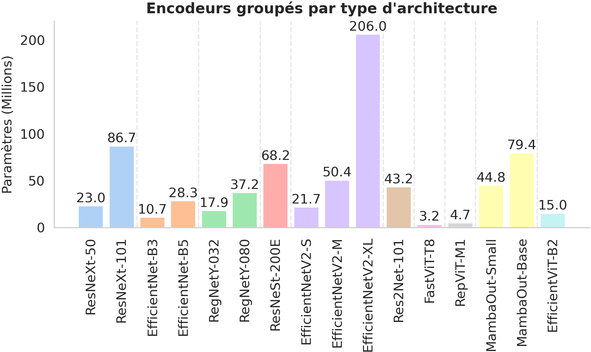
<figcaption>Encodeurs groupés par type d’architecture</figcaption>
</figure>

La Figure [3.63](#fig:ch36_architecture_04_backbone_taille_encodeur_ordonnee){reference-type="ref" reference="fig:ch36_architecture_04_backbone_taille_encodeur_ordonnee"} présente les encodeurs par ordre croissant de taille, mesurée en nombre de paramètres. Cette représentation permet de visualiser rapidement la complexité relative des différents encodeurs. Le plus petit encodeur est FastViT T8 avec 3.2 millions de paramètres, tandis que le plus grand est EfficientNetV2-XL avec 206.0 millions de paramètres.

<figure id="fig:ch36_architecture_04_backbone_taille_encodeur_ordonnee" data-latex-placement="H">
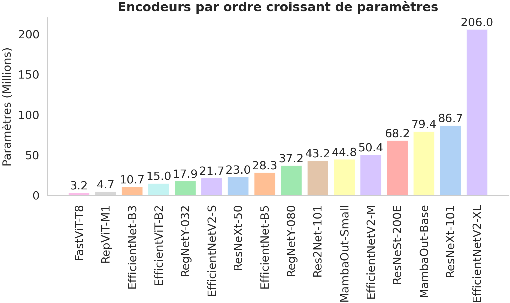
<figcaption>Encodeurs par ordre croissant de paramètres</figcaption>
</figure>

Cette sélection d’encodeurs représente une bonne variété tant en termes de taille que de complexité, les modèles plus récents ou avec plus de paramètres n’auront pas forcément de meilleures performances sur une tâche concrète.

#### YOLO {#yolo}

YOLO (You Only Look Once) est un algorithme de détection et segmentation instance d’images qui a révolutionné le domaine de la vision par ordinateur. Sa dernière version YOLOv12 est décrite en détail dans (voir page ). YOLOv12 dispose de plusieurs modèles pré-entraînés de différentes tailles selon la complexité des images à segmenter. Le Tableau [3.6](#tab:yolov12_modeles_testes){reference-type="ref" reference="tab:yolov12_modeles_testes"} présente les modèles YOLOv12-seg testés.

| **Modèle**   | **Paramètres** |
|:-------------|---------------:|
| YOLOv12n-seg |           2.8M |
| YOLOv12s-seg |           9.8M |
| YOLOv12m-seg |          21.9M |
| YOLOv12l-seg |          28.8M |
| YOLOv12x-seg |          64.5M |

<span id="tab:yolov12_modeles_testes"></span>

<p class="thesis-caption"><em>YOLOv12-seg modèles testés</em></p>
### Préparation des données {#préparation-des-données-1}

Cette sous-section traite de la préparation des données avant de débuter l’entraînement du modèle.

#### Dataset {#dataset}

Le dataset compte en tout 530 images, réparties de la manière suivante:

- 441 images pour l’entraînement et la validation (réparties en 5 folds)

- 89 images pour l’évaluation finale (dataset de test)

- 530 masques qui comptent une seule classe (toiture libre) avec l’arrière-plan comme classe négative

Chaque fold dispose d’un fichier de texte où sont indiquées les tuiles incluses, en tout 5 fichiers de texte. Tour à tour, chacun des folds est utilisé comme dataset de validation et les folds restants comme dataset d’entraînement. Par exemple, la première combinaison utilise le fold 0 comme dataset de validation et les folds restants (1, 2, 3, 4) comme dataset d’entraînement.

#### Augmentation des données {#subsubsec:augmentation_donnees}

L’augmentation des données permet de créer plusieurs versions d’une même image, ce qui améliore les performances du modèle en augmentant artificiellement la variété des images présentes dans le dataset d’entraînement.

##### Stratégie d’augmentation de données {#stratégie-daugmentation-de-données}

La librairie Albumentations &#91;[90](../bibliography.md#ref-albumentations_albumentations_nodate)&#93; permet de faire de l’augmentation de données directement sur les images avant qu’elles soient utilisées pour l’entraînement du modèle. Le Code [&#91;code:pipeline\_augmentation\_donnees&#93;](#code:pipeline_augmentation_donnees){reference-type="ref" reference="code:pipeline_augmentation_donnees"} présente la combinaison de transformations utilisées pour réaliser l’augmentation de données.

```python
    import albumentations as A
    def get_transforms(is_training=True):
        """
        Get data augmentation transforms.
        """
        if is_training:
            return A.Compose(
                [
                    # Basic Geometric
                    A.SquareSymmetry(p=0.5),
                    # Affine and Perspective
                    A.Affine(
                        scale=(0.95, 1.05), translate_percent=0.1, rotate=(-45, 45), p=0.6
                    ),
                    # Blur
                    A.OneOf([A.GaussianBlur(blur_limit=(3, 7), p=0.5),
                            A.MedianBlur(blur_limit=5, p=0.5),
                            A.MotionBlur(blur_limit=(3, 7), p=0.5),
                        ],p=0.2,),
                    # Noise
                    A.OneOf([A.GaussNoise(p=0.5),
                            A.ISONoise(color_shift=(0.01, 0.05), intensity=(0.1, 0.5), p=0.5),
                            A.MultiplicativeNoise(multiplier=(0.9, 1.1), per_channel=True, p=0.5),
                            A.SaltAndPepper(p=0.5),
                        ],p=0.2,),
                    # Weather effects
                    A.RandomSunFlare(p=0.2),
                    A.RandomFog(p=0.2),
                ]
            )
        else:
            return None
```

<span id="code:pipeline_augmentation_donnees"></span>

<p class="thesis-caption"><em>Code 13 — Pipeline augmentation des données</em></p>

SMP réalise les transformations en mémoire avant qu’elles soient utilisées lors de l’entraînement. L’avantage est qu’il n’y a pas d’images supplémentaires à stocker, mais cela peut en revanche prolonger le temps d’entraînement avec l’ajout de ce processus.

YOLO dispose de stratégies d’augmentation de données propres dans sa librairie Python qui sont utilisées automatiquement. La pertinence de ces transformations est discutable dans le cas d’images aériennes. Par exemple, la transformation `mosaic` assemble plusieurs images en provenance du dataset d’entraînement (Figure [3.66](#fig:ch36_augmentation_donnees_yolo_mosaic){reference-type="ref" reference="fig:ch36_augmentation_donnees_yolo_mosaic"}).

<figure id="fig:ch36_augmentation_donnees_yolo_mosaic" data-latex-placement="H">
<figure id="fig:ch36_augmentations_00a_yolo_exemple1_original">
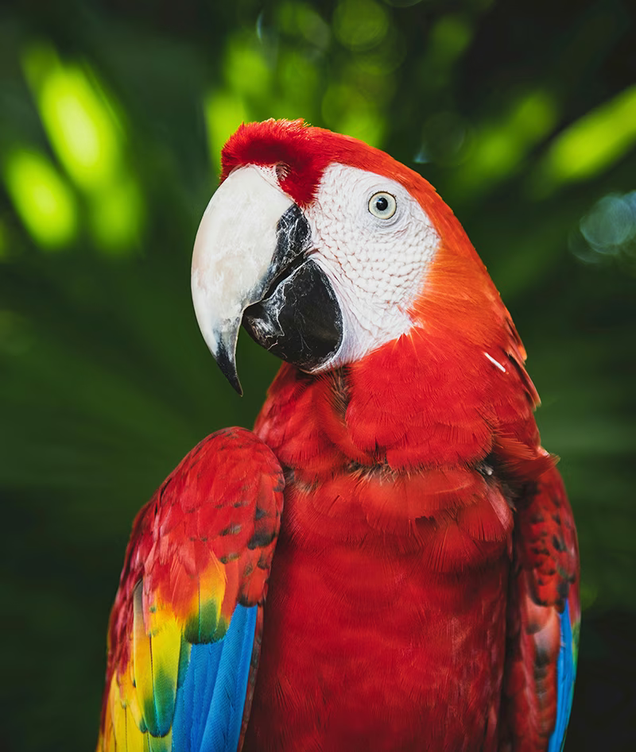
<figcaption>Image originale</figcaption>
</figure>
<figure id="fig:ch36_augmentations_00b_yolo_exemple1_mosaic">

<figcaption>Image transformée avec <code>mosaic</code></figcaption>
</figure>
<figcaption>Transformation <code>mosaic</code> de YOLO</figcaption>
</figure>

YOLO applique aussi des transformations qui affectent le contraste et les couleurs, ce qui n’est pas adapté aux images aériennes. Les premiers tests avec ces réglages automatiques ont donné des résultats relativement mauvais. YOLO dispose en théorie d’une compatibilité totale avec Albumentations; dans la pratique, ils ne permettent d’utiliser qu’une partie des transformations d’Albumentations.

La solution adoptée consiste à inclure exactement les mêmes transformations que pour SMP (Code [&#91;code:pipeline\_augmentation\_donnees&#93;](#code:pipeline_augmentation_donnees){reference-type="ref" reference="code:pipeline_augmentation_donnees"}), mais en les intégrant directement au sein du dataset d’entraînement pour chacun des folds. Chaque image est augmentée 10 fois, portant ainsi le dataset d’entraînement pour YOLO à 353 images originales et 3530 images augmentées, soit un total de 3880 images. Les annotations subissent les mêmes transformations que les images correspondantes. Les datasets de test et de validation ne subissent pas d’augmentation de données. L’augmentation de données automatique est désactivée lors de l’entraînement des modèles YOLO, permettant ainsi d’obtenir des résultats comparables entre SMP et YOLO.

Cette méthode d’augmentation de données pour YOLO implique un temps d’entraînement plus long, car il faut traiter dix fois plus d’images durant le processus d’apprentissage. Cependant, les résultats obtenus s’avèrent supérieurs à ceux des transformations automatiques natives de YOLO.

Les explications des transformations utilisées sont faites à partir de la documentation &#91;[91](../bibliography.md#ref-albumentations_documentation_nodate)&#93; d’Albumentations.

`Compose` permet d’appliquer de manière séquentielle des transformations. La documentation suggère d’utiliser certaines transformations pour les images aériennes, comme par exemple, l’occlusion d’une partie de l’image. Cette transformation peut aider le modèle à mieux généraliser dans des images complètes, mais ce n’est pas utile lorsque la zone d’intérêt est clairement indiquée. Le reste des transformations est une adaptation de leurs recommandations.

La première transformation `SquareSymmetry` applique une symétrie à l’image avec une probabilité `p=0.5`. Les possibilités sont :

- Aucune transformation n’est appliquée

- Rotation de 90°, 180°, 270°

- Miroir sur l’axe vertical ou horizontal

- Miroir sur l’une des diagonales

La Figure [3.67](#fig:ch36_augmentations_01_squaresymmetry){reference-type="ref" reference="fig:ch36_augmentations_01_squaresymmetry"} montre deux exemples de cet effet. Dans l’exemple de gauche (colonne du centre), la symétrie est un miroir vertical, cette même symétrie est bien entendu aussi appliquée à son masque correspondant. L’exemple de droite n’applique aucun effet.

<figure id="fig:ch36_augmentations_01_squaresymmetry" data-latex-placement="H">
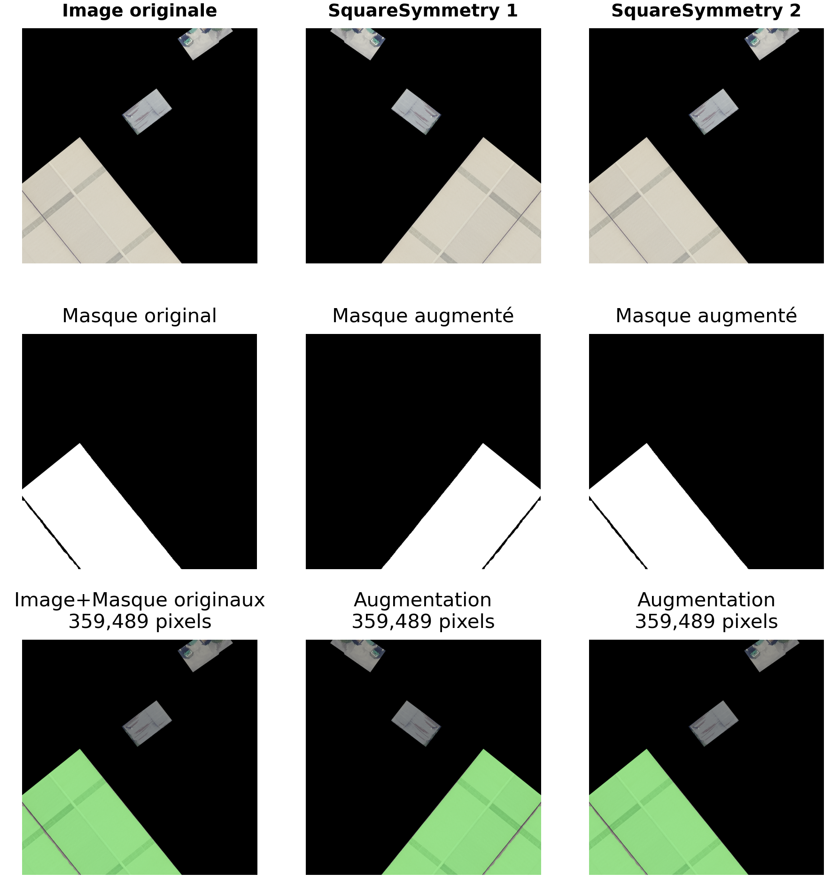
<figcaption>Augmentation de données - exemples de symétrie</figcaption>
</figure>

Le deuxième effet `Affine` applique plusieurs opérations sur l’image. L’effet d’échelle (Figure [3.68](#fig:ch36_augmentations_02_scale){reference-type="ref" reference="fig:ch36_augmentations_02_scale"}) réalise un léger zoom entre ± 5%. Les essais avec un zoom plus important ont montré que le modèle avait des difficultés à apprendre. Certaines images ayant un grand pourcentage d’arrière-plan noir, un zoom trop important peut rapidement réduire drastiquement la partie utile à l’apprentissage du modèle.

<figure id="fig:ch36_augmentations_02_scale" data-latex-placement="H">

<figcaption>Augmentation de données - exemples de échelle</figcaption>
</figure>

`Affine` dispose d’un effet de translation (Figure [3.68](#fig:ch36_augmentations_02_scale){reference-type="ref" reference="fig:ch36_augmentations_02_scale"}) dans lequel l’image est déplacée vers la droite de 10%. Cet effet implique une perte d’information utile à l’apprentissage et doit être utilisé avec parcimonie.

<figure id="fig:ch36_augmentations_03_translation" data-latex-placement="H">
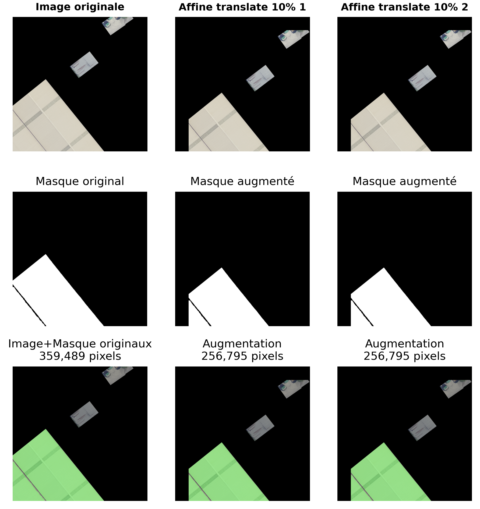
<figcaption>Augmentation de données - exemples de translation</figcaption>
</figure>

La dernière option utilisée de `Affine` est la rotation (Figure [3.70](#fig:ch36_augmentations_04_rotation){reference-type="ref" reference="fig:ch36_augmentations_04_rotation"}. Pour éviter que cela ne soit une symétrie mais tout de même apporter une variété à l’image et améliorer l’apprentissage, la rotation est comprise entre ± 45°. Tous les effets combinés de `Affine` ont une probabilité `p=0.6`.

<figure id="fig:ch36_augmentations_04_rotation" data-latex-placement="H">
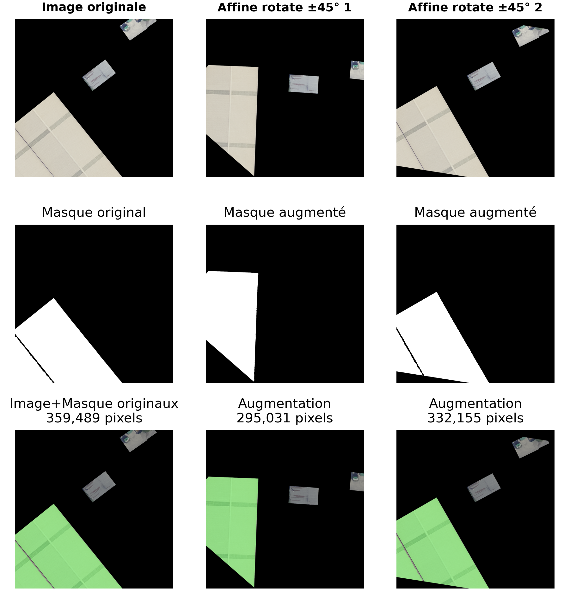
<figcaption>Augmentation de données - exemples de rotation</figcaption>
</figure>

`OneOf` permet de sélectionner entre plusieurs options au sein de la séquence `Compose`. Dans ce cas, il s’agit des effets de floutage, qui ont pour but de réduire le bruit et les détails afin de créer un certain lissage de l’image. Il semble pertinent de n’en appliquer qu’un seul à la fois pour ne pas trop dénaturer l’image.

`GaussianBlur` floute l’image d’entrée (Figure [3.71](#fig:ch36_augmentations_05_flou_gaussien){reference-type="ref" reference="fig:ch36_augmentations_05_flou_gaussien"}) à l’aide d’un filtre gaussien dont la taille du noyau et la valeur *σ* sont aléatoires. Les valeurs par défaut sont utilisées sauf pour `blur_limit` qui augmente la taille des noyaux et le floutage, sinon le flou est à peine visible. `blur_limit=(3, 7)` implique un flou plus fort mais encore raisonnable.

<figure id="fig:ch36_augmentations_05_flou_gaussien" data-latex-placement="H">
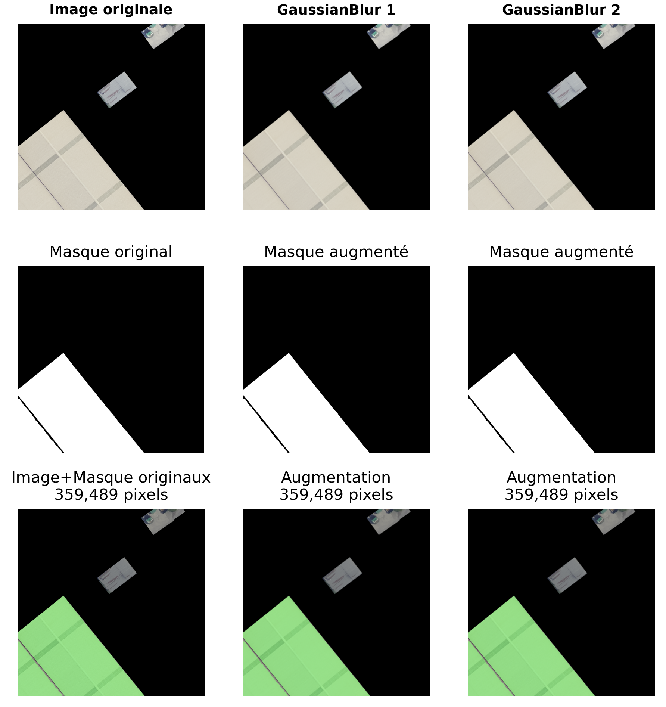
<figcaption>Augmentation de données - exemples de flou gaussien</figcaption>
</figure>

`MedianBlur` utilise un filtre médian pour flouter l’image d’entrée (Figure [3.72](#fig:ch36_augmentations_06_flou_median){reference-type="ref" reference="fig:ch36_augmentations_06_flou_median"}). Le filtrage médian est particulièrement efficace pour supprimer les bruits de type « poivre et sel » tout en préservant les contours. La valeur par défaut est `blur_limit=(3, 7)`, mais avec `blur_limit=5` le rendu est plus uniforme.

<figure id="fig:ch36_augmentations_06_flou_median" data-latex-placement="H">
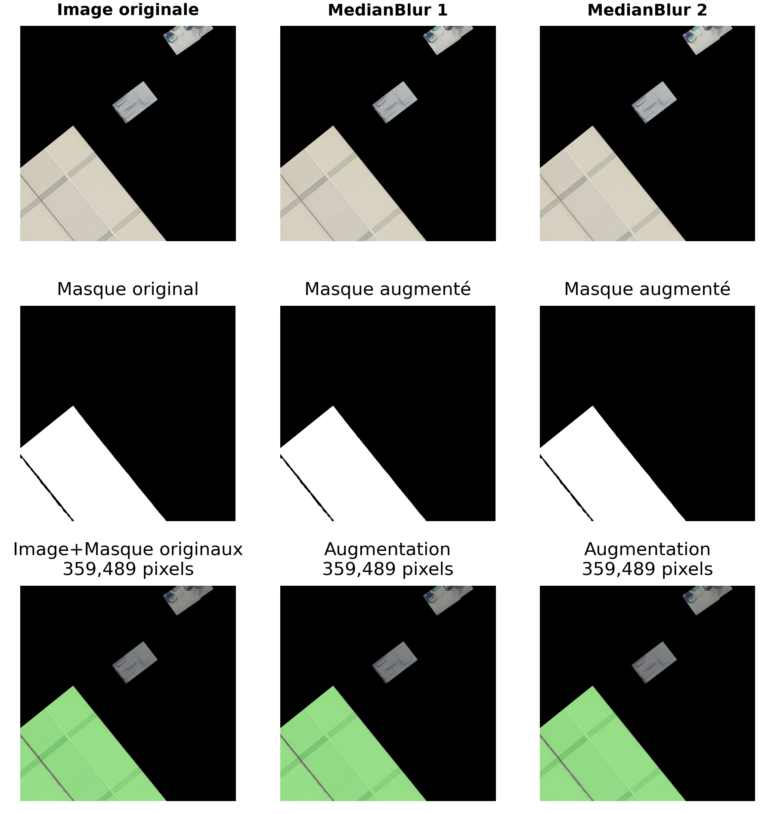
<figcaption>Augmentation de données - exemples de flou médian</figcaption>
</figure>

`MotionBlur` simule les effets de flou de mouvement qui se produisent lors de la capture d’images, tels que le tremblement de l’appareil photo ou le mouvement d’un objet. Les valeurs par défaut créent un effet très léger de mouvement.

<figure id="fig:ch36_augmentations_07_flou_motion" data-latex-placement="H">

<figcaption>Augmentation de données - exemples de flou “mouvement”</figcaption>
</figure>

Le deuxième `OneOf` permet de sélectionner une des transformations disponibles pour ajouter du bruit dans l’image. Le bruit dans une image correspond aux variations aléatoires indésirables des valeurs de pixels (points parasites, grain, distorsions). Exposer le modèle à des données bruitées permet de le rendre plus robuste et de mieux apprendre à généraliser.

Le bruit gaussien est un bruit dont la densité de probabilité suit la loi normale. `GaussNoise` permet d’ajouter du bruit gaussien à l’image (Figure [3.74](#fig:ch36_augmentations_08_bruit_gaussien){reference-type="ref" reference="fig:ch36_augmentations_08_bruit_gaussien"}).

<figure id="fig:ch36_augmentations_08_bruit_gaussien" data-latex-placement="H">
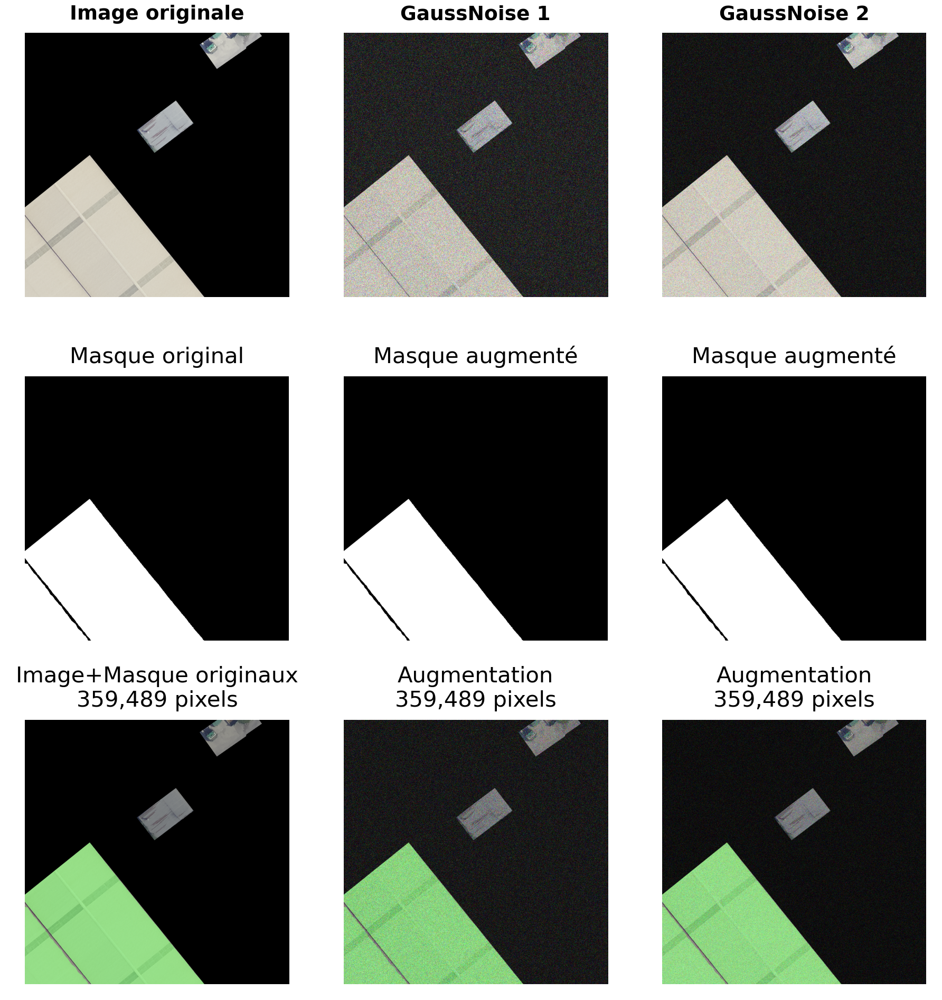
<figcaption>Augmentation de données - exemples de bruit gaussien</figcaption>
</figure>

`ISONoise` ajoute un bruit aléatoire à l’image (Figure [3.75](#fig:ch36_augmentations_09_bruit_iso){reference-type="ref" reference="fig:ch36_augmentations_09_bruit_iso"}), imitant l’effet de l’utilisation de paramètres ISO élevés en photographie numérique. Les deux composantes principales du bruit ISO sont:

1.  Les changements aléatoires de la teinte des couleurs

2.  Les variations aléatoires de l’intensité des pixels

<figure id="fig:ch36_augmentations_09_bruit_iso" data-latex-placement="H">
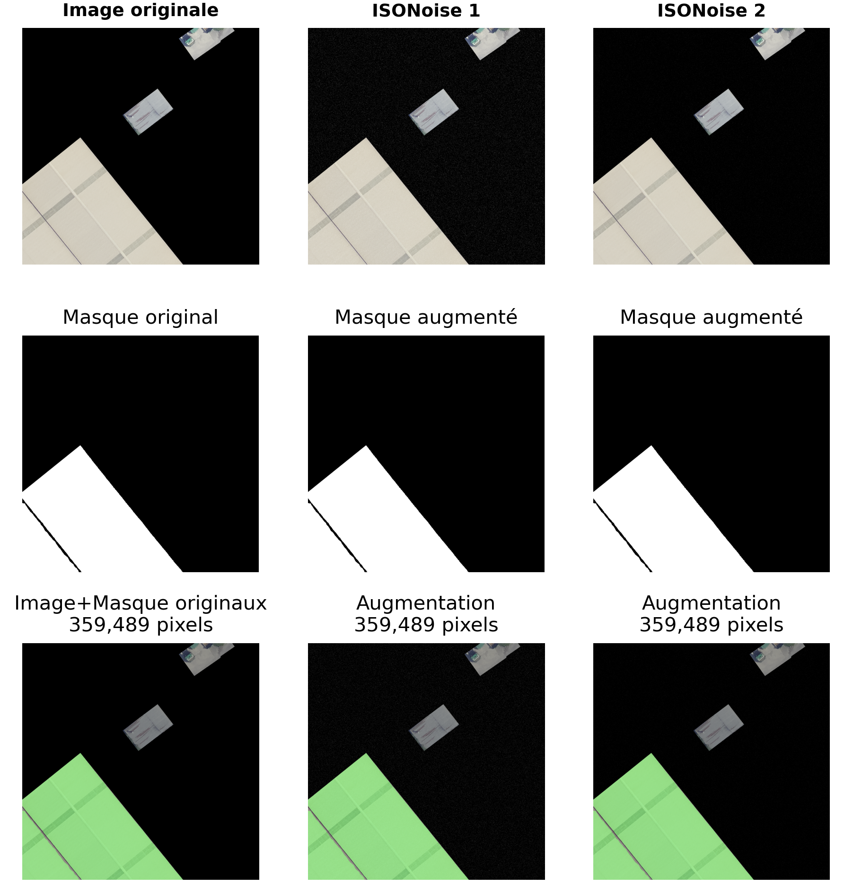
<figcaption>Augmentation de données - exemples de bruit ISO</figcaption>
</figure>

`MultiplicativeNoise` multiplie chaque pixel de l’image par une valeur aléatoire ou un ensemble de valeurs, créant ainsi un bruit qui varie selon l’intensité de l’image (Figure [3.76](#fig:ch36_augmentations_10_bruit_multiplicatif){reference-type="ref" reference="fig:ch36_augmentations_10_bruit_multiplicatif"}).

<figure id="fig:ch36_augmentations_10_bruit_multiplicatif" data-latex-placement="H">
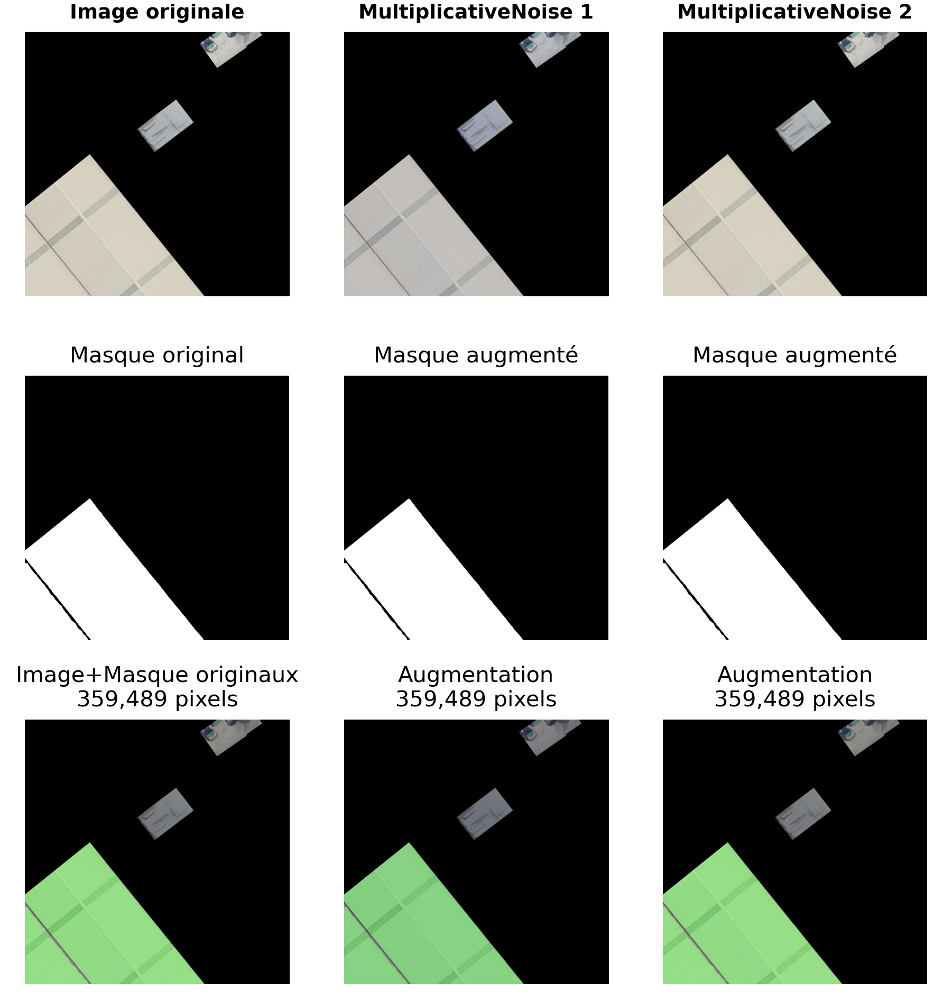
<figcaption>Augmentation de données - exemples de bruit “multiplicatif”</figcaption>
</figure>

`SaltAndPepper` est une forme de bruit impulsionnel qui place aléatoirement les pixels à une valeur maximale (sel) ou à une valeur minimale (poivre).

<figure id="fig:ch36_augmentations_11_bruit_poivre_et_sel" data-latex-placement="H">
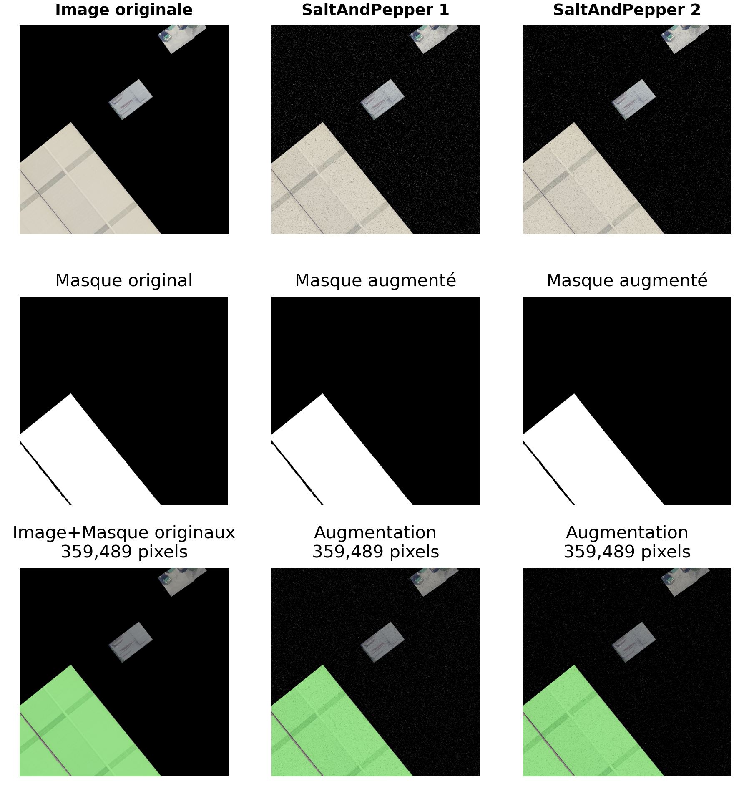
<figcaption>Augmentation de données - exemples de bruit “poivre et sel”</figcaption>
</figure>

Les deux dernières transformations sont des simulations d’effets météo sur les images. Leur impact est significatif sur le résultat final, ce qui explique qu’elles soient utilisées avec une probabilité de `p=0.2`. Les tests effectués montrent que le modèle obtient de meilleurs résultats avec ces transformations activées occasionnellement, en revanche, si elles sont trop fréquentes, le modèle peine à apprendre.

`RandomSunFlare` simule un effet de lumière solaire sur l’image en ajoutant des cercles semi-transparents de différentes tailles (Figure [3.78](#fig:ch36_augmentations_12_effets_meteo_eblouissement){reference-type="ref" reference="fig:ch36_augmentations_12_effets_meteo_eblouissement"}).

<figure id="fig:ch36_augmentations_12_effets_meteo_eblouissement" data-latex-placement="H">
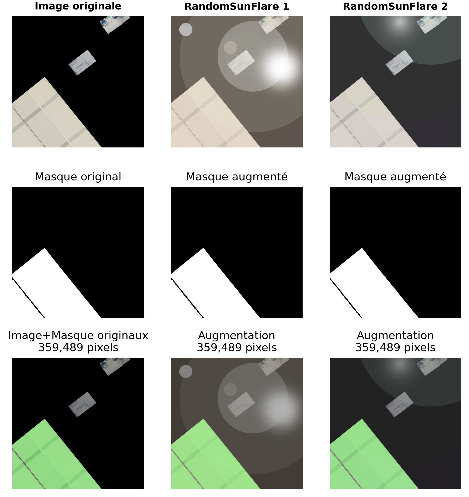
<figcaption>Augmentation de données - exemples d’effet météo éblouissement</figcaption>
</figure>

`RandomFog` simule un effet de brouillard sur l’image (Figure [3.79](#fig:ch36_augmentations_13_effets_meteo_brouillard){reference-type="ref" reference="fig:ch36_augmentations_13_effets_meteo_brouillard"}).

<figure id="fig:ch36_augmentations_13_effets_meteo_brouillard" data-latex-placement="H">
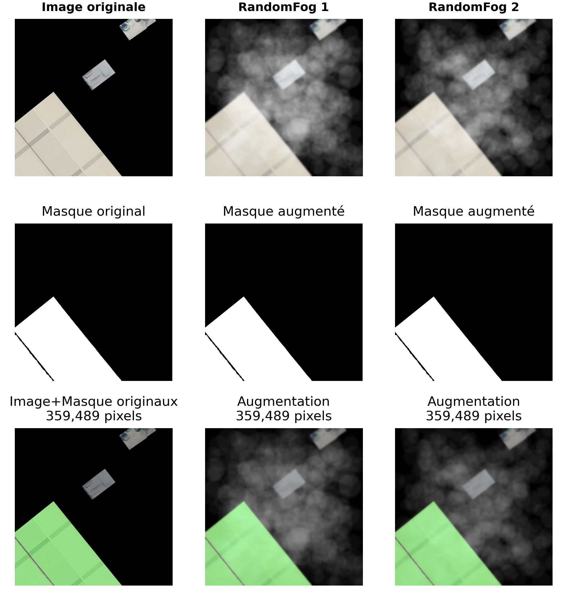
<figcaption>Augmentation de données - exemples d’effet météo brouillard</figcaption>
</figure>

##### Résultats {#résultats-7}

Les résultats obtenus avec la combinaison séquentielle de transformations de `Compose` permettent d’obtenir des images variées pour augmenter la quantité de données d’entraînement disponibles. Tout est fait en mémoire sans avoir à sauvegarder des données supplémentaires.

La Figure [3.80](#fig:ch36_augmentations_14_exemples_complets1){reference-type="ref" reference="fig:ch36_augmentations_14_exemples_complets1"} et [3.81](#fig:ch36_augmentations_15_exemples_complets2){reference-type="ref" reference="fig:ch36_augmentations_15_exemples_complets2"} représentent chacune deux exemples d’augmentations à partir de la même image. Avec les probabilités d’application de chaque transformation, chaque image augmentée est différente et cela sans que l’image de base soit trop dénaturée.

<figure id="fig:ch36_augmentations_14_exemples_complets1" data-latex-placement="H">
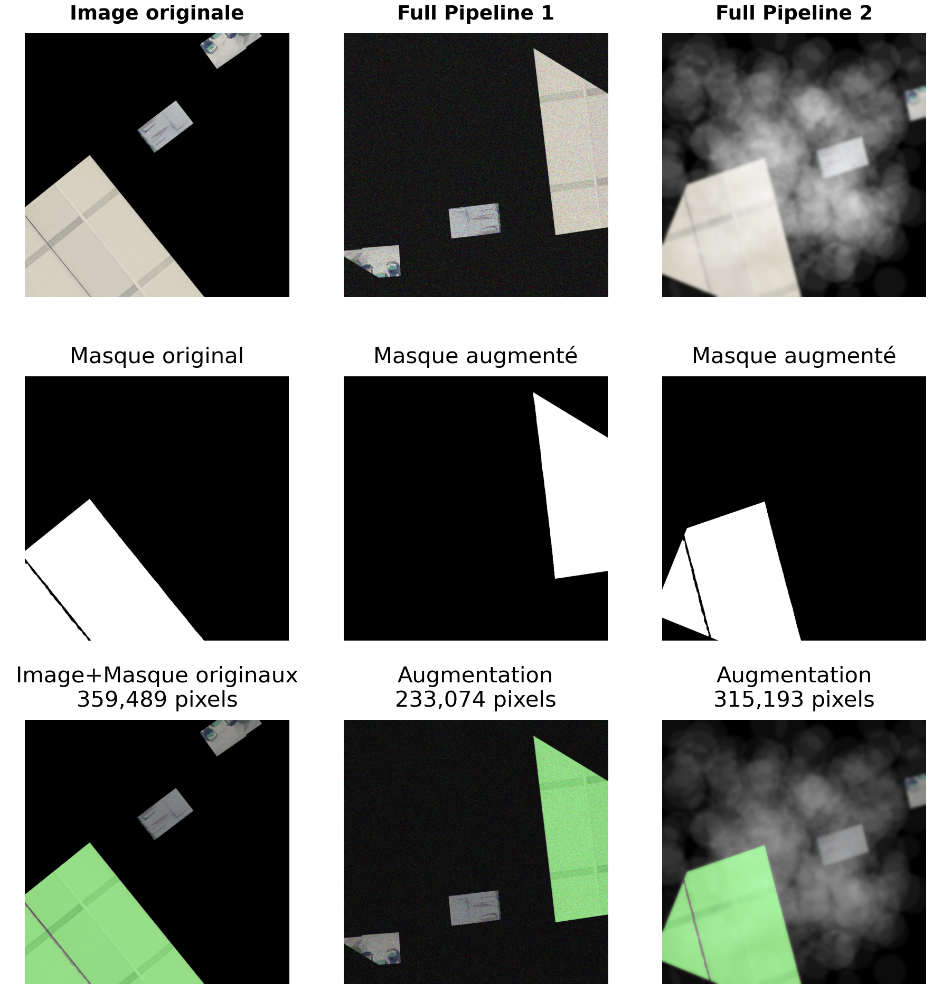
<figcaption>Augmentation de données - exemples complets 1</figcaption>
</figure>

<figure id="fig:ch36_augmentations_15_exemples_complets2" data-latex-placement="H">
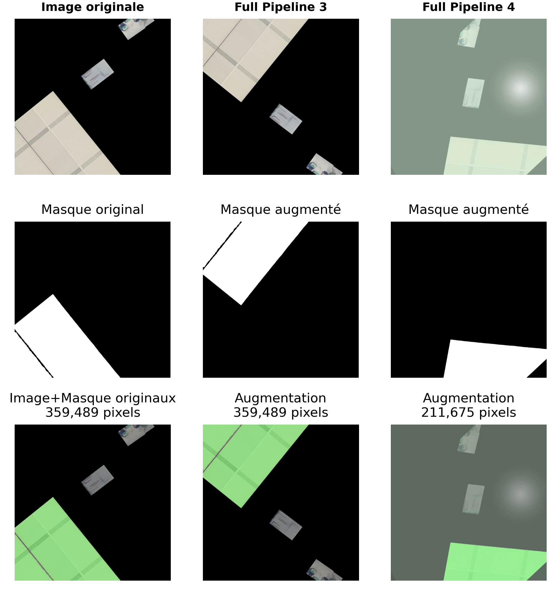
<figcaption>Augmentation de données - exemples complets 2</figcaption>
</figure>

### Processus d’entraînement {#processus-dentraînement}

Cette sous-section décrit le processus d’entraînement des modèles SMP et YOLO, en précisant les étapes clés et les configurations utilisées.

#### SMP {#smp}

Le processus d’entraînement des modèles SMP suit une approche structurée organisée en plusieurs phases distinctes.

##### Configuration modèles {#configuration-modèles}

La configuration des hyperparamètres est réalisée dans le fichier `training_configs.py`, qui est ensuite importé dans le script d’entraînement. Le Code [&#91;code:ch36\_entrainement\_config\_smp&#93;](#code:ch36_entrainement_config_smp){reference-type="ref" reference="code:ch36_entrainement_config_smp"} présente un exemple de fichier de configuration pour SMP. Dans cet exemple, la configuration correspond à un modèle U-Net avec un encodeur EfficientNet-B3 pré-entraîné sur ImageNet.

```python
    # training_configs.py
    IMG_SIZE = (1280, 1280)
    NUM_CLASSES = 1
    EPOCHS = 1000
    PATIENCE = 50
    LEARNING_RATE = 0.001
    ACCUMULATION_STEPS = 4

    BATCH_SIZE_SMALL = 4
    BATCH_SIZE_MEDIUM = 2
    BATCH_SIZE_LARGE = 1
    BATCH_SIZE_HUGE = 2

    BATCH_SIZE_MIN = 1
    BATCH_SIZE_MAX = 128
    BATCH_SIZE_NB_TESTS = 2

    CONFIGS = {
        "unet_efficientnet_b3_imagenet": {
            "architecture": "unet",
            "backbone": "timm-efficientnet-b3",
            "encoder_weights": "imagenet",
            "img_size": IMG_SIZE,
            "num_classes": NUM_CLASSES,
            "learning_rate": LEARNING_RATE,
            "epochs": EPOCHS,
            "patience": PATIENCE,
            "accumulation_steps": ACCUMULATION_STEPS,
            "auto_batch_size": False,
            "batch_size": BATCH_SIZE_SMALL,
            "min_batch_size_search": BATCH_SIZE_MIN,
            "max_batch_size_search": BATCH_SIZE_MAX,
            "batch_size_test_steps": BATCH_SIZE_NB_TESTS,
        },
    }
```

<span id="code:ch36_entrainement_config_smp"></span>

<p class="thesis-caption"><em>Code 14 — Exemple de fichier de configuration d’entraînement pour SMP</em></p>

`architecture`, ici U-Net, définit le type de modèle utilisé. `backbone` spécifie l’encodeur utilisé, ici EfficientNet-B3 pré-entraîné sur ImageNet (`encoder_weights`). `img_size` correspond à la taille des images d’entrée, `num_classes` au nombre de classes à prédire (1 pour la toiture libre). `learning_rate` définit le taux d’apprentissage, `epochs` le nombre d’époques d’entraînement, et `patience` le nombre d’époques sans amélioration avant d’arrêter l’entraînement. `accumulation_steps` permet l’accumulation de gradients pour simuler une taille de batch plus importante.

`batch_size` définit la taille du batch pour l’entraînement. Selon la taille de l’encodeur et du décodeur sélectionnés, ce paramètre doit être ajusté. Pour améliorer la gestion des ressources, il est possible de laisser le script déterminer automatiquement la taille du batch en fonction de la mémoire disponible. Les paramètres `auto_batch_size`, `min_batch_size_search`, `max_batch_size_search` et `batch_size_test_steps` permettent de configurer cette fonctionnalité. Cette option pose des problèmes lors de l’entraînement sur l’un des clusters de l’Université de Genève et reste désactivée par défaut.

La taille des images exige un ajustement précis du paramètre `batch_size` pour éviter les erreurs de mémoire. Cette valeur est généralement évaluée manuellement à travers un entraînement de 5 itérations avec validation. Un modèle qualifié de `small` compte moins de 25 millions de paramètres, un modèle `medium` entre 25 et 50 millions de paramètres, un modèle `large` entre 50 et 100 millions de paramètres, et un modèle `huge` au-delà de 100 millions de paramètres. Le Tableau [3.7](#tab:ch36_batch_size){reference-type="ref" reference="tab:ch36_batch_size"} présente les tailles de batch utilisées pour chaque catégorie de modèle.

| **Type de modèle** | **Taille du batch** | **Taille du batch (accumulation)** | **VRAM GPU** |
|:---|:--:|:--:|:--:|
| Small | 4 | 16 | 24Gb |
| Medium | 2 | 8 | 24Gb |
| Large | 1 | 4 | 24Gb |
| Huge | 2 | 2 | 40Gb |

<span id="tab:ch36_batch_size"></span>

<p class="thesis-caption"><em>Taille du batch pour chaque type de modèle</em></p>
L’utilisation d’un batch size plus important pour les gros modèles (huge) s’explique par le fait que ces derniers sont entraînés sur des GPU disposant de 40 ou 80 GB de mémoire, permettant ainsi d’exploiter des batches plus volumineux et d’accélérer l’entraînement. Cependant, l’accumulation de gradients est désactivée (`accumulation_steps`) car cette fonctionnalité génère des problèmes de mémoire.

Tous les autres modèles sont entraînés sur des GPU dotés de 24 GB de mémoire. Ce choix revêt également un aspect stratégique car les GPU de 24 GB sont plus disponibles dans les clusters de l’Université de Genève que ceux de 40 ou 80 GB.

Ces paramètres sont utilisés pour la majorité des modèles. MambaOut constitue la seule exception, exigeant un taux d’apprentissage plus faible de 0,0001. Le script d’entraînement comprend d’autres paramètres qui sont identiques pour tous les modèles entraînés.

##### Initialisation du modèle {#initialisation-du-modèle}

La deuxième étape consiste à créer le modèle en combinant l’architecture sélectionnée (U-Net, FPN, etc.) avec l’encodeur choisi. Le Code [&#91;code:ch36\_creation\_modele\_smp&#93;](#code:ch36_creation_modele_smp){reference-type="ref" reference="code:ch36_creation_modele_smp"} illustre cette initialisation.

```python
        import segmentation_models_pytorch as smp

        # Création du modèle
        model = smp.Unet(
            encoder_name="timm-efficientnet-b3",
            encoder_weights="imagenet",  # Poids pré-entraînés
            in_channels=3,               # Images RGB
            classes=1,                   # Une seule classe (toiture libre)
            activation=None              # Activation appliquée après
        )
        
        # Optimisation pour GPU
        model = model.to(device)
        model = model.to(memory_format=torch.channels_last)
```

<span id="code:ch36_creation_modele_smp"></span>

<p class="thesis-caption"><em>Code 15 — Création et initialisation d’un modèle SMP</em></p>

L’utilisation de poids pré-entraînés (`encoder_weights="imagenet"`) permet de bénéficier des caractéristiques apprises sur ImageNet, accélérant ainsi la convergence et améliorant les performances finales. Le paramètre `memory_format=torch.channels_last` &#91;[92](../bibliography.md#ref-noauthor_beta_nodate)&#93; optimise le format des images pour une utilisation plus efficiente de la mémoire GPU, ce qui s’avère crucial dans le cas d’images haute résolution.

##### Configuration de l’optimisation {#configuration-de-loptimisation}

L’optimiseur AdamW est utilisé avec une stratégie de réduction adaptative du taux d’apprentissage. Le Code [&#91;code:ch36\_optimiseur\_smp&#93;](#code:ch36_optimiseur_smp){reference-type="ref" reference="code:ch36_optimiseur_smp"} présente cette configuration.

```python
    # Optimiseur AdamW avec régularisation
    optimizer = optim.AdamW(
        model.parameters(),
        lr=0.001,                    # Taux d'apprentissage initial
        weight_decay=0.01,           # Régularisation L2
        betas=(0.9, 0.999),
        eps=1e-8,
        fused=True                   # Optimisation GPU
    )
    
    # Planificateur adaptatif
    scheduler = ReduceLROnPlateau(
        optimizer,
        mode="max",                  # Maximiser l'IoU
        factor=0.75,                 # Réduction de 25%
        patience=10,                 # Attendre 10 epochs
        min_lr=0.000001             # Taux minimum 1/1000 du lr initial
    )
    
    # Fonction de perte
    criterion = nn.BCEWithLogitsLoss()
```

<span id="code:ch36_optimiseur_smp"></span>

<p class="thesis-caption"><em>Code 16 — Configuration de l’optimiseur et planificateur</em></p>

L’optimiseur AdamW &#91;[93](../bibliography.md#ref-noauthor_adamw_nodate)&#93; est choisi pour sa capacité à gérer efficacement les gradients et à réduire le surapprentissage grâce à la régularisation L2 (`weight_decay=0.01`). Cette régularisation constitue une technique courante pour éviter le surapprentissage en ajoutant une pénalité sur la taille des poids du modèle. Le paramètre `betas` contrôle les moments du gradient, et `eps` représente un petit nombre pour éviter la division par zéro. Le paramètre `fused=True` optimise les calculs sur GPU, réduisant ainsi la consommation de mémoire et accélérant l’entraînement. Les paramètres choisis correspondent aux valeurs par défaut d’AdamW qui conviennent dans la plupart des cas.

La fonction de perte `BCEWithLogitsLoss` combine une activation sigmoïde avec la perte d’entropie croisée binaire, optimisée pour la segmentation binaire.

`ReduceLROnPlateau` permet de réduire progressivement le taux d’apprentissage pour affiner l’entraînement lorsque les performances stagnent. Le taux d’apprentissage sera réduit en fonction de l’IoU : si celui-ci n’évolue pas après 10 epochs (`patience=10`), il est réduit de 25% (`factor=0.75`). Le taux d’apprentissage minimum est fixé à 0,000001 (`min_lr`).

##### Entraînement avec précision mixte {#entraînement-avec-précision-mixte}

La précision mixte &#91;[94](../bibliography.md#ref-noauthor_automatic_nodate)&#93; permet d’accélérer l’entraînement en utilisant des types de données à virgule flottante 16 bits (FP16) pour les calculs, tout en conservant la précision des poids en 32 bits (FP32). Cette technique réduit la consommation de mémoire et accélère les calculs sur les GPU modernes. L’entraînement peut être accéléré d’un facteur de 2 à 3. Le Code [&#91;code:ch36\_boucle\_entrainement&#93;](#code:ch36_boucle_entrainement){reference-type="ref" reference="code:ch36_boucle_entrainement"} illustre la boucle d’entraînement principale avec précision mixte.

```python
    from torch.amp import GradScaler, autocast

    scaler = GradScaler()
    accumulation_steps = 4  # Simule un batch 4x plus grand
    
    for epoch in range(epochs):
        model.train()
        total_loss = 0
        
        # Réinitialisation des gradients au début de l'époque
        optimizer.zero_grad(set_to_none=True)
        
        for batch_idx, (images, masks) in enumerate(train_loader):
            # Transfert vers GPU avec format optimisé des images
            images = images.to(device, memory_format=torch.channels_last)
            masks = masks.to(device)
            
            # Forward pass avec précision mixte
            with autocast(device_type="cuda"):
                outputs = model(images)
                loss = criterion(outputs.squeeze(1), masks)
                # Division par accumulation_steps pour normaliser
                loss = loss / accumulation_steps
            
            # Backward pass avec mise à l'échelle des gradients
            scaler.scale(loss).backward()
            
            # Mise à jour des poids seulement tous les accumulation_steps
            if (batch_idx + 1) % accumulation_steps == 0:
                # Dé-mise à l'échelle avant écrêtage des gradients
                scaler.unscale_(optimizer)
                
                # Gradient cliping pour stabilité
                torch.nn.utils.clip_grad_norm_(model.parameters(), max_norm=1.0)
                
                # Mise à jour des paramètres
                scaler.step(optimizer)
                scaler.update()
                
                # Réinitialisation pour le prochain cycle d'accumulation
                optimizer.zero_grad(set_to_none=True)
            
            total_loss += loss.item() * accumulation_steps
        
        # Validation et mise à jour du planificateur
        val_loss, val_metrics = validate_model(model, val_loader)
        scheduler.step(val_metrics["iou"])
```

<span id="code:ch36_boucle_entrainement"></span>

<p class="thesis-caption"><em>Code 17 — Boucle d’entraînement avec précision mixte et accumulation de gradients</em></p>

La boucle d’entraînement du Code [&#91;code:ch36\_boucle\_entrainement&#93;](#code:ch36_boucle_entrainement){reference-type="ref" reference="code:ch36_boucle_entrainement"} fonctionne selon le processus suivant :

- Un `GradScaler` est créé pour gérer la précision mixte (FP16/FP32) et le paramètre `accumulation_steps` définit le nombre de mini-batches à accumuler avant la mise à jour des poids.

- Pour chaque époque `for epoch in range(epochs)`, le modèle est mis en mode entraînement et les gradients sont réinitialisés au début de l’epoch.

- Pour chaque batch de données `for batch_idx, (images, masks) in enumerate(train_loader)` :

  - Les données sont transférées sur le GPU avec un format mémoire optimisé (`memory_format=torch.channels_last`) pour améliorer les performances des Tensor Cores des GPU Ampere.

  - Le passage avant (forward pass) s’effectue avec précision mixte (`with autocast(device_type="cuda")`) pour réduire la consommation mémoire.

  - La perte (`loss`) est calculée entre la sortie du modèle (`outputs`) et le masque cible (`masks`), puis divisée par `accumulation_steps` pour normaliser l’accumulation des gradients.

  - Le passage arrière (backward pass) accumule les gradients avec mise à l’échelle (`scaler.scale(loss).backward()`).

  - La mise à jour des poids n’intervient que tous les `accumulation_steps` batches. À ce moment, les gradients sont d’abord dé-mis à l’échelle  
    (`scaler.unscale_(optimizer)`), puis écrêtés (`clip_grad_norm_`) pour éviter l’explosion des gradients, avant que l’optimiseur ne mette à jour les paramètres.

  - Les gradients sont réinitialisés seulement après chaque cycle d’accumulation complet, permettant ainsi de simuler un batch plus important.

- Après chaque époque, le modèle est évalué sur le dataset de validation et le planificateur de taux d’apprentissage (`ReduceLROnPlateau`) ajuste automatiquement le taux d’apprentissage selon l’évolution de la métrique d’IoU de validation.

Cette boucle permet d’entraîner efficacement un modèle de segmentation sémantique sur GPU, en optimisant la mémoire et la vitesse grâce à la précision mixte.

##### Validation croisée {#validation-croisée}

L’entraînement utilise une validation croisée à 5 folds pour maximiser l’utilisation des données annotées. Chaque fold sert alternativement de dataset de validation, permettant d’obtenir une évaluation robuste des performances. Le Code [&#91;code:ch36\_validation\_croisee&#93;](#code:ch36_validation_croisee){reference-type="ref" reference="code:ch36_validation_croisee"} illustre cette approche.

```python
    for fold in range(5):
        # Préparation des datasets
        val_paths = data_paths[fold]
        train_paths = {"images": [], "masks": []}
        
        for i, fold_data in enumerate(data_paths):
            if i != fold:
                train_paths["images"].extend(fold_data["images"])
                train_paths["masks"].extend(fold_data["masks"])
        
        # Entraînement du modèle pour ce fold
        fold_result = train_single_fold(
            fold=fold,
            train_paths=train_paths,
            val_paths=val_paths,
            test_paths=test_paths,
            config=config
        )
        
        # Sauvegarde des résultats
        all_results.append(fold_result)
```

<span id="code:ch36_validation_croisee"></span>

<p class="thesis-caption"><em>Code 18 — Validation croisée à 5 folds</em></p>

La validation croisée du Code [&#91;code:ch36\_validation\_croisee&#93;](#code:ch36_validation_croisee){reference-type="ref" reference="code:ch36_validation_croisee"} fonctionne ainsi:

- Pour chaque fold de 0 à 4 (`for fold in range(5)`), une configuration différente des datasets d’entraînement et de validation est créée.

- Préparation des datasets pour le fold courant :

  - Le fold actuel (`data_paths[fold]`) est assigné comme dataset de validation (`val_paths`).

  - Un dictionnaire `train_paths` est initialisé pour regrouper les chemins des images et masques d’entraînement.

  - Tous les autres folds (`if i != fold`) sont combinés pour former le dataset d’entraînement, leurs chemins d’images et de masques étant ajoutés aux listes `train_paths["images"]` et `train_paths["masks"]`.

- Entraînement du modèle : La fonction `train_single_fold` lance l’entraînement complet pour ce fold spécifique, en utilisant les datasets préparés ainsi que le dataset de test fixe (`test_paths`) qui reste identique pour tous les folds.

- Sauvegarde des résultats : Les métriques de performance, le modèle entraîné et les statistiques d’entraînement (`fold_result`) sont stockés dans la liste `all_results` pour analyse ultérieure.

- Répétition : Ce processus garantit que chaque échantillon du dataset sera utilisé exactement une fois pour la validation et quatre fois pour l’entraînement, maximisant ainsi l’exploitation des données annotées disponibles.

##### Calcul des métriques {#calcul-des-métriques}

Les métriques constituent un élément essentiel pour évaluer les performances des modèles de segmentation d’instances. Elles permettent de quantifier la précision des prédictions du modèle par rapport aux annotations de référence. La sous-section (voir page ) présente en détail les principales métriques utilisées en machine learning (accuracy, precision, recall, F1-score). La sous-section (voir page ) présente les métriques spécifiques à la segmentation d’images (IoU, AP, mAP, PA).

L’évaluation des performances s’effectue à l’aide des métriques IoU, F1-score, accuracy, precision et recall. Ces métriques sont calculées à l’aide de SMP, ce qui permet de faire tous les calculs sur GPU et éviter les échanges CPU-GPU si on le fait avec numpy. Le Code [&#91;code:ch36\_calcul\_metriques&#93;](#code:ch36_calcul_metriques){reference-type="ref" reference="code:ch36_calcul_metriques"} présente le calcul de ces métriques.

```python
    def calculate_metrics_smp(pred_logits, target):
        # Application de la sigmoïde aux logits
        pred_probs = torch.sigmoid(pred_logits)
        target_binary = (target > 0.5).long()
        
        # Ajout de la dimension canal pour SMP
        pred_probs = pred_probs.unsqueeze(1)
        target_binary = target_binary.unsqueeze(1)
        
        # Calcul des statistiques de base
        tp, fp, fn, tn = smp.metrics.get_stats(
            pred_probs, target_binary,
            mode="binary", threshold=0.5
        )
        
        # Calcul des métriques finales
        metrics = {
            "iou": smp.metrics.iou_score(tp, fp, fn, tn, reduction="micro"),
            "f1_score": smp.metrics.f1_score(tp, fp, fn, tn, reduction="micro"),
            "accuracy": smp.metrics.accuracy(tp, fp, fn, tn, reduction="micro"),
            "recall": smp.metrics.recall(tp, fp, fn, tn, reduction="micro"),
            "precision": smp.metrics.precision(tp, fp, fn, tn, reduction="micro")
        }
        
        return metrics
```

<span id="code:ch36_calcul_metriques"></span>

<p class="thesis-caption"><em>Code 19 — Calcul des métriques d’évaluation</em></p>

Les étapes pour le calcul des métriques du Code [&#91;code:ch36\_calcul\_metriques&#93;](#code:ch36_calcul_metriques){reference-type="ref" reference="code:ch36_calcul_metriques"} sont les suivantes:

- Préparation des données d’entrée :

  - Les logits bruts du modèle (`pred_logits`) sont convertis en probabilités par application de la fonction sigmoïde (`torch.sigmoid`).

  - Les masques cibles (`target`) sont binarisés en appliquant un seuil de 0,5 et convertis en entiers longs (`.long()`) pour assurer la compatibilité avec SMP.

- Formatage pour SMP : Les tenseurs de prédictions et de cibles sont redimensionnés en ajoutant une dimension canal (`.unsqueeze(1)`) car SMP attend un format `[batch, channels, height, width]`.

- Calcul des statistiques fondamentales : La fonction `smp.metrics.get_stats` calcule les valeurs de base de la matrice de confusion :

  - `tp` (vrais positifs) : pixels correctement prédits comme toiture libre

  - `fp` (faux positifs) : pixels incorrectement prédits comme toiture libre

  - `fn` (faux négatifs) : pixels de toiture libre manqués par le modèle

  - `tn` (vrais négatifs) : pixels correctement prédits comme non-toiture libre

- Calcul des métriques dérivées : À partir des statistiques de base, les métriques finales sont calculées avec une réduction `"micro"` qui agrège les résultats sur tous les pixels avant le calcul des ratios.

- Retour des résultats : Un dictionnaire contenant les cinq métriques principales est retourné, permettant une évaluation complète des performances de segmentation du modèle.

##### Stratégies d’optimisation {#stratégies-doptimisation}

Plusieurs stratégies d’optimisation sont mises en place pour améliorer les performances d’entraînement et la stabilité du processus d’apprentissage :

- Arrêt précoce (early stopping) : L’entraînement s’arrête automatiquement si l’IoU de validation ne s’améliore pas pendant 50 epochs consécutifs, évitant ainsi le surapprentissage et réduisant le temps de calcul inutile.

- Sauvegarde sélective : Seul le modèle ayant obtenu la meilleure IoU de validation est conservé, garantissant que le modèle final correspond aux meilleures performances observées durant l’entraînement.

- Gestion optimisée de la mémoire GPU : Des nettoyages périodiques  
  (`torch.cuda.empty_cache()`) libèrent la mémoire non utilisée, tandis que le format `channels_last` optimise l’utilisation des Tensor Cores et réduit la fragmentation mémoire.

- Accumulation de gradients : Cette technique permet de simuler des tailles de batch plus importantes en accumulant les gradients sur plusieurs mini-batches avant la mise à jour des paramètres, particulièrement utile pour les modèles volumineux avec des contraintes mémoire.

- Écrêtage des gradients (gradient clipping) : L’application d’une norme maximale (`max_norm=1.0`) prévient l’explosion des gradients et stabilise l’entraînement, notamment lors de l’accumulation de gradients.

- Précision mixte adaptative : L’utilisation automatique de FP16 et FP32 selon les opérations accélère l’entraînement tout en préservant la stabilité numérique grâce au `GradScaler`.

- Planification adaptative du taux d’apprentissage : Le `ReduceLROnPlateau` réduit automatiquement le taux d’apprentissage de 25% lorsque l’IoU de validation stagne, permettant une convergence plus fine.

- Régularisation L2 : Intégrée dans l’optimiseur AdamW (`weight_decay=0.01`), elle limite la complexité du modèle et améliore la généralisation sur de nouvelles données.

- Optimisations de Pytorch spécifiques au GPU Ampere

##### Monitoring et visualisation {#monitoring-et-visualisation}

Le processus génère automatiquement des graphiques de suivi des métriques d’entraînement et de validation (Figure [3.82](#fig:ch36_entrainement_01_suivi_metriques){reference-type="ref" reference="fig:ch36_entrainement_01_suivi_metriques"}), ainsi que des visualisations des prédictions pour évaluer qualitativement les performances du modèle. Ces éléments permettent de diagnostiquer d’éventuels problèmes.

<figure id="fig:ch36_entrainement_01_suivi_metriques" data-latex-placement="H">

<figcaption>Suivi des métriques d’entraînement et de validation</figcaption>
</figure>

Le processus complet, de l’initialisation à l’évaluation finale, prend généralement entre 2 et 12 heures par fold selon la complexité du modèle et la taille de l’encodeur utilisé.

##### Stratégies testées mais abandonnées {#stratégies-testées-mais-abandonnées}

L’entraînement des modèles sur le cluster de l’Université de Genève a révélé des problèmes qui étaient passés inaperçus lors des tests sur un ou deux GPU. Ce cluster met à disposition des GPU avec 24, 40 ou 80 GB de mémoire de la génération Ampere.

Le calcul automatique du batch size permet en principe de mieux utiliser la mémoire du GPU assigné et par conséquent de réduire le temps d’entraînement. Cette fonctionnalité a cependant causé des problèmes de mémoire et des arrêts inopinés d’entraînements. Le temps gagné par cette fonctionnalité ne compense pas le temps consacré à surveiller les entraînements.

Les modèles pré-entraînés sont stockés dans un cache commun (dossier invisible), ce qui permet d’éviter des téléchargements répétés. Lors d’entraînements du même modèle mais sur des folds différents, des problèmes d’accès surviennent car plusieurs processus tentent de télécharger simultanément le même fichier. La stratégie initialement testée consiste à faire réessayer le modèle d’accéder au fichier selon des délais progressifs en cas de conflit : 30 secondes, puis 60 secondes, puis 120 secondes, puis 240 secondes. Cette approche devrait a priori laisser suffisamment de temps pour compléter le téléchargement. Cependant, cette stratégie n’a pas réussi car des conflits d’accès persistaient malgré ces délais. La solution finalement adoptée consiste à faire créer par chaque entraînement son propre dossier où il télécharge individuellement le modèle pré-entraîné, évitant ainsi tout conflit d’accès concurrent.

Le chargement des données représente un processus potentiellement long et bloquant car le GPU reste en attente du batch à traiter. `torch.utils.data.DataLoader` peut utiliser plusieurs processus en parallèle et d’autres fonctionnalités pour accélérer significativement le chargement des données. Cependant, le cluster de l’Université de Genève ne supporte pas bien cette fonctionnalité, bien que le nombre de cœurs CPU (8) et la mémoire RAM assignés soient suffisants (64Gb), cette approche fait planter l’entraînement. Un autre responsable peut être aussi les nombres accès au stockage pour la lecture des données. La stratégie adoptée consiste à utiliser un traitement séquentiel sans pré-chargement en mémoire.

La mémoire GPU est rapidement devenue un problème majeur lors des entraînements, même avec des petits modèles. La compilation du modèle avec `torch.compile` permet d’optimiser les performances d’entraînement en réduisant la consommation mémoire et en accélérant les calculs. Cette fonctionnalité n’est cependant pas compatible avec tous les modèles et n’a pas offert de gains significatifs en temps d’entraînement. Il est donc préférable de ne pas utiliser cette fonctionnalité pour le moment.

### Traitement des résultats {#traitement-des-résultats}

Une fois tous les entraînements terminés, les résultats sont traités selon la procédure suivante :

- Les configurations encodeur-décodeur (modèle) avec un IoU inférieur à 0,2 sont éliminées

- Vérification que chaque modèle dispose bien d’au moins un entraînement par fold

- Si le modèle dispose de plusieurs entraînements pour un même fold, conserver celui qui présente le meilleur IoU

Pour SMP, 89 modèles sont retenus sur les 160 modèles testés, avec un IoU moyen sur les 5 folds compris entre 0,62 et 0,74. Pour YOLO, 4 modèles sur les 5 testés sont conservés, avec des IoU variant entre 0,70 et 0,73.

## Autres pistes explorées {#sec:pistes_explorees}

Plusieurs autres approches ont été explorées, le but initial étant d’éviter de devoir créer un dataset. La génération d’un dataset pour une tâche tel que la segmentation sémantique est assez chronophage et laborieux. La première approche est d’essayer de classifier les données géomatiques, la deuxième approche implique l’utilisation de segment-anything-model.

### Classification {#classification-2}

La classification des toitures est une approche naïve pour déterminer quelles toitures sont disponibles en utilisant les couches des toitures et superstructures de <a href="../glossary.html#gloss-sitg"><span data-acronym-label="sitg" data-acronym-form="singular+abbrv">sitg</span></a>.

#### Méthodologie {#méthodologie-12}

La Figure [3.83](#fig:ch3_piste_exploree_classification_01_workflow){reference-type="ref" reference="fig:ch3_piste_exploree_classification_01_workflow"} résume les principales étapes.

<figure id="fig:ch3_piste_exploree_classification_01_workflow" data-latex-placement="H">

<figcaption>Schéma classification des toitures</figcaption>
</figure>

L’objectif est de créer 3 classes en utilisant la couche des toitures et celle des superstructures:

- Classe 1: Toiture totalement occupée

- Classe 2: Toiture partiellement occupée

- Classe 3: Toiture libre

Premièrement, les toitures de moins de 2 m<sup>2</sup> sont éliminées car jugées trop petites.

L’étape suivante (Figure [3.87](#fig:piste_exploree_classification_image_exemple){reference-type="ref" reference="fig:piste_exploree_classification_image_exemple"}) est de déterminer si la toiture est un polygone complètement fermé ou s’il y a un autre polygone à l’intérieur. La Figure [3.84](#fig:ch3_piste_exploree_classification_02_image_originale){reference-type="ref" reference="fig:ch3_piste_exploree_classification_02_image_originale"} représente une image d’exemple pour illustrer cette étape, la toiture est un toit à deux pans inclinés avec des lucarnes. La Figure [3.85](#fig:ch3_piste_exploree_classification_03_couche_toiture){reference-type="ref" reference="fig:ch3_piste_exploree_classification_03_couche_toiture"} superpose la couche des toitures sur la Figure [3.84](#fig:ch3_piste_exploree_classification_02_image_originale){reference-type="ref" reference="fig:ch3_piste_exploree_classification_02_image_originale"}, on observe que la couche des toitures a bien un polygone assigné à chacune des lucarnes. La Figure [3.86](#fig:ch3_piste_exploree_classification_04_image_resultante){reference-type="ref" reference="fig:ch3_piste_exploree_classification_04_image_resultante"} représente le résultat pour la partie nord de la toiture, la partie intérieur (lucarne) a été éliminée et tout ce qui est hors polygone a été enlevé.

A continuation, il faut vérifier la présence d’une superstructure (couche superstructure) sur la toiture. Dans le cas de la Figure [3.87](#fig:piste_exploree_classification_image_exemple){reference-type="ref" reference="fig:piste_exploree_classification_image_exemple"}, il n’y a pas de superstructure dans la toiture.

Les deux étapes précédentes vont déterminer l’action à réaliser sur l’image, ainsi que sa classification. Si l’on reprend le schéma de la Figure [3.83](#fig:ch3_piste_exploree_classification_01_workflow){reference-type="ref" reference="fig:ch3_piste_exploree_classification_01_workflow"} pour l’exemple étape par étape:

1.  Surface &gt; 2 m<sup>2</sup> : Oui

2.  Polygone totalement inclus à l’intérieur de celui de la toiture : Oui

3.  Superstructure sur la toiture : Non

4.  Classe 3b: Supprimer "trou" de l’image

5.  Toiture finalement classée comme "libre"

<figure id="fig:piste_exploree_classification_image_exemple" data-latex-placement="H">
<figure id="fig:ch3_piste_exploree_classification_02_image_originale">
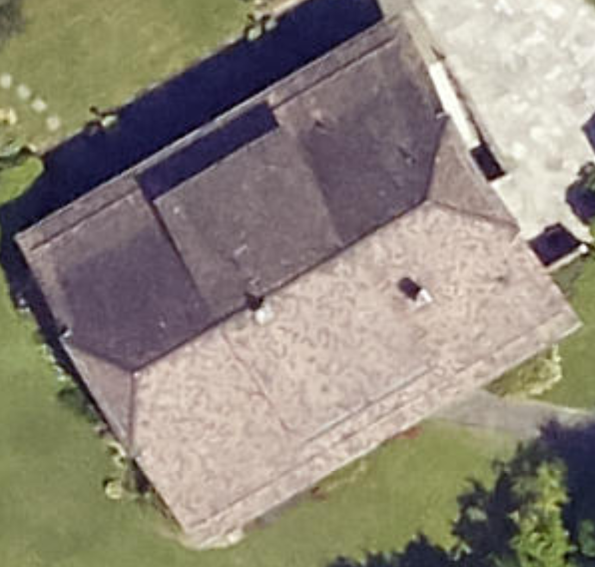
<figcaption>Image d’exemple</figcaption>
</figure>
<figure id="fig:ch3_piste_exploree_classification_03_couche_toiture">
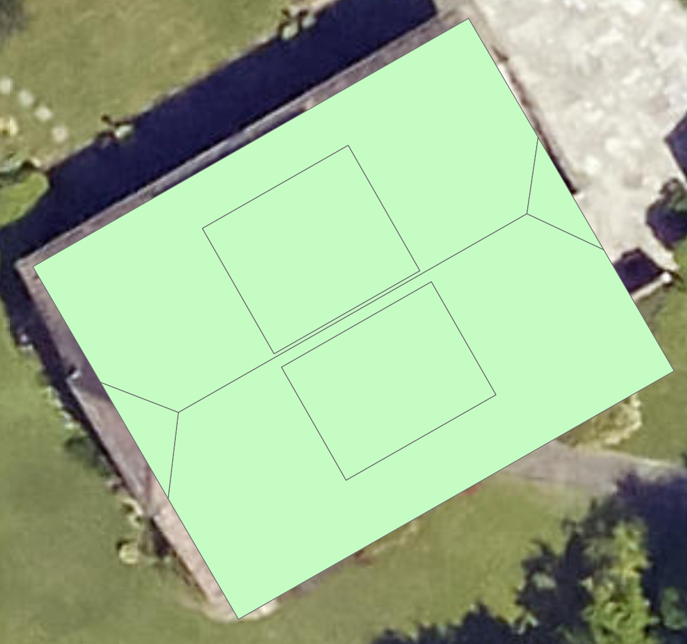
<figcaption>Couche toiture superposée</figcaption>
</figure>
<figure id="fig:ch3_piste_exploree_classification_04_image_resultante">
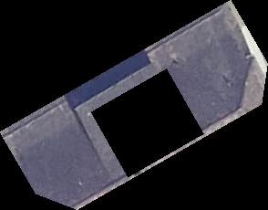
<figcaption>Résultat final</figcaption>
</figure>
<figcaption>Exemple de toiture avec un "trou" et sans superstructure</figcaption>
</figure>

#### Résultats {#résultats-8}

La Figure [3.88](#fig:ch3_piste_exploree_classification_05_classification_simplified){reference-type="ref" reference="fig:ch3_piste_exploree_classification_05_classification_simplified"} représente la classification intermédiaire selon la présence d’un polygone à l’intérieur de la toiture et de la présence de superstructure (voir Figure [3.83](#fig:ch3_piste_exploree_classification_01_workflow){reference-type="ref" reference="fig:ch3_piste_exploree_classification_01_workflow"}). La grande majorité des toitures sont classées comme "3a", c’est à dire des toitures qui n’ont pas de superstructure ni d’autre polygone à l’intérieur. Ce sont des toitures à priori libres.

La Figure [3.89](#fig:ch3_piste_exploree_classification_06_classification_finale){reference-type="ref" reference="fig:ch3_piste_exploree_classification_06_classification_finale"} montre la classification finale en 3 classes. Les résultats indiquent que quasiment toutes les toitures sont libres, ce qui est loin d’être le cas. Le problème est la couche des superstructures, celle-ci n’est pas complète et pas tous les éléments en dessous de 9 m<sup>2</sup> sont représentés. La classification ne tient pas en compte de la réalité terrain et sa précision et pertinence va dépendre de la qualité des données géomatiques utilisées.

<figure id="fig:ch3_piste_exploree_classification_05_classification_simplified" data-latex-placement="H">
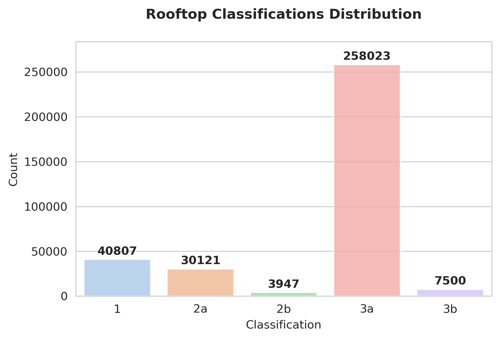
<figcaption>Classification intermédiaire</figcaption>
</figure>

<figure id="fig:ch3_piste_exploree_classification_06_classification_finale" data-latex-placement="H">
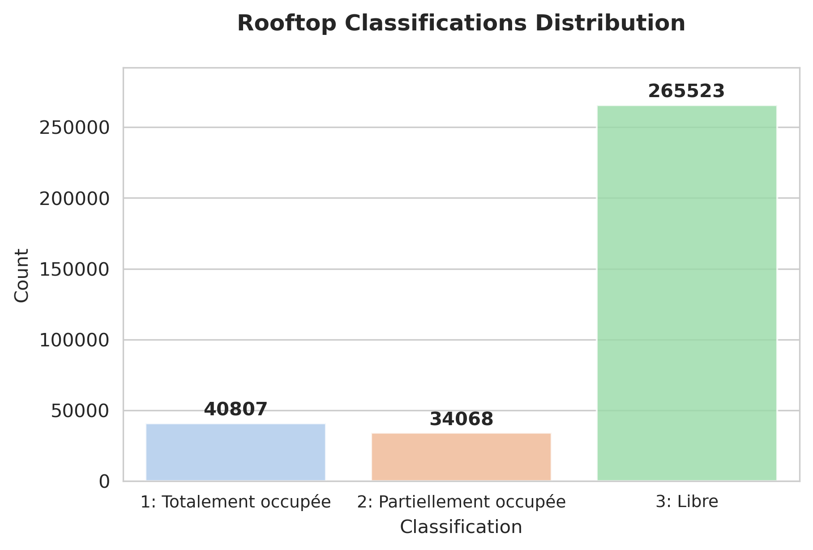
<figcaption>Classification finale</figcaption>
</figure>

La Figure [3.94](#fig:piste_exploree_classification_resultats_explications){reference-type="ref" reference="fig:piste_exploree_classification_resultats_explications"} représente un exemple de la problématique, les superstructures présentes sur le toit (Figure [3.92](#fig:ch3_piste_exploree_classification_10_resultats_image_sp){reference-type="ref" reference="fig:ch3_piste_exploree_classification_10_resultats_image_sp"}) ne sont pas toutes représentées (Figure [3.90](#fig:ch3_piste_exploree_classification_07_resultats_image_exemple){reference-type="ref" reference="fig:ch3_piste_exploree_classification_07_resultats_image_exemple"}). La couche des toitures (Figure [3.91](#fig:ch3_piste_exploree_classification_08_resultats_image_toiture){reference-type="ref" reference="fig:ch3_piste_exploree_classification_08_resultats_image_toiture"}) inclus aussi des balcons et terrasses, ce qui complique significativement la tâche de classification. Il n’y a pas le découpage pour cette toiture (similaire Figure [3.86](#fig:ch3_piste_exploree_classification_04_image_resultante){reference-type="ref" reference="fig:ch3_piste_exploree_classification_04_image_resultante"}), car il y a un bug dans le script qui classifie et découpe les toitures. Finalement, il y a aussi des problèmes d’alignement entre les orthophotos et les superstructures qui rendent peu fiables les découpes nécessaires pour enlever les superstructures des toitures dans la dernière phase de la classification.

<figure id="fig:piste_exploree_classification_resultats_explications" data-latex-placement="H">
<figure id="fig:ch3_piste_exploree_classification_07_resultats_image_exemple">
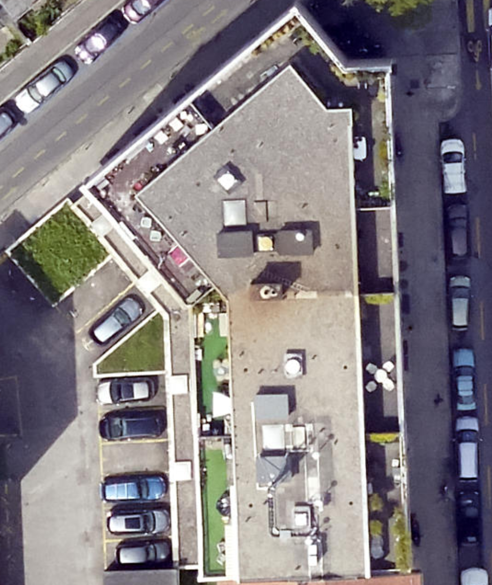
<figcaption>Image d’exemple</figcaption>
</figure>
<figure id="fig:ch3_piste_exploree_classification_08_resultats_image_toiture">
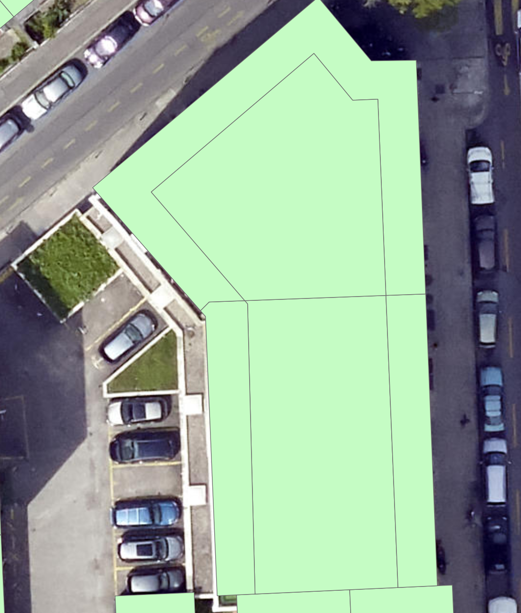
<figcaption>Couche des toitures</figcaption>
</figure>
<figure id="fig:ch3_piste_exploree_classification_10_resultats_image_sp">
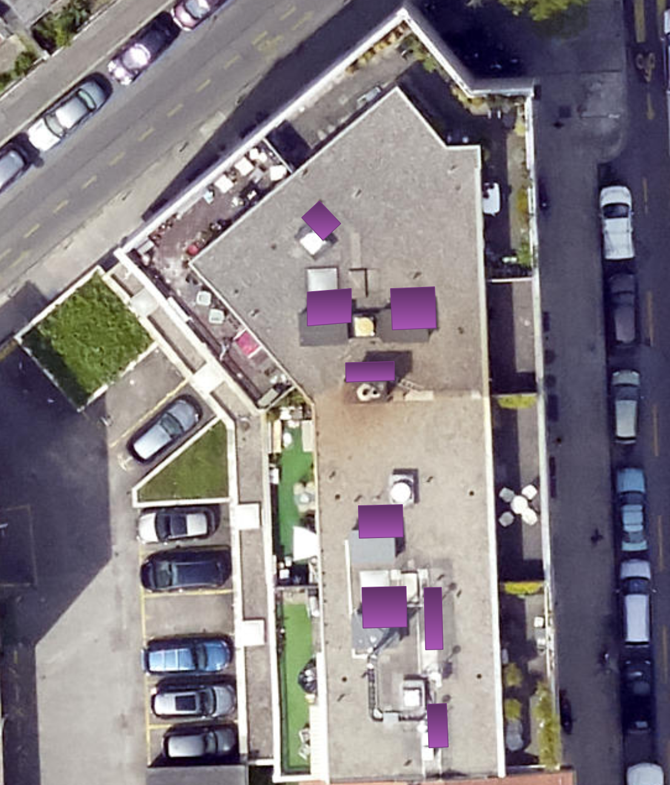
<figcaption>Couche des superstructures</figcaption>
</figure>
<figure id="fig:ch3_piste_exploree_classification_09_resultats_image__toiture_sp">
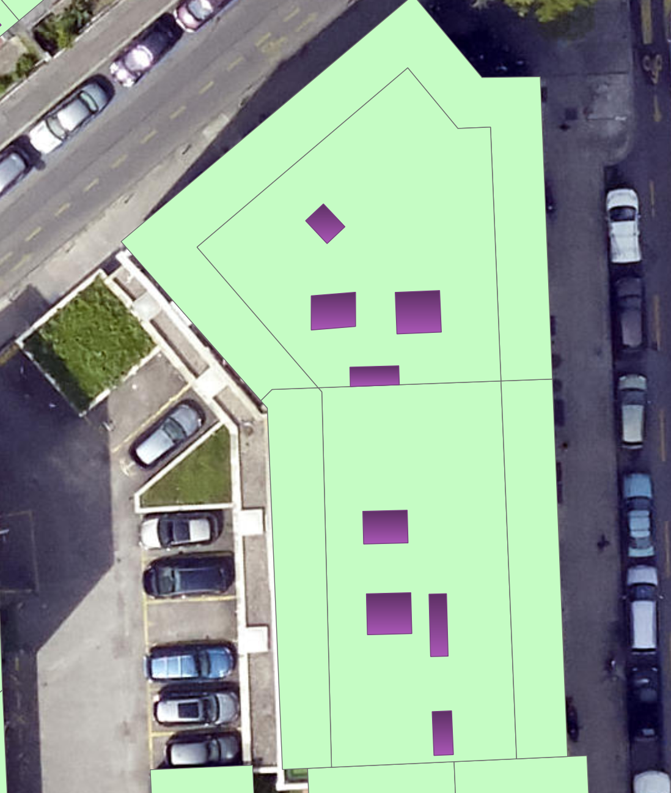
<figcaption>Couche des toitures et superstructures</figcaption>
</figure>
<figcaption>Exemple de toiture problématique pour la classification</figcaption>
</figure>

Pour conclure, les différents problèmes rencontrés et le manque de fiabilité du résultat final ont fait que la piste de la classification n’a pas été retenue.

### <a href="../glossary.html#gloss-sam"><span data-acronym-label="sam" data-acronym-form="singular+abbrv">sam</span></a> {#sam}

Une autre piste explorée est l’utilisation du segment-anything-model (<a href="../glossary.html#gloss-sam"><span data-acronym-label="sam" data-acronym-form="singular+abbrv">sam</span></a>). Cet algorithme présente l’avantage de permettre une segmentation efficace sur des images sur lesquelles <a href="../glossary.html#gloss-sam"><span data-acronym-label="sam" data-acronym-form="singular+abbrv">sam</span></a> n’a pas été spécifiquement entraîné. <a href="../glossary.html#gloss-stdl"><span data-acronym-label="stdl" data-acronym-form="singular+abbrv">stdl</span></a> avait déjà exploré cette piste dans la sous-section (voir page ) avec quelques différences entre les méthodologies utilisées.

#### Méthodologie {#méthodologie-13}

La Figure [3.101](#fig:essai_algo_sam){reference-type="ref" reference="fig:essai_algo_sam"} résume les différentes étapes:

1.  Mettre en noir tout ce qui est hors toiture (Figure [3.95](#fig:ch3_essai_sam_01_image_original){reference-type="ref" reference="fig:ch3_essai_sam_01_image_original"})

2.  Détermination zone d’intêret (Figure [3.96](#fig:ch3_essai_sam_02_ROI){reference-type="ref" reference="fig:ch3_essai_sam_02_ROI"})

3.  <a href="../glossary.html#gloss-sam"><span data-acronym-label="sam" data-acronym-form="singular+abbrv">sam</span></a> va segmenter toute l’image (Figure [3.97](#fig:ch3_essai_sam_03_200_masks){reference-type="ref" reference="fig:ch3_essai_sam_03_200_masks"})

4.  Filtrer les masques (polygones segmentés) (Figure [3.98](#fig:ch3_essai_sam_04_194_filtered_masks){reference-type="ref" reference="fig:ch3_essai_sam_04_194_filtered_masks"})

5.  Visualisation des masques filtrés avec des couleurs plus vives pour vérification visuelle (Figure [3.99](#fig:ch3_essai_sam_05_filtered_masks_overlay){reference-type="ref" reference="fig:ch3_essai_sam_05_filtered_masks_overlay"})

6.  Détermination de l’espace libre (Figure [3.100](#fig:ch3_essai_sam_06_une_zone_libre){reference-type="ref" reference="fig:ch3_essai_sam_06_une_zone_libre"})

La première étape (Figure [3.95](#fig:ch3_essai_sam_01_image_original){reference-type="ref" reference="fig:ch3_essai_sam_01_image_original"}) est de fusionner tous les polygones qui délimitent la toiture. Ce grand polygone de toiture va permettre de centrer l’attention de <a href="../glossary.html#gloss-sam"><span data-acronym-label="sam" data-acronym-form="singular+abbrv">sam</span></a> sur la toiture, les zones hors toitures peuvent être considérées comme du bruit et mises en noir. Un avantage notable de cette démarche est d’éviter du temps de calcul à <a href="../glossary.html#gloss-sam"><span data-acronym-label="sam" data-acronym-form="singular+abbrv">sam</span></a>.

La deuxième étape (Figure [3.96](#fig:ch3_essai_sam_02_ROI){reference-type="ref" reference="fig:ch3_essai_sam_02_ROI"}) est de déterminer la zone d’intérêt (ROI). Cette étape utilise la librairie python pillow et permet de mettre en évidence les zones sombres à l’intérieur de la toiture.

La troisième étape (Figure [3.97](#fig:ch3_essai_sam_03_200_masks){reference-type="ref" reference="fig:ch3_essai_sam_03_200_masks"}) utilise l’algorithme <a href="../glossary.html#gloss-sam"><span data-acronym-label="sam" data-acronym-form="singular+abbrv">sam</span></a> pour réaliser la segmentation complète de l’image de la Figure [3.95](#fig:ch3_essai_sam_01_image_original){reference-type="ref" reference="fig:ch3_essai_sam_01_image_original"}. Dans ce cas, un total de 200 masques sont segmentés. Le temps de calcul est de 7 minutes pour une image de toiture. <a href="../glossary.html#gloss-sam"><span data-acronym-label="sam" data-acronym-form="singular+abbrv">sam</span></a> dispose de plusieurs paramètres qui peuvent augmenter significativement le temps de calcul; <a href="../glossary.html#gloss-sam"><span data-acronym-label="sam" data-acronym-form="singular+abbrv">sam</span></a> peut par exemple diviser l’image en plusieurs parties pour améliorer la segmentation, plus cette partition est fine, meilleurs seront les résultats. La documentation de <a href="../glossary.html#gloss-sam"><span data-acronym-label="sam" data-acronym-form="singular+abbrv">sam</span></a> est assez rudimentaire et n’explique pas clairement toutes les options disponibles.

La quatrième étape (Figure [3.98](#fig:ch3_essai_sam_04_194_filtered_masks){reference-type="ref" reference="fig:ch3_essai_sam_04_194_filtered_masks"}) consiste à filtrer les polygones segmentés selon trois critères principaux :

- Recouvrement avec la ROI : les masques doivent avoir un recouvrement supérieur à 50% avec la zone d’intérêt

- Taille minimale : élimination des polygones de moins de 50 pixels (paramètre <a href="../glossary.html#gloss-sam"><span data-acronym-label="sam" data-acronym-form="singular+abbrv">sam</span></a>) et suppression additionnelle des masques avec moins de 100 pixels

- Qualité de segmentation : utilisation des seuils <a href="../glossary.html#gloss-sam"><span data-acronym-label="sam" data-acronym-form="singular+abbrv">sam</span></a> avec un IoU prédit &gt; 0.85 et un score de stabilité &gt; 0.85

Cette étape réduit le nombre de masques de 200 à 194, éliminant principalement les artefacts de segmentation hors toiture et les zones trop petites.

La cinquième étape (Figure [3.99](#fig:ch3_essai_sam_05_filtered_masks_overlay){reference-type="ref" reference="fig:ch3_essai_sam_05_filtered_masks_overlay"}) propose une visualisation colorée des masques filtrés pour faciliter la vérification visuelle des résultats de segmentation.

La sixième étape (Figure [3.100](#fig:ch3_essai_sam_06_une_zone_libre){reference-type="ref" reference="fig:ch3_essai_sam_06_une_zone_libre"}) détermine l’espace libre en combinant plusieurs critères :

- Critères géométriques:

  - Zone tampon de 0.5 m autour des obstacles détectés

  - Ratio de largeur/hauteur pour éliminer les masques long mais pas suffisament larges pour être intéressants pour la pose de panneaux solaires

  - Taille du masque minimum de 10 m² par défaut (soit 4000 pixels à 5 cm/pixel)

- Critère de luminosité:

  - Filtre sur les zone sombres qui ont une luminosité de moins de 60% de la moyenne globale de l’image

<figure id="fig:essai_algo_sam" data-latex-placement="H">
<figure id="fig:ch3_essai_sam_01_image_original">
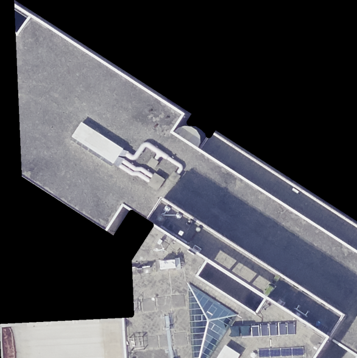
<figcaption>Image d’exemple</figcaption>
</figure>
<figure id="fig:ch3_essai_sam_02_ROI">
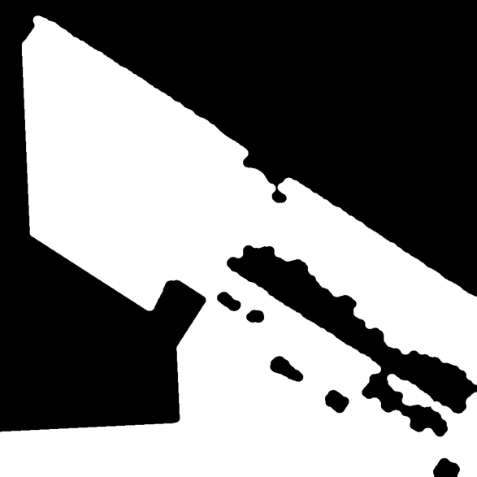
<figcaption>Zone d’intérêt (ROI)</figcaption>
</figure>
<figure id="fig:ch3_essai_sam_03_200_masks">
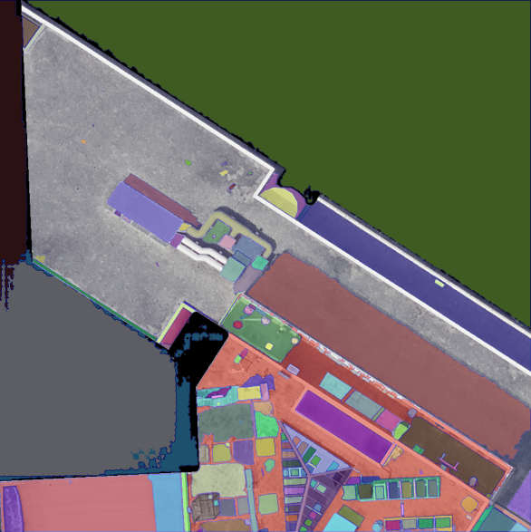
<figcaption>Polygones segmentés (200)</figcaption>
</figure>
<figure id="fig:ch3_essai_sam_04_194_filtered_masks">
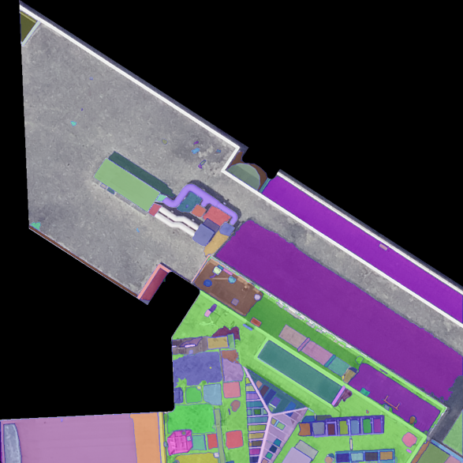
<figcaption>Polygone segmentés filtrés (194)</figcaption>
</figure>
<figure id="fig:ch3_essai_sam_05_filtered_masks_overlay">
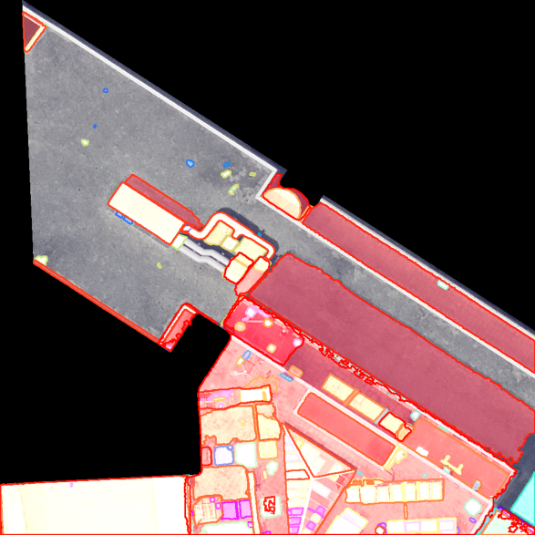
<figcaption>Mise en évidence des polygones filtrés</figcaption>
</figure>
<figure id="fig:ch3_essai_sam_06_une_zone_libre">
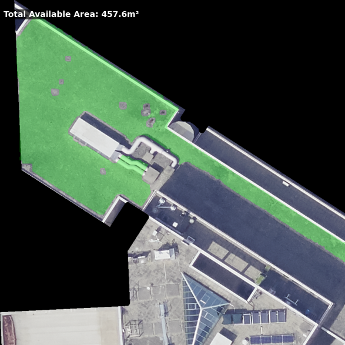
<figcaption>Espace libre</figcaption>
</figure>
<figcaption>Essai d’utilisation de <a href="../glossary.html#gloss-sam"><span data-acronym-label="sam" data-acronym-form="singular+abbrv">sam</span></a></figcaption>
</figure>

#### Fine-tuning de <a href="../glossary.html#gloss-sam"><span data-acronym-label="sam" data-acronym-form="singular+abbrv">sam</span></a> {#subsubsec:fine_tuning_sam}

La piste d’un fine-tuning de <a href="../glossary.html#gloss-sam"><span data-acronym-label="sam" data-acronym-form="singular+abbrv">sam</span></a> pour mieux l’adapter à la tâche d’identification des espaces libres a été explorée. Un dataset de 45 images (Figure [3.102](#fig:ch3_piste_exploree_classification_11_fine_tuning_dataset){reference-type="ref" reference="fig:ch3_piste_exploree_classification_11_fine_tuning_dataset"}) n’a pas permis d’améliorer significativement les performances du modèle. Une des problématiques rencontrées lors de la création de ce dataset est qu’il faut identifier tous les obstacles présents sur la toiture, ce qui prend énormément de temps et nécessite une grande quantité de classes différentes.

<figure id="fig:ch3_piste_exploree_classification_11_fine_tuning_dataset" data-latex-placement="H">
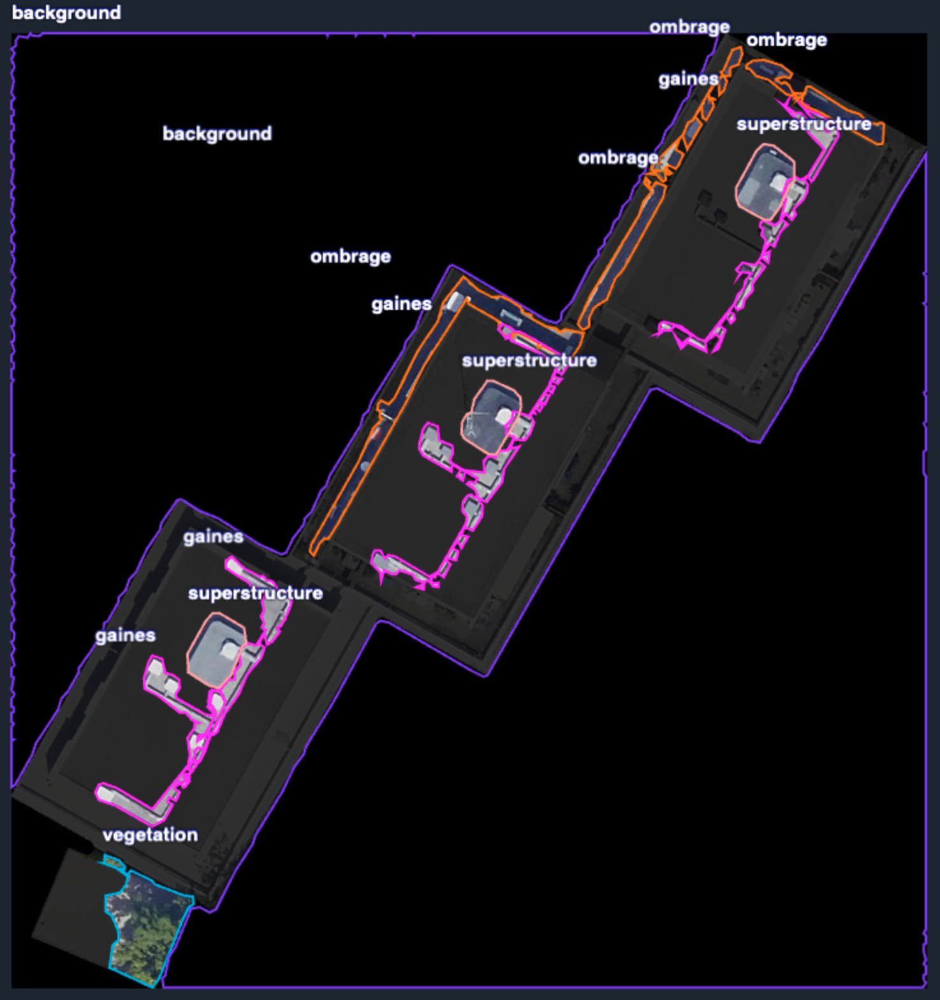
<figcaption>Image du dataset pour le fine-tuning <a href="../glossary.html#gloss-sam"><span data-acronym-label="sam" data-acronym-form="singular+abbrv">sam</span></a></figcaption>
</figure>

#### Résultats {#résultats-9}

<a href="../glossary.html#gloss-sam"><span data-acronym-label="sam" data-acronym-form="singular+abbrv">sam</span></a> segmente correctement les toitures bien éclairées avec un contraste suffisant entre obstacles et surface. Les résultats se dégradent significativement en présence d’ombrages ou de faible contraste.

Les principales limitations sont:

- Principal problème rencontré sont les ombrages. <a href="../glossary.html#gloss-sam"><span data-acronym-label="sam" data-acronym-form="singular+abbrv">sam</span></a> confond les zones ombragées avec l’arrière-plan noir, même avec les filtres de luminosité implémentés. Cela génère des faux négatifs dans les zones ombragées.

- Le temps de calcul par image est de 7 minutes (sur <a href="../glossary.html#gloss-gpu"><span data-acronym-label="gpu" data-acronym-form="singular+abbrv">gpu</span></a>), ce qui confirme les résultats de <a href="../glossary.html#gloss-stdl"><span data-acronym-label="stdl" data-acronym-form="singular+abbrv">stdl</span></a>. La mise à l’échelle du canton est problématique.

- Les performances de segmentation sont directement corrélées à la résolution et au contraste de l’image d’entrée.

Le fine-tuning avec 45 images annotées n’améliore pas les performances. Le dataset reste trop petit pour un modèle de cette complexité, et l’annotation manuelle de tous les obstacles de toiture est très chronophage.

Pour conclure, <a href="../glossary.html#gloss-sam"><span data-acronym-label="sam" data-acronym-form="singular+abbrv">sam</span></a> fonctionne bien sur des images de qualité avec un bon éclairage, par contre son utilité reste limitée à cause des ombrages et du temps de calcul nécessaire.

## Synthèse {#synthèse-1}

Ce chapitre a présenté la méthodologie complète pour développer un modèle de segmentation sémantique capable d’identifier les espaces libres sur les toitures du canton de Genève. La démarche s’articule autour de trois phases principales : la définition de la tâche et sélection de l’algorithme, la création d’un dataset d’entraînement adapté, et le développement du modèle.

##### Approche retenue {#approche-retenue}

La segmentation sémantique a été choisie comme algorithme principal après l’analyse réalisée dans le chapitre précédent. Cette approche permet d’identifier pixel par pixel les zones libres sur les toitures, offrant une précision supérieure aux méthodes de classification ou de segmentation d’instance.

##### Dataset créé {#dataset-créé}

La constitution du dataset représente l’effort principal de ce travail :

- Données sources : orthophotos 2019 de <a href="../glossary.html#gloss-sitg"><span data-acronym-label="sitg" data-acronym-form="singular+abbrv">sitg</span></a> (436 tuiles, 700 GB) et données vectorielles des bâtiments, enrichies d’une classification <a href="../glossary.html#gloss-sia"><span data-acronym-label="sia" data-acronym-form="singular+short">sia</span></a>

- Préparation : découpage de 38294 tuiles de pixels avec recouvrement de 256 pixels, couvrant 77993 <a href="../glossary.html#gloss-egid"><span data-acronym-label="egid" data-acronym-form="singular+short">egid</span></a> uniques

- Sélection : échantillonnage stratifié basé sur la classe <a href="../glossary.html#gloss-sia"><span data-acronym-label="sia" data-acronym-form="singular+short">sia</span></a> dominante et la surface des toitures, résultant en 539 tuiles représentatives

- Annotation : processus manuel assisté par Supervisely durant 6 semaines (environ 180 heures), produisant 530 masques binaires après post-traitement

- Distribution : répartition en 5 folds pour validation croisée (441 images) et un dataset de test indépendant (89 images)

##### Modèles développés {#modèles-développés}

Deux approches complémentaires ont été implémentées :

- Segmentation Models PyTorch (SMP) : 160 combinaisons encodeur-décodeur testées, dont 89 retenues avec des IoU moyens entre 0,62 et 0,74

- YOLOv12 : 5 modèles de tailles différentes, dont 4 retenus avec des IoU entre 0,70 et 0,73

L’entraînement a exploité plusieurs optimisations techniques : précision mixte  
(FP16/FP32), accumulation de gradients, augmentation de données via Albumentations, et planification adaptative du taux d’apprentissage. Ces stratégies ont permis d’optimiser l’utilisation des ressources GPU tout en maintenant la qualité des modèles.

##### Enseignements tirés {#enseignements-tirés}

Les pistes explorées mais non retenues ont fourni des enseignements précieux :

- La classification basée uniquement sur les données géomatiques s’est révélée inadéquate en raison de l’incomplétude de la couche des superstructures

- <a href="../glossary.html#gloss-sam"><span data-acronym-label="sam" data-acronym-form="singular+abbrv">sam</span></a>, malgré ses capacités de segmentation généraliste, présente des limitations majeures : sensibilité aux ombrages, temps de calcul prohibitif (7 minutes par image), et nécessité d’un dataset conséquent pour le fine-tuning

##### Contribution principale {#contribution-principale}

La création d’un dataset annoté de haute qualité pour la segmentation des espaces libres sur toitures constitue la contribution majeure de ce travail. Ce dataset, stratifié selon les catégories <a href="../glossary.html#gloss-sia"><span data-acronym-label="sia" data-acronym-form="singular+short">sia</span></a> et les surfaces de toitures, offre une représentation équilibrée de la diversité architecturale du canton. Les modèles entraînés atteignent des performances prometteuses avec des IoU supérieurs à 0,70 pour les meilleurs d’entre eux, validant l’approche méthodologique adoptée.

L’investissement temporel considérable dans l’annotation manuelle (environ 20 minutes par image) souligne l’importance de développer des approches semi-automatiques pour étendre cette méthodologie à d’autres régions. Les résultats obtenus justifient néanmoins cet effort, offrant une base solide pour l’évaluation automatisée du potentiel solaire à l’échelle cantonale.
