# Évaluation, validation et analyse {#chap:eval_valid_modele}

Ce chapitre présente l’évaluation des modèles de segmentation développés pour identifier les espaces libres sur les toitures du canton de Genève. L’objectif est d’analyser les performances de 93 configurations sur un dataset de test indépendant pour déterminer les architectures les plus adaptées à un déploiement opérationnel.

L’évaluation suit trois axes principaux : l’analyse quantitative des performances avec plusieurs métriques (IoU, mAP, F1-score), l’étude du rapport entre performance et complexité des modèles, et la validation qualitative sur des cas réels incluant un quartier absent des données d’entraînement. Cette approche permet de sélectionner la meilleure configuration et d’identifier les améliorations nécessaires pour renforcer la robustesse du système.

## Évaluation sur le dataset de test {#évaluation-sur-le-dataset-de-test}

### Protocole d’évaluation {#protocole-dévaluation}

L’évaluation des modèles a été réalisée sur un dataset de test indépendant composé de 89 images représentatives du canton de Genève. Cette évaluation porte sur 93 configurations distinctes, comprenant 89 modèles issus de Segmentation Models PyTorch (SMP) et 4 variantes de YOLOv12. Pour garantir la robustesse des résultats, chaque configuration a été entraînée selon une validation croisée à 5 folds, permettant d’obtenir des performances moyennées et des écarts-types significatifs.

Chaque fold de l’ensemble des modèles testés a fait l’objet d’au minimum 3 entraînements. Pour l’évaluation finale, seul l’entraînement ayant obtenu le meilleur IoU parmi tous ceux réalisés pour chaque fold a été conservé. Chaque modèle dispose de 5 folds, les résultats présentés sont la moyenne des performances sur ces 5 folds.

Pour des raisons pratiques de visualisation, YOLO est intégré dans les graphiques en tant que décodeur et ses différentes variantes en tant qu’encodeurs. Cette représentation vise uniquement à faciliter la comparaison des résultats, car YOLOv12 constitue un modèle complet qui ne peut pas être divisé en composants encodeur-décodeur interchangeables comme les modèles SMP.

#### Métriques d’évaluation {#métriques-dévaluation}

Les performances des modèles ont été évaluées selon plusieurs métriques complémentaires :

- IoU (Intersection over Union) : métrique principale mesurant le recouvrement entre les prédictions et les annotations de référence

- mAP@k : mean average precision à différents seuils d’IoU (50%, 75%, 95%)

- F1-score : moyenne harmonique entre precision et recall

- Métriques classiques : accuracy, precision et recall

Les aspects computationnels ont également été mesurés :

- Temps d’entraînement total pour les 5 fold

- Nombre de paramètres du modèle (en millions)

### Vue d’ensemble des performances {#vue-densemble-des-performances}

#### Distribution globale des résultats {#distribution-globale-des-résultats}

Le Tableau [4.1](#tab:vue_ensemble_metrique_moyennes){reference-type="ref" reference="tab:vue_ensemble_metrique_moyennes"} présente les statistiques de base des 93 modèles évalués. Ils présentent des IoU s’échelonnant de 0,619 à 0,741, avec une moyenne de 0,708 et un écart-type de 0,024. Cette faible dispersion témoigne de la qualité générale des architectures modernes de segmentation sur cette tâche spécifique.

| **Métrique** | **Moyenne** | **Médiane** | **Minimum** | **Maximum** |
|:---|---:|---:|---:|---:|
| IoU | 0.708 ± 0.024 | 0.711 | 0.619 | 0.741 |
| F1 Score | 0.775 ± 0.048 | 0.787 | 0.544 | 0.810 |
| mAP@0.5 | 0.818 ± 0.056 | 0.834 | 0.556 | 0.854 |
| mAP@0.75 | 0.592 ± 0.073 | 0.609 | 0.347 | 0.694 |
| mAP@0.95 | 0.109 ± 0.036 | 0.110 | 0.029 | 0.191 |
| Accuracy | 0.946 ± 0.101 | 0.968 | 0.451 | 0.976 |
| Recall | 0.816 ± 0.043 | 0.823 | 0.616 | 0.872 |
| Precision | 0.773 ± 0.043 | 0.786 | 0.577 | 0.812 |
| Temps d’entraînement (h.) | 20.266 ± 10.698 | 19.557 | 1.792 | 48.268 |

<em>Statistiques générales des modèles évalués sur le dataset de test</em>

La Figure [4.1](#fig:heatmap_iou){reference-type="ref" reference="fig:heatmap_iou"} présente une vue synthétique des performances pour chaque combinaison encodeur-décodeur.

<figure id="fig:heatmap_iou" data-latex-placement="H">
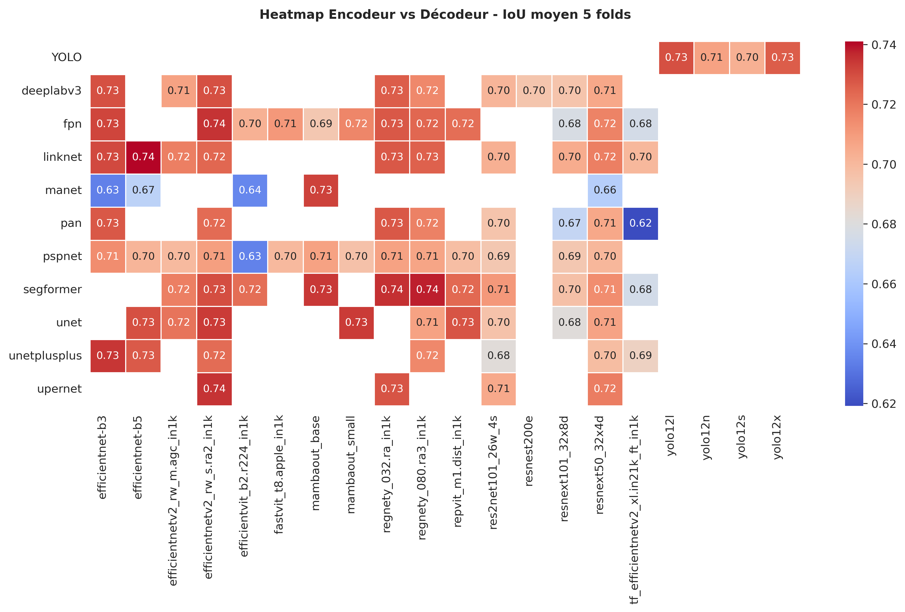
<figcaption>Heatmap IoU par combinaison encodeur-décodeur</figcaption>
</figure>

Certaines combinaisons d’encodeur et de décodeur présentent des cases vides car elles ont échoué lors de l’entraînement. L’échec peut être dû à de très mauvaises performances avec un IoU inférieur à 0,2, ce qui indique que le modèle n’a pas réussi à apprendre les caractéristiques de la tâche. D’autres échecs résultent d’incompatibilités entre les encodeurs et décodeurs, certains d’entre eux nécessitant des réglages très spécifiques qui n’ont pas été explorés par manque de temps.

Par exemple, YOLOv12m obtient un IoU de 0,11, ce qui est relativement surprenant comparé aux performances des autres modèles de la famille YOLOv12.

Ces modèles semblent tous présenter des résultats exceptionnels à première vue, mais il est important de visualiser le F1-score (Figure [4.2](#fig:ch4_01_architecture_backbone_heatmap_08_eval_test_f1_score_mean){reference-type="ref" reference="fig:ch4_01_architecture_backbone_heatmap_08_eval_test_f1_score_mean"}) pour mieux comprendre la qualité des prédictions. Le F1-score constitue une métrique plus robuste car elle prend en compte à la fois la precision et le rappel, ce qui s’avère crucial pour les tâches de segmentation où les faux positifs et les faux négatifs peuvent avoir un impact significatif.

<figure id="fig:ch4_01_architecture_backbone_heatmap_08_eval_test_f1_score_mean" data-latex-placement="H">
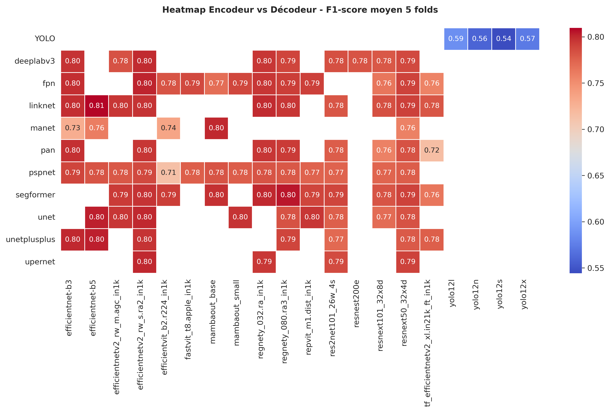
<figcaption>Heatmap F1-score par combinaison encodeur-décodeur</figcaption>
</figure>

Les modèles YOLOv12 présentent des F1-scores significativement plus faibles que les modèles SMP, malgré des IoU similaires. Cette observation indique que les modèles YOLO peinent à segmenter correctement les espaces libres sur les toitures, ce qui constitue un aspect crucial pour cette tâche. Par exemple, YOLOv12n atteint un IoU de 0,73 mais un F1-score de seulement 0,57, suggérant qu’il génère un nombre important de faux positifs ou de faux négatifs.

#### Top 10 des modèles {#top-10-des-modèles}

La Figure [4.3](#fig:ch4_02_top_models_performance_01_eval_test_iou_mean){reference-type="ref" reference="fig:ch4_02_top_models_performance_01_eval_test_iou_mean"} illustre les 10 meilleurs modèles selon leur IoU.

<figure id="fig:ch4_02_top_models_performance_01_eval_test_iou_mean" data-latex-placement="H">
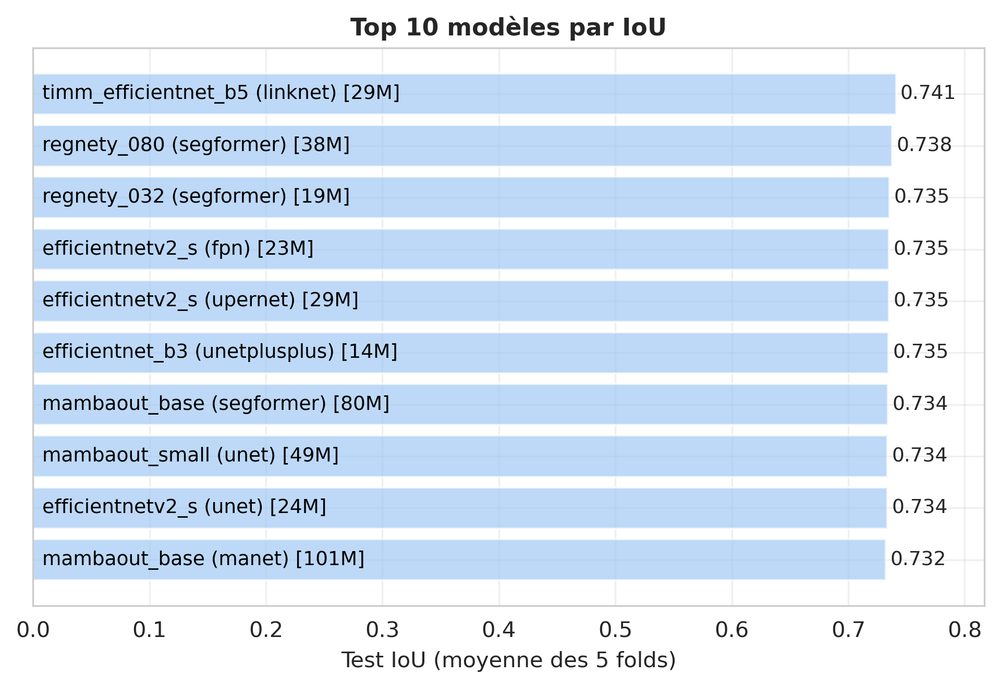
<figcaption>Top 10 des modèles par IoU moyen sur dataset de test</figcaption>
</figure>

Les Figures [4.4](#fig:ch4_02_top_models_performance_02_eval_test_map_50_mean){reference-type="ref" reference="fig:ch4_02_top_models_performance_02_eval_test_map_50_mean"}, [4.5](#fig:ch4_02_top_models_performance_03_eval_test_map_75_mean){reference-type="ref" reference="fig:ch4_02_top_models_performance_03_eval_test_map_75_mean"} et [4.6](#fig:ch4_02_top_models_performance_04_eval_test_map_95_mean){reference-type="ref" reference="fig:ch4_02_top_models_performance_04_eval_test_map_95_mean"} présentent les performances des modèles selon la métrique mAP à différents seuils d’IoU (0.5, 0.75 et 0.95). La Figure [4.7](#fig:ch4_02_top_models_performance_08_eval_test_f1_score_mean){reference-type="ref" reference="fig:ch4_02_top_models_performance_08_eval_test_f1_score_mean"} présente les performances des modèles selon le F1-score.

<figure id="fig:ch4_02_top_models_performance_02_eval_test_map_50_mean" data-latex-placement="H">
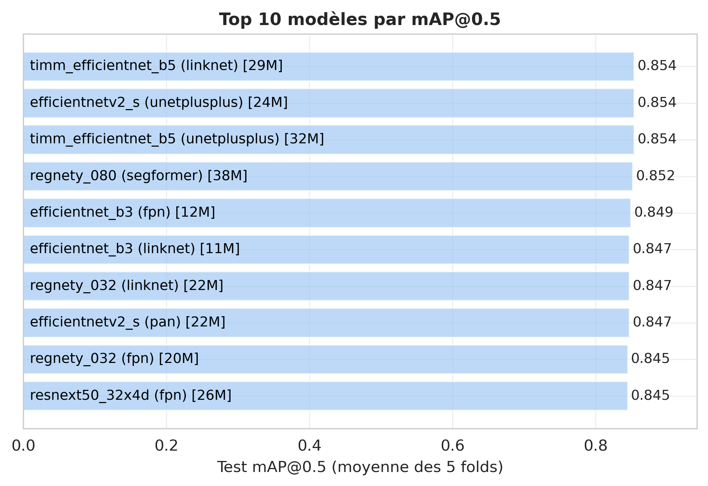
<figcaption>Top 10 des modèles par mAP@0.5 moyen sur dataset de test</figcaption>
</figure>

<figure id="fig:ch4_02_top_models_performance_03_eval_test_map_75_mean" data-latex-placement="H">
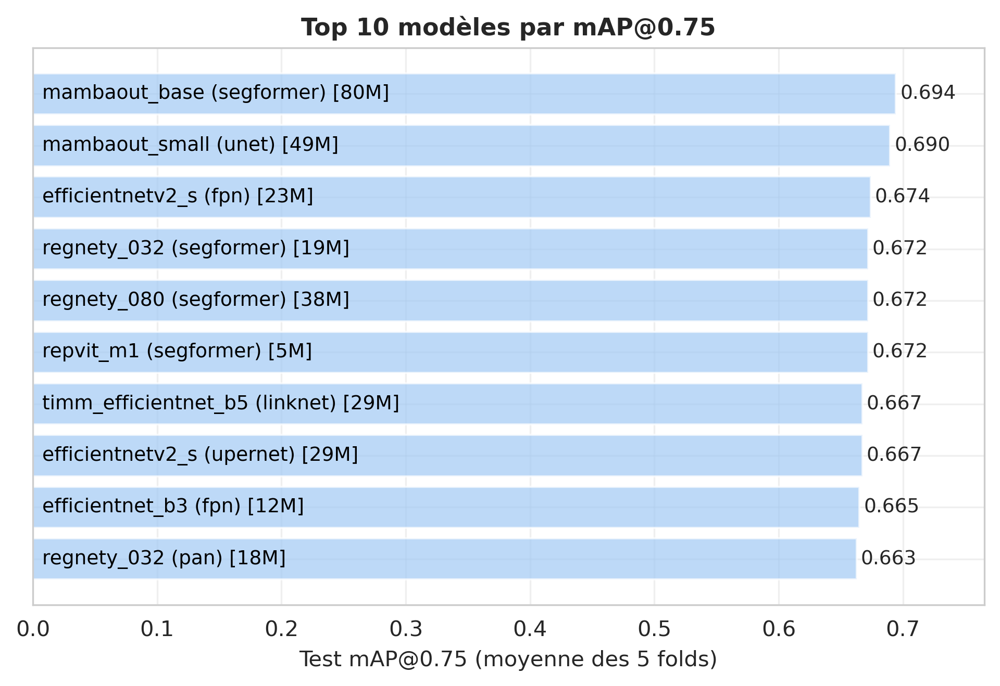
<figcaption>Top 10 des modèles par mAP@0.75 moyen sur dataset de test</figcaption>
</figure>

<figure id="fig:ch4_02_top_models_performance_04_eval_test_map_95_mean" data-latex-placement="H">
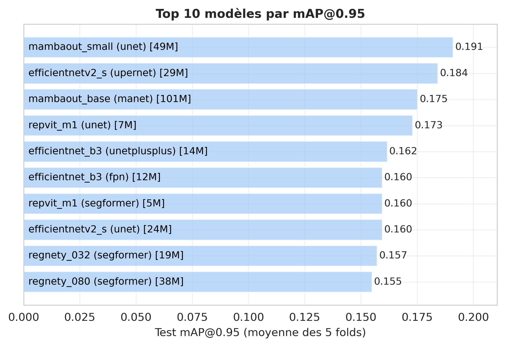
<figcaption>Top 10 des modèles par mAP@0.95 moyen sur dataset de test</figcaption>
</figure>

<figure id="fig:ch4_02_top_models_performance_08_eval_test_f1_score_mean" data-latex-placement="H">
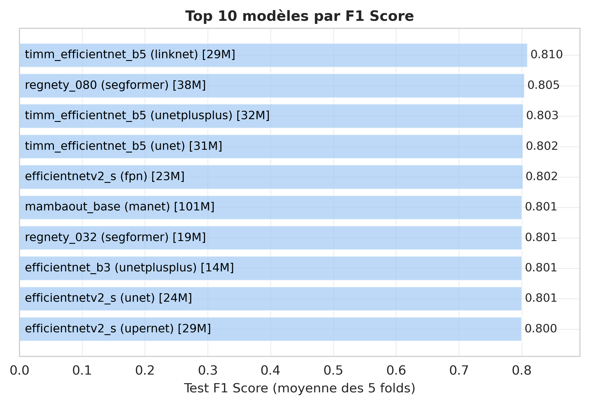
<figcaption>Top 10 des modèles par F1-score moyen sur dataset de test</figcaption>
</figure>

En résumé, le Tableau [4.2](#tab:top10_modeles){reference-type="ref" reference="tab:top10_modeles"} présente les 10 meilleurs modèles selon l’IoU moyen sur les 5 fold :

| Modèle           |  IoU  | F1-Score | mAP@50 | mAP@75 | mAP@95 | Params (M) | Temps (h) |
|:-----------------|:-----:|:--------:|:------:|:------:|:------:|:----------:|:---------:|
|                  |       |          |        |        |        |            |           |
| EfficientNet-B5  | 0.741 |  0.810   | 0.854  | 0.667  | 0.151  |   28.75    |   18.11   |
|                  |       |          |        |        |        |            |           |
| RegNetY-080      | 0.738 |  0.805   | 0.852  | 0.672  | 0.155  |   38.41    |   9.29    |
|                  |       |          |        |        |        |            |           |
| RegNetY-032      | 0.735 |  0.801   | 0.831  | 0.672  | 0.157  |   18.87    |   30.62   |
|                  |       |          |        |        |        |            |           |
| EfficientNetV2-S | 0.735 |  0.802   | 0.834  | 0.674  | 0.153  |   23.42    |   19.56   |
|                  |       |          |        |        |        |            |           |
| EfficientNetV2-S | 0.735 |  0.800   | 0.840  | 0.667  | 0.184  |   29.13    |   27.75   |
|                  |       |          |        |        |        |            |           |
| EfficientNet-B5  | 0.735 |  0.801   | 0.843  | 0.661  | 0.162  |   13.63    |   31.28   |
|                  |       |          |        |        |        |            |           |
| mambaout\_base   | 0.734 |  0.797   | 0.820  | 0.694  | 0.153  |   80.06    |   5.93    |
|                  |       |          |        |        |        |            |           |
| mambaout\_small  | 0.734 |  0.796   | 0.827  | 0.690  | 0.191  |   48.52    |   8.95    |
|                  |       |          |        |        |        |            |           |
| EfficientNetV2-S | 0.734 |  0.801   | 0.845  | 0.647  | 0.160  |   23.94    |   23.45   |
|                  |       |          |        |        |        |            |           |
| mambaout\_small  | 0.732 |  0.801   | 0.845  | 0.656  | 0.175  |   100.61   |   9.94    |

<em>Top 10 des modèles par IoU moyen sur dataset de test</em>

Le mAP (mean Average Precision) constitue une métrique qui évalue la capacité d’un modèle à détecter et délimiter avec précision les espaces libres sur les toitures. Le mAP permet de vérifier non seulement si le modèle identifie les bonnes zones, mais aussi à quel point il les délimite précisément.

L’IoU représente le rapport entre la surface de chevauchement et la surface totale couverte par la prédiction du modèle et la vérité terrain. Un IoU de 0,5 signifie que la zone détectée chevauche d’au moins 50% avec la zone réelle. Plus le seuil IoU est élevé, plus la détection doit être précise pour être considérée comme correcte.

Le mAP se décline en plusieurs variantes selon le niveau de précision requis :

- mAP@50

  - Accepte les détections avec 50% de chevauchement minimum

  - Suffisant pour identifier l’emplacement général des espaces libres

- mAP@75

  - Exige 75% de chevauchement minimum

  - Assure que les contours détectés sont relativement fidèles à la réalité

- mAP@95

  - Requiert 95% de chevauchement minimum

  - Segmentation très précise et fiable

Un modèle performant devra atteindre des scores élevés sur ces trois seuils pour être considéré comme adapté à une utilisation opérationnelle.

L’analyse du mAP@95 (Figure [4.6](#fig:ch4_02_top_models_performance_04_eval_test_map_95_mean){reference-type="ref" reference="fig:ch4_02_top_models_performance_04_eval_test_map_95_mean"}) révèle qu’UNet avec mambaout\_small obtient les meilleures performances avec un score de 0,191. Ce modèle affiche également un mAP@75 de 0,690 et un mAP@50 de 0,827. UNet++ avec EfficientNet-B5 se distingue également avec un mAP@95 de 0,162, accompagné d’un mAP@75 de 0,661 et d’un mAP@50 de 0,843.

Ces performances indiquent que ces modèles sont capables de segmenter précisément les espaces libres sur les toitures, même dans des conditions architecturales complexes, ce qui confirme leur potentiel pour une application opérationnelle.

### Analyse comparative des architectures {#analyse-comparative-des-architectures}

#### Performance par famille de décodeur {#performance-par-famille-de-décodeur}

L’analyse des performances par décodeur selon les métriques IoU (Figure [4.8](#fig:ch4_06_architecture_boxplot_01_eval_test_iou_mean){reference-type="ref" reference="fig:ch4_06_architecture_boxplot_01_eval_test_iou_mean"} et Tableau [4.3](#tab:statistique_par_decodeur_iou){reference-type="ref" reference="tab:statistique_par_decodeur_iou"}) et mAP@0.95 (Figure [4.9](#fig:ch4_06_architecture_boxplot_04_eval_test_map_95_mean){reference-type="ref" reference="fig:ch4_06_architecture_boxplot_04_eval_test_map_95_mean"} et Tableau [4.4](#tab:statistique_par_decodeur_map95){reference-type="ref" reference="tab:statistique_par_decodeur_map95"}) révèle des tendances significatives.

<figure id="fig:ch4_06_architecture_boxplot_01_eval_test_iou_mean" data-latex-placement="H">
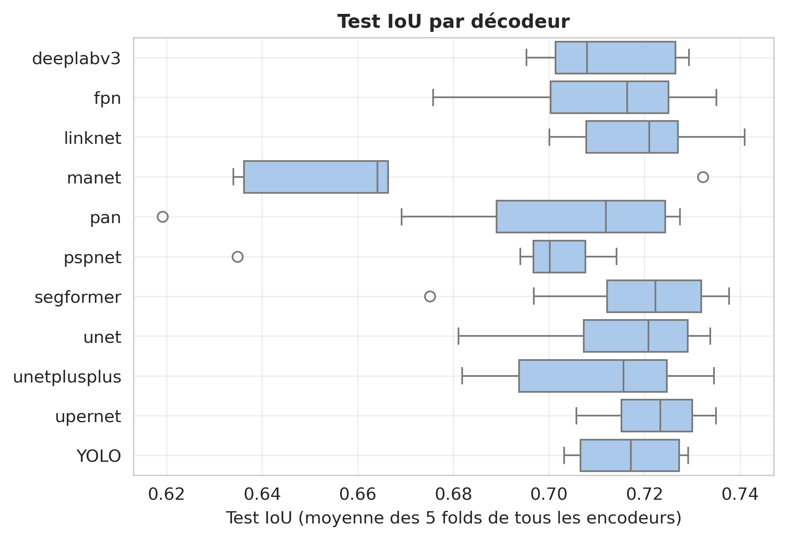
<figcaption>Boîte à moustaches IoU par décodeur</figcaption>
</figure>

|              |         |            |         |         |         |
|:-------------|:-------:|:----------:|:-------:|:-------:|:-------:|
| Décodeur     |   IoU   |            |         |         |         |
|              | Moyenne | écart-type | Médiane | Minimum | Maximum |
| YOLO         |  0.717  |   0.013    |  0.717  |  0.703  |  0.729  |
| deeplabv3    |  0.712  |   0.014    |  0.708  |  0.695  |  0.729  |
| fpn          |  0.711  |   0.020    |  0.716  |  0.676  |  0.735  |
| linknet      |  0.719  |   0.013    |  0.721  |  0.700  |  0.741  |
| manet        |  0.667  |   0.040    |  0.664  |  0.634  |  0.732  |
| pan          |  0.698  |   0.038    |  0.712  |  0.619  |  0.727  |
| pspnet       |  0.697  |   0.019    |  0.700  |  0.635  |  0.714  |
| segformer    |  0.718  |   0.019    |  0.722  |  0.675  |  0.738  |
| unet         |  0.715  |   0.018    |  0.721  |  0.681  |  0.734  |
| unetplusplus |  0.710  |   0.020    |  0.716  |  0.682  |  0.735  |
| upernet      |  0.722  |   0.013    |  0.723  |  0.706  |  0.735  |

<em>Statistiques IoU par décodeur</em>

<figure id="fig:ch4_06_architecture_boxplot_04_eval_test_map_95_mean" data-latex-placement="H">
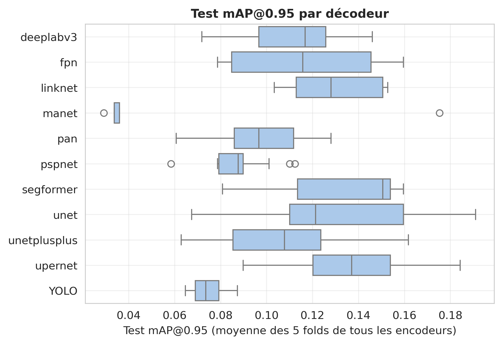
<figcaption>Boîte à moustaches mAP@95 par décodeur</figcaption>
</figure>

|              |          |            |         |         |         |
|:-------------|:--------:|:----------:|:-------:|:-------:|:-------:|
| Décodeur     | mAP@0.95 |            |         |         |         |
|              | Moyenne  | écart-type | Médiane | Minimum | Maximum |
| YOLO         |  0.075   |   0.010    |  0.074  |  0.065  |  0.087  |
| deeplabv3    |  0.110   |   0.025    |  0.117  |  0.072  |  0.146  |
| fpn          |  0.116   |   0.032    |  0.116  |  0.079  |  0.160  |
| linknet      |  0.130   |   0.021    |  0.128  |  0.103  |  0.153  |
| manet        |  0.062   |   0.064    |  0.034  |  0.029  |  0.175  |
| pan          |  0.096   |   0.023    |  0.097  |  0.061  |  0.128  |
| pspnet       |  0.087   |   0.014    |  0.088  |  0.058  |  0.112  |
| segformer    |  0.131   |   0.028    |  0.151  |  0.081  |  0.160  |
| unet         |  0.128   |   0.041    |  0.121  |  0.067  |  0.191  |
| unetplusplus |  0.107   |   0.033    |  0.108  |  0.063  |  0.162  |
| upernet      |  0.137   |   0.039    |  0.137  |  0.090  |  0.184  |

<em>Statistiques mAP@0.95 par décodeur</em>

Les décodeurs présentent des performances très variables selon les encodeurs choisis, ce qui se manifeste par la variance (largeur des boîtes) et les valeurs extrêmes (moustaches) observées dans les boîtes à moustaches. Certains décodeurs affichent néanmoins des performances globalement inférieures aux autres en termes de mAP@0.95, notamment MANet et YOLOv12.

#### Performance par encodeur {#performance-par-encodeur}

L’analyse des encodeurs avec les métriques IoU (Figure [4.10](#fig:ch4_07_backbone_boxplot_01_eval_test_iou_mean){reference-type="ref" reference="fig:ch4_07_backbone_boxplot_01_eval_test_iou_mean"} et Tableau [4.5](#tab:statistique_par_encodeur_iou){reference-type="ref" reference="tab:statistique_par_encodeur_iou"}) et mAP@0.95 (Figure [4.11](#fig:ch4_07_backbone_boxplot_04_eval_test_map_95_mean){reference-type="ref" reference="fig:ch4_07_backbone_boxplot_04_eval_test_map_95_mean"} et Tableau [4.6](#tab:statistique_par_encodeur_map95){reference-type="ref" reference="tab:statistique_par_encodeur_map95"}) révèle des différences notables.

<figure id="fig:ch4_07_backbone_boxplot_01_eval_test_iou_mean" data-latex-placement="H">
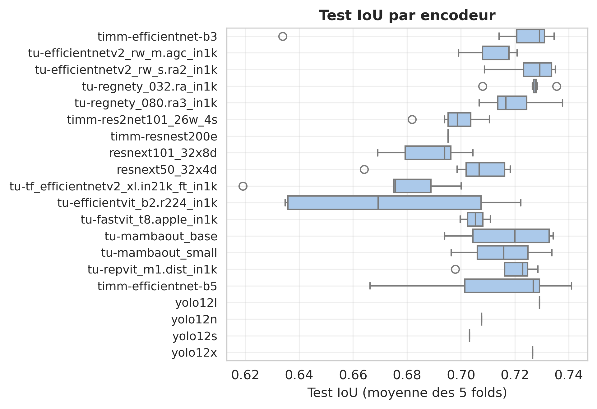
<figcaption>Boîte à moustaches IoU par encodeur</figcaption>
</figure>

|                       |         |            |         |         |         |
|:----------------------|--------:|-----------:|--------:|--------:|--------:|
| Encodeur              |     IoU |            |         |         |         |
|                       | Moyenne | écart-type | Médiane | Minimum | Maximum |
| resnext101            |   0.688 |      0.013 |   0.694 |   0.669 |   0.704 |
| resnext50             |   0.705 |      0.016 |   0.707 |   0.664 |   0.718 |
| efficientnet-b3       |   0.714 |      0.036 |   0.729 |   0.634 |   0.735 |
| efficientnet-b5       |   0.713 |      0.030 |   0.727 |   0.666 |   0.741 |
| res2net101            |   0.699 |      0.009 |   0.699 |   0.682 |   0.711 |
| resnest200e           |   0.695 |            |   0.695 |   0.695 |   0.695 |
| efficientnetv2\_rw\_m |   0.713 |      0.009 |   0.718 |   0.699 |   0.721 |
| efficientnetv2\_rw\_s |   0.727 |      0.008 |   0.729 |   0.709 |   0.735 |
| efficientvit\_b2      |   0.674 |      0.045 |   0.669 |   0.635 |   0.722 |
| fastvit\_t8           |   0.705 |      0.008 |   0.705 |   0.700 |   0.711 |
| mambaout\_base        |   0.717 |      0.020 |   0.720 |   0.694 |   0.734 |
| mambaout\_small       |   0.715 |      0.019 |   0.716 |   0.696 |   0.734 |
| regnety\_032          |   0.726 |      0.008 |   0.728 |   0.708 |   0.735 |
| regnety\_080          |   0.719 |      0.010 |   0.717 |   0.707 |   0.738 |
| repvit\_m1            |   0.718 |      0.014 |   0.723 |   0.698 |   0.729 |
| efficientnetv2\_xl    |   0.672 |      0.031 |   0.676 |   0.619 |   0.700 |
| yolo12l               |   0.729 |            |   0.729 |   0.729 |   0.729 |
| yolo12n               |   0.708 |            |   0.708 |   0.708 |   0.708 |
| yolo12s               |   0.703 |            |   0.703 |   0.703 |   0.703 |
| yolo12x               |   0.727 |            |   0.727 |   0.727 |   0.727 |

<em>Statistiques IoU par encodeur</em>

<figure id="fig:ch4_07_backbone_boxplot_04_eval_test_map_95_mean" data-latex-placement="H">
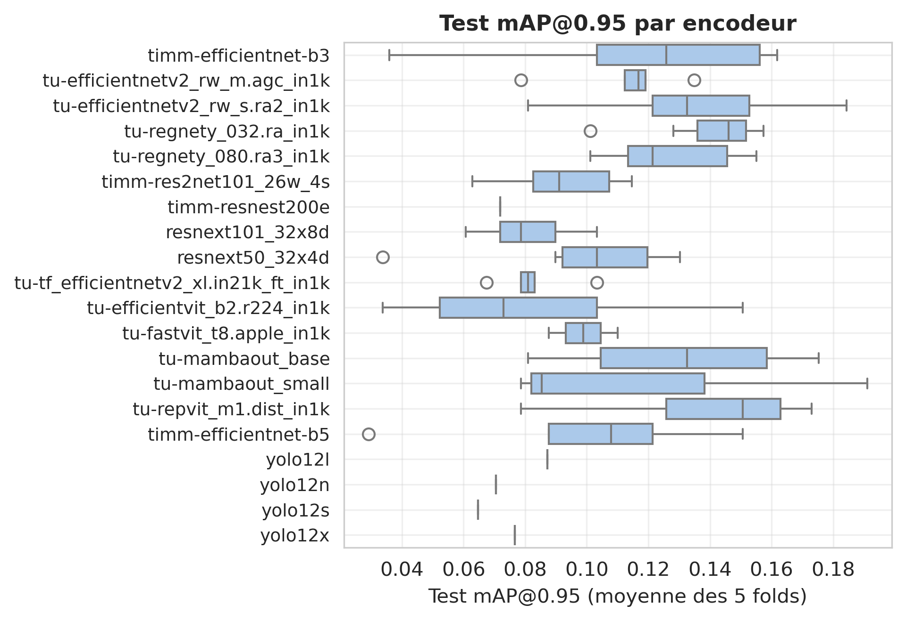
<figcaption>Boîte à moustaches IoU par encodeur</figcaption>
</figure>

|                       |          |            |         |         |         |
|:----------------------|---------:|-----------:|--------:|--------:|--------:|
| Encodeur              | mAP@0.95 |            |         |         |         |
|                       |  Moyenne | écart-type | Médiane | Minimum | Maximum |
| resnext101            |    0.081 |      0.015 |   0.079 |   0.061 |   0.103 |
| resnext50             |    0.101 |      0.028 |   0.103 |   0.034 |   0.130 |
| efficientnet-b3       |    0.120 |      0.045 |   0.126 |   0.036 |   0.162 |
| efficientnet-b5       |    0.099 |      0.045 |   0.108 |   0.029 |   0.151 |
| res2net101            |    0.093 |      0.018 |   0.091 |   0.063 |   0.115 |
| resnest200e           |    0.072 |            |   0.072 |   0.072 |   0.072 |
| efficientnetv2\_rw\_m |    0.112 |      0.021 |   0.117 |   0.079 |   0.135 |
| efficientnetv2\_rw\_s |    0.136 |      0.030 |   0.133 |   0.081 |   0.184 |
| efficientvit\_b2      |    0.083 |      0.050 |   0.073 |   0.034 |   0.151 |
| fastvit\_t8           |    0.099 |      0.016 |   0.099 |   0.088 |   0.110 |
| mambaout\_base        |    0.130 |      0.042 |   0.133 |   0.081 |   0.175 |
| mambaout\_small       |    0.118 |      0.063 |   0.085 |   0.079 |   0.191 |
| regnety\_032          |    0.140 |      0.019 |   0.146 |   0.101 |   0.157 |
| regnety\_080          |    0.127 |      0.020 |   0.121 |   0.101 |   0.155 |
| repvit\_m1            |    0.138 |      0.042 |   0.151 |   0.079 |   0.173 |
| efficientnetv2\_xl    |    0.083 |      0.013 |   0.081 |   0.067 |   0.103 |
| yolo12l               |    0.087 |            |   0.087 |   0.087 |   0.087 |
| yolo12n               |    0.071 |            |   0.071 |   0.071 |   0.071 |
| yolo12s               |    0.065 |            |   0.065 |   0.065 |   0.065 |
| yolo12x               |    0.077 |            |   0.077 |   0.077 |   0.077 |

<em>Statistiques mAP@0.95 par décodeur</em>

Les encodeurs présentent une variance plus réduite que les décodeurs, témoignant d’une plus grande stabilité des performances. EfficientVIT constitue la seule exception avec une variance importante, probablement liée à sa complexité et à son architecture spécifique.

RepVIT\_M1, EfficientNetV2\_RW\_S et RegNetY\_032 se distinguent par leurs performances élevées, atteignant des IoU moyens respectifs de 0,718, 0,727 et 0,726, ainsi que des mAP@0.95 de 0,138, 0,136 et 0,140.

Les encodeurs mambaout\_base et mambaout\_small affichent également des performances solides avec des IoU moyens de 0,717 et 0,715, accompagnés de mAP@0.95 de 0,130 et 0,118 respectivement. Ces modèles présentent toutefois une variance élevée pour la métrique mAP@0.95, suggérant une compatibilité variable selon les décodeurs associés.

### Analyse de l’efficacité computationnelle {#analyse-de-lefficacité-computationnelle}

#### Compromis performance-complexité {#compromis-performance-complexité}

L’analyse du front de Pareto (Figures  [4.12](#fig:ch4_09_performance_vs_parameters_pareto_01_eval_test_iou_mean){reference-type="ref" reference="fig:ch4_09_performance_vs_parameters_pareto_01_eval_test_iou_mean"} et [4.13](#fig:ch4_09_performance_vs_parameters_pareto_04_eval_test_map_95_mean){reference-type="ref" reference="fig:ch4_09_performance_vs_parameters_pareto_04_eval_test_map_95_mean"}) identifient les modèles offrant le meilleur compromis entre performance et complexité selon les métriques visées.

<figure id="fig:ch4_09_performance_vs_parameters_pareto_01_eval_test_iou_mean" data-latex-placement="H">
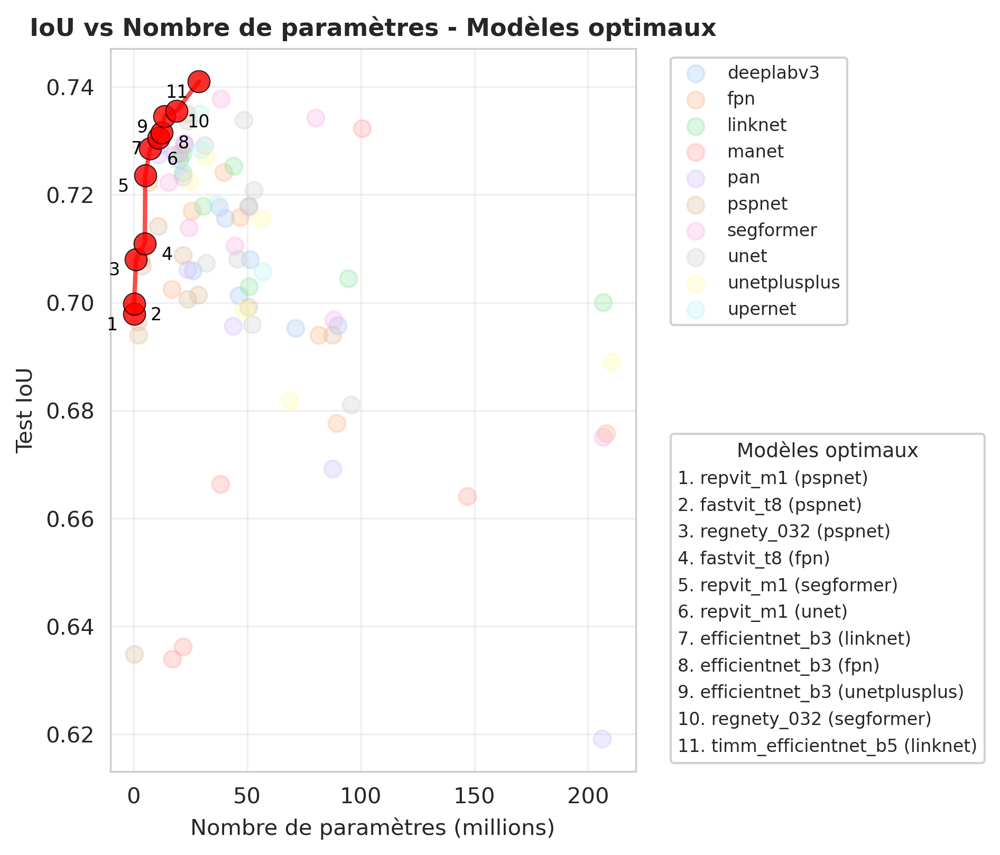
<figcaption>IoU vs nombre de paramètres. Les modèles sur la ligne rouge représentent les solutions optimales.</figcaption>
</figure>

Les modèles optimaux identifiés dans la Figure [4.12](#fig:ch4_09_performance_vs_parameters_pareto_01_eval_test_iou_mean){reference-type="ref" reference="fig:ch4_09_performance_vs_parameters_pareto_01_eval_test_iou_mean"} sont :

1.  linknet + EfficientNet-B5 (IoU 0,741, 28,75M params)

2.  segformer + RegNetY-032 (IoU 0,735, 18,87M params)

3.  unet++ + EfficientNet-B3 (IoU 0,735, 13,63M params)

Au-delà de 25M paramètres, les gains en IoU deviennent marginaux (&lt;1% IoU), suggérant une saturation du bénéfice apporté par la complexité additionnelle.

<figure id="fig:ch4_09_performance_vs_parameters_pareto_04_eval_test_map_95_mean" data-latex-placement="H">
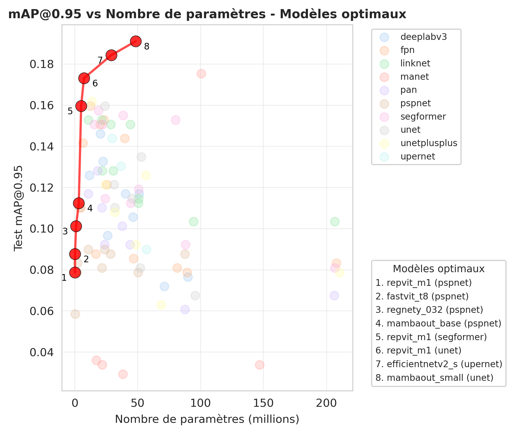
<figcaption>mAP@0.95 vs nombre de paramètres. Les modèles sur la ligne rouge représentent les solutions optimales.</figcaption>
</figure>

Les encodeurs (Figure [4.13](#fig:ch4_09_performance_vs_parameters_pareto_04_eval_test_map_95_mean){reference-type="ref" reference="fig:ch4_09_performance_vs_parameters_pareto_04_eval_test_map_95_mean"}) mambaout\_small et EfficientNetV2\_S et les décodeurs PSPNet offrent un bon compromis entre précision de segmentation et complexité.

#### Analyse temporelle {#analyse-temporelle}

La distribution des temps d’entraînement (Figure [4.14](#fig:ch4_11_training_time_dist_09){reference-type="ref" reference="fig:ch4_11_training_time_dist_09"}) nécessaires révèlent des écarts significatifs entre les modèles, allant de 1,8 à 48,3 heures pour les configurations les plus complexes. Il n’y a pas de corrélation évidente entre le nombre de paramètres et le temps d’entraînement, ce qui suggère que la complexité des architectures joue un rôle plus important que la taille brute du modèle.

<figure id="fig:ch4_11_training_time_dist_09" data-latex-placement="H">
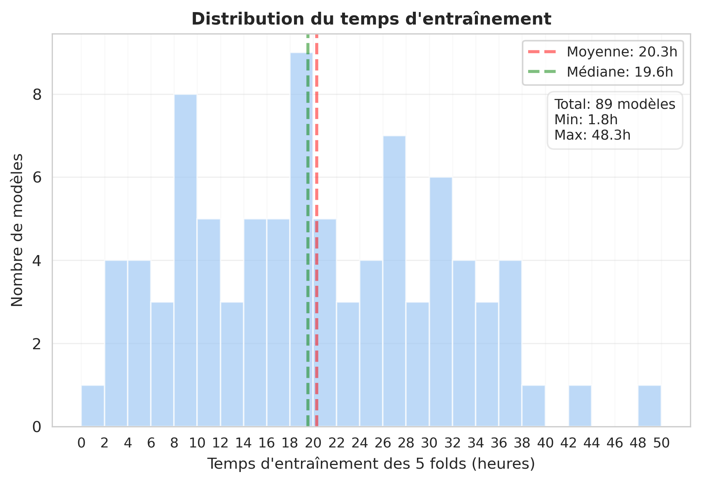
<figcaption>Distribution du temps d’entraînement total (5 fold)</figcaption>
</figure>

### Analyse des métriques complémentaires {#analyse-des-métriques-complémentaires}

#### Analyse mAP multi-seuils {#analyse-map-multi-seuils}

Le Tableau [4.7](#tab:performance_moyenne_map_different_seuils){reference-type="ref" reference="tab:performance_moyenne_map_different_seuils"} présente l’évolution des performances selon différents seuils de mAP.

| Décodeur | mAP@0.5 | mAP@0.65 | mAP@0.75 | mAP@0.85 | mAP@0.90 | mAP@0.95 | Chute relative |
|:---|---:|---:|---:|---:|---:|---:|---:|
| YOLO | 0.577 | 0.468 | 0.378 | 0.279 | 0.189 | 0.075 | -87.0% |
| deeplabv3 | 0.834 | 0.725 | 0.604 | 0.416 | 0.265 | 0.110 | -86.8% |
| fpn | 0.829 | 0.728 | 0.618 | 0.433 | 0.285 | 0.116 | -86.0% |
| linknet | 0.837 | 0.732 | 0.616 | 0.443 | 0.294 | 0.130 | -84.5% |
| manet | 0.805 | 0.651 | 0.498 | 0.287 | 0.150 | 0.062 | -92.3% |
| pan | 0.814 | 0.702 | 0.584 | 0.401 | 0.254 | 0.096 | -88.2% |
| pspnet | 0.827 | 0.705 | 0.588 | 0.387 | 0.243 | 0.087 | -89.5% |
| segformer | 0.829 | 0.738 | 0.628 | 0.444 | 0.298 | 0.131 | -84.2% |
| unet | 0.834 | 0.731 | 0.615 | 0.429 | 0.283 | 0.128 | -84.7% |
| unetplusplus | 0.837 | 0.719 | 0.594 | 0.406 | 0.255 | 0.107 | -87.2% |
| upernet | 0.837 | 0.745 | 0.635 | 0.459 | 0.313 | 0.137 | -83.6% |

<em>Performances moyennes mAP à différents seuils. Chute relative mAP@0.5 à mAP@0.95</em>

Les modèles SMP conservent mieux leurs performances aux seuils élevés, à l’exception de MANet, démontrant une segmentation plus précise des contours. La transition du mAP@0.5 au mAP@0.95 révèle une chute significative des performances, pouvant atteindre jusqu’à -92,3% pour MANet. Les modèles UNet et UPerNet présentent des diminutions plus modérées de -84,7% et -83,6% respectivement, suggérant une robustesse relative face aux seuils exigeants.

L’analyse du passage de mAP@0.90 à mAP@0.95 met en évidence une dégradation importante des performances, dépassant 50% dans tous les cas. Cette observation souligne la difficulté intrinsèque à maintenir une précision élevée dans les détections les plus exigeantes.

### Analyse par catégorie de taille {#analyse-par-catégorie-de-taille}

L’analyse des performances selon la taille des modèles (Figures  [4.15](#fig:ch4_05_models_by_size_category_01_eval_test_iou_mean){reference-type="ref" reference="fig:ch4_05_models_by_size_category_01_eval_test_iou_mean"} et [4.16](#fig:ch4_05_models_by_size_category_04_eval_test_map_95_mean){reference-type="ref" reference="fig:ch4_05_models_by_size_category_04_eval_test_map_95_mean"}) met en évidence plusieurs points intéressants.

Les deux métriques utilisées montrent des résultats assez différents. Pour l’IoU (Figure [4.15](#fig:ch4_05_models_by_size_category_01_eval_test_iou_mean){reference-type="ref" reference="fig:ch4_05_models_by_size_category_01_eval_test_iou_mean"}), les performances restent relativement stables peu importe la taille du modèle, avec des valeurs comprises entre 0,689 et 0,741. Cette constance indique que le nombre de paramètres n’influence pas directement la qualité de segmentation.

<figure id="fig:ch4_05_models_by_size_category_01_eval_test_iou_mean" data-latex-placement="H">
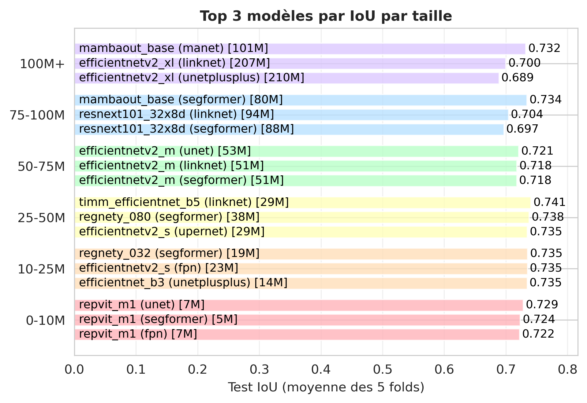
<figcaption>Top 3 modèles par IoU par taille (paramètres)</figcaption>
</figure>

Des modèles légers comme RepViT avec seulement 7M de paramètres obtiennent des résultats similaires à des architectures plus lourdes comme MambaOut qui en compte 101M. Cela montre que des approches bien optimisées peuvent être très efficaces pour segmenter les toitures.

La métrique mAP@0.95 (Figure [4.16](#fig:ch4_05_models_by_size_category_04_eval_test_map_95_mean){reference-type="ref" reference="fig:ch4_05_models_by_size_category_04_eval_test_map_95_mean"}) raconte une histoire différente. Cette métrique, qui mesure la précision avec un seuil IoU strict de 0.95, donne des résultats plus variés allant de 0,083 à 0,191. Les écarts sont donc beaucoup plus marqués entre les différentes architectures.

<figure id="fig:ch4_05_models_by_size_category_04_eval_test_map_95_mean" data-latex-placement="H">
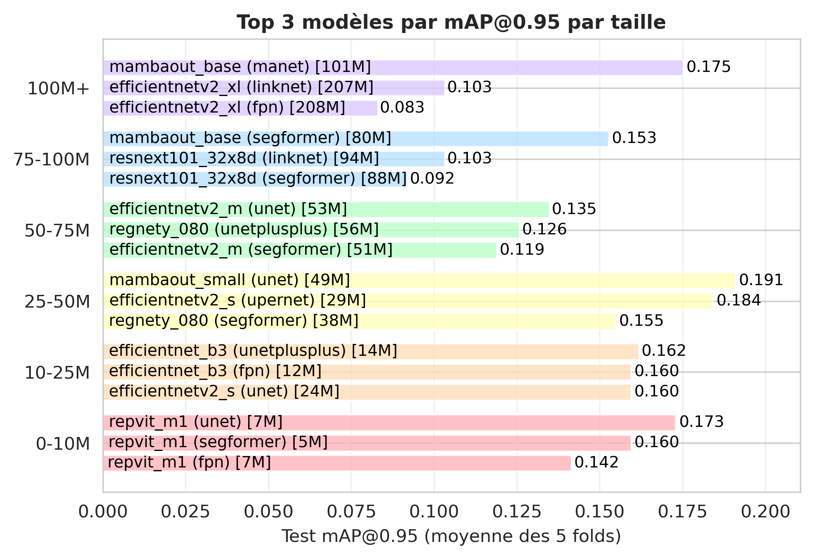
<figcaption>Top 3 modèles par mAP@0.95 par taille (paramètres)</figcaption>
</figure>

Un résultat surprenant est que les modèles de taille moyenne (25-50M paramètres) obtiennent les meilleurs scores mAP@0.95. Ce n’est donc pas une simple relation où plus gros égale meilleur - il semble y avoir une taille optimale qui balance capacité de représentation et efficacité d’apprentissage.

Un autre point important concerne l’architecture elle-même. En prenant l’exemple d’EfficientNet, on constate que selon le décodeur utilisé (UNet, SegFormer ou FPN), les performances peuvent varier significativement même si la taille reste similaire. Le choix du décodeur est donc tout aussi important que celui de l’encodeur pour obtenir de bons résultats en segmentation.

### Analyse qualitative {#analyse-qualitative}

Cette sous-section examine des exemples concrets de segmentation produits par les modèles ayant obtenu les meilleures performances.

#### Modèles retenus {#modèles-retenus}

La sélection des modèles s’est basée sur leurs performances sur le dataset de test selon plusieurs métriques : IoU, mAP@0.5, mAP@0.75, mAP@0.95 et F1-score. Les combinaisons encodeur-décodeur retenues sont :

- UNet + mambaout\_small

- UPerNet + EfficientNetV2-S

- Segformer + mambaout\_base

- LinkNet + EfficientNet-B5

- Unet++ + EfficientNetV2-S

- SegFormer + RegNetY-080

Pour chaque combinaison, 5 modèles ont été entraînés suivant la méthode de validation croisée. Chaque modèle utilise un fold différent pour la validation et les quatre autres pour l’entraînement. Il faut donc déterminer comment combiner efficacement les prédictions de ces 5 modèles pour obtenir un résultat final.

#### Stratégie d’ensemble k-fold {#stratégie-densemble-k-fold}

L’approche retenue consiste à exploiter la complémentarité des modèles issus de la validation croisée. Plutôt que de sélectionner le meilleur modèle parmi les 5 folds de chaque combinaison, les prédictions des 5 modèles sont combinées. Cette stratégie d’ensemble permet d’obtenir des segmentations plus robustes et moins sensibles aux variations dans les données d’entraînement.

##### Principe de fonctionnement {#principe-de-fonctionnement}

Pour chaque combinaison encodeur-décodeur, voici comment se déroule le processus :

1.  Récupération des modèles : Les 5 modèles entraînés sont chargés un par un pour éviter de saturer la mémoire GPU

2.  Prédiction individuelle : Chaque modèle produit une carte de probabilité pour toutes les images du dataset de test

3.  Agrégation des prédictions : Les probabilités sont moyennées pixel par pixel avec la formule suivante :
    $$\begin{equation}
            P_{ensemble}(x,y) = \frac{1}{K} \sum_{k=1}^{K} P_k(x,y)
    \end{equation}$$
    où *K* = 5 correspond au nombre de folds et *P**k*(*x*, *y*) représente la probabilité donnée par le modèle du fold *k* au pixel (*x*, *y*)

4.  Binarisation : Les probabilités moyennées sont transformées en masque binaire en appliquant un seuil de 0.5

##### Avantages de l’approche {#avantages-de-lapproche}

Cette stratégie d’ensemble apporte plusieurs avantages :

- Réduction de la variance : La moyenne des prédictions de modèles entraînés sur différents sous-ensembles diminue la sensibilité aux variations aléatoires dans les données

- Amélioration de la généralisation : Comme chaque modèle a vu des données de validation différentes, l’ensemble obtient une vue plus complète du problème

- Robustesse accrue : Les erreurs des modèles individuels ont tendance à se compenser lors de l’agrégation, ce qui limite l’impact des prédictions aberrantes

- Exploitation maximale des données : Avec 5 folds, chaque échantillon participe à l’entraînement de 4 modèles sur 5

##### Inconvénients et limitations {#inconvénients-et-limitations}

Cette approche présente aussi quelques contraintes :

- Coût computationnel : L’inférence prend 5 fois plus de temps, passant de quelques secondes à plusieurs dizaines de secondes par image

- Consommation mémoire : Même si les modèles sont chargés un par un, stocker 5 modèles par configuration demande environ 5 fois plus d’espace disque

- Complexité de déploiement : Gérer plusieurs modèles rend le système plus complexe à mettre en production

##### Optimisations techniques {#optimisations-techniques}

Pour limiter les problèmes de mémoire, plusieurs stratégies ont été mises en place :

- Chargement séquentiel des modèles avec libération de la mémoire GPU après chaque fold (`torch.cuda.empty_cache()`)

- Traitement par batch des images pour rentabiliser le chargement des modèles

- Accumulation progressive des prédictions pour éviter de garder toutes les probabilités en mémoire en même temps

Cette approche d’ensemble k-fold offre un bon équilibre entre précision et efficacité. Elle convient particulièrement aux cas où la qualité des résultats est plus importante que la vitesse de traitement.

##### Résultats de l’ensemble k-fold {#résultats-de-lensemble-k-fold}

Le Tableau [4.8](#tab:kfold_ensemble){reference-type="ref" reference="tab:kfold_ensemble"} présente les performances des modèles avec et sans ensemble k-fold. Les résultats montrent que l’ensemble est plus performant que la moyenne des folds de chaque modèle.

| Modèle | Folds | Moy. fold IoU | Meilleur fold IoU | Ensemble IoU | Amélioration |
|:---|:--:|:--:|:--:|:--:|:--:|
| UNet + mambaout\_small | 5 | 0.734 ± 0.012 | 0.748 | **0.745** | +1.6% |
| UPerNet + EfficientNetV2-S | 5 | 0.735 ± 0.005 | 0.743 | **0.748** | +1.8% |
| Segformer + mambaout\_base | 5 | 0.734 ± 0.009 | 0.747 | **0.742** | +1.0% |
| LinkNet + EfficientNet-B5 | 5 | 0.741 ± 0.003 | 0.744 | **0.752** | +1.5% |
| Unet++ + EfficientNetV2-S | 5 | 0.723 ± 0.012 | 0.738 | **0.737** | +2.0% |
| SegFormer + RegNetY-080 | 5 | 0.738 ± 0.006 | 0.746 | **0.745** | +0.9% |

<em>Comparaison des performances des modèles avec et sans ensemble k-fold. Amélioration calculée par rapport à l’IoU moyen des folds.</em>

#### Visualisation des résultats {#visualisation-des-résultats}

Les figures [4.17](#fig:unet_mambaoutsmall_best_cases){reference-type="ref" reference="fig:unet_mambaoutsmall_best_cases"} et [4.18](#fig:unet_mambaoutsmall_worst_cases){reference-type="ref" reference="fig:unet_mambaoutsmall_worst_cases"} illustrent les cas extrêmes de performance du modèle UNet avec mambaout\_small sur le dataset de test.

La Figure [4.17](#fig:unet_mambaoutsmall_best_cases){reference-type="ref" reference="fig:unet_mambaoutsmall_best_cases"} montre les 4 segmentations les plus réussies avec des valeurs IoU élevées. Le modèle parvient à identifier correctement les toitures dans diverses situations. Les résultats montrent que même les obstacles de petite taille comme les cheminées sont correctement détectés, ce qui indique une bonne capacité de segmentation fine.

La Figure [4.18](#fig:unet_mambaoutsmall_worst_cases){reference-type="ref" reference="fig:unet_mambaoutsmall_worst_cases"} présente les 4 cas les plus problématiques avec des IoU très bas. Les erreurs se concentrent sur les toitures végétalisées et les terrasses praticables, révélant les difficultés du modèle à traiter ces types de surfaces particulières.

<figure id="fig:unet_mambaoutsmall_best_cases" data-latex-placement="H">
<figure>

<figcaption>Top1 - Original</figcaption>
</figure>
<figure>

<figcaption>Vérité terrain</figcaption>
</figure>
<figure>

<figcaption>Prédiction - IoU = 0.998</figcaption>
</figure>
<figure>

<figcaption>Top2 - Original</figcaption>
</figure>
<figure>
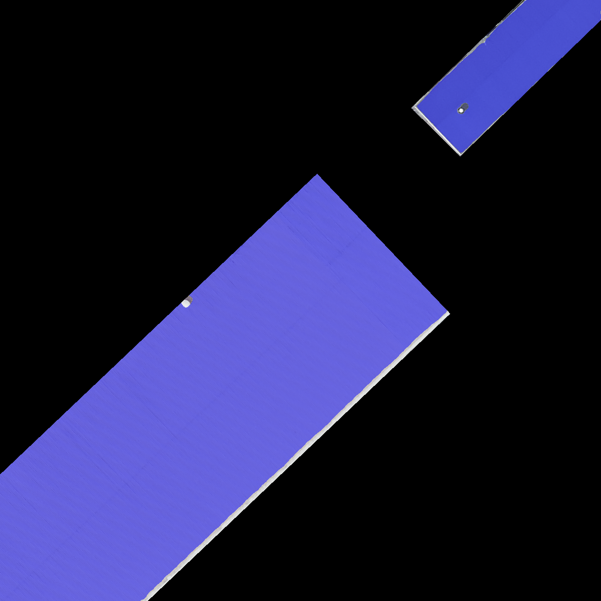
<figcaption>Vérité terrain</figcaption>
</figure>
<figure>

<figcaption>Prédiction - IoU = 0.991</figcaption>
</figure>
<figure>

<figcaption>Top3 - Original</figcaption>
</figure>
<figure>
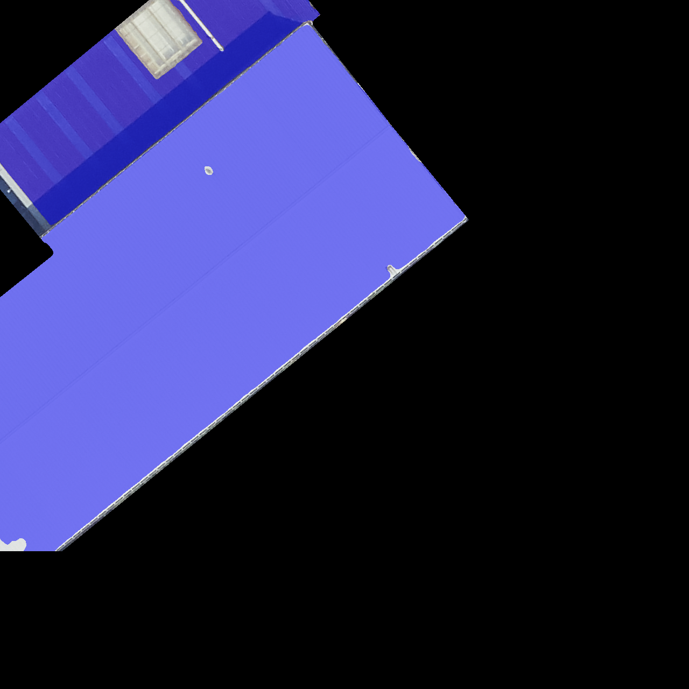
<figcaption>Vérité terrain</figcaption>
</figure>
<figure>

<figcaption>Prédiction - IoU = 0.988</figcaption>
</figure>
<figure>

<figcaption>Top4 - Original</figcaption>
</figure>
<figure>

<figcaption>Vérité terrain</figcaption>
</figure>
<figure>

<figcaption>Prédiction - IoU = 0.984</figcaption>
</figure>
<figcaption>Meilleurs IoU pour Unet avec mambaout_small backbone sur le dataset de test</figcaption>
</figure>

<figure id="fig:unet_mambaoutsmall_worst_cases" data-latex-placement="H">
<figure>

<figcaption>Top1 - Original</figcaption>
</figure>
<figure>

<figcaption>Vérité terrain</figcaption>
</figure>
<figure>
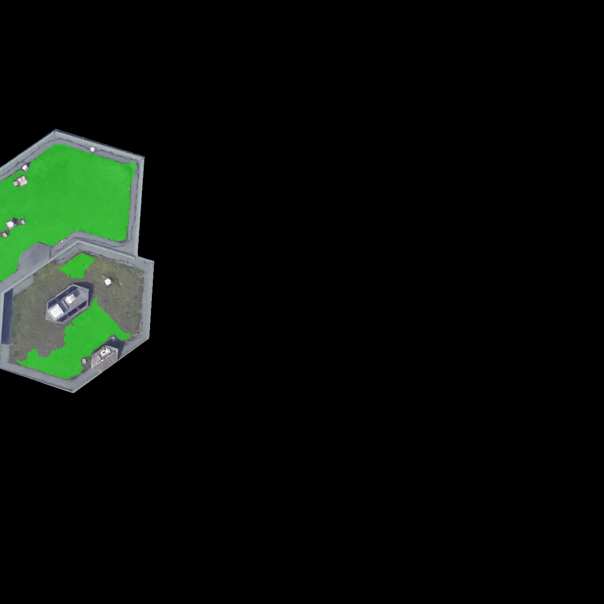
<figcaption>Prédiction - IoU = 0.000</figcaption>
</figure>
<figure>

<figcaption>Top2 - Original</figcaption>
</figure>
<figure>

<figcaption>Vérité terrain</figcaption>
</figure>
<figure>

<figcaption>Prédiction - IoU = 0.000</figcaption>
</figure>
<figure>

<figcaption>Top3 - Original</figcaption>
</figure>
<figure>

<figcaption>Vérité terrain</figcaption>
</figure>
<figure>

<figcaption>Prédiction - IoU = 0.000</figcaption>
</figure>
<figure>

<figcaption>Top4 - Original</figcaption>
</figure>
<figure>

<figcaption>Vérité terrain</figcaption>
</figure>
<figure>

<figcaption>Prédiction - IoU = 0.000</figcaption>
</figure>
<figcaption>Pires IoU pour Unet avec mambaout_small sur le dataset de test</figcaption>
</figure>

Les Figures [4.19](#fig:upernet_efficientnetv2_s_best_cases){reference-type="ref" reference="fig:upernet_efficientnetv2_s_best_cases"} et [4.19](#fig:upernet_efficientnetv2_s_best_cases){reference-type="ref" reference="fig:upernet_efficientnetv2_s_best_cases"} illustrent les performances extrêmes du modèle UPerNet + EfficientNetV2\_RW\_S sur le dataset de test.

La Figure [4.19](#fig:upernet_efficientnetv2_s_best_cases){reference-type="ref" reference="fig:upernet_efficientnetv2_s_best_cases"} présente les 4 meilleures segmentations. Les résultats sont proches de ceux obtenus avec UNet + mambaout\_small - trois images sur quatre sont identiques à celles de la Figure [4.17](#fig:unet_mambaoutsmall_best_cases){reference-type="ref" reference="fig:unet_mambaoutsmall_best_cases"}.

La Figure [4.19](#fig:upernet_efficientnetv2_s_best_cases){reference-type="ref" reference="fig:upernet_efficientnetv2_s_best_cases"} montre les 4 pires cas. Là aussi, on retrouve trois images communes avec la Figure [4.18](#fig:unet_mambaoutsmall_worst_cases){reference-type="ref" reference="fig:unet_mambaoutsmall_worst_cases"}, confirmant que les deux modèles peinent sur les mêmes types de surfaces (toitures végétalisées et terrasses praticables). La quatrième image présente une toiture de type hangar où la vérité terrain semble questionnable, les critères de labellisation pourraient ne pas être adaptés à ce cas particulier.

<figure id="fig:upernet_efficientnetv2_s_best_cases" data-latex-placement="H">
<figure>

<figcaption>Top1 - Original</figcaption>
</figure>
<figure>

<figcaption>Vérité terrain</figcaption>
</figure>
<figure>

<figcaption>Prédiction - IoU = 0.999</figcaption>
</figure>
<figure>
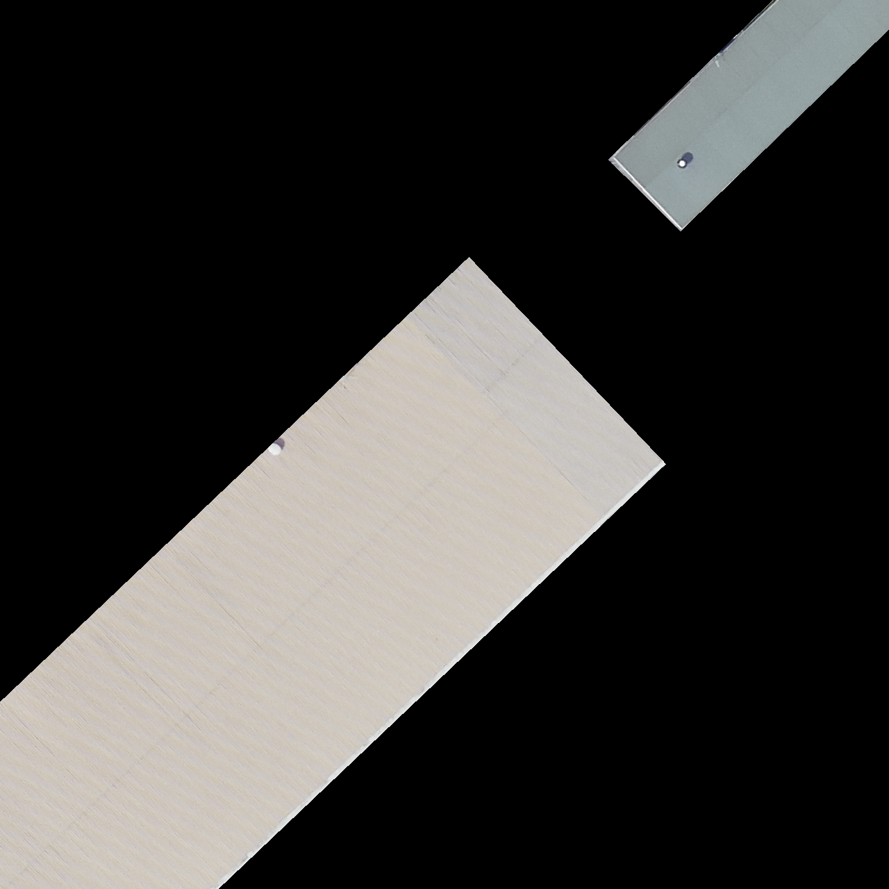
<figcaption>Top2 - Original</figcaption>
</figure>
<figure>

<figcaption>Vérité terrain</figcaption>
</figure>
<figure>

<figcaption>Prédiction - IoU = 0.987</figcaption>
</figure>
<figure>

<figcaption>Top3 - Original</figcaption>
</figure>
<figure>

<figcaption>Vérité terrain</figcaption>
</figure>
<figure>

<figcaption>Prédiction - IoU = 0.987</figcaption>
</figure>
<figure>

<figcaption>Top4 - Original</figcaption>
</figure>
<figure>

<figcaption>Vérité terrain</figcaption>
</figure>
<figure>

<figcaption>Prédiction - IoU = 0.984</figcaption>
</figure>
<figcaption>Meilleurs IoU pour UPerNet avec EfficientNetV2-S sur le dataset de test</figcaption>
</figure>

<figure id="fig:upernet_efficientnetv2_s_worst_cases" data-latex-placement="H">
<figure>

<figcaption>Top1 - Original</figcaption>
</figure>
<figure>

<figcaption>Vérité terrain</figcaption>
</figure>
<figure>
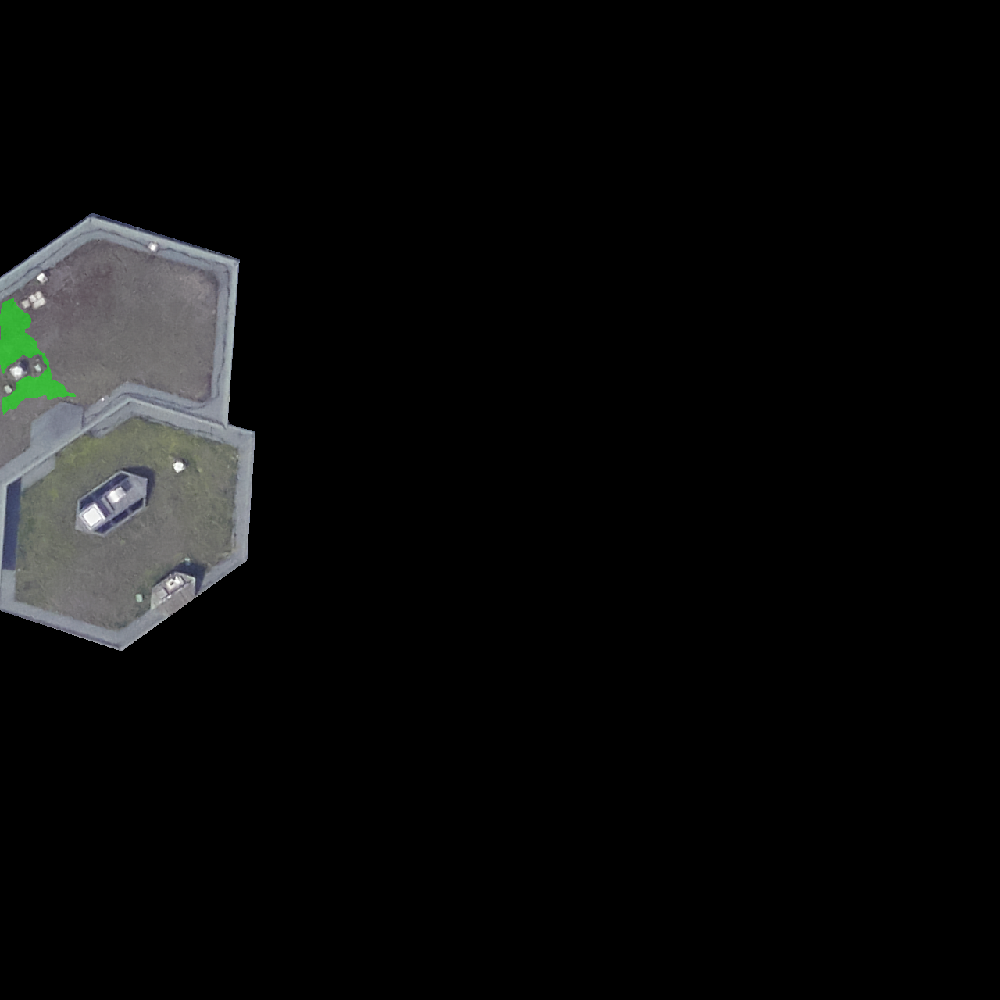
<figcaption>Prédiction - IoU = 0.000</figcaption>
</figure>
<figure>

<figcaption>Top2 - Original</figcaption>
</figure>
<figure>

<figcaption>Vérité terrain</figcaption>
</figure>
<figure>

<figcaption>Prédiction - IoU = 0.000</figcaption>
</figure>
<figure>
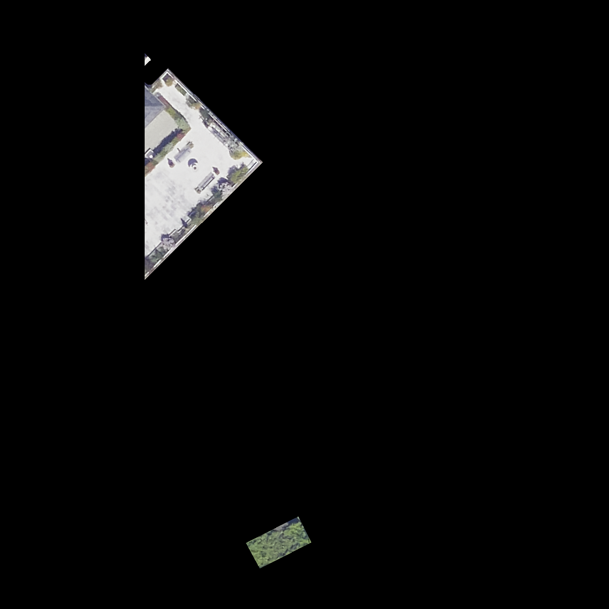
<figcaption>Top3 - Original</figcaption>
</figure>
<figure>

<figcaption>Vérité terrain</figcaption>
</figure>
<figure>

<figcaption>Prédiction - IoU = 0.000</figcaption>
</figure>
<figure>

<figcaption>Top4 - Original</figcaption>
</figure>
<figure>

<figcaption>Vérité terrain</figcaption>
</figure>
<figure>

<figcaption>Prédiction - IoU = 0.000</figcaption>
</figure>
<figcaption>Pires IoU pour UPerNet avec EfficientNetV2-S sur le dataset de test</figcaption>
</figure>

Les Figures [4.21](#fig:segformer_mambaoutbase_best_cases){reference-type="ref" reference="fig:segformer_mambaoutbase_best_cases"} et [4.22](#fig:segformer_mambaoutbase_worst_cases){reference-type="ref" reference="fig:segformer_mambaoutbase_worst_cases"} montrent les cas extrêmes du modèle SegFormer + mambaout\_base sur le dataset de test.

La Figure [4.21](#fig:segformer_mambaoutbase_best_cases){reference-type="ref" reference="fig:segformer_mambaoutbase_best_cases"} présente les 4 meilleures segmentations. Ces images correspondent à celles qui donnent également d’excellents résultats avec les deux modèles précédents (UNet + mambaout\_small et UPerNet + EfficientNetV2-S). Le modèle SegFormer détecte bien les toitures et même les petits éléments comme les cheminées.

La Figure [4.22](#fig:segformer_mambaoutbase_worst_cases){reference-type="ref" reference="fig:segformer_mambaoutbase_worst_cases"} illustre les 4 pires performances. On retrouve exactement les mêmes images que pour le modèle précédent, avec les mêmes observations.

<figure id="fig:segformer_mambaoutbase_best_cases" data-latex-placement="H">
<figure>

<figcaption>Top1 - Original</figcaption>
</figure>
<figure>

<figcaption>Vérité terrain</figcaption>
</figure>
<figure>

<figcaption>Prédiction - IoU = 0.997</figcaption>
</figure>
<figure>
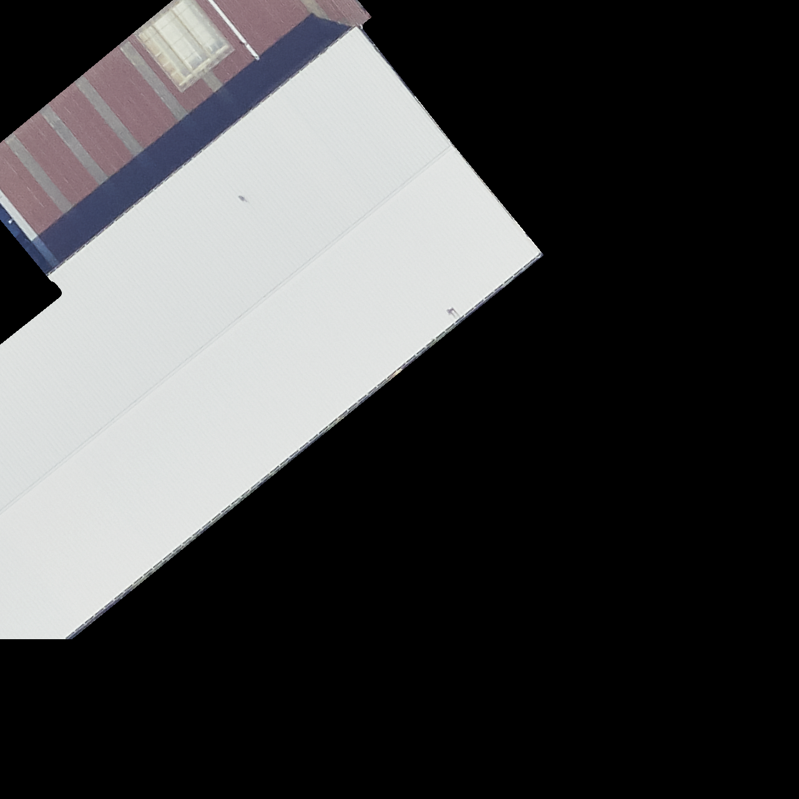
<figcaption>Top2 - Original</figcaption>
</figure>
<figure>

<figcaption>Vérité terrain</figcaption>
</figure>
<figure>
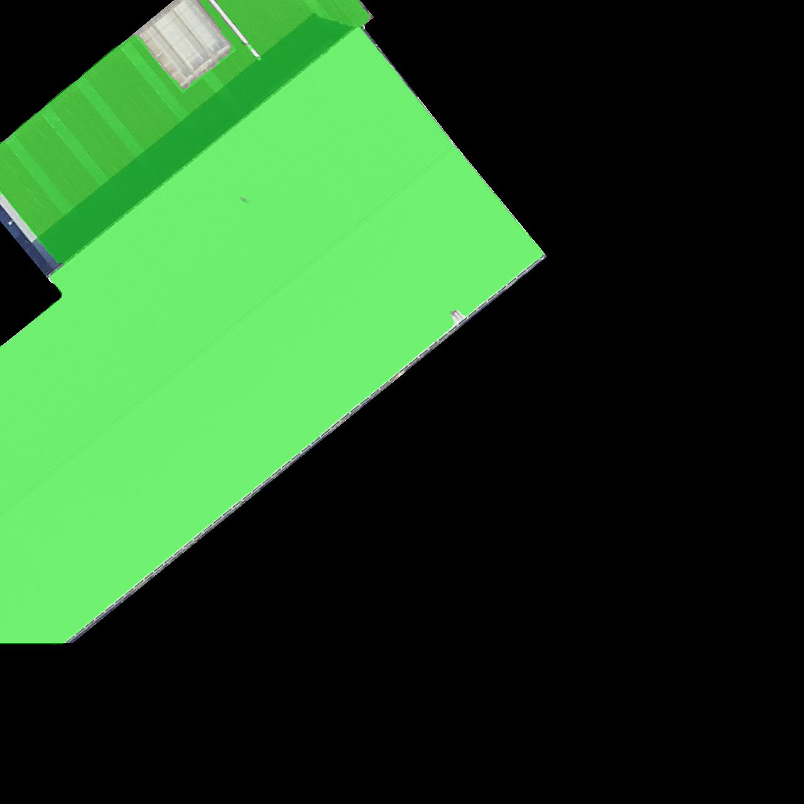
<figcaption>Prédiction - IoU = 0.984</figcaption>
</figure>
<figure>

<figcaption>Top3 - Original</figcaption>
</figure>
<figure>

<figcaption>Vérité terrain</figcaption>
</figure>
<figure>

<figcaption>Prédiction - IoU = 0.984</figcaption>
</figure>
<figure>

<figcaption>Top4 - Original</figcaption>
</figure>
<figure>

<figcaption>Vérité terrain</figcaption>
</figure>
<figure>

<figcaption>Prédiction - IoU = 0.983</figcaption>
</figure>
<figcaption>Meilleurs IoU pour SegFormer avec mambaout_base sur le dataset de test</figcaption>
</figure>

<figure id="fig:segformer_mambaoutbase_worst_cases" data-latex-placement="H">
<figure>

<figcaption>Top1 - Original</figcaption>
</figure>
<figure>
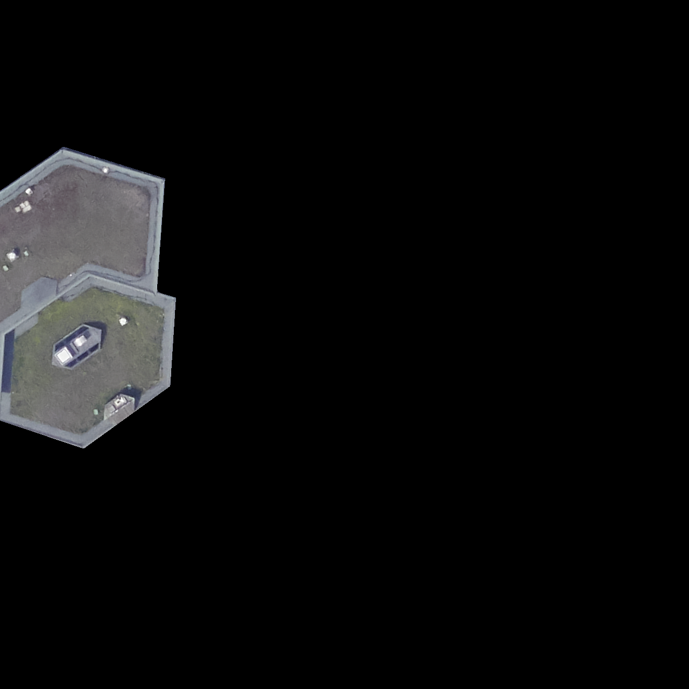
<figcaption>Vérité terrain</figcaption>
</figure>
<figure>

<figcaption>Prédiction - IoU = 0.000</figcaption>
</figure>
<figure>

<figcaption>Top2 - Original</figcaption>
</figure>
<figure>
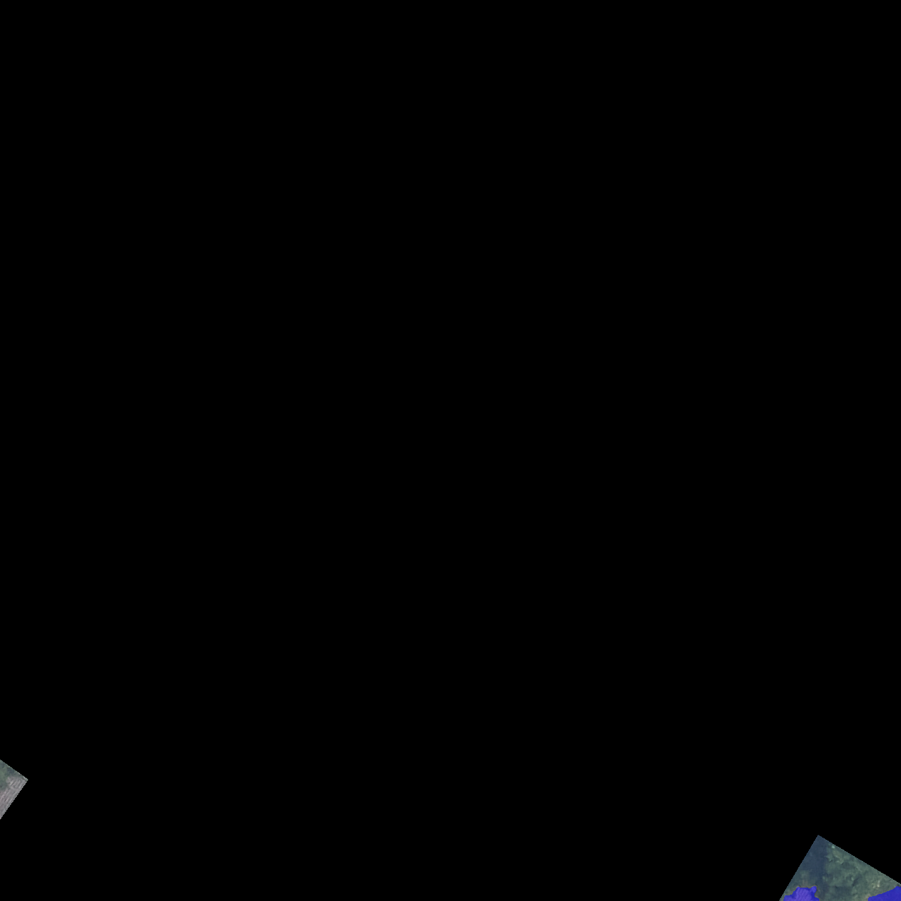
<figcaption>Vérité terrain</figcaption>
</figure>
<figure>

<figcaption>Prédiction - IoU = 0.000</figcaption>
</figure>
<figure>

<figcaption>Top3 - Original</figcaption>
</figure>
<figure>

<figcaption>Vérité terrain</figcaption>
</figure>
<figure>

<figcaption>Prédiction - IoU = 0.000</figcaption>
</figure>
<figure>

<figcaption>Top4 - Original</figcaption>
</figure>
<figure>
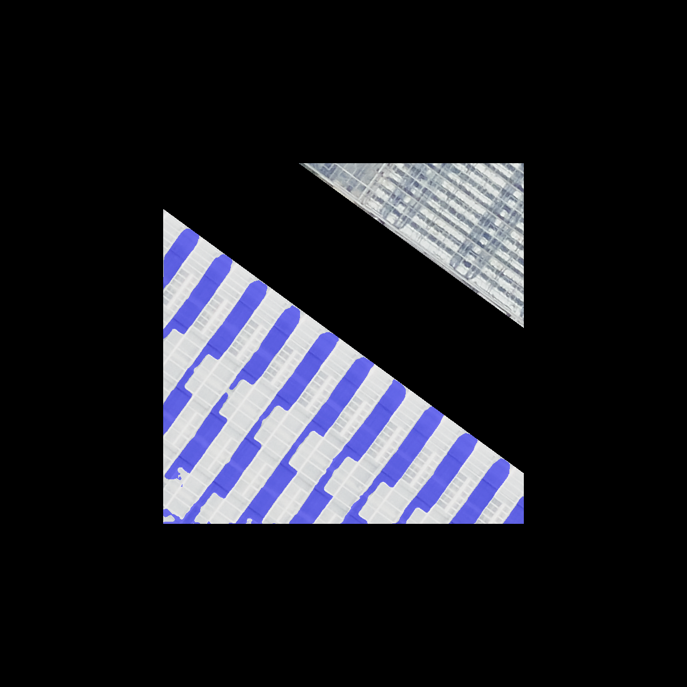
<figcaption>Vérité terrain</figcaption>
</figure>
<figure>

<figcaption>Prédiction - IoU = 0.000</figcaption>
</figure>
<figcaption>Pires IoU pour SegFormer avec mambaout_base sur le dataset de test</figcaption>
</figure>

Les Figures [4.23](#fig:linknet_efficientnet_b5_best_cases){reference-type="ref" reference="fig:linknet_efficientnet_b5_best_cases"} et [4.24](#fig:linknet_efficientnet_b5_worst_cases){reference-type="ref" reference="fig:linknet_efficientnet_b5_worst_cases"} illustrent les performances extrêmes du modèle LinkNet + EfficientNet-B5 sur le dataset de test.

La Figure [4.23](#fig:linknet_efficientnet_b5_best_cases){reference-type="ref" reference="fig:linknet_efficientnet_b5_best_cases"} présente les 4 meilleures segmentations. Les images sont les mêmes que pour les modèles précédents, avec des performances similaires.

La Figure [4.24](#fig:linknet_efficientnet_b5_worst_cases){reference-type="ref" reference="fig:linknet_efficientnet_b5_worst_cases"} montre les 4 cas les plus problématiques. Le premier cas présente une zone sans annotation dans la vérité terrain, mais cette absence semble discutable, ce qui explique pourquoi le modèle segmente cette partie. Le deuxième cas montre une petite portion de toiture qui n’est pas correctement détectée. Les deux dernières images, déjà rencontrées avec les modèles précédents, correspondent aux toitures végétalisées et terrasses praticables qui posent systématiquement problème.

<figure id="fig:linknet_efficientnet_b5_best_cases" data-latex-placement="H">
<figure>
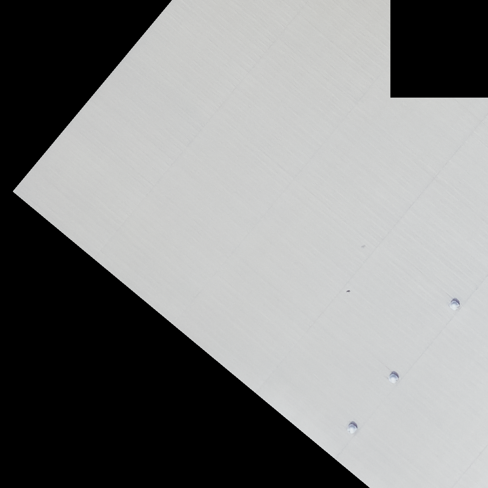
<figcaption>Top1 - Original</figcaption>
</figure>
<figure>

<figcaption>Vérité terrain</figcaption>
</figure>
<figure>
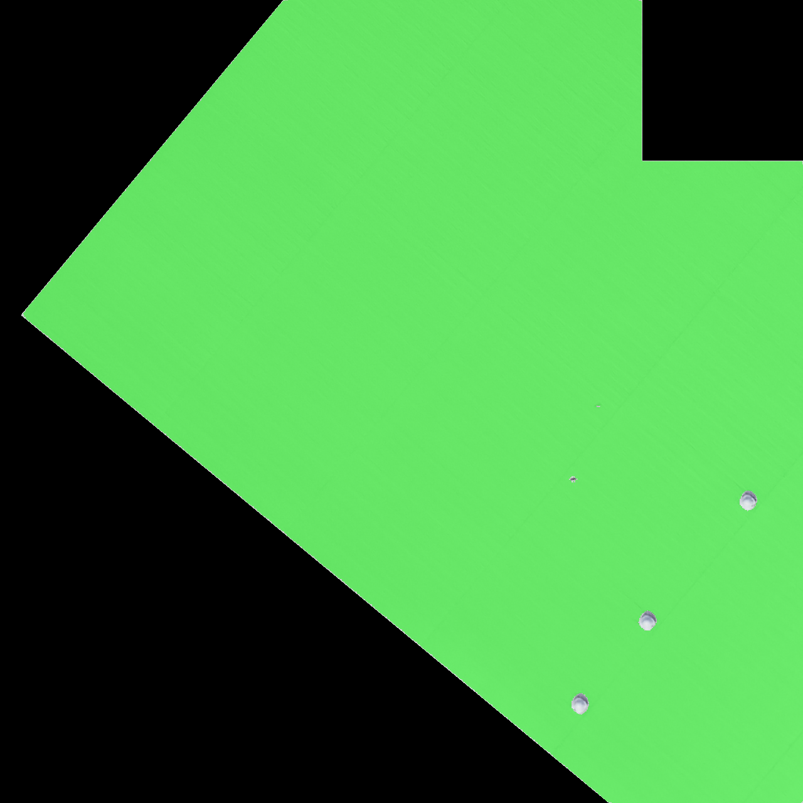
<figcaption>Prédiction - IoU = 0.997</figcaption>
</figure>
<figure>

<figcaption>Top2 - Original</figcaption>
</figure>
<figure>

<figcaption>Vérité terrain</figcaption>
</figure>
<figure>

<figcaption>Prédiction - IoU = 0.992</figcaption>
</figure>
<figure>

<figcaption>Top3 - Original</figcaption>
</figure>
<figure>

<figcaption>Vérité terrain</figcaption>
</figure>
<figure>

<figcaption>Prédiction - IoU = 0.986</figcaption>
</figure>
<figure>

<figcaption>Top4 - Original</figcaption>
</figure>
<figure>

<figcaption>Vérité terrain</figcaption>
</figure>
<figure>
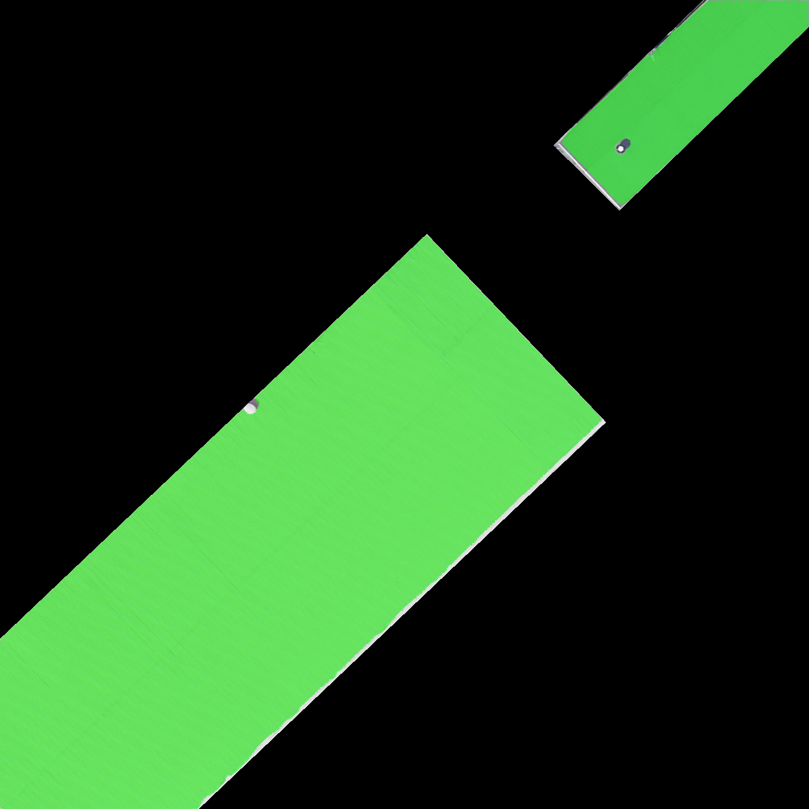
<figcaption>Prédiction - IoU = 0.986</figcaption>
</figure>
<figcaption>Meilleurs IoU pour LinkNet avec EfficientNet-B5 sur le dataset de test</figcaption>
</figure>

<figure id="fig:linknet_efficientnet_b5_worst_cases" data-latex-placement="H">
<figure>

<figcaption>Top1 - Original</figcaption>
</figure>
<figure>

<figcaption>Vérité terrain</figcaption>
</figure>
<figure>

<figcaption>Prédiction - IoU = 0.000</figcaption>
</figure>
<figure>

<figcaption>Top2 - Original</figcaption>
</figure>
<figure>

<figcaption>Vérité terrain</figcaption>
</figure>
<figure>

<figcaption>Prédiction - IoU = 0.000</figcaption>
</figure>
<figure>

<figcaption>Top3 - Original</figcaption>
</figure>
<figure>

<figcaption>Vérité terrain</figcaption>
</figure>
<figure>

<figcaption>Prédiction - IoU = 0.000</figcaption>
</figure>
<figure>

<figcaption>Top4 - Original</figcaption>
</figure>
<figure>

<figcaption>Vérité terrain</figcaption>
</figure>
<figure>
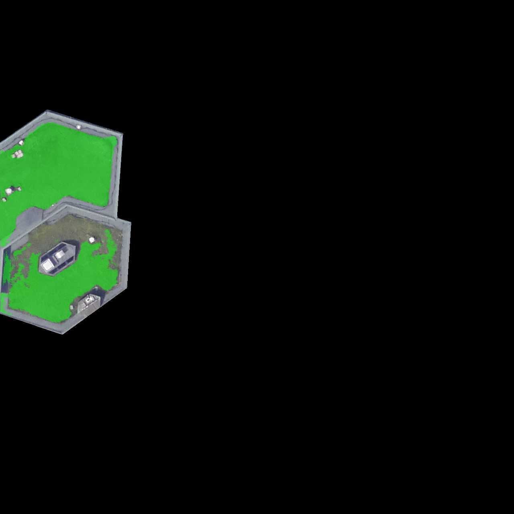
<figcaption>Prédiction - IoU = 0.000</figcaption>
</figure>
<figcaption>Pires IoU pour LinkNet avec EfficientNet-B5 sur le dataset de test</figcaption>
</figure>

Les Figures [4.25](#fig:unetplusplus_efficientnetv2_s_best_cases){reference-type="ref" reference="fig:unetplusplus_efficientnetv2_s_best_cases"} et [4.26](#fig:unetplusplus_efficientnetv2_s_worst_cases){reference-type="ref" reference="fig:unetplusplus_efficientnetv2_s_worst_cases"} montrent les cas extrêmes du modèle UNet++ + EfficientNetV2-RW-S sur le dataset de test.

La Figure [4.25](#fig:unetplusplus_efficientnetv2_s_best_cases){reference-type="ref" reference="fig:unetplusplus_efficientnetv2_s_best_cases"} présente les 4 meilleures segmentations. Les images sont similaires à celles des modèles précédents, avec des performances très légèrement en retrait.

La Figure [4.26](#fig:unetplusplus_efficientnetv2_s_worst_cases){reference-type="ref" reference="fig:unetplusplus_efficientnetv2_s_worst_cases"} illustre les 4 pires performances. Les iamges ont déjà été rencontrées avec les modèles précédents, et les observations restent les mêmes.

<figure id="fig:unetplusplus_efficientnetv2_s_best_cases" data-latex-placement="H">
<figure>

<figcaption>Top1 - Original</figcaption>
</figure>
<figure>

<figcaption>Vérité terrain</figcaption>
</figure>
<figure>

<figcaption>Prédiction - IoU = 0.989</figcaption>
</figure>
<figure>

<figcaption>Top2 - Original</figcaption>
</figure>
<figure>

<figcaption>Vérité terrain</figcaption>
</figure>
<figure>

<figcaption>Prédiction - IoU = 0.988</figcaption>
</figure>
<figure>

<figcaption>Top3 - Original</figcaption>
</figure>
<figure>

<figcaption>Vérité terrain</figcaption>
</figure>
<figure>

<figcaption>Prédiction - IoU = 0.987</figcaption>
</figure>
<figure>
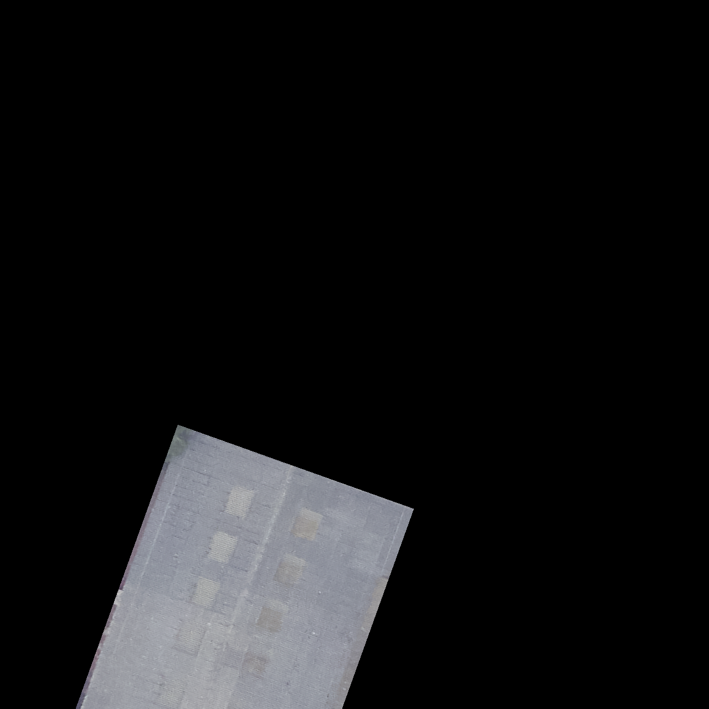
<figcaption>Top4 - Original</figcaption>
</figure>
<figure>
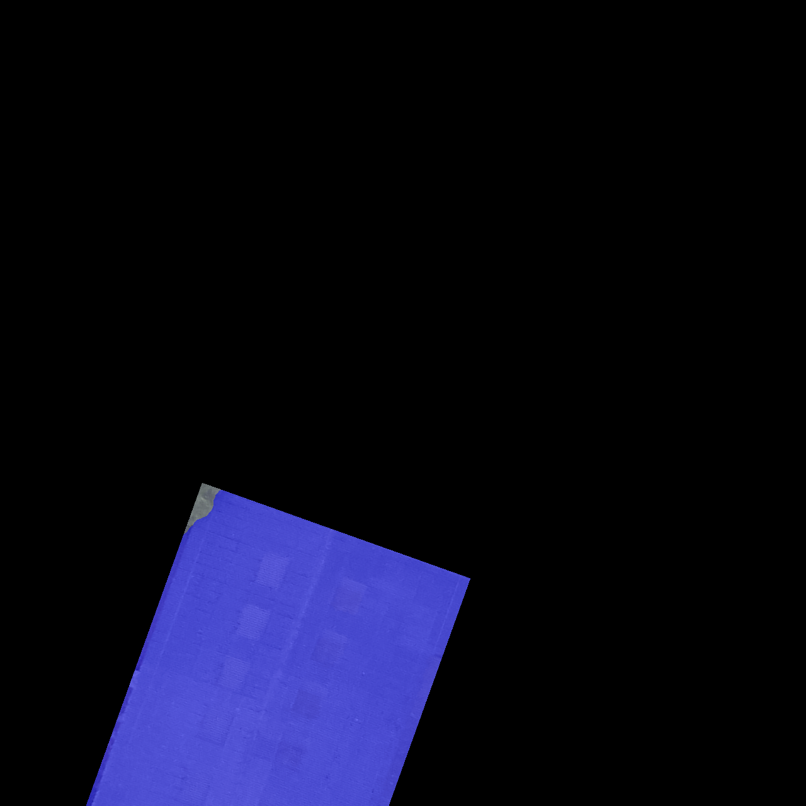
<figcaption>Vérité terrain</figcaption>
</figure>
<figure>
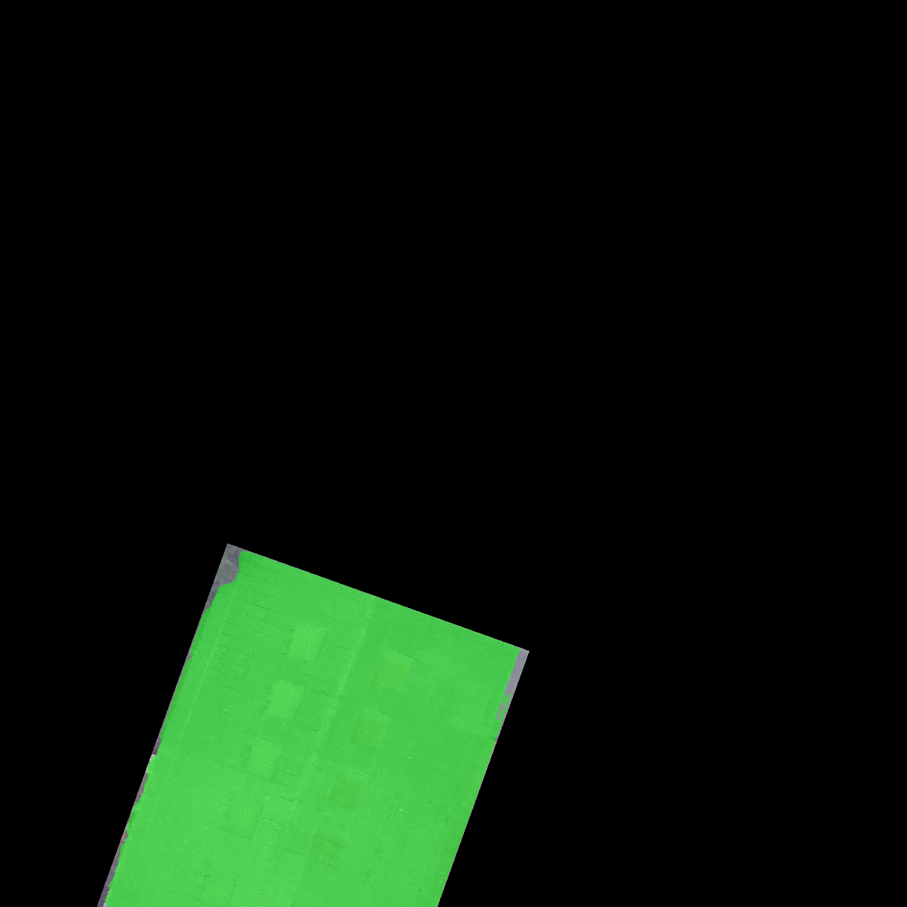
<figcaption>Prédiction - IoU = 0.982</figcaption>
</figure>
<figcaption>Meilleurs IoU pour Unet++ avec EfficientNetV2-S sur le dataset de test</figcaption>
</figure>

<figure id="fig:unetplusplus_efficientnetv2_s_worst_cases" data-latex-placement="H">
<figure>

<figcaption>Top1 - Original</figcaption>
</figure>
<figure>

<figcaption>Vérité terrain</figcaption>
</figure>
<figure>

<figcaption>Prédiction - IoU = 0.000</figcaption>
</figure>
<figure>

<figcaption>Top2 - Original</figcaption>
</figure>
<figure>

<figcaption>Vérité terrain</figcaption>
</figure>
<figure>

<figcaption>Prédiction - IoU = 0.000</figcaption>
</figure>
<figure>
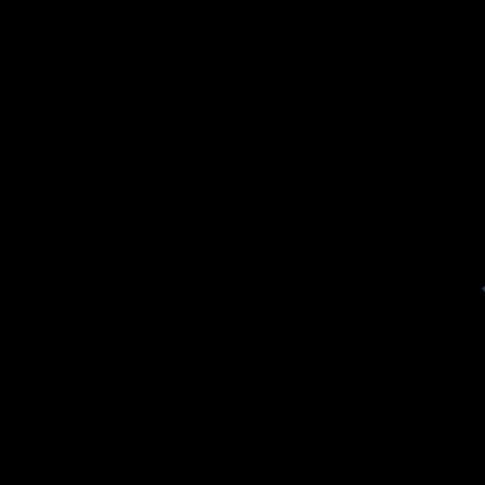
<figcaption>Top3 - Original</figcaption>
</figure>
<figure>

<figcaption>Vérité terrain</figcaption>
</figure>
<figure>

<figcaption>Prédiction - IoU = 0.000</figcaption>
</figure>
<figure>

<figcaption>Top4 - Original</figcaption>
</figure>
<figure>

<figcaption>Vérité terrain</figcaption>
</figure>
<figure>
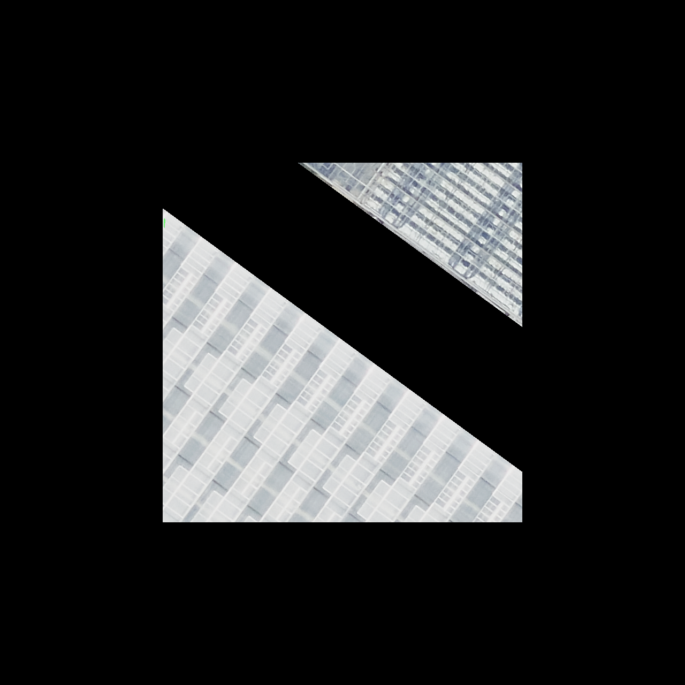
<figcaption>Prédiction - IoU = 0.000</figcaption>
</figure>
<figcaption>Pires IoU pour Unet++ avec EfficientNetV2-S sur le dataset de test</figcaption>
</figure>

Les Figures [4.27](#fig:segformer_regnety_080_best_cases){reference-type="ref" reference="fig:segformer_regnety_080_best_cases"} et [4.28](#fig:segformer_regnety_080_worst_cases){reference-type="ref" reference="fig:segformer_regnety_080_worst_cases"} montrent les performances extrêmes du modèle SegFormer + RegNetY-080 sur le dataset de test.

La Figure [4.27](#fig:segformer_regnety_080_best_cases){reference-type="ref" reference="fig:segformer_regnety_080_best_cases"} présente les 4 meilleures segmentations. On retrouve les mêmes cas de succès que pour les modèles précédents.

La Figure [4.28](#fig:segformer_regnety_080_worst_cases){reference-type="ref" reference="fig:segformer_regnety_080_worst_cases"} illustre les 4 cas les plus difficiles. Les images correspondent largement à celles déjà analysées, avec une exception notable : la troisième image montre une toiture végétalisée et une terrasse praticable sans annotation dans la vérité terrain. Le modèle a segmenté une partie de la terrasse, ce qui soulève la difficulté pour l’algorithme de distinguer les surfaces praticables des autres types de toitures.

<figure id="fig:segformer_regnety_080_best_cases" data-latex-placement="H">
<figure>

<figcaption>Top1 - Original</figcaption>
</figure>
<figure>
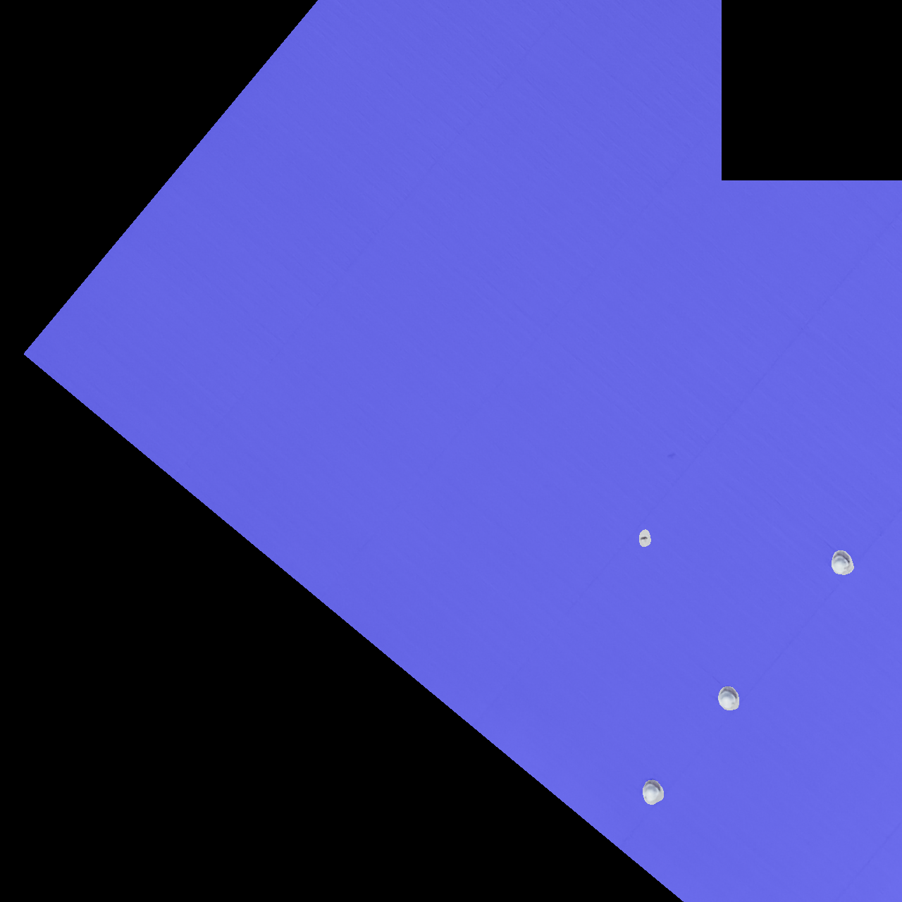
<figcaption>Vérité terrain</figcaption>
</figure>
<figure>

<figcaption>Prédiction - IoU = 0.998</figcaption>
</figure>
<figure>

<figcaption>Top2 - Original</figcaption>
</figure>
<figure>

<figcaption>Vérité terrain</figcaption>
</figure>
<figure>

<figcaption>Prédiction - IoU = 0.989</figcaption>
</figure>
<figure>

<figcaption>Top3 - Original</figcaption>
</figure>
<figure>

<figcaption>Vérité terrain</figcaption>
</figure>
<figure>

<figcaption>Prédiction - IoU = 0.987</figcaption>
</figure>
<figure>

<figcaption>Top4 - Original</figcaption>
</figure>
<figure>

<figcaption>Vérité terrain</figcaption>
</figure>
<figure>

<figcaption>Prédiction - IoU = 0.985</figcaption>
</figure>
<figcaption>Meilleurs IoU pour SegFormer avec RegNetY-080 sur le dataset de test</figcaption>
</figure>

<figure id="fig:segformer_regnety_080_worst_cases" data-latex-placement="H">
<figure>

<figcaption>Top1 - Original</figcaption>
</figure>
<figure>
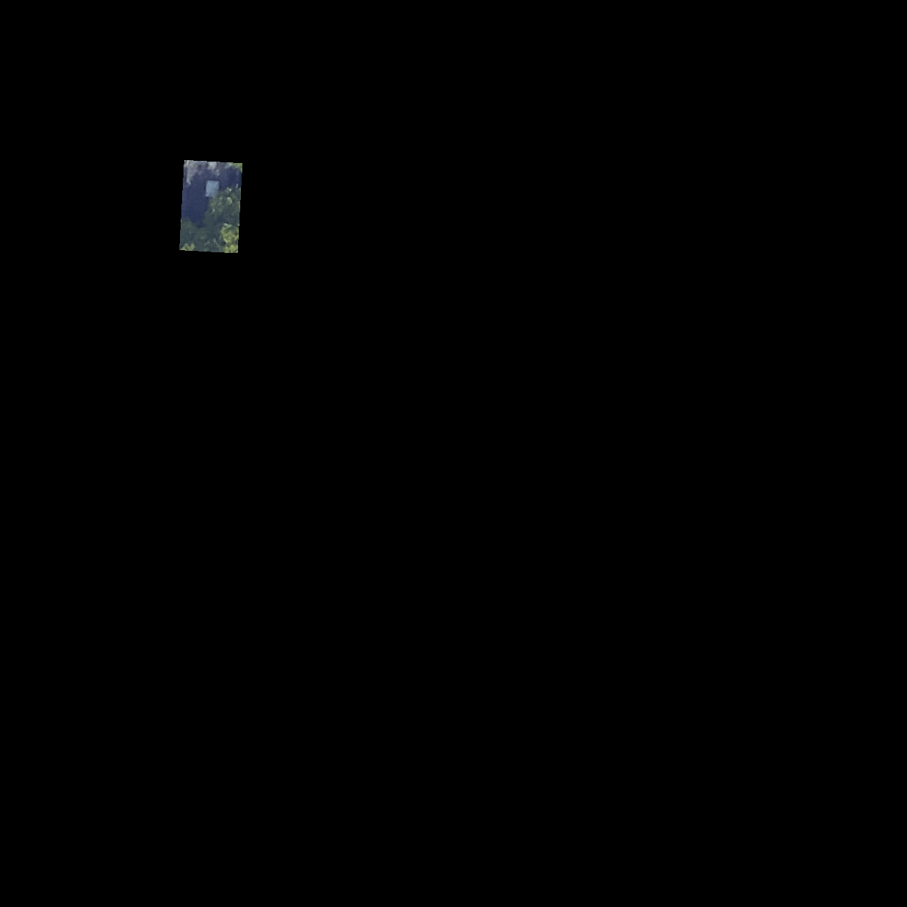
<figcaption>Vérité terrain</figcaption>
</figure>
<figure>

<figcaption>Prédiction - IoU = 0.000</figcaption>
</figure>
<figure>

<figcaption>Top2 - Original</figcaption>
</figure>
<figure>

<figcaption>Vérité terrain</figcaption>
</figure>
<figure>

<figcaption>Prédiction - IoU = 0.000</figcaption>
</figure>
<figure>

<figcaption>Top3 - Original</figcaption>
</figure>
<figure>
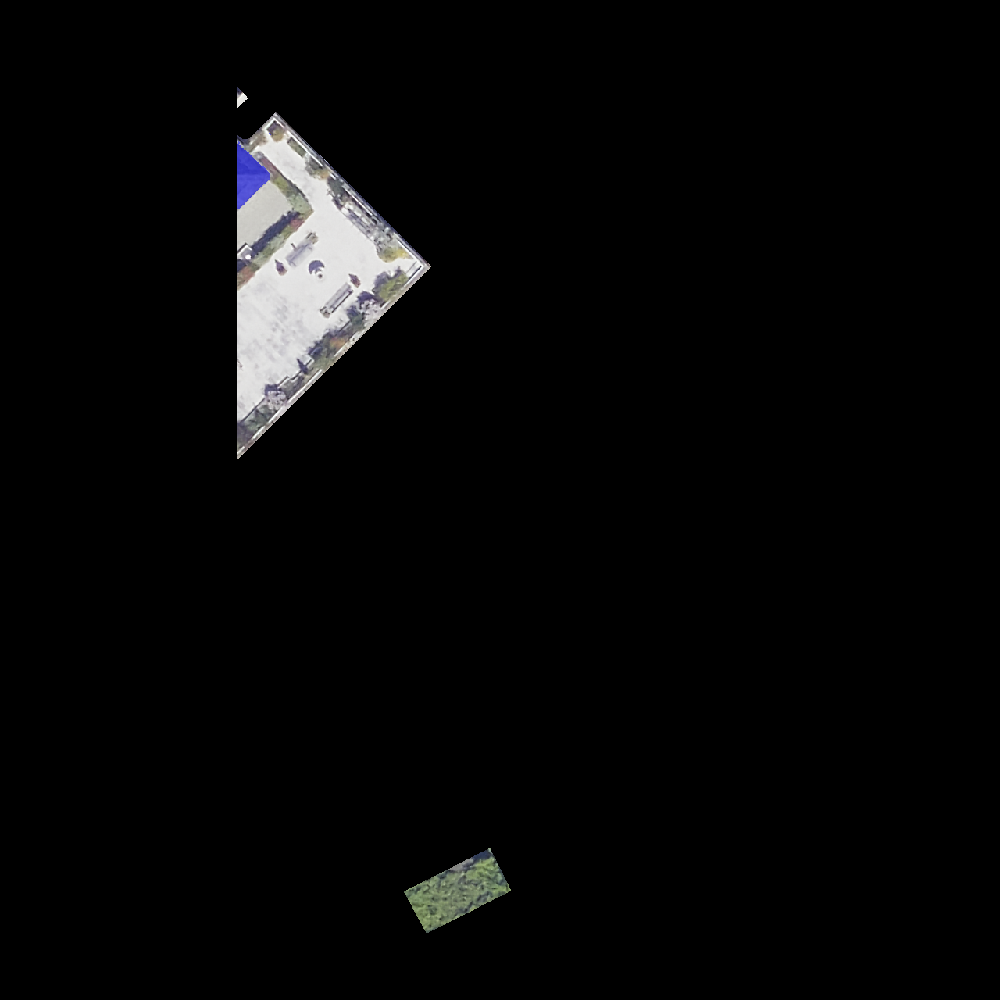
<figcaption>Vérité terrain</figcaption>
</figure>
<figure>
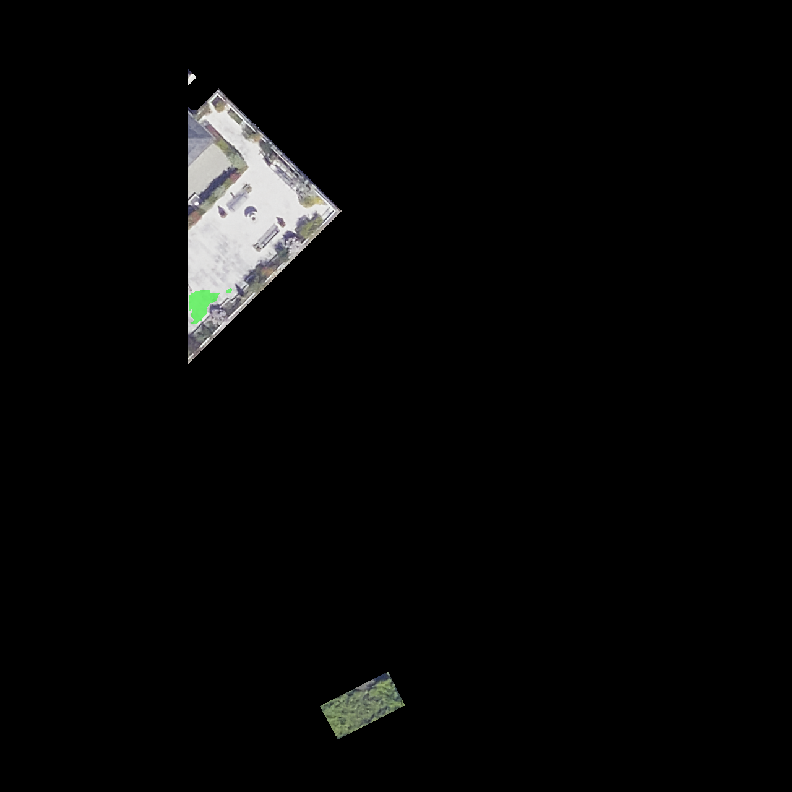
<figcaption>Prédiction - IoU = 0.000</figcaption>
</figure>
<figure>

<figcaption>Top4 - Original</figcaption>
</figure>
<figure>

<figcaption>Vérité terrain</figcaption>
</figure>
<figure>

<figcaption>Prédiction - IoU = 0.000</figcaption>
</figure>
<figcaption>Pires IoU pour SegFormer avec RegNetY-080 sur le dataset de test</figcaption>
</figure>

Pour conclure cette section, l’évaluation des modèles sélectionnés donne des résultats satisfaisants. Les modèles parviennent à obtenir de bonnes performances sur le dataset de test.

L’analyse révèle cependant plusieurs limites dans le dataset. Premièrement, certaines images contiennent des toitures qui représentent moins de 1% de la surface totale de l’image, ce qui complique l’apprentissage du modèle. Deuxièmement, les toitures végétalisées et les terrasses praticables restent difficiles à distinguer des autres types de surfaces. Le dataset ne contient probablement pas assez d’exemples de ces cas particuliers pour permettre au modèle d’apprendre à les différencier correctement. Troisièmement, les exemples négatifs (images sans annotation) ont été inclus pour que le modèle apprenne à identifier ce qui ne constitue pas une surface libre. Le nombre de ces exemples négatifs semble insuffisant car tous les modèles rencontrent des difficultés sur ces cas.

## Application sur un quartier {#application-sur-un-quartier}

La zone de <a href="../glossary.html#gloss-hepia">hepia</a> a été choisie pour tester les modèles sur un secteur qui n’a pas servi à l’entraînement.

### Analyse qualitative {#analyse-qualitative-1}

La Figure [4.29](#fig:quartier_hepia_original){reference-type="ref" reference="fig:quartier_hepia_original"} montre les images originales de la zone <a href="../glossary.html#gloss-hepia">hepia</a>. La Figure [4.30](#fig:quartier_hepia_masque_toitures){reference-type="ref" reference="fig:quartier_hepia_masque_toitures"} présente les mêmes images avec un masque appliqué sur les toitures (couche toitures <a href="../glossary.html#gloss-sitg">sitg</a>). Cette étape permet au modèle de traiter uniquement les surfaces de toitures en ignorant le reste du paysage urbain.

Les zones identifiées comme toitures (Figure [4.30](#fig:quartier_hepia_masque_toitures){reference-type="ref" reference="fig:quartier_hepia_masque_toitures"}) ne sont pas toutes évidentes. En bas à gauche, une cour intérieure est identifiée comme toiture. En bas à droite, une terrasse praticable est aussi classée comme toiture, ce qui techniquement est correct car il y a bien un bâtiment dessous, mais cela complique la tâche de segmentation. L’image contient également des balcons et terrasses qui permettront d’évaluer le comportement des modèles sur ce type de surface.

<figure id="fig:quartier_hepia_original" data-latex-placement="H">

<figcaption>Zone <a href="../glossary.html#gloss-hepia">hepia</a> - Original</figcaption>
</figure>

<figure id="fig:quartier_hepia_masque_toitures" data-latex-placement="H">

<figcaption>Zone <a href="../glossary.html#gloss-hepia">hepia</a> - Masque couche toitures</figcaption>
</figure>

La Figure [4.31](#fig:quartier_hepia_modele_unet_mambaoutsmall){reference-type="ref" reference="fig:quartier_hepia_modele_unet_mambaoutsmall"} présente les résultats obtenus avec le modèle UNet + MambaOutSmall sur la zone <a href="../glossary.html#gloss-hepia">hepia</a>.

Le modèle identifie correctement les balcons et terrases lorsqu’ils ont des éléments tel que des chaises, table ou autre mobilier typique des balcons. En revanche, les toitures praticables (zone à droite) et cours intérieures (en bas à gauche) sont mal interprétées - le modèle les classe comme surfaces libres alors qu’elles ne le sont pas.

Les obstacles tel que les verrières, panneaux solaires, gaines, cheminées, lucarnes, acrotères, bords de toiture, arbres et autres végétaux sont bien détectées et ignorées par le modèle lors de la segmentation.

La gestion des ombrages reste variable. Dans la partie gauche de l’image, les ombrages légèrs sont correctement traitées. Par contre, dans la zone centrale droite où l’ombrage est plus marqué, le modèle a des difficultés à identifier correctement l’intégralité des espaces libres.

<figure id="fig:quartier_hepia_modele_unet_mambaoutsmall" data-latex-placement="H">

<figcaption>Zone <a href="../glossary.html#gloss-hepia">hepia</a> - Unet avec MambaOutSmall</figcaption>
</figure>

La Figure [4.32](#fig:quartier_hepia_modele_upernet_efficientnetv2_s){reference-type="ref" reference="fig:quartier_hepia_modele_upernet_efficientnetv2_s"} montre les résultats du modèle UPerNet + EfficientNetV2-S sur la zone <a href="../glossary.html#gloss-hepia">hepia</a>.

Les observations sont similaires au modèle précédent concernant les terrasses et cours intérieures.

Les obstacles comme les verrières, panneaux solaires, gaines, cheminées, lucarnes, acrotères, bords de toiture, arbres et végétation sont correctement détectés. Le modèle les exclut bien lors de la segmentation.

La gestion des ombrages est moins performante qu’avec UNet + MambaOutSmall. UPerNet peine à identifier les espaces libres dans toutes les zones ombragées, peu importe l’intensité de l’ombre.

<figure id="fig:quartier_hepia_modele_upernet_efficientnetv2_s" data-latex-placement="H">

<figcaption>Zone <a href="../glossary.html#gloss-hepia">hepia</a> - UPerNet avec EfficientNetV2-S</figcaption>
</figure>

La Figure [4.33](#fig:quartier_hepia_modele_segformer_mambaoutbase){reference-type="ref" reference="fig:quartier_hepia_modele_segformer_mambaoutbase"} montre les résultats du modèle SegFormer + MambaOutBase sur la zone <a href="../glossary.html#gloss-hepia">hepia</a>.

Les observations sont similaires aux modèles précédent concernant les terrasses et cours intérieures.

Les obstacles comme les verrières, panneaux solaires, gaines, cheminées, lucarnes, acrotères, bords de toiture, arbres et végétation sont correctement détectés. Le modèle les exclut bien lors de la segmentation.

La gestion des ombrages est bien meilleure que pour les deux modèles précédents. SegFormer parvient à mieux identifier les espaces libres dans les zones ombragées, même lorsque l’ombre est plus marquée.

<figure id="fig:quartier_hepia_modele_segformer_mambaoutbase" data-latex-placement="H">

<figcaption>Zone <a href="../glossary.html#gloss-hepia">hepia</a> - SegFormer avec MambaOutBase</figcaption>
</figure>

La Figure [4.34](#fig:quartier_hepia_modele_linknet_efficientnet_b5){reference-type="ref" reference="fig:quartier_hepia_modele_linknet_efficientnet_b5"} illustre les résultats obtenus avec LinkNet + EfficientNet-B5 sur la zone <a href="../glossary.html#gloss-hepia">hepia</a>.

La cour intérieure de <a href="../glossary.html#gloss-hepia">hepia</a> (en bas à droite) est partiellement segmentée. Le modèle semble capable de distinguer en partie les surfaces praticables des autres toitures. Toutefois, la cour intérieure située en bas à gauche est incorrectement identifiée comme surface libre.

Les obstacles comme les verrières, panneaux solaires, gaines, cheminées, lucarnes, acrotères, bords de toiture, arbres et végétation sont correctement détectés et exclus de la segmentation. La précision de détection paraît supérieure aux modèles précédents.

Le traitement des ombrages est efficace. Le modèle identifie correctement les espaces libres dans les zones ombragées, y compris celles avec des ombres prononcées.

<figure id="fig:quartier_hepia_modele_linknet_efficientnet_b5" data-latex-placement="H">

<figcaption>Zone <a href="../glossary.html#gloss-hepia">hepia</a> - LinkNet avec EfficientNet-B5</figcaption>
</figure>

La Figure [4.35](#fig:quartier_hepia_modele_unetplusplus_efficientnetv2_s){reference-type="ref" reference="fig:quartier_hepia_modele_unetplusplus_efficientnetv2_s"} montre les résultats du modèle UNet++ + EfficientNetV2-S sur la zone <a href="../glossary.html#gloss-hepia">hepia</a>.

Les observations restent identiques pour les terrasses et cours intérieures. Les obstacles présents sur les toitures sont généralement bien identifiés.

Le modèle gère correctement les ombres légères. En revanche, quand l’ombrage devient plus intense, il peine à détecter les espaces libres.

<figure id="fig:quartier_hepia_modele_unetplusplus_efficientnetv2_s" data-latex-placement="H">

<figcaption>Zone <a href="../glossary.html#gloss-hepia">hepia</a> - UNet++ avec EfficientNetV2-S</figcaption>
</figure>

La Figure [4.36](#fig:quartier_hepia_modele_segformer_regnety_080){reference-type="ref" reference="fig:quartier_hepia_modele_segformer_regnety_080"} présente les résultats du modèle SegFormer + RegNetY-080 sur la zone <a href="../glossary.html#gloss-hepia">hepia</a>.

La segmentation des petits obstacles sur les toitures semble moins précise comparé aux autres modèles. La gestion des ombrages est correcte, mais le modèle a des difficultés à identifier les espaces libres dans les zones ombragées, surtout lorsque l’ombre est plus marquée. Les remarques sur les terrasses et cours intérieures restent similaires aux autres modèles.

<figure id="fig:quartier_hepia_modele_segformer_regnety_080" data-latex-placement="H">

<figcaption>Zone <a href="../glossary.html#gloss-hepia">hepia</a> - SegFormer avec RegNetY-080</figcaption>
</figure>

#### Synthèse et analyse des résultats {#synthèse-et-analyse-des-résultats}

Le Tableau [4.9](#tab:quartier_hepia_comparatif_modeles){reference-type="ref" reference="tab:quartier_hepia_comparatif_modeles"} résume les performances des six modèles testés sur la zone <a href="../glossary.html#gloss-hepia">hepia</a>, en se basant sur quatre critères : la détection des balcons/terrasses, la segmentation des toitures praticables, la détection des obstacles et la gestion des ombrages.

<table id="tab:quartier_hepia_comparatif_modeles">
<caption>Tableau comparatif des performances des 6 modèles sur la zone <a href="../glossary.html#gloss-hepia">hepia</a></caption>
<thead>
<tr>
<th style="text-align: left;">Modèle</th>
<th style="text-align: left;">Balcons 
Terrasses</th>
<th style="text-align: left;">Toitures 
praticables</th>
<th style="text-align: left;">Petits 
obstacles</th>
<th style="text-align: left;">Gestion 
ombrages</th>
</tr>
</thead>
<tbody>
<tr>
<td style="text-align: left;">UNet + MambaOutSmall</td>
<td style="text-align: left;">\(+\)</td>
<td style="text-align: left;">\(--\)</td>
<td style="text-align: left;">\(+/-\)</td>
<td style="text-align: left;">\(-\)</td>
</tr>
<tr>
<td style="text-align: left;">UPerNet + EfficientNetV2-S</td>
<td style="text-align: left;">\(+\)</td>
<td style="text-align: left;">\(-\)</td>
<td style="text-align: left;">\(+\)</td>
<td style="text-align: left;">\(--\)</td>
</tr>
<tr>
<td style="text-align: left;">SegFormer + MambaOutBase</td>
<td style="text-align: left;">\(+\)</td>
<td style="text-align: left;">\(--\)</td>
<td style="text-align: left;">\(+\)</td>
<td style="text-align: left;">\(+\)</td>
</tr>
<tr>
<td style="text-align: left;">LinkNet + EfficientNet-B5</td>
<td style="text-align: left;">\(+\)</td>
<td style="text-align: left;">\(+/-\)</td>
<td style="text-align: left;">\(++\)</td>
<td style="text-align: left;">\(+\)</td>
</tr>
<tr>
<td style="text-align: left;">UNet++ + EfficientNetV2-S</td>
<td style="text-align: left;">\(+\)</td>
<td style="text-align: left;">\(-\)</td>
<td style="text-align: left;">\(+/-\)</td>
<td style="text-align: left;">\(-\)</td>
</tr>
<tr>
<td style="text-align: left;">SegFormer + RegNetY-080</td>
<td style="text-align: left;">\(+\)</td>
<td style="text-align: left;">\(-\)</td>
<td style="text-align: left;">\(-\)</td>
<td style="text-align: left;">\(+/-\)</td>
</tr>
</tbody>
</table>

Légende du Tableau [4.9](#tab:quartier_hepia_comparatif_modeles){reference-type="ref" reference="tab:quartier_hepia_comparatif_modeles"} :

- ++ : Très bonne performance

- + : Bonne performance

- +/− : Performance mitigée

- − : Performance insuffisante

- −− : Très mauvaise performance

Pour conclure cette section, il est important de noter que ces images n’ont pas de vérité terrain associée. L’évaluation reste donc subjective. L’objectif est d’observer comment les modèles se comportent sur des données qu’ils n’ont jamais vues. Cette capacité de généralisation est cruciale pour juger de leur robustesse en conditions réelles.

Cette évaluation qualitative permet aussi de révéler les biais présents dans le dataset d’entraînement. Malgré le soin apporté à sa création, ce dataset reste imparfait et les modèles reproduisent ses limites dans leurs prédictions.

Un problème récurrent concerne les toitures praticables. Ces surfaces, bien que classées comme toitures par <a href="../glossary.html#gloss-sitg">sitg</a> (ce qui est techniquement correct puisqu’elles correspondent au dernier étage d’un bâtiment), posent problème aux modèles. La distinction entre surfaces praticables et non praticables reste difficile. L’ajout d’exemples supplémentaires dans le dataset pourrait améliorer les performances sur ce point.

Les balcons montrent aussi des résultats variables. Ceux avec du mobilier sont correctement identifiés par tous les modèles, mais les balcons vides sont souvent confondus avec des toitures. Cela confirme le besoin de diversifier les exemples dans le dataset.

La détection des petits obstacles donne des résultats encourageants. Les modèles identifient correctement la plupart des éléments comme les verrières, panneaux solaires, gaines, cheminées, lucarnes et acrotères. LinkNet + EfficientNet-B5 se démarque avec une précision supérieure sur ces petits éléments.

Les performances sur les zones ombragées dépassent les attentes, particulièrement pour SegFormer + MambaOutBase et LinkNet + EfficientNet-B5. Ces modèles détectent les espaces libres même sous ombrage marqué, ce qui est essentiel pour traiter des images aériennes. Le choix de la combinaison encodeur-décodeur s’avère déterminant : EfficientNet-B5 avec UPerNet gère mal les ombrages, alors qu’avec LinkNet les résultats sont excellents.

Au final, LinkNet + EfficientNet-B5 semble être le modèle le plus performant. Il excelle dans la détection des petits obstacles et la gestion des ombrages, tout en maintenant de bonnes performances sur les autres éléments.

## Synthèse {#synthèse-2}

Ce chapitre a évalué 93 configurations de modèles de segmentation pour identifier les espaces libres sur les toitures du canton de Genève. L’analyse comparative montre des performances globalement homogènes entre les architectures, avec plusieurs enseignements utiles pour un déploiement pratique.

### Performances générales et robustesse des modèles {#performances-générales-et-robustesse-des-modèles}

L’évaluation quantitative utilise un dataset de test indépendant de 89 images. Les modèles obtiennent des performances élevées et stables. Les valeurs d’IoU vont de 0,619 à 0,741, avec une moyenne de 0,708 et un écart-type de 0,024. Cette faible dispersion indique que les architectures sont bien adaptées à cette tâche.

Les modèles de Segmentation Models PyTorch (SMP) surpassent les variantes YOLOv12, notamment sur les métriques F1-score et mAP@0.95. Les modèles SMP gèrent mieux les faux positifs et faux négatifs, ce qui est essentiel pour une segmentation précise des contours.

### Architectures optimales et compromis performance-complexité {#architectures-optimales-et-compromis-performance-complexité}

L’analyse du front de Pareto montre que les gains deviennent marginaux au-delà de 25 millions de paramètres. L’ajout de complexité n’apporte plus grand-chose. Trois configurations ressortent comme solutions optimales :

- LinkNet + EfficientNet-B5 : IoU de 0,741 avec 28,75M paramètres, les meilleures performances absolues

- SegFormer + RegNetY-032 : IoU de 0,735 avec 18,87M paramètres, un bon équilibre performance-efficacité

- UNet++ + EfficientNet-B3 : IoU de 0,735 avec 13,63M paramètres, privilégiant la compacité

La stratégie d’ensemble k-fold améliore ces modèles de 0,9% à 2,0% en moyenne par rapport à la moyenne des folds. Cette approche renforce la robustesse pour une utilisation opérationnelle.

### Analyse qualitative et limites identifiées {#analyse-qualitative-et-limites-identifiées}

Les tests sur la zone <a href="../glossary.html#gloss-hepia">hepia</a> montrent une bonne capacité de généralisation mais aussi des limites. Les modèles détectent bien les obstacles classiques (panneaux solaires, cheminées, verrières, végétation) et fonctionnent correctement sur les zones avec ombrage léger à modéré.

Deux défis principaux subsistent :

- Surfaces praticables : Les toitures végétalisées et terrasses praticables sont mal classées, probablement par manque d’exemples dans le dataset d’entraînement

- Ombrages intenses : Les performances chutent sous ombrage marqué, avec des variations selon la combinaison encodeur-décodeur

### Recommandations pour le déploiement opérationnel {#recommandations-pour-le-déploiement-opérationnel}

Cette évaluation permet de formuler plusieurs recommandations pratiques :

##### Choix du modèle {#choix-du-modèle}

LinkNet + EfficientNet-B5 est la configuration optimale. Elle combine les meilleures performances IoU (0,741), une excellente gestion des ombrages et une détection précise des petits obstacles. L’utilisation d’un ensemble k-fold maximise la robustesse.

##### Améliorations du dataset {#améliorations-du-dataset}

Le dataset devrait être enrichi avec plus d’exemples de toitures végétalisées, terrasses praticables et zones fortement ombragées. Augmenter le nombre d’exemples négatifs réduirait aussi les faux positifs. Les images contenant très peu d’informations pertinentes posent également problème - les modèles ont du mal à apprendre dans ces conditions et ces cas devraient être mieux équilibrés dans le dataset.

##### Stratégie de déploiement {#stratégie-de-déploiement}

L’ensemble k-fold multiplie le temps de calcul par cinq mais reste justifié pour les applications critiques nécessitant une haute fiabilité. Pour les applications avec contraintes temporelles, on peut utiliser le meilleur modèle individuel de chaque configuration.

##### Perspectives d’amélioration {#perspectives-damélioration}

L’augmentation de données ciblée sur les cas difficiles (surfaces praticables, ombrages intenses) et le pré-traitement pour normaliser l’éclairage sont des pistes prometteuses.

Cette évaluation confirme que la segmentation des espaces libres sur toitures est suffisamment mature pour un déploiement opérationnel. Les axes d’amélioration identifiés permettront d’optimiser la robustesse du système en conditions réelles.
